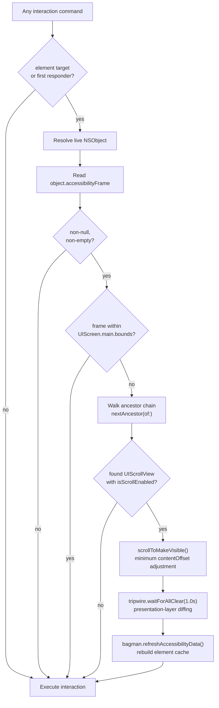

# TheSafecracker Deep Dive: Scrolling

> **Source:** `ButtonHeist/Sources/TheInsideJob/TheSafecracker/TheSafecracker+Actions.swift`
> **Parent dossier:** [04-THESAFECRACKER.md](04-THESAFECRACKER.md)

TheSafecracker owns all scrolling — three explicit scroll commands for agents, and an automatic pre-interaction scroll that ensures every action is visible on screen.

## Auto-Scroll to Visible

### Why it exists

Humans watching an agent interact with a simulator need to see every action happen on screen. Without auto-scroll, an agent can tap, type into, or swipe an element that's scrolled out of the viewport — the action succeeds but the observer sees nothing happen.

The check runs inside TheSafecracker before every interaction. The agent has no knowledge of it, sends no extra parameters, and receives no indication it happened. From the agent's perspective the command just works. From the human's perspective the screen scrolls to the element and then the action occurs.

### What it checks

The check compares the element's `accessibilityFrame` (screen coordinates, read from the live `NSObject`) against `UIScreen.main.bounds`. If the frame is fully contained within the screen bounds, no scroll is needed.

**This is a bounds check, not a visibility check.** It does not care about:
- Keyboard overlapping the element
- Modal sheets or overlays obscuring the element
- Other views drawn on top of the element
- The element being transparent or hidden

It only cares whether the element's frame is geometrically within the screen rectangle. An element behind a keyboard is "on screen" — an element scrolled 500 points below the viewport is not.

### What it does when an element is off-screen

1. Walks the accessibility/view hierarchy upward from the element via `nextAncestor(of:)` to find the nearest `UIScrollView` with `isScrollEnabled == true`
2. Calls `scrollToMakeVisible(_:in:)` which converts the element's frame into the scroll view's coordinate space and adjusts `contentOffset` by the minimum amount needed to bring the element fully within the scroll view's visible rect
3. Waits for the scroll animation to settle via `tripwire.waitForAllClear(timeout: 1.0)` — this uses presentation-layer diffing, not a fixed sleep
4. Refreshes the element cache via `bagman.refreshAccessibilityData()` so subsequent reads (activation points, frames) reflect post-scroll positions



### Entry points

Two public methods resolve their target, then delegate to a shared private implementation:

| Method | Resolves object from | Used by |
|--------|---------------------|---------|
| `ensureOnScreen(for: ActionTarget)` | TheBagman element cache | activate, increment, decrement, customAction, tap, longPress, swipe, drag, pinch, rotate, twoFingerTap, typeText |
| `ensureFirstResponderOnScreen()` | `firstResponderView()` responder chain walk | editAction, setPasteboard, getPasteboard, resignFirstResponder |

Both delegate to `ensureOnScreen(object: NSObject)`. `NSObject` is the right abstraction because `accessibilityFrame` lives on NSObject via the UIAccessibility informal protocol, and the ancestor walk needs the live object to climb `superview` / `accessibilityContainer`. A bare `CGRect` can't tell you which scroll view to scroll.

### Requirements

- **UIScrollView ancestor.** The element must be inside a `UIScrollView` (or subclass — `UITableView`, `UICollectionView`, `UITextView`, etc.) with `isScrollEnabled == true`. If no scrollable ancestor exists, the check is a no-op.
- **Valid accessibilityFrame.** The live `NSObject` must return a non-null, non-empty `accessibilityFrame`. Elements with `.isNull` or `.isEmpty` frames are skipped.
- **Reachable via ancestor walk.** `nextAncestor(of:)` traverses `UIView.superview`, `UIAccessibilityElement.accessibilityContainer`, and KVO `accessibilityContainer`. If the hierarchy is broken or uses a non-standard container pattern the walk won't find the scroll view.
- **TheTripwire injected.** If `tripwire` is nil the scroll still happens but there's no settle wait — the interaction proceeds immediately after adjusting the content offset.

### Limitations

- **Single scroll view.** The ancestor walk stops at the first `UIScrollView` it finds. Nested scroll views (e.g. a horizontal carousel inside a vertical table) will only scroll the innermost one. If the element is off-screen in the outer scroll view, the inner scroll adjustment alone won't bring it into the viewport.
- **No retry.** If the scroll doesn't fully bring the element on screen (e.g. the element is larger than the viewport, or the scroll view has constraints that prevent reaching the target offset), there is no second attempt.
- **No synthetic touch scrolling.** All scrolling uses `UIScrollView.setContentOffset(animated: true)` directly. This bypasses gesture recognizers, scroll view delegates, and any custom scrolling behavior that only responds to touch events. Paging scroll views, scroll views with `scrollViewWillEndDragging` snapping, and custom pull-to-refresh headers may not behave as expected.
- **Frame-based only.** The check uses `accessibilityFrame` which is a rectangle in screen coordinates. It does not account for scroll view content insets reducing the actual visible area — though `scrollToMakeVisible` does account for `adjustedContentInset` when computing the visible rect and clamping the offset.
- **Raw coordinate gestures bypass the check.** Gestures specified by explicit `pointX`/`pointY` coordinates (no element target) skip auto-scroll entirely. If an agent sends a tap at coordinates that happen to be off-screen, there's no element to scroll to.

### Best-effort guarantee

The auto-scroll never blocks or fails the command. If anything goes wrong — element can't be resolved, no scrollable ancestor, frame is null, tripwire is nil — the interaction proceeds at the current position, exactly as it did before this feature existed.

## Explicit Scroll Commands

Three commands expose scrolling directly to agents. These are not auto-scroll — they are standalone commands the agent sends intentionally.

| Command | Method | Behavior |
|---------|--------|----------|
| `scroll` | `scrollByPage(_:direction:)` | Moves contentOffset by `frame.height - 44pt` overlap in the given direction |
| `scroll_to_visible` | `scrollToMakeVisible(_:in:)` | Minimum offset adjustment to bring element fully into viewport |
| `scroll_to_edge` | `scrollToEdge(elementAt:edge:)` | Jumps to content extreme using `contentSize + adjustedContentInset` |

All three use the same ancestor walk and drive `UIScrollView.setContentOffset(animated: true)` directly — no synthetic touch involved. The explicit `scroll_to_visible` command is the same underlying operation as auto-scroll, but exposed as a standalone command for agents that want explicit control.

### scroll (page step)

Scrolls the nearest `UIScrollView` ancestor by one page in the given direction. "One page" is the scroll view's frame dimension minus a 44pt overlap, so the user retains context across pages.

```
newOffset.y = offset.y + (frame.height - 44)   // down/next
newOffset.y = offset.y - (frame.height - 44)   // up/previous
newOffset.x = offset.x + (frame.width - 44)    // right
newOffset.x = offset.x - (frame.width - 44)    // left
```

Offsets are clamped to `[-insets.top, contentSize.height + insets.bottom - frame.height]` (vertical) and the equivalent horizontal range. Returns `false` if the computed offset equals the current offset (already at the edge).

Directions: `.up`, `.down`, `.left`, `.right`, `.next` (alias for down), `.previous` (alias for up).

### scroll_to_visible (minimal adjustment)

Adjusts `contentOffset` by the minimum amount needed to bring the element's `accessibilityFrame` fully within the scroll view's visible rect.

The visible rect accounts for `adjustedContentInset`:
```
visibleRect = CGRect(
    x: contentOffset.x + insets.left,
    y: contentOffset.y + insets.top,
    width: frame.width - insets.left - insets.right,
    height: frame.height - insets.top - insets.bottom
)
```

If the element is already within `visibleRect`, returns `true` without scrolling. Otherwise adjusts the offset on whichever axis is out of bounds, clamped to the valid content range.

This is the same `scrollToMakeVisible(_:in:)` method used by auto-scroll.

### scroll_to_edge (jump to extreme)

Jumps the content offset to the absolute edge of the content:

| Edge | Offset |
|------|--------|
| `.top` | `y = -insets.top` |
| `.bottom` | `y = contentSize.height + insets.bottom - frame.height` |
| `.left` | `x = -insets.left` |
| `.right` | `x = contentSize.width + insets.right - frame.width` |

Returns `true` without scrolling if already at the target edge.

## Ancestor Walk

All scroll operations share `nextAncestor(of:)` to find the nearest scrollable container. It handles three cases:

1. **UIView** → `view.superview` — standard UIKit view hierarchy
2. **UIAccessibilityElement** → `element.accessibilityContainer` cast to `NSObject` — VoiceOver container elements that aren't UIViews
3. **Other NSObject** → KVO `value(forKey: "accessibilityContainer")` — covers custom accessibility containers that implement the informal protocol

The walk stops at the first `UIScrollView` (or subclass) with `isScrollEnabled == true`. This means:
- `UITableView`, `UICollectionView`, `UITextView` are all found (they're UIScrollView subclasses)
- Disabled scroll views (`isScrollEnabled = false`) are skipped — the walk continues upward
- SwiftUI `ScrollView` works because it's backed by a `UIScrollView` in the underlying UIKit hierarchy

### What the walk cannot find

- Scroll views behind a broken container chain (e.g. a custom `UIAccessibilityElement` whose `accessibilityContainer` is nil)
- Non-UIScrollView custom scrolling containers (e.g. a custom `UIView` that implements its own pan-gesture-driven scrolling)
- SwiftUI `LazyVStack` without a `ScrollView` parent — there's no UIScrollView in the hierarchy to find

## Settle After Scroll

After any `setContentOffset(animated: true)` call, the scroll view runs a Core Animation animation (~300ms). The auto-scroll path waits for this to complete using `tripwire.waitForAllClear(timeout: 1.0)`.

TheTripwire's settle detection works by repeatedly snapshotting CALayer presentation trees and comparing them. When all presentation layers match their model layers (no in-flight animations), it returns. This covers both UIKit animations and SwiftUI transitions that might be triggered by the scroll.

After settle, `bagman.refreshAccessibilityData()` rebuilds the element cache. This is necessary because:
- `accessibilityFrame` values change after scrolling (the views moved)
- `activationPoint` values change (derived from frames)
- The agent's next action needs to tap/interact at the new position

The explicit scroll commands (`scroll`, `scroll_to_visible`, `scroll_to_edge`) do **not** settle or refresh — they return immediately after `setContentOffset`. The settle and delta computation happens in the outer `performInteraction` pipeline after the command returns.

## Implementation Notes

### Why setContentOffset, not synthetic touch

Synthetic touch scrolling would require simulating a multi-step pan gesture:
1. Touch down
2. Multiple touch-moved events with appropriate velocity
3. Touch up with deceleration

This is fragile — scroll view physics, deceleration curves, and content inset handling are complex. `setContentOffset(animated: true)` gives us exact positioning with UIKit handling all the animation. The trade-off is that we bypass `UIScrollViewDelegate` methods like `scrollViewWillEndDragging(_:withVelocity:targetContentOffset:)`, which means paging snap behavior won't trigger.

### Why the 44pt overlap in page scroll

The 44pt overlap when paging ensures continuity — the last few lines of the previous page remain visible at the top of the next page. This matches the standard iOS VoiceOver three-finger-swipe page scrolling behavior. 44pt is also the minimum recommended touch target size in the HIG.

### Why NSObject for ensureOnScreen

The auto-scroll has two callers: element-targeted commands (resolve through TheBagman) and first-responder commands (resolve through the UIView responder chain). Both produce a live `NSObject` that has `accessibilityFrame` and participates in the view hierarchy. Accepting `NSObject` lets both paths share one implementation without forcing either to convert to the other's resolution type.

A `CGRect` parameter was considered and rejected because the ancestor walk needs the live object reference — you can't climb `superview` from a rectangle.
