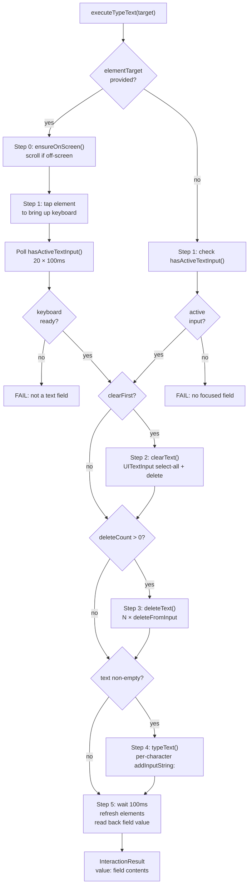

# TheSafecracker Deep Dive: Text Entry

> **Source:** `ButtonHeist/Sources/TheInsideJob/TheSafecracker/TheSafecracker+TextEntry.swift`, `TheSafecracker.swift`
> **Parent dossier:** [04-THESAFECRACKER.md](04-THESAFECRACKER.md)

Text entry bypasses the UIKit touch system entirely and speaks directly to `UIKeyboardImpl` via Objective-C runtime messaging — the same technique used by the KIF testing framework. This works with both software and hardware keyboards.

## The 5-Step Pipeline

`executeTypeText` orchestrates five steps. All are optional — any combination of focus, clear, delete, type can be requested.



### Step 0: Ensure on screen

If `elementTarget` is provided, `ensureOnScreen(for:)` scrolls the element into view before tapping. See [04a-SCROLLING.md](04a-SCROLLING.md).

### Step 1: Focus

**With elementTarget:** Resolves the element via TheBagman, taps at its `activationPoint` via synthetic touch, then polls `hasActiveTextInput()` every 100ms for up to 2 seconds (20 iterations). The poll exists because keyboard activation is asynchronous — UIKit needs time to create the keyboard host view and connect the input delegate.

**Without elementTarget:** Checks `hasActiveTextInput()` once. If false, fails immediately — the caller must either provide an element to tap or ensure a field is already focused.

### Step 2: Clear existing text

Only runs if `clearFirst == true`. Uses the `UITextInput` protocol, not the keyboard:

1. Gets the first responder as `(any UITextInput)` via `firstResponderTextInput()`
2. Builds a range from `beginningOfDocument` to `endOfDocument`
3. Sets `selectedTextRange = fullRange` (selects all)
4. Waits 50ms for the selection to register
5. Sends `deleteFromInput` via `UIKeyboardImpl`, or falls back to `deleteBackward()` directly on the UITextInput

The 50ms yield after setting `selectedTextRange` exists because the keyboard's internal state needs a run-loop turn to treat the selection as the "current" range for the subsequent delete.

Returns true immediately if the range is empty (nothing to clear).

### Step 3: Delete characters

Sends `deleteFromInput` to `UIKeyboardImpl.sharedInstance` once per character, with `drainKeyboardTaskQueue` + `interKeyDelay` between each. This is the backspace key equivalent.

### Step 4: Type text

Iterates each `Character` in the string (Swift character granularity, not UTF-16 code units). For each:

1. Sends `addInputString:` with a single-character `String` to `UIKeyboardImpl.sharedInstance`
2. Drains the keyboard task queue
3. Sleeps `interKeyDelay` (30ms default)

`addInputString:` routes the character through the keyboard's internal input processing, which means it lands in the first responder via the normal `UIKeyInput.insertText(_:)` pathway with all associated responder-chain delegate callbacks.

### Step 5: Readback

Waits 100ms, refreshes the accessibility element cache via `bagman.refreshElements()`, then re-resolves the element and reads its `value` property. This value is returned in the `InteractionResult` so the agent knows what the field contains after typing.

## Keyboard Detection

### `getKeyboardImpl()` — sharedInstance vs activeInstance

```swift
ObjCRuntime.classMessage("sharedInstance", on: "UIKeyboardImpl")?.call()
```

Uses `sharedInstance`, not `activeInstance`. The difference matters:
- `sharedInstance` persists across both software and hardware keyboard modes
- `activeInstance` returns nil when a hardware (Bluetooth/USB) keyboard is connected because UIKit doesn't create a software keyboard view

Using `sharedInstance` means `typeText` and `deleteText` work transparently regardless of which keyboard type is active.

### `hasActiveTextInput()`

Simply checks whether `getKeyboardImpl()` returns non-nil. If `UIKeyboardImpl.sharedInstance` is resolvable, text input is possible.

### Keyboard visibility tracking (notification-based)

`TheSafecracker` tracks keyboard visibility via `UIResponder.keyboardDidChangeFrameNotification`. The handler extracts the `keyboardFrameEndUserInfoKey` rect and sets `keyboardVisible = true` if all three conditions hold:

- Frame intersects `UIScreen.main.bounds`
- Frame height > 0
- Frame origin.y < screen height (distinguishes on-screen from dismissed-below-edge)

This notification-based approach was adopted because on iOS 26, `UIKeyboardImpl`'s host window no longer appears in `UIWindowScene.windows`, making view-hierarchy-based keyboard detection unreliable.

`isKeyboardVisible()` is a composite check: returns the tracked `keyboardVisible` flag, or falls back to checking whether `UIKeyboardImpl.sharedInstance.delegate` conforms to `UIKeyInput`.

## drainKeyboardTaskQueue — Why It Exists

```swift
private func drainKeyboardTaskQueue(_ impl: AnyObject) {
    guard let taskQueue: AnyObject = ObjCRuntime.message("taskQueue", to: impl)?.call() else { return }
    ObjCRuntime.message("waitUntilAllTasksAreFinished", to: taskQueue)?.call()
}
```

`UIKeyboardImpl` enqueues character processing work on an internal `taskQueue`. Without draining, a rapid succession of `addInputString:` or `deleteFromInput` calls outpaces the keyboard's processing, causing dropped or reordered characters. This is a direct port of KIF's `[taskQueue waitUntilAllTasksAreFinished]` pattern. The drain runs synchronously on the main actor before the `interKeyDelay` sleep.

## First Responder Resolution

Three related methods, all doing multi-window walks via `UIApplication.shared.connectedScenes`:

| Method | Returns | Used by |
|--------|---------|---------|
| `firstResponderView()` | `UIView?` | `ensureFirstResponderOnScreen`, `resignFirstResponder` |
| `firstResponderTextInput()` | `(any UITextInput)?` | `clearText` |
| `findFirstResponder(in:)` | `UIView?` (recursive) | Both of the above |

`firstResponderTextInput()` finds the first responder and casts it to `UITextInput`. Returns nil if the first responder doesn't conform (e.g., a button that somehow became first responder).

## Edit Actions

`performEditAction` sends standard edit actions through UIKit's responder chain:

```swift
UIApplication.shared.sendAction(action.selector, to: nil, from: nil, for: nil)
```

With `to: nil`, UIKit walks the responder chain from the first responder upward until something handles it.

| EditAction case | Selector |
|-----------------|----------|
| `.copy` | `copy(_:)` |
| `.paste` | `paste(_:)` |
| `.cut` | `cut(_:)` |
| `.select` | `select(_:)` |
| `.selectAll` | `selectAll(_:)` |

`executeEditAction` calls `ensureFirstResponderOnScreen()` first so the human observer sees the target field.

## Timing Constants

| Constant | Value | Used by |
|----------|-------|---------|
| `defaultInterKeyDelay` | 30ms | Default delay between each keypress |
| `maxInterKeyDelay` | 500ms | Upper clamp applied in `executeTypeText` |
| 50ms yield | hardcoded | `clearText` — after setting `selectedTextRange` |
| 100ms poll | hardcoded | Step 1 — keyboard readiness polling interval |
| 2s timeout | 20 × 100ms | Step 1 — max wait for keyboard to appear |
| 100ms settle | hardcoded | Step 5 — before readback |

The effective `interKeyDelay` is `min(defaultInterKeyDelay, maxInterKeyDelay)` = 30ms. The 30ms delay per character means typing 100 characters takes ~3 seconds.

## Requirements

- **UIKeyboardImpl present.** The `sharedInstance` singleton must be resolvable via ObjC runtime. This is a private class that has existed since iOS 2 and is stable across versions.
- **addInputString: and deleteFromInput selectors.** These must exist on `UIKeyboardImpl`. Both are KIF-validated patterns.
- **UITextInput conformance for clearText.** The first responder must conform to `UITextInput` (UITextField, UITextView, and custom conformers). `UIKeyInput`-only conformers (rare) will fail the clear operation.
- **Main actor.** All text methods interact with UIKit responder chain and must run on the main thread.

## Limitations

- **No autocomplete/suggestion interaction.** Characters are injected directly — autocomplete suggestions that appear in the suggestion bar are not tapped or dismissed. The text lands as-is.
- **No secure text field detection.** Typing into secure fields (password fields) works, but the readback in Step 5 returns the masked value or nil, not the actual typed text.
- **Single-character granularity.** Each character is a separate `addInputString:` call with a sleep between. Emoji sequences and complex Unicode clusters work (Swift `Character` handles them), but the per-character delay adds up for long strings.
- **No IME / multi-stage input.** CJK input methods that require composition (pinyin, kana) are not supported — characters are injected as final text, bypassing the composition stage.
- **clearText depends on UITextInput.** If the first responder only conforms to `UIKeyInput` (not `UITextInput`), clearing fails. This is rare in practice — UITextField and UITextView both conform to `UITextInput`.
- **Hardware keyboard drain timing.** `drainKeyboardTaskQueue` may behave differently with hardware keyboards since the task queue processing path differs. In practice this hasn't been an issue because the drain is synchronous.

## Error Cases

| Condition | Error message |
|-----------|--------------|
| Element not found | "Target element not found" |
| Tap failed | "Failed to tap target element to bring up keyboard" |
| Keyboard didn't appear in 2s | "No active text input after tapping element. The element may not be a text field." |
| No focus, no elementTarget | "No active text input. Provide an elementTarget to focus a text field, or ensure a text field is already focused." |
| Clear failed | "Failed to clear existing text." |
| Delete failed | "No keyboard or focused text input available for delete." |
| Type failed | "No keyboard or focused text input available for typing." |
