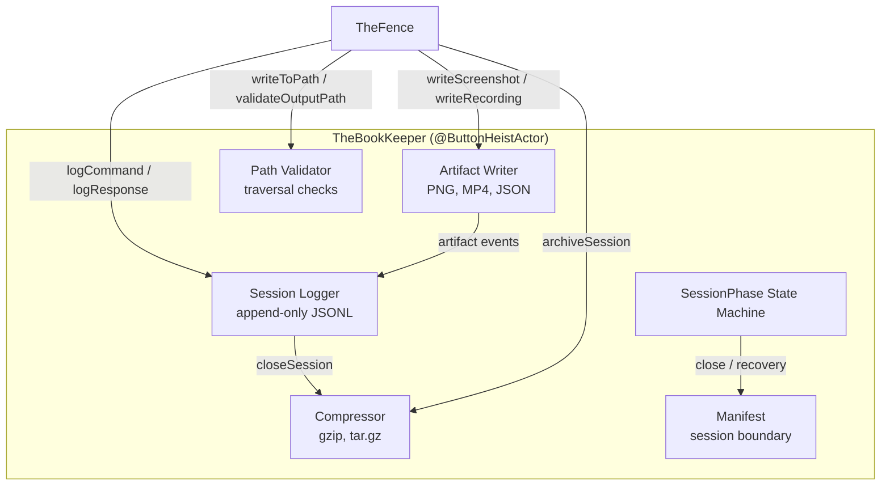
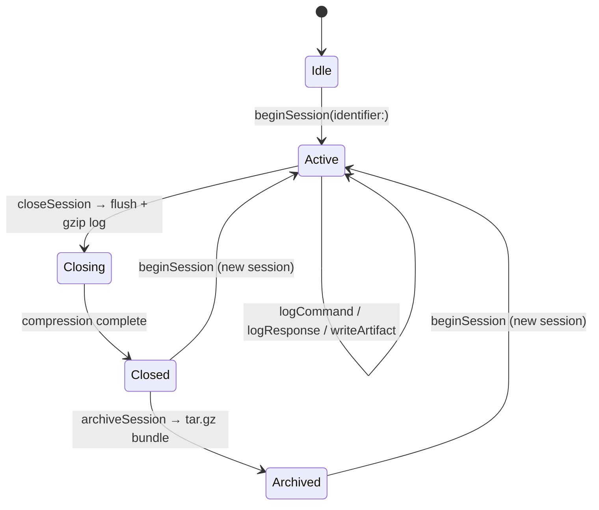

# TheBookKeeper - The Accountant

> **Directory:** `ButtonHeist/Sources/TheButtonHeist/TheBookKeeper/` (`TheBookKeeper.swift`, `TheBookKeeper+Compression.swift`, `TheBookKeeper+Logging.swift`, `SessionManifest.swift`, `PlaybackFailure.swift`)
> **Platform:** macOS 14.0+
> **Role:** Centralized file operations — session logs, artifact storage, compression, path safety, heist recording, abandoned-session recovery

## Responsibilities

TheBookKeeper owns all filesystem I/O on the macOS side:

1. **Session log** — append-only JSONL file recording every command dispatched through TheFence and every response returned, with timestamps and request IDs
2. **Artifact storage** — writes screenshots (PNG) and videos (MP4) to organized session directories with deterministic, sequence-numbered filenames when a session is active, or to standalone artifact directories when no session is active
3. **Path validation** — single entry point for output path safety checks (rejects `..` components, resolves via `.standardized`)
4. **Session manifest** — writes `manifest.json` for durable session boundary data (`formatVersion`, `sessionId`, `startTime`, `endTime`); artifact and count summaries are projected from the append-only session log
5. **Compression** — gzips session logs on close via `/usr/bin/gzip`; bundles a completed session directory into a `.tar.gz` archive on demand via `/usr/bin/tar`
6. **Lifecycle** — creates session directory on `beginSession`, closes and compresses on `closeSession`, archives on `archiveSession`
7. **Heist recording** — records agent sessions as replayable `.heist` scripts. Builds minimal `ElementMatcher` for each targeted element (smallest matcher that uniquely identifies it), filters out state traits and UUID-containing identifiers, falls back to ordinal when no unique matcher exists. Manages `HeistRecording` state within `ActiveSession`, writes `HeistPlayback` (envelope) and `HeistEvidence` (individual steps) to disk. Malformed evidence lines are logged and skipped on stop, not allowed to destroy the whole recording
8. **Heist file I/O** — static `writeHeist(_:to:)` and `readHeist(from:)` for `.heist` file serialization (pretty-printed JSON with sorted keys)
9. **Artifact orchestration** — `writeScreenshotArtifact(...)` and `writeRecordingArtifact(...)` pick the right sink (explicit output path → `writeToPath`; active session → typed `writeScreenshot`/`writeRecording`; idle with no path → standalone default artifact)
10. **Abandoned-session recovery** — `recoverAbandonedSessions()` scans the base directory for sessions with an uncompressed `session.jsonl` (indicating the process exited before `closeSession`), writes a recovery manifest, compresses the log, and surfaces any abandoned heist evidence. Module-internal today; not wired into a production flow yet

## Architecture Diagram



## Session State Machine

TheBookKeeper models its lifecycle as an explicit enum state machine with associated data per phase. Each phase carries exactly the data valid for that state — no stale handles, no orphaned resources.



```swift
enum SessionPhase {
    case idle
    case active(ActiveSession)
    case closing(ClosingSession)
    case closed(ClosedSession)
    case archived(ArchivedSession)
}

struct ActiveSession {
    let sessionId: String              // "{identifier}-{YYYY-MM-dd-HHmmss}"
    let directory: URL                 // base/sessions/{sessionId}/
    let logHandle: FileHandle          // session.jsonl (append mode)
    var manifest: SessionManifest      // in-memory session boundary data
    let startTime: Date
    var nextSequenceNumber: Int        // monotonic counter for artifact filenames
}

struct ClosingSession {
    let sessionId: String
    let directory: URL
    var manifest: SessionManifest
    let startTime: Date
    let endTime: Date
}

struct ClosedSession {
    let sessionId: String
    let directory: URL
    let compressedLogPath: URL         // session.jsonl.gz
    let manifest: SessionManifest
    let startTime: Date
    let endTime: Date
}

struct ArchivedSession {
    let archivePath: URL               // {sessionId}.tar.gz
    let manifest: SessionManifest
    let startTime: Date
    let endTime: Date
}
```

Transitioning from `.active` to `.closing` flushes the manifest and closes the FileHandle. The `.closing` phase then compresses the log to `.gz` via `/usr/bin/gzip`; on success, the phase advances to `.closed`. If compression fails, the phase stays `.closing` — session data is preserved and a fresh `beginSession` is still allowed. Transitioning from `.closed` to `.archived` bundles the directory via `/usr/bin/tar czf`. No phase carries stale handles or open resources from a prior phase.

Invalid transitions throw `BookKeeperError.invalidPhase` — you cannot close an idle session, archive an active session, or begin a second session while one is active.

## Recovery of abandoned sessions

`recoverAbandonedSessions()` is the out-of-band recovery path for sessions where the process died before `closeSession` ran. An "abandoned" session is any directory under the base that has a raw `session.jsonl` but no `session.jsonl.gz`. For each such session, TheBookKeeper:

1. Reads or regenerates the manifest, stamping `endTime` if it's missing.
2. Writes the manifest back atomically.
3. Shells out to `/usr/bin/gzip` to compress the raw log.
4. Surfaces any abandoned `heist.jsonl` evidence (line-count + path) so the caller can salvage a partial recording.

This API is module-internal: it's not yet wired into TheFence, the CLI, or MCP. Tests exercise it via `@testable import`. Promote to public when a production consumer lands.

An in-progress heist recording whose `session.jsonl` is still open will never be corrupted by a crash mid-step: `recordHeistEvidence` writes each `HeistEvidence` JSON line durably before updating in-memory state, and `stopHeistRecording` reads entries back using `compactMap` so a single malformed line is logged and skipped rather than destroying the rest of the recording.

## Error Handling

```swift
enum BookKeeperError: Error, LocalizedError {
    case invalidPhase(expected: String, actual: String)
    case unsafePath(String)
    case base64DecodingFailed
    case compressionFailed(String)
    case archiveFailed(String)
    case noStepsRecorded
    case notRecordingHeist
}
```

## Session Directory Layout

```
$XDG_DATA_HOME/buttonheist/sessions/
└── accra-scroll-detection-2026-04-02-143022/
    ├── session.jsonl.gz          # compressed session log
    ├── manifest.json             # session boundary data
    ├── screenshots/
    │   ├── 001-get_screen.png
    │   ├── 002-get_screen.png
    │   └── ...
    └── recordings/
        ├── 001-stop_recording.mp4
        └── ...
```

- Session directory name: `{identifier}-{YYYY-MM-dd-HHmmss}` — self-documenting, matches the simulator naming convention.
- Artifacts use a zero-padded 3-digit sequence number prefix + the command raw value that produced them (`001-get_screen.png`). Sequence numbers are monotonic and never collide; timestamps are in artifact log events and snapshot projections.
- Base directory resolution follows XDG Base Directory conventions:
  1. `BUTTONHEIST_SESSIONS_DIR` env var (explicit override, highest priority)
  2. `$XDG_DATA_HOME/buttonheist/sessions/` (XDG-compliant)
  3. `~/.local/share/buttonheist/sessions/` (XDG default when `XDG_DATA_HOME` is unset)
- No `~/Library/Application Support/` — this is a CLI tool, not a sandboxed app.

The `init(baseDirectory:)` parameter overrides all env var resolution, used by tests to write into a temp directory.

## Format Versioning

Both the JSONL session log and the manifest use SemVer versioning via `SessionFormatVersion.current` (defined in `SessionManifest.swift`). The current version is **0.1.0**. Bump the version when:
- **Patch** (0.1.x): adding optional fields, clarifying semantics without changing structure
- **Minor** (0.x.0): adding required fields, new record types, new artifact types
- **Major** (x.0.0): removing fields, changing field types, breaking the JSONL line structure

## Session Log Format

Append-only JSONL. One JSON object per line. The first line is always a header; subsequent lines are command/response pairs:

```jsonl
{"formatVersion":"0.1.0","sessionId":"accra-scroll-detection-2026-04-02-143022","type":"header"}
{"command":"activate","requestId":"abc-123","t":"2026-04-02T14:30:22.451Z","type":"command","args":{"identifier":"loginButton"}}
{"duration_ms":441,"requestId":"abc-123","status":"ok","t":"2026-04-02T14:30:22.892Z","type":"response"}
{"command":"get_screen","requestId":"def-456","t":"2026-04-02T14:30:25.100Z","type":"command"}
{"artifact":"screenshots/001-get_screen.png","duration_ms":580,"requestId":"def-456","status":"ok","t":"2026-04-02T14:30:25.680Z","type":"response"}
{"artifactType":"screenshot","command":"get_screen","metadata":{"height":852.0,"width":393.0},"path":"screenshots/001-get_screen.png","requestId":"def-456","size":245760,"t":"2026-04-02T14:30:25.681Z","type":"artifact"}
```

Fields:
- `type` — `"header"`, `"command"`, `"response"`, or `"artifact"`
- `formatVersion` — SemVer string (header only)
- `sessionId` — session identifier (header only)
- `t` — ISO 8601 timestamp with fractional seconds
- `requestId` — correlates command/response pairs
- `command` — the command name as a string (command records only)
- `args` — the request arguments, minus binary data and the `"command"` key itself (command records only; omitted when empty)
- `status` — `"ok"` or `"error"` (response records only)
- `duration_ms` — wall-clock time from command to response (response records only)
- `artifact` — relative path to any file written (response records only, when applicable)
- `error` — error message (response records only, when status is `"error"`)
- `artifactType`, `path`, `size`, `metadata` — durable artifact index fields (artifact records only)

Binary data exclusion: keys in the `binaryKeys` set (`pngData`, `videoData`) are stripped. String values longer than 1000 characters are replaced with a `<N chars>` placeholder. JSON keys are sorted for deterministic output.

## Manifest Format

```json
{
    "formatVersion": "0.1.0",
    "sessionId": "accra-scroll-detection-2026-04-02-143022",
    "startTime": "2026-04-02T14:30:22Z",
    "endTime": "2026-04-02T14:31:45Z"
}
```

The manifest is intentionally small: it records the durable session boundary only. It does not carry artifact arrays, command counts, or error counts; those are reconstructed from session log events so `session.jsonl` stays the source of truth. The manifest is written atomically (via `Data.write(to:options:.atomic)`) on close and during abandoned-session recovery.

## Session Log Snapshots

`get_session_log` and `archive_session` return a `SessionLogSnapshot`, not a raw manifest. The snapshot combines:

- `manifest` — durable boundary data from `SessionManifest`
- `counts` — `SessionLogCounts`, derived from command records and error response records
- `artifacts` — `ArtifactEntry` values projected from `type: "artifact"` log records
- `projectionStatus` — `SessionLogProjectionStatus`, reporting malformed JSONL lines and malformed artifact records

Formatted responses flatten the healthy snapshot for callers:

```json
{
    "status": "ok",
    "formatVersion": "0.1.0",
    "sessionId": "accra-scroll-detection-2026-04-02-143022",
    "startTime": "2026-04-02T14:30:22Z",
    "endTime": "2026-04-02T14:31:45Z",
    "commandCount": 47,
    "errorCount": 2,
    "artifactCount": 2,
    "artifacts": [
        {
            "type": "screenshot",
            "path": "screenshots/001-get_screen.png",
            "size": 245760,
            "timestamp": "2026-04-02T14:30:25Z",
            "requestId": "def-456",
            "command": "get_screen",
            "metadata": { "width": 393.0, "height": 852.0 }
        },
        {
            "type": "recording",
            "path": "recordings/001-stop_recording.mp4",
            "size": 3145728,
            "timestamp": "2026-04-02T14:31:40Z",
            "requestId": "ghi-789",
            "command": "stop_recording",
            "metadata": { "width": 393, "height": 852, "duration": 12.5, "fps": 8, "frameCount": 100 }
        }
    ]
}
```

When the projection is degraded, formatted output adds `projectionStatus` with `malformedLineCount`, `malformedArtifactCount`, and the first malformed line/cause when available. Healthy snapshots omit that diagnostic object.

## Compression

Two levels, both shelling out to standard POSIX utilities via `Process`:

1. **Log compression** (`closeSession`) — `/usr/bin/gzip session.jsonl` → `session.jsonl.gz`. gzip replaces the original file atomically. Verifies the `.gz` file exists after completion; throws `BookKeeperError.compressionFailed` on non-zero exit or missing output.

2. **Session archive** (`archiveSession`) — `/usr/bin/tar czf {sessionId}.tar.gz -C {parent} {dirName}`. The archive is written adjacent to the session directory. Verifies the archive exists; throws `BookKeeperError.archiveFailed` on failure. Optionally deletes the source directory via `deleteSource` parameter.

### Output format contract

Every file TheBookKeeper writes is consumable by standard Unix tools without Apple software:

| Artifact | Format | Verify with |
|----------|--------|-------------|
| Session log | JSONL (one JSON object per `\n`-terminated line) | `jq . < session.jsonl` |
| Compressed log | gzip (RFC 1952) | `gunzip session.jsonl.gz` |
| Manifest | JSON | `jq . < manifest.json` |
| Screenshots | PNG | `file 001-get_screen.png` |
| Recordings | MP4 (H.264) | `ffprobe 001-stop_recording.mp4` |
| Session archive | tar+gzip | `tar xzf session.tar.gz` |

No `.plist`, no `.bplist`, no Apple Archive (`.aar`), no Compression framework raw streams. `scp` a session archive to a Linux box, `tar xzf` it, `gunzip` the log, `jq` the manifest — everything works.

## Integration with TheFence

TheFence owns TheBookKeeper as a `let` property alongside TheHandoff:

```swift
let handoff = TheHandoff()
let bookKeeper = TheBookKeeper()
```

### Commands

Four local-only commands dispatch to TheBookKeeper without sending anything to the iOS device. `play_heist` is local-file driven, but executes recorded steps against the connected iOS app:

| Command | Enum case | Behavior |
|---------|-----------|----------|
| `get_session_log` | `.getSessionLog` | Returns the current `SessionLogSnapshot` as a `.sessionLog` response |
| `archive_session` | `.archiveSession` | Auto-closes an active session (if needed), then archives it and returns `.archiveResult` with the archive path and `SessionLogSnapshot` |
| `start_heist` | `.startHeist` | Begins heist recording for the current session (auto-starts a session if needed) |
| `stop_heist` | `.stopHeist` | Stops heist recording and writes the `.heist` file to the specified output path |
| `play_heist` | `.playHeist` | Reads a `.heist` file, then replays steps sequentially via `execute(request:)` against the connected app. CLI supports `--junit <path>` to write a JUnit XML report |

All are in the no-connection-required guard alongside `get_session_state`, `list_devices`, `connect`, and `list_targets`.

### FenceResponse cases

```swift
case sessionLog(snapshot: SessionLogSnapshot)
case archiveResult(path: String, snapshot: SessionLogSnapshot)
case heistStarted
case heistStopped(path: String, stepCount: Int)
case heistPlayback(completedSteps: Int, failedIndex: Int?, totalTimingMs: Int, failure: PlaybackFailure? = nil, report: HeistPlaybackReport? = nil)
```

All implement `humanFormatted()`, `compactFormatted()`, and typed `jsonData()` serialization.

### Logging integration

TheBookKeeper's logging and artifact APIs take `TheFence.Command` directly at the boundary (not a raw string), and convert to `command.rawValue` internally when constructing artifact filenames and JSONL entries. That keeps the typed command surface the dominant currency inside the process while still writing stable string identifiers on disk. TheBookKeeper does not depend on `FenceResponse` — TheFence is the only type that translates responses into the status/artifact/error fields passed to `logResponse`.

TheFence's `execute(request:)` wraps every dispatch with `logCommand` (before) and `logResponse` (after), including timing in milliseconds. Errors that throw from dispatch are also logged before re-throwing. Both calls use `do/catch` with `os.log` warnings so logging failures never break command execution. The `requestId` generated in `execute()` is threaded into handlers via `_requestId` in the args dict, ensuring session log entries and artifact writes share the same correlation ID. When no session is active (`.idle` phase), both calls silently no-op.

### File write delegation

TheFence handlers `handleGetScreen` and `handleStopRecording` delegate file writes to TheBookKeeper via `writeScreenshotArtifact(...)` and `writeRecordingArtifact(...)`:
- **Explicit `--output` path**: routes to `writeToPath`, which validates path safety (rejects `..` components). `BookKeeperError.unsafePath` is caught and converted to `.error()` for the caller.
- **Active session, no explicit path**: auto-persists to the session directory via `writeScreenshot`/`writeRecording`, which appends an artifact event with sequence-numbered filenames and metadata. Returns a `.screenshot`/`.recording` response with the file path.
- **No session, no explicit path**: writes a standalone default artifact under the base directory and returns the file path. Raw base64 responses are opt-in at the handler layer via `inlineData`.

The `ArtifactMetadata` enum (`.screenshot(ScreenshotMetadata) | .recording(RecordingMetadata)`) routes the request to the correct typed write path.

The lower-level `writeScreenshotIfSinkAvailable` / `writeRecordingIfSinkAvailable` helpers still exist for tests and compatibility callers that intentionally want `nil` when no sink exists; TheFence's product path uses the artifact-first methods above.

## CLI Commands

```
buttonheist session-log              # Print session log snapshot and stats
buttonheist archive-session          # Close + archive current session → prints archive path
  --delete-source                    # Remove session directory after archiving
buttonheist start-heist              # Begin heist recording
  --app <bundleId>                   # Target app (default: com.buttonheist.testapp)
buttonheist stop-heist               # Stop recording and write .heist file
  --output <path>                    # Output file path (required)
buttonheist play-heist               # Replay a .heist file
  --input <path>                     # Input file path (required)
```

All accept `--format` (human/json/compact) and standard `ConnectionOptions`.

## MCP Tools

```json
{
    "name": "get_session_log",
    "description": "Get the current session log snapshot showing all commands executed and artifacts produced during this session.",
    "inputSchema": { "type": "object", "properties": {}, "additionalProperties": false }
}
```

```json
{
    "name": "archive_session",
    "description": "Close and compress the current session into a .tar.gz archive. Returns the archive file path.",
    "inputSchema": {
        "type": "object",
        "properties": {
            "delete_source": {
                "type": "boolean",
                "description": "Delete the session directory after archiving (default: false)"
            }
        },
        "additionalProperties": false
    }
}
```

## Design Decisions

### Portable artifacts, modern implementation

The implementation uses idiomatic Swift — `FileHandle`, `FileManager`, `JSONEncoder`, `JSONSerialization`, `Data`, `URL`. The constraint is on **what hits disk**: every output artifact is a standard format consumable by Unix tools without Apple software.

- **XDG Base Directory** for session storage, not `~/Library/Application Support/`. This is a CLI tool used by developers and agents.
- **gzip (RFC 1952)** for log compression via `/usr/bin/gzip`, not Apple Archive or Compression framework.
- **tar+gzip** for session archives via `/usr/bin/tar`. Standard, universal.
- **JSONL and JSON** for structured data, not plist.
- **PNG and MP4** for media — passed through as-is from the wire.

### Why a separate crew member, not inline in TheFence?

TheFence is the largest type in the codebase (600+ lines). File I/O, compression, and manifest management are a distinct responsibility. Extracting them follows the same pattern that separated TheHandoff (connection lifecycle) from TheFence (command dispatch).

### Why JSONL?

Append-only (safe for crash recovery), streamable (`jq` works line-by-line), compresses well. Each line is independently parseable — a truncated file loses at most one partial entry.

### Why lazy session creation?

One-shot CLI commands (`buttonheist get_screen --output shot.png`) don't need session directories. TheBookKeeper starts in `.idle` and only allocates a session directory when `beginSession` is called. Explicit `writeToPath` and default standalone artifact writes work without a session. `logCommand`/`logResponse` silently no-op in idle.

### Why sequence numbers instead of timestamps in filenames?

Timestamps can collide (two screenshots in the same second). Sequence numbers are monotonic and sort naturally. The timestamp is in the artifact log event and snapshot output.

### Why not compress recordings?

MP4 (H.264) is already compressed. Gzipping an MP4 saves <1%.

## Tests

Real filesystem I/O against a temp directory created in `setUp` and deleted in `tearDown`. Split across two files:

- `TheBookKeeperTests.swift` — session lifecycle, logging, manifest, path validation, artifact storage, artifact-first write orchestration.
- `BookKeeperHeistTests.swift` — heist recording/playback, minimal matcher construction, heist file I/O, abandoned-session recovery.

| Group | What they verify |
|-------|-----------------|
| Session phase | idle→active→closing→closed→archived transitions, invalid transitions throw, new session from closed/archived, directory/log file creation, path traversal/slash rejection in identifiers |
| Session log | JSONL line format, command/response fields, error/command count, binary data exclusion, silent no-op when idle |
| Manifest / snapshot | manifest Codable round-trip equality, snapshot projections start empty |
| Path validation | `..` rejection, empty path, simple relative, absolute, embedded traversal |
| Artifact storage | screenshot/recording file creation, artifact log events, sequence numbering, base64 failure, `writeToPath` traversal guard, `writeToPath` success, `archiveSession(deleteSource: true)` deletes the source directory, orchestration routes for all three sinks |
| Heist recording | start/stop lifecycle, excluded commands, error skipping, coordinate-only flagging, binary stripping, interface cache resolution |
| Minimum matcher | identifier, label, semantic traits, value, stateful traits / excludeTraits, then ordinal fallback |
| Heist file I/O | round-trip write/read preserves version, app, steps; malformed JSONL line is logged and skipped, not fatal |
| Recovery | abandoned session compressed with recovery manifest, clean sessions skipped, heist evidence preserved, corrupt manifest regenerated, empty base directory no-op |

## File Inventory

| File | Purpose |
|------|---------|
| `ButtonHeist/Sources/TheButtonHeist/TheBookKeeper/TheBookKeeper.swift` | State machine, session lifecycle, artifact storage, path validation, heist recording, recovery, public API |
| `ButtonHeist/Sources/TheButtonHeist/TheBookKeeper/TheBookKeeper+Logging.swift` | JSONL log writing, binary data exclusion, command/response serialization |
| `ButtonHeist/Sources/TheButtonHeist/TheBookKeeper/TheBookKeeper+Compression.swift` | `/usr/bin/gzip` for logs, `/usr/bin/tar czf` for archives |
| `ButtonHeist/Sources/TheButtonHeist/TheBookKeeper/SessionManifest.swift` | `SessionManifest`, `SessionLogSnapshot`, `SessionLogCounts`, `SessionLogProjectionStatus`, `ArtifactEntry`, `ArtifactType`, `ScreenshotMetadata`, `RecordingMetadata`, `ResponseStatus`, `SessionFormatVersion` |
| `ButtonHeist/Sources/TheButtonHeist/TheBookKeeper/PlaybackFailure.swift` | `PlaybackFailure` enum with `.fenceError`, `.actionFailed`, `.thrown` cases for heist playback diagnostics |
| `ButtonHeist/Sources/TheButtonHeist/TheBookKeeper/README.md` | In-module reading-order guide |
| `ButtonHeist/Sources/TheButtonHeist/Support/String+PathValidation.swift` | `validatedOutputURL()` — the single path-safety check consumed by `validateOutputPath` |
| `ButtonHeist/Tests/ButtonHeistTests/TheBookKeeperTests.swift` | Session lifecycle, logging, manifest, path, artifact storage tests |
| `ButtonHeist/Tests/ButtonHeistTests/BookKeeperHeistTests.swift` | Heist recording/playback, minimal matcher, recovery tests |
| `ButtonHeistCLI/Sources/Commands/SessionLogCommand.swift` | CLI: `buttonheist session-log` |
| `ButtonHeistCLI/Sources/Commands/ArchiveSessionCommand.swift` | CLI: `buttonheist archive-session` |
