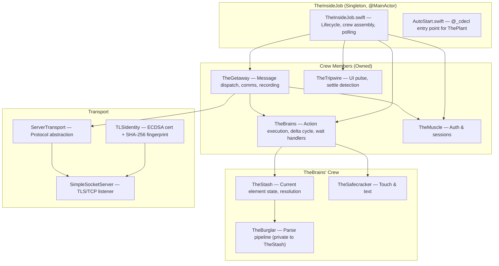
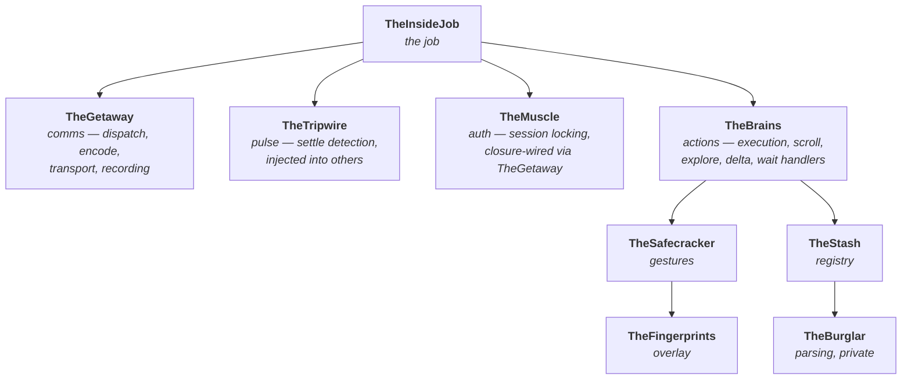
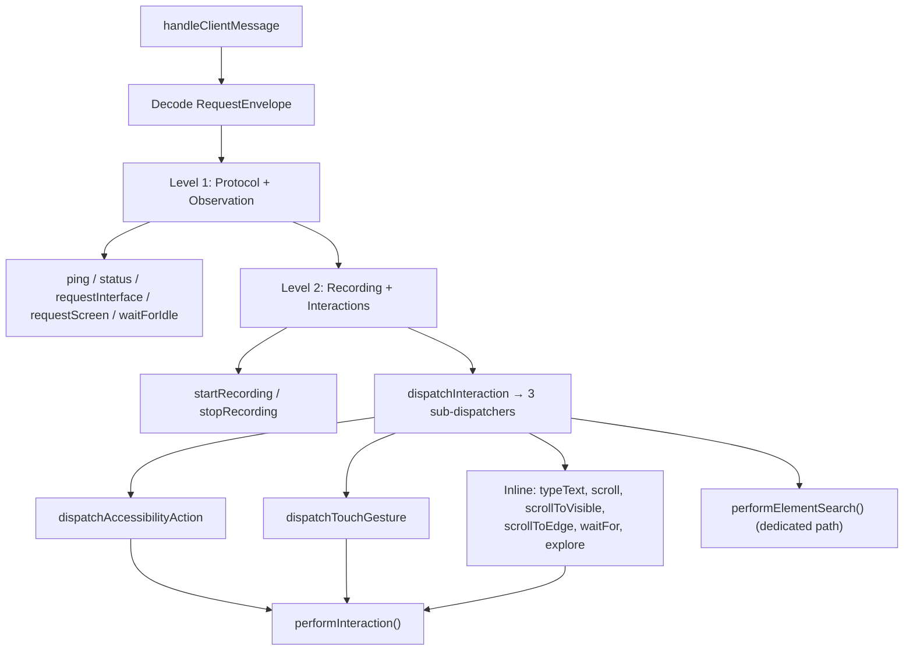
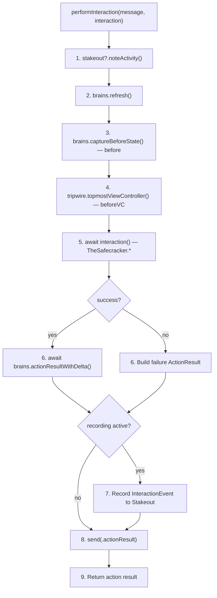
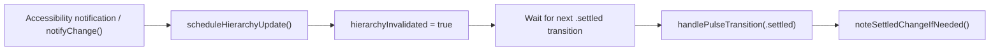
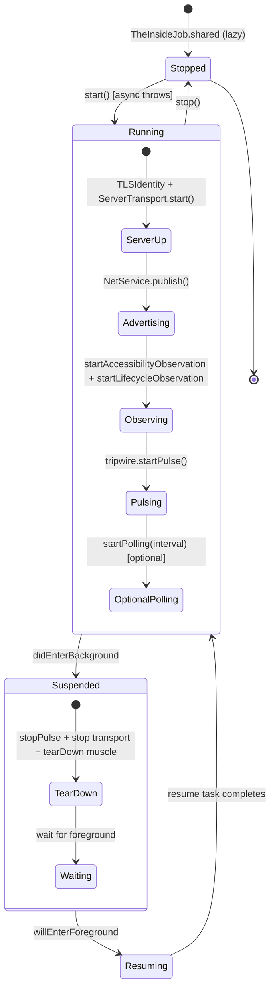

# TheInsideJob — The Job

> **Module:** `ButtonHeist/Sources/TheInsideJob/`
> **Platform:** iOS 17.0+ (UIKit, DEBUG builds only)
> **Role:** The job itself — singleton coordinator, crew assembly, server lifecycle

## Responsibilities

TheInsideJob is the job. It assembles the crew, manages the operation lifecycle, and provides the public API. It does not handle messages, encode responses, or touch the accessibility tree — those are delegated to the crew.

1. **Singleton and public API** — `TheInsideJob.shared`, `configure(token:instanceId:)`, `start()`, `stop()`, `notifyChange()`, `startPolling()`, `stopPolling()`
2. **Crew assembly** — creates TheMuscle, TheTripwire, TheBrains, and TheGetaway at init; wires them together
3. **Server lifecycle** — creates TLS identity, creates ServerTransport, tells TheGetaway to wire transport, starts listening, advertises via Bonjour
4. **App lifecycle** — observes `didEnterBackground` (suspend), `willEnterForeground` (resume), `willTerminate` (stop)
5. **Suspend/resume** — tears down transport, pulse, keyboard observation, and cache on background; recreates everything on foreground
6. **Polling management** — `PollingPhase` state machine, `makePollingTask` settle loop, pause/resume across background
7. **Pulse routing** — receives `TheTripwire.PulseTransition` via callback, tells TheGetaway when a settled capture may have changed
8. **Accessibility observation** — listens for `elementFocusedNotification` and `voiceOverStatusDidChange`, tells TheGetaway to mark hierarchy invalidated

## Architecture Diagram

## Key Files

| File | Purpose |
|------|---------|
| `TheInsideJob.swift` | Singleton, crew assembly, server lifecycle, polling, app lifecycle |
| `AutoStart.swift` | `@_cdecl` bridge for ObjC auto-start (ThePlant calls this) |

All message handling, encoding, transport notifications, and recording now live in [`TheGetaway/`](../../ButtonHeist/Sources/TheInsideJob/TheGetaway/). See [09-THEGETAWAY.md](09-THEGETAWAY.md).

## Ownership

## Singleton Pattern and `configure()`

`TheInsideJob` uses a manually managed `private static var _shared`. The `public static var shared` property lazily creates a default instance if `_shared` is nil.

`configure(token:instanceId:allowedScopes:port:)` is a **one-shot factory**:
- If `_shared` is already set: logs a warning and returns immediately (no-op)
- If `_shared` is nil: creates a new instance with the provided parameters

Calling `shared` before `configure()` creates a default instance that ignores any subsequent `configure()` call.

## Message Dispatch Flow

### `dispatchAccessibilityAction`
`activate`, `increment`, `decrement`, `performCustomAction`, `editAction`, `setPasteboard`, `getPasteboard`, `resignFirstResponder`

### `dispatchTouchGesture`
`touchTap`, `touchLongPress`, `touchSwipe`, `touchDrag`, `touchPinch`, `touchRotate`, `touchTwoFingerTap`, `touchDrawPath` (≤10,000 points), `touchDrawBezier` (≤1,000 segments)

### Inline in `dispatchInteraction`
`typeText`, `scroll`, `scrollToVisible` (one-shot), `scrollToEdge`, `waitFor`, `explore`

### `performElementSearch` (dedicated path)
`elementSearch` — iterative page-by-page scroll search. Bypasses `performInteraction` because the scroll loop manages its own refresh/settle cycles.

## `performInteraction` Pipeline

Every interaction except `elementSearch` flows through this method:

`performElementSearch` is structurally identical but calls `brains.executeElementSearch` directly (handles repeated scroll+settle cycles internally) and preserves `scrollSearchResult` in the response. `scrollToVisible` is now a one-shot jump that flows through the standard `performInteraction` pipeline.

## Status Message Handling

`status` is handled specially:
- Allowed **pre-auth**: any client that has completed `clientHello` → `serverHello` (is in `helloValidatedClients`) can send `status` before providing a token
- Allowed **post-auth**: routed through the Level 1 dispatch for authenticated clients
- Builds `StatusPayload` via `makeStatusPayload()` from `Bundle.main`, `UIDevice.current`, and `TheMuscle` state

## Settled Change Tracking

Two paths update recording/background state from settled hierarchy changes:

### 1. Pulse-driven invalidation (primary)

There is **no debounce timer**. The mechanism is entirely pulse-driven:
- `scheduleHierarchyUpdate()` sets `hierarchyInvalidated = true`
- the next `.settled` transition fires `handlePulseTransition`
- `noteSettledChangeIfNeeded()` refreshes via TheBrains and updates recording inactivity state if the capture changed

### 2. Settle-driven polling (supplementary)

`startPolling(interval:)` enables an optional loop that waits on `tripwire.waitForAllClear(timeout:)`, then calls the same settled-change tracking path. The timeout defaults to 2s and is clamped to a 0.5s minimum. **Disabled by default** (`isPollingEnabled = false`); auto-started instances can enable it.

## Lifecycle State Machine

`ServerState` is an enum with four cases: `.stopped`, `.running(transport: ServerTransport)`, `.suspended`, `.resuming(task: Task<Void, Never>)`. There is no `Configured` state -- `configure()` sets the singleton but does not change `ServerState`.

`suspend()` tears down the entire TCP server, Bonjour, pulse, and observation. `resume()` recreates everything from scratch on a potentially new port — any connected clients are silently disconnected.

## Transport Wiring

Five closure assignments wire `TheMuscle` ↔ `ServerTransport`:
- `muscle.sendToClient` → `transport.send(_:to:)`
- `muscle.markClientAuthenticated` → `transport.markAuthenticated(_:)`
- `muscle.disconnectClient` → `transport.disconnect(clientId:)`
- `muscle.onClientAuthenticated` → `sendServerInfo`
- `muscle.onSessionActiveChanged` → update Bonjour TXT record (`sessionactive` key)

Inbound events arrive via a single `AsyncStream<TransportEvent>` exposed as
`transport.events`. TheGetaway runs one long-lived consumer task that awaits
each event sequentially and dispatches via `handleTransportEvent(_:)`:
- **Authenticated path**: `.dataReceived(clientId, data, respond)` →
  `handleClientMessage`
- **Pre-auth path**: `.unauthenticatedData(clientId, data, respond)` →
  checks for `status` probe from hello-validated clients → otherwise routes to
  `muscle.handleUnauthenticatedMessage`
- **Lifecycle**: `.clientConnected(clientId, address)` registers the address
  on TheMuscle and sends serverHello; `.clientDisconnected(clientId)` notifies
  TheMuscle.
- **Fast path**: `.fastPathHandled(clientId)` is yielded after
  `syncDataInterceptor` answers a ping on the network queue — TheGetaway just
  notes client activity. The actual response went out before the event was
  enqueued.

Routing every event through one ordered stream means the consumer cannot
observe a `.dataReceived` for a client before its `.clientConnected` — the
race the prior per-event `Task { @MainActor in ... }` callback bridge could
lose.

## Items Flagged for Review

### MEDIUM PRIORITY

**No unit tests for TheInsideJob itself**
- Delta computation logic in TheStash is pure data transformation and could be tested without UIKit
- Server-side dispatch logic is untested

### LOW PRIORITY

**Background/foreground lifecycle**
- `suspend()` tears down the entire TCP server and Bonjour
- `resume()` recreates on a potentially new port
- Any connected clients are silently disconnected with no notification
- Expected iOS behavior but worth understanding
