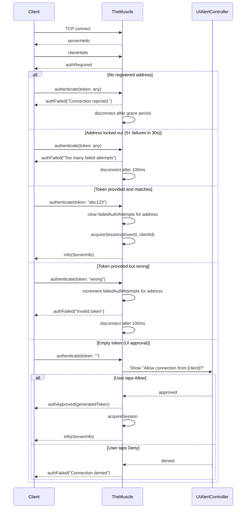
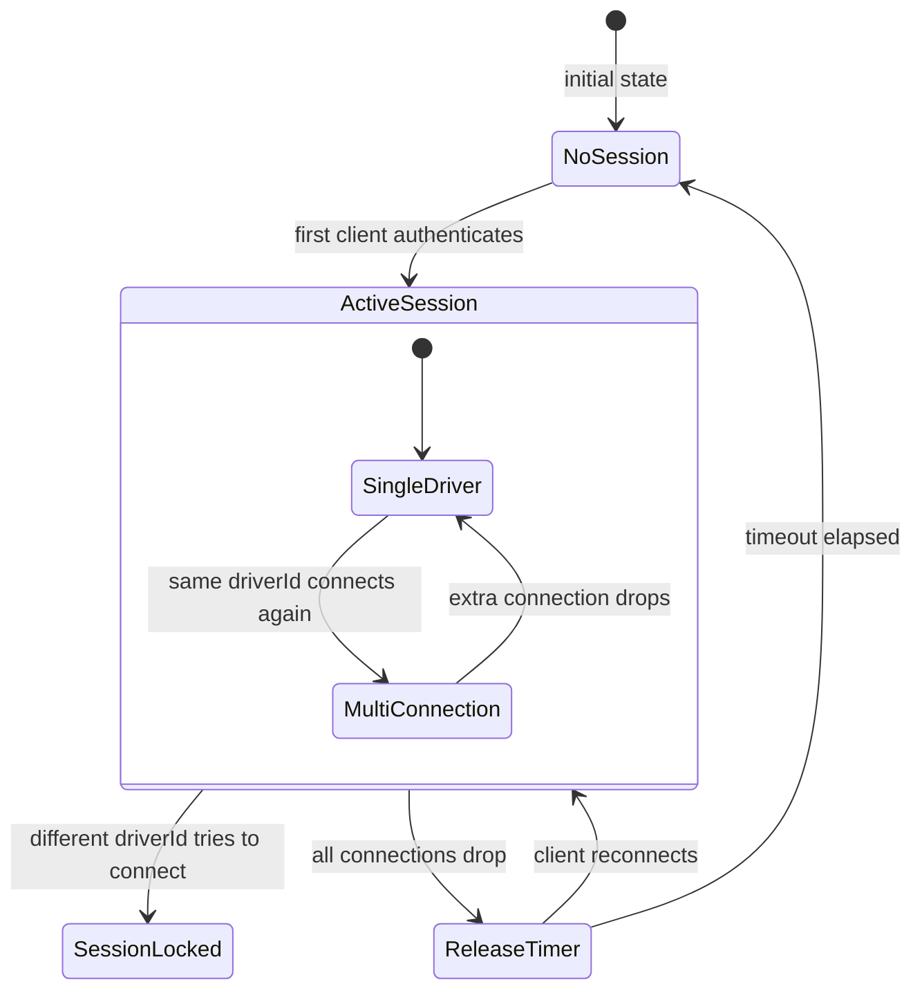

# TheMuscle - The Bouncer

> **File:** `ButtonHeist/Sources/TheInsideJob/TheMuscle.swift`
> **Platform:** iOS 17.0+ (UIKit)
> **Role:** Guards the perimeter - authentication, session locking, on-device approval

## Responsibilities

TheMuscle controls who gets access and enforces single-driver exclusivity:

1. **Token-based authentication** - validates incoming tokens against configured/auto-generated value
2. **On-device UI approval** - shows Allow/Deny popup for empty-token connections
3. **Session locking** - ensures only one "driver" controls the app at a time
4. **Single-timer session release** - inactivity timer for cleanup when all connections drop
5. **Observer management** - tracks read-only observer connections (`observerClients`), routes `watch` messages, validates token by default (`restrictWatchers` defaults to `true`). Set `INSIDEJOB_RESTRICT_WATCHERS=0` (env) or `InsideJobRestrictWatchers=false` (plist) to allow unauthenticated observers
6. **Brute-force protection** - tracks per-address rate-limiting state via `addressAuthStates: [String: AddressAuthState]`. `AddressAuthState` is an enum with two cases: `.failing(attempts: Int)` for accumulating failures and `.lockedOut(until: Date, attempts: Int)` for lockout after 5 consecutive failures. Lockout lasts 30 seconds, persists across TCP reconnections (keyed on IP, not client ID), and clears automatically on expiry. Successful authentication removes the entry for that address
7. **Per-client lifecycle tracking** - each client traverses a `ClientPhase` enum stored in `clients: [Int: ClientPhase]`. The five phases are: `.connected(address:)`, `.helloValidated(address:)`, `.pendingApproval(address:respond:isObserver:)`, `.authenticated(address:driverIdentity:subscribed:)`, and `.observer(address:subscribed:)`. Disconnection removes the entry entirely. Clients must reach `.helloValidated` before auth is processed; clients still in `.connected` are rejected and disconnected

## Architecture Diagram

```mermaid
graph TD
    subgraph TheMuscle["TheMuscle (@MainActor)"]
        TokenRes["Token Resolution - explicit > env var > plist > auto-generated UUID"]
        HelloGate["Hello Gate - require clientHello before auth/watch/status"]
        AuthFlow["Auth Flow - validate token / show UI prompt"]
        SessionMgr["Session Manager - driver identity tracking"]
        Timer["Release Timer - fires when all connections drop"]
    end

    WatchMgr["Observer Manager - observer tracking, token-checked by default"]

    Client["Remote Client"] -->|clientHello| HelloGate
    HelloGate -->|authenticate(token)| AuthFlow
    HelloGate -->|watch(token)| WatchMgr
    AuthFlow -->|valid| SessionMgr
    AuthFlow -->|empty| UIPrompt["UIAlertController - Allow / Deny"]
    AuthFlow -->|invalid| Reject["authFailed + disconnect"]

    SessionMgr -->|same driver| Join["Join existing session"]
    SessionMgr -->|different driver| Lock["sessionLocked"]

    Timer -->|all disconnected, timeout elapsed| Release["releaseSession()"]
    Release -->|session cleared| TokenRes
```

## Auth Flow Detail



## Session Locking State Machine



## Configuration

| Source | Key | Default | Notes |
|--------|-----|---------|-------|
| Environment | `INSIDEJOB_TOKEN` | auto-UUID | Explicit auth token |
| Info.plist | `InsideJobToken` | auto-UUID | Fallback when env var not set |
| Environment | `INSIDEJOB_SESSION_TIMEOUT` | 30s | Release timer (fires when all connections drop). No plist fallback. |
| Environment | `INSIDEJOB_RESTRICT_WATCHERS` | `true` (restricted) | Set to `"0"`, `"false"`, or `"no"` to allow unauthenticated observers. Accepts `"1"`, `"true"`, `"yes"` (case-insensitive) to restrict. |
| Info.plist | `InsideJobRestrictWatchers` | `true` (restricted) | Fallback when env var not set. Boolean plist value. |

### Callbacks

| Callback | Set by | Fires when |
|----------|--------|-----------|
| `sendToClient` | TheInsideJob | Sending messages to a client |
| `markClientAuthenticated` | TheInsideJob | Client passes auth |
| `disconnectClient` | TheInsideJob | Force-disconnecting a client |
| `onClientAuthenticated` | TheInsideJob | A client completes auth → triggers `sendServerInfo` |
| `onSessionActiveChanged` | TheInsideJob | Session acquired or released → updates Bonjour TXT `sessionactive` key |

## Items Flagged for Review

### HIGH PRIORITY

**Empty token allows any hello-complete network client to trigger UI prompt** (`TheMuscle.swift`)
- Any process on the local network can connect, complete the hello handshake, and send `authenticate(token: "")`
- This triggers a `UIAlertController` on the device
- Documented behavior, but potential for annoyance/DoS in shared network environments
- Consider: should there be a way to disable UI approval flow entirely?

**Client lifecycle is a 5-phase state machine** (`TheMuscle.swift`)
- `ClientPhase` tracks each client through: connected, helloValidated, pendingApproval, authenticated, observer
- `helloValidatedClients` is a computed property derived from `clients` (any phase past `.connected`)
- Any future auth changes need to preserve these phase distinctions or disconnections will get subtle

### MEDIUM PRIORITY

**Disconnect grace period still uses a fixed constant**
- `disconnectGracePeriod` is now centralized, which is better than duplicated literals
- It is still a hardcoded transport behavior rather than a documented protocol timing guarantee
- If clients ever need slower links, this may need revisiting

**Token resolution generates new UUID every launch** (`TheMuscle.swift`)
- `UUID().uuidString` on every launch — tokens are ephemeral unless `INSIDEJOB_TOKEN` is set
- Previously-approved clients must re-authenticate after app restart

**TheMuscle test coverage is still narrower than the state machine**
- There are now unit tests for hello/auth flows and protocol mismatch handling
- Session locking logic and timer behavior remain more complex than the current test surface

### LOW PRIORITY

**Session connections tracked by client ID integers**
- `activeSessionConnections` is a computed property derived from the `SessionState` enum: returns `connections` from `.active(driverId:, connections:)`, empty set otherwise
- Session state is modeled as `SessionState` enum with three cases: `.idle`, `.active(driverId: String, connections: Set<Int>)`, `.draining(driverId: String, releaseTimer: Task<Void, Never>)`
- Client IDs come from `SimpleSocketServer` connection tracking (incrementing `Int` counter)
