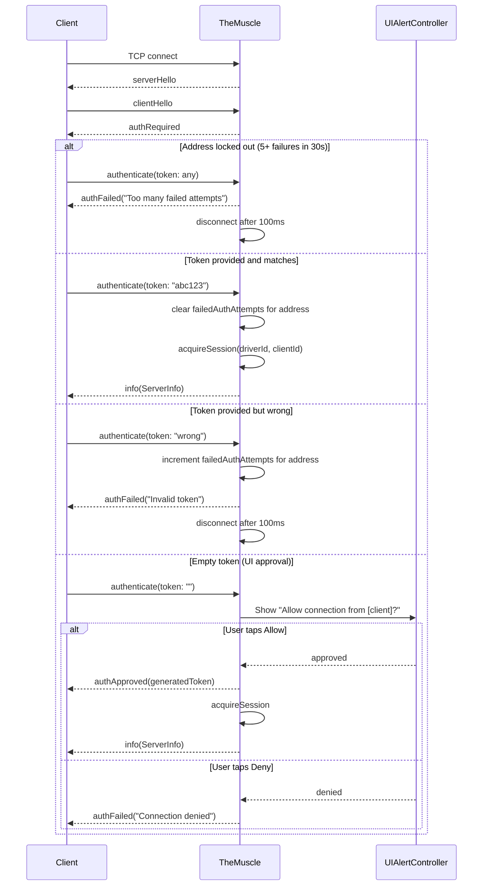
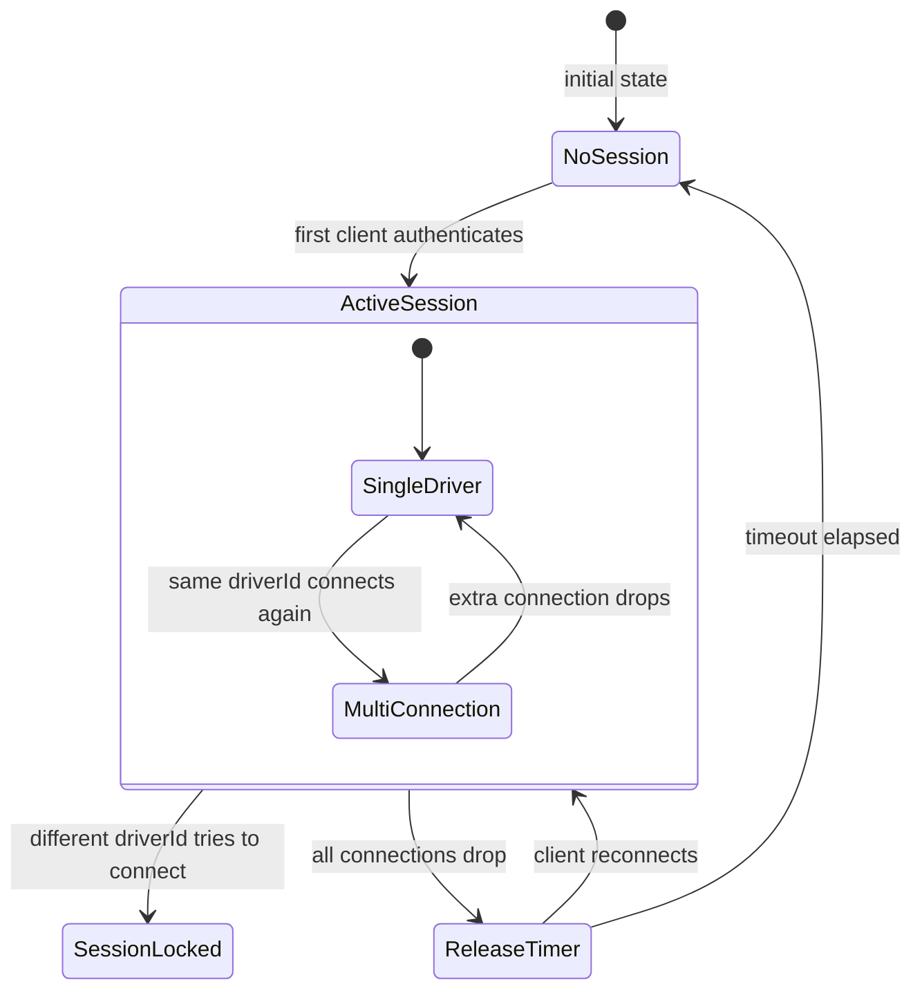

# TheMuscle - The Bouncer

> **File:** `ButtonHeist/Sources/TheInsideJob/TheMuscle.swift`
> **Platform:** iOS 17.0+ (UIKit)
> **Role:** Guards the perimeter - authentication, session locking, on-device approval

## Responsibilities

TheMuscle controls who gets access and enforces single-driver exclusivity:

1. **Token-based authentication** - validates incoming tokens against configured/auto-generated value
2. **On-device UI approval** - shows Allow/Deny popup for empty-token connections
3. **Session locking** - ensures only one "driver" controls the app at a time
4. **Single-timer session release** - inactivity timer for cleanup when all connections drop
5. **Observer management** - tracks read-only observer connections (`observerClients`), routes `watch` messages, validates token by default (`restrictWatchers` defaults to `true`). Set `INSIDEJOB_RESTRICT_WATCHERS=0` (env) or `InsideJobRestrictWatchers=false` (plist) to allow unauthenticated observers
6. **Brute-force protection** - tracks failed auth attempts per remote IP address (`failedAuthAttempts`, `lockedOutAddresses`). After 5 consecutive failures from the same address, that address is locked out for 30 seconds. Lockout persists across TCP reconnections since it's keyed on IP, not client ID. Successful authentication clears the counter for that address

## Architecture Diagram

```mermaid
graph TD
    subgraph TheMuscle["TheMuscle (@MainActor)"]
        TokenRes["Token Resolution - explicit > env var > plist > auto-generated UUID"]
        HelloGate["Hello Gate - require clientHello before auth/watch/status"]
        AuthFlow["Auth Flow - validate token / show UI prompt"]
        SessionMgr["Session Manager - driver identity tracking"]
        Timer["Release Timer - fires when all connections drop"]
    end

    WatchMgr["Observer Manager - observer tracking, token-checked by default"]

    Client["Remote Client"] -->|clientHello| HelloGate
    HelloGate -->|authenticate(token)| AuthFlow
    HelloGate -->|watch(token)| WatchMgr
    AuthFlow -->|valid| SessionMgr
    AuthFlow -->|empty| UIPrompt["UIAlertController - Allow / Deny"]
    AuthFlow -->|invalid| Reject["authFailed + disconnect"]

    SessionMgr -->|same driver| Join["Join existing session"]
    SessionMgr -->|different driver| Lock["sessionLocked"]

    Timer -->|all disconnected, timeout elapsed| Release["releaseSession()"]
    Release -->|session cleared| TokenRes
```

## Auth Flow Detail



## Session Locking State Machine



## Configuration

| Source | Key | Default | Notes |
|--------|-----|---------|-------|
| Environment | `INSIDEJOB_TOKEN` | auto-UUID | Explicit auth token |
| Info.plist | `InsideJobToken` | auto-UUID | Fallback to env var |
| Environment | `INSIDEJOB_SESSION_TIMEOUT` | 30s | Release timer (fires when all connections drop) |
| Info.plist | `InsideJobSessionTimeout` | 30s | Fallback |
| Environment | `INSIDEJOB_RESTRICT_WATCHERS` | not set | Set to `"1"` to require valid token for watch connections |
| Info.plist | `InsideJobRestrictWatchers` | not set | Set to `true` to require valid token for watch connections |

## Items Flagged for Review

### HIGH PRIORITY

**Empty token allows any hello-complete network client to trigger UI prompt** (`TheMuscle.swift`)
- Any process on the local network can connect, complete the hello handshake, and send `authenticate(token: "")`
- This triggers a `UIAlertController` on the device
- Documented behavior, but potential for annoyance/DoS in shared network environments
- Consider: should there be a way to disable UI approval flow entirely?

**Hello validation is tracked separately from auth/session state** (`TheMuscle.swift`)
- `helloValidatedClients` is now a distinct pre-auth gate before `authenticate`, `watch`, or pre-auth `status`
- This is the right behavior, but it means three connection states now exist: connected, hello-complete, authenticated
- Any future auth changes need to preserve those distinctions or disconnections will get subtle

### MEDIUM PRIORITY

**Disconnect grace period still uses a fixed constant**
- `disconnectGracePeriod` is now centralized, which is better than duplicated literals
- It is still a hardcoded transport behavior rather than a documented protocol timing guarantee
- If clients ever need slower links, this may need revisiting

**Token resolution generates new UUID every launch** (`TheMuscle.swift`)
- `UUID().uuidString` on every launch — tokens are ephemeral unless `INSIDEJOB_TOKEN` is set
- Previously-approved clients must re-authenticate after app restart

**TheMuscle test coverage is still narrower than the state machine**
- There are now unit tests for hello/auth flows and protocol mismatch handling
- Session locking logic and timer behavior remain more complex than the current test surface

### LOW PRIORITY

**Session connections tracked by client ID integers**
- `activeSessionConnections: Set<Int>` stores client IDs
- Client IDs come from `SimpleSocketServer` connection tracking (incrementing `Int` counter)
- If IDs were reused (unlikely but possible), stale entries could accumulate
