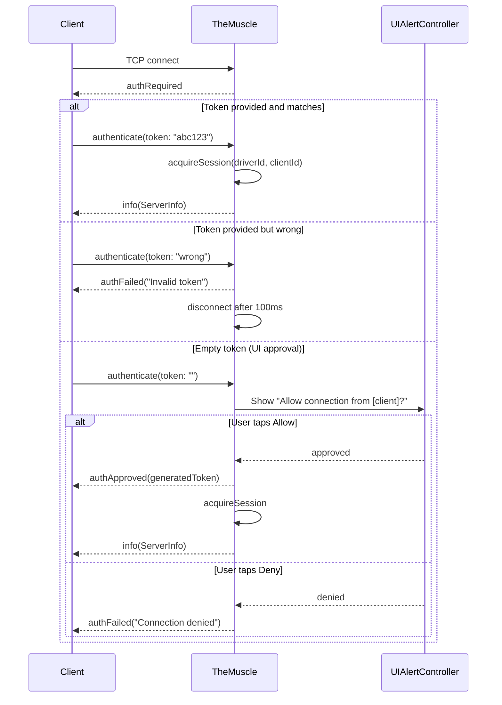
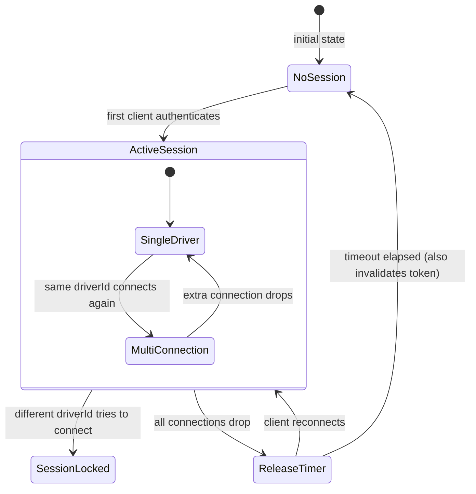

# TheMuscle - The Bouncer

> **File:** `ButtonHeist/Sources/TheInsideJob/TheMuscle.swift`
> **Platform:** iOS 17.0+ (UIKit)
> **Role:** Guards the perimeter - authentication, session locking, on-device approval

## Responsibilities

TheMuscle controls who gets access and enforces single-driver exclusivity:

1. **Token-based authentication** - validates incoming tokens against configured/auto-generated value
2. **On-device UI approval** - shows Allow/Deny popup for empty-token connections
3. **Session locking** - ensures only one "driver" controls the app at a time
4. **Single-timer session release** - inactivity timer for cleanup when all connections drop
5. **Observer management** - tracks read-only observer connections (`observerClients`), routes `watch` messages, auto-approves by default or validates token when `INSIDEJOB_RESTRICT_WATCHERS=1` (env) or `InsideJobRestrictWatchers=true` (plist) is set

## Architecture Diagram

```mermaid
graph TD
    subgraph TheMuscle["TheMuscle (@MainActor)"]
        TokenRes["Token Resolution - explicit > env var > plist > auto-generated UUID"]
        AuthFlow["Auth Flow - validate token / show UI prompt"]
        SessionMgr["Session Manager - driver identity tracking"]
        Timer["Release Timer - fires when all connections drop"]
    end

    WatchMgr["Observer Manager - observer tracking, auto-approve"]

    Client["Remote Client"] -->|authenticate(token)| AuthFlow
    Client -->|watch(token)| WatchMgr
    AuthFlow -->|valid| SessionMgr
    AuthFlow -->|empty| UIPrompt["UIAlertController - Allow / Deny"]
    AuthFlow -->|invalid| Reject["authFailed + disconnect"]

    SessionMgr -->|same driver| Join["Join existing session"]
    SessionMgr -->|different driver| Lock["sessionLocked"]

    Timer -->|all disconnected, timeout elapsed| Release["releaseSession()"]
    Release -->|invalidates token| TokenRes
```

## Auth Flow Detail



## Session Locking State Machine



## Configuration

| Source | Key | Default | Notes |
|--------|-----|---------|-------|
| Environment | `INSIDEJOB_TOKEN` | auto-UUID | Explicit auth token |
| Info.plist | `InsideJobToken` | auto-UUID | Fallback to env var |
| Environment | `INSIDEJOB_SESSION_TIMEOUT` | 30s | Release timer (fires when all connections drop) |
| Info.plist | `InsideJobSessionTimeout` | 30s | Fallback |
| Environment | `INSIDEJOB_RESTRICT_WATCHERS` | not set | Set to `"1"` to require valid token for watch connections |
| Info.plist | `InsideJobRestrictWatchers` | not set | Set to `true` to require valid token for watch connections |

## Items Flagged for Review

### HIGH PRIORITY

**Empty token allows any network process to trigger UI prompt** (`TheMuscle.swift:108`)
- Any process on the local network can connect and send `authenticate(token: "")`
- This triggers a `UIAlertController` on the device
- Documented behavior, but potential for annoyance/DoS in shared network environments
- Consider: should there be a way to disable UI approval flow entirely?

**Release timer invalidates auth token** (`TheMuscle.swift`)
- When the release timer fires (all connections dropped for timeout duration), `releaseSession()` is called AND the token is invalidated
- A fresh UUID is generated, meaning the previous token no longer works
- This is aggressive: if a client temporarily loses connectivity for >30s, it cannot reconnect without re-discovering the new token

### MEDIUM PRIORITY

**Repeated `100_000_000` nanosecond delay** (`TheMuscle.swift:125, 189, 249`)
```swift
try? await Task.sleep(nanoseconds: 100_000_000)  // appears 3 times
```
- Used as a "give client time to receive the message before disconnect" delay
- Should be a named constant

**Token resolution generates new UUID every launch** (`TheMuscle.swift`)
- `UUID().uuidString` on every launch — tokens are ephemeral unless `INSIDEJOB_TOKEN` is set
- Previously-approved clients must re-authenticate after app restart

**No unit tests for TheMuscle**
- Session locking logic (driver identity matching, timer behavior) is complex
- Could be tested with mock server/client without UIKit dependency

### LOW PRIORITY

**Session connections tracked by client ID integers**
- `activeSessionConnections: Set<Int>` stores client IDs
- Client IDs come from `SimpleSocketServer` connection tracking (incrementing `Int` counter)
- If IDs were reused (unlikely but possible), stale entries could accumulate
