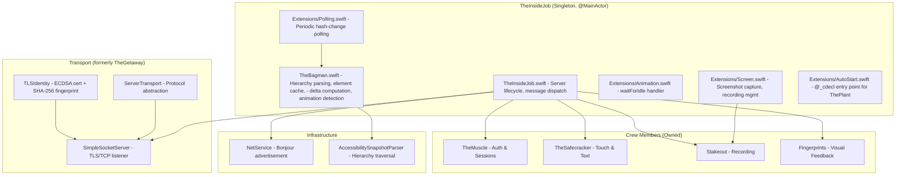
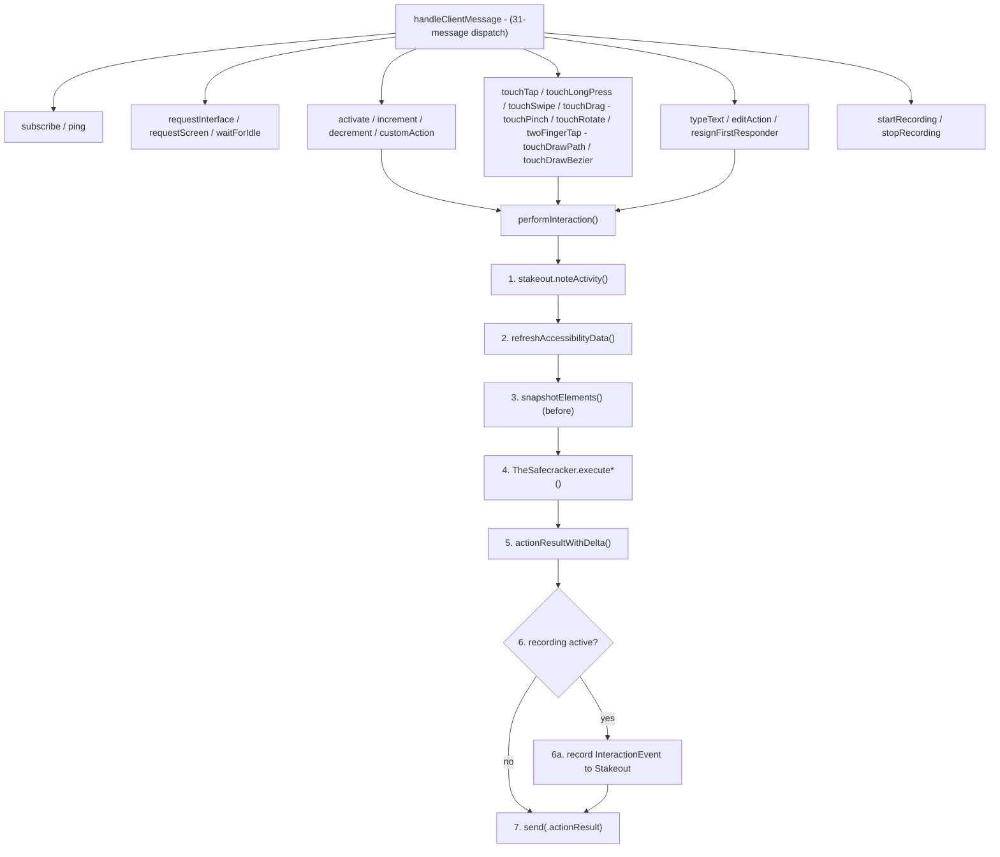
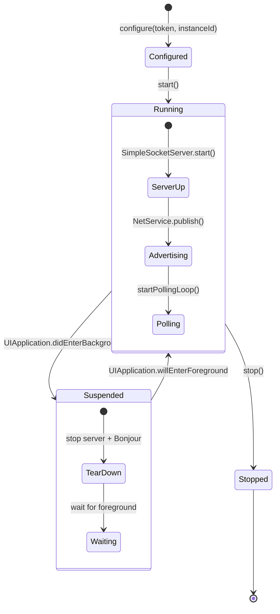

# TheInsideJob - The Inside Operative

> **Module:** `ButtonHeist/Sources/TheInsideJob/`
> **Platform:** iOS 17.0+ (UIKit, DEBUG builds only)
> **Role:** Master coordinator of the entire iOS-side operation

## Responsibilities

TheInsideJob is the central hub running inside the target iOS app. It:

1. **Runs a TLS/TCP server** (`SimpleSocketServer`) listening for remote commands
2. **Manages TLS identity** (`TLSIdentity`) — runtime-generated self-signed ECDSA certificates with SHA-256 fingerprint pinning
3. **Provides server transport** (`ServerTransport`) — protocol abstraction for server-side networking
4. **Broadcasts presence** via Bonjour mDNS (`_buttonheist._tcp`)
5. **Polls for UI changes** at configurable intervals (default 1s, min 0.5s)
6. **Dispatches all commands** to crew members (TheSafecracker, Stakeout, TheMuscle)
7. **Manages client subscriptions** and broadcasts hierarchy/screen updates
8. **Caches accessibility elements** with weak references for fast resolution
9. **Filters connections by scope** (`ConnectionScope`) — classifies incoming connections at `.ready` using typed `NWEndpoint.Host` and interface detection (loopback = simulator, `anpi` interface = USB, other = network). Defaults to simulator + USB; configurable via `INSIDEJOB_SCOPE` env var.

## Architecture Diagram



## Key Files

| File | Purpose |
|------|---------|
| `TheInsideJob.swift` | Core lifecycle, server wiring, message dispatch |
| `TheBagman.swift` | Element cache, hierarchy parsing, delta computation, animation detection, screen capture |
| `Extensions/Animation.swift` | `handleWaitForIdle` — waits for animation settle, refreshes hierarchy |
| `Extensions/Polling.swift` | Periodic poll loop, debounced broadcast |
| `Extensions/Screen.swift` | Screen capture broadcast, recording start/stop handlers |
| `Extensions/AutoStart.swift` | `@_cdecl` bridge for ObjC auto-start |
| `SimpleSocketServer.swift` | NWListener TLS/TCP server, connection management |
| `ServerTransport.swift` | Server-side networking protocol abstraction |
| `TLSIdentity.swift` | ECDSA cert generation, SHA-256 fingerprint, Keychain persistence |

## Message Dispatch Flow



## Lifecycle State Machine



## Update Mechanisms

Two paths trigger hierarchy broadcasts:

1. **Notification-driven** (`scheduleHierarchyUpdate`): Triggered by `UIAccessibility.elementFocusedNotification` and `voiceOverStatusDidChangeNotification`. Debounced 300ms.
2. **Polling** (`startPollingLoop`): Periodic at configurable interval (default 1s). Compares `elements.hashValue` to `lastHierarchyHash`. Only broadcasts on change.

## Items Flagged for Review

### HIGH PRIORITY

**Auth token logged in plaintext** (`TheInsideJob.swift:114`)
```swift
insideJobLogger.info("Auth token: \(self.muscle.authToken)")
```
The full UUID token is emitted to the system log at `info` level. Any process with log access can read it.

**`handleClientMessage` cyclomatic complexity** (`TheInsideJob.swift:268`)
- Top-level switch handles protocol and observation messages, then delegates interaction dispatch to `TheInsideJob+Dispatch.swift` which routes 31 message types across 3 sub-methods
- Each case delegates to a helper, so the individual cases are thin, but the full dispatch flow spans multiple files

### MEDIUM PRIORITY

**`shouldBindToLoopback` always returns `false`** (`TheInsideJob.swift:98`)
```swift
private var shouldBindToLoopback: Bool { false }
```
Dead computed property. The server always binds to all interfaces. The documented `INSIDEJOB_BIND_ALL` env var is never read. Note: connection scope filtering (`INSIDEJOB_SCOPE`) now provides a proper mechanism to restrict which connection sources are accepted, partially superseding the need for bind-address filtering.

**Magic nanosecond literals**
- `300_000_000` debounce (line 66)
- `1_000_000_000` polling interval (line 70)
- These could be named constants for clarity.

**`performInteraction` captures interaction events during recording**
- When `stakeout.state == .recording`, each interaction captures an `InteractionEvent`
- This includes an optional `interfaceDelta: InterfaceDelta?` (not full before/after snapshots)
- The `command: ClientMessage` parameter was added to `performInteraction` — all call sites updated

**No unit tests for TheInsideJob itself**
- The delta computation logic in `TheBagman.swift` is pure data transformation
- It could be extracted and tested without UIKit dependency
- Currently untested

### LOW PRIORITY

**Background/foreground lifecycle**
- `suspend()` tears down the entire TCP server and Bonjour advertisement
- `resume()` recreates on a new port
- Any connected clients are silently disconnected with no notification
- This is expected iOS behavior but worth understanding

**Singleton pattern**
- `TheInsideJob.shared` is a replaceable singleton via `configure()`
- Multiple calls to `configure()` create a new instance, but `start()` on the old one isn't called
- Safe in practice (ThePlant only calls once), but the API allows misuse
