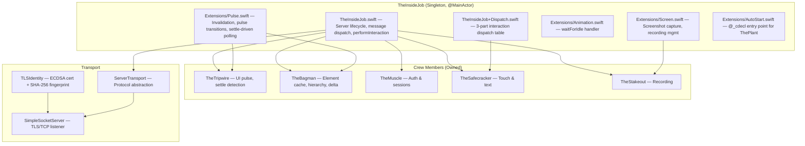
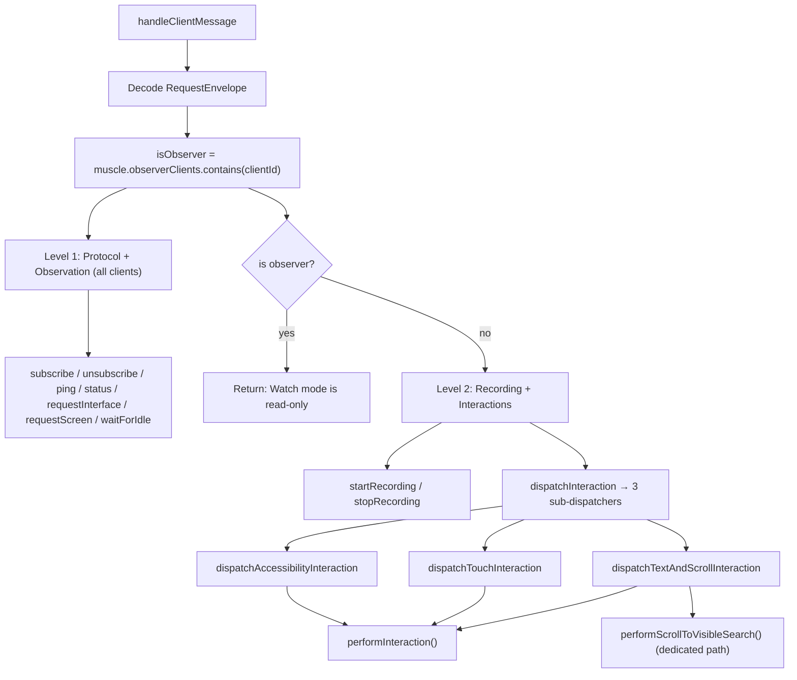
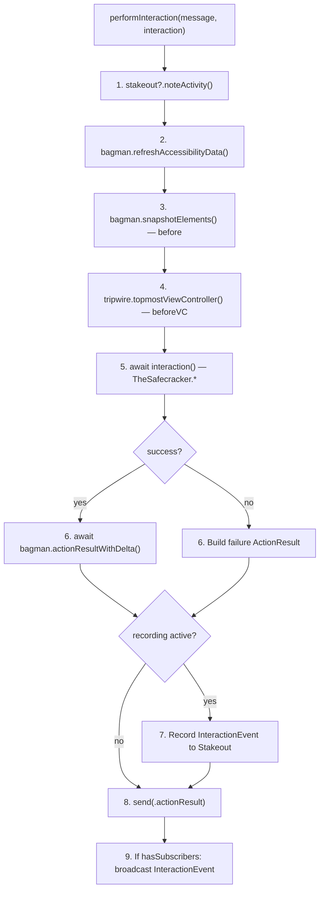
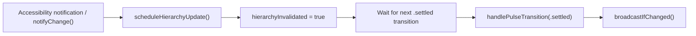
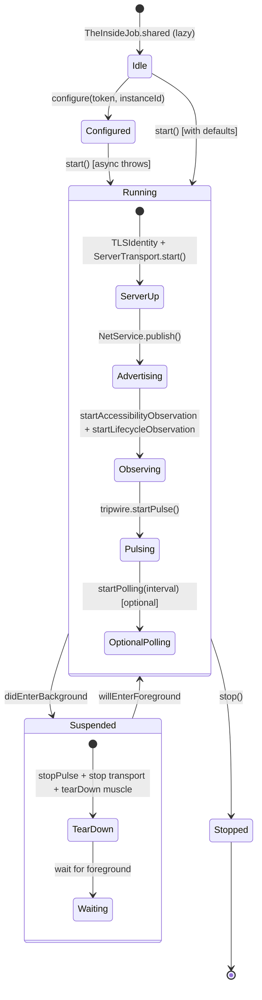

# TheInsideJob — The Inside Operative

> **Module:** `ButtonHeist/Sources/TheInsideJob/`
> **Platform:** iOS 17.0+ (UIKit, DEBUG builds only)
> **Role:** Master coordinator of the entire iOS-side operation

## Responsibilities

TheInsideJob is the central hub running inside the target iOS app. It:

1. **Runs a TLS/TCP server** (`SimpleSocketServer`) listening for remote commands
2. **Manages TLS identity** (`TLSIdentity`) — runtime-generated self-signed ECDSA certificates with SHA-256 fingerprint pinning
3. **Provides server transport** (`ServerTransport`) — protocol abstraction for server-side networking
4. **Broadcasts presence** via Bonjour mDNS (`_buttonheist._tcp`)
5. **Drives hierarchy updates** via TheTripwire's pulse-based settle detection (no debounce timer)
6. **Polls for UI changes** at configurable intervals (default 1s, min 0.5s) as a supplementary mechanism
7. **Dispatches all commands** to crew members via a two-level dispatch structure
8. **Manages client subscriptions** and broadcasts hierarchy/screen updates
9. **Filters connections by scope** (`ConnectionScope`) — classifies incoming connections at `.ready` using typed `NWEndpoint.Host` and interface detection

## Architecture Diagram

## Key Files

| File | Purpose |
|------|---------|
| `TheInsideJob.swift` | Core lifecycle, server wiring, message dispatch, `performInteraction`, `performScrollToVisibleSearch` |
| `TheInsideJob+Dispatch.swift` | Three-part interaction dispatch: accessibility, touch, text+scroll |
| `TheBagman.swift` | Element cache, hierarchy parsing, delta computation, animation detection, screen capture |
| `Extensions/Pulse.swift` | `scheduleHierarchyUpdate`, `handlePulseTransition`, `startPollingLoop`, `broadcastIfChanged`, `sendInterface` |
| `Extensions/Animation.swift` | `handleWaitForIdle` — waits for settle, returns interface snapshot |
| `Extensions/Screen.swift` | Screen capture broadcast, recording start/stop handlers |
| `Extensions/AutoStart.swift` | `@_cdecl` bridge for ObjC auto-start |
| `SimpleSocketServer.swift` | NWListener TLS/TCP server, connection management |
| `ServerTransport.swift` | Server-side networking protocol abstraction |
| `TLSIdentity.swift` | ECDSA cert generation, SHA-256 fingerprint, Keychain persistence |

## Singleton Pattern and `configure()`

`TheInsideJob` uses a manually managed `private static var _shared`. The `public static var shared` property lazily creates a default instance if `_shared` is nil.

`configure(token:instanceId:allowedScopes:port:)` is a **one-shot factory**:
- If `_shared` is already set: logs a warning and returns immediately (no-op)
- If `_shared` is nil: creates a new instance with the provided parameters

Calling `shared` before `configure()` creates a default instance that ignores any subsequent `configure()` call.

## Message Dispatch Flow

### `dispatchAccessibilityInteraction`
`activate`, `increment`, `decrement`, `performCustomAction`, `editAction`, `setPasteboard`, `getPasteboard`, `resignFirstResponder`

### `dispatchTouchInteraction`
`touchTap`, `touchLongPress`, `touchSwipe`, `touchDrag`, `touchPinch`, `touchRotate`, `touchTwoFingerTap`, `touchDrawPath` (≤10,000 points), `touchDrawBezier` (≤1,000 segments)

### `dispatchTextAndScrollInteraction`
`typeText`, `scroll`, `scrollToVisible` (→ dedicated path), `scrollToEdge`

## `performInteraction` Pipeline

Every interaction except `scrollToVisible` flows through this method:

`performScrollToVisibleSearch` is structurally identical but calls `theSafecracker.executeScrollToVisible` directly (handles repeated scroll+settle cycles internally) and preserves `scrollSearchResult` in the response.

## Status Message Handling

`status` is handled specially:
- Allowed **pre-auth**: any client that has completed `clientHello` → `serverHello` (is in `helloValidatedClients`) can send `status` before providing a token
- Allowed **post-auth**: routed through the Level 1 dispatch for all authenticated clients including observers
- Builds `StatusPayload` via `makeStatusPayload()` from `Bundle.main`, `UIDevice.current`, and `TheMuscle` state

## Update Mechanisms

Two paths trigger hierarchy broadcasts:

### 1. Pulse-driven invalidation (primary)

There is **no debounce timer**. The mechanism is entirely pulse-driven:
- `scheduleHierarchyUpdate()` sets `hierarchyInvalidated = true`
- the next `.settled` transition fires `handlePulseTransition`
- `broadcastIfChanged()` refreshes Bagman, compares the snapshot hash, and broadcasts the same shared interface payload path

### 2. Settle-driven polling (supplementary)

`startPolling(interval:)` enables an optional loop that waits on `tripwire.waitForAllClear(timeout:)`, then calls the same `broadcastIfChanged()` path. The timeout defaults to 2s and is clamped to a 0.5s minimum. **Disabled by default** (`isPollingEnabled = false`); auto-started instances can enable it.

## Lifecycle State Machine

`suspend()` tears down the entire TCP server, Bonjour, pulse, and observation. `resume()` recreates everything from scratch on a potentially new port — any connected clients are silently disconnected.

## Transport Wiring

Five closure assignments wire `TheMuscle` ↔ `ServerTransport`:
- `muscle.sendToClient` → `transport.send(_:to:)`
- `muscle.markClientAuthenticated` → `transport.markAuthenticated(_:)`
- `muscle.disconnectClient` → `transport.disconnect(clientId:)`
- `muscle.onClientAuthenticated` → `sendServerInfo`
- `muscle.onSessionActiveChanged` → update Bonjour TXT record (`sessionactive` key)

Inbound data paths:
- **Authenticated path**: `transport.onDataReceived` → `handleClientMessage`
- **Pre-auth path**: `transport.onUnauthenticatedData` → checks for `status` probe from hello-validated clients → otherwise routes to `muscle.handleUnauthenticatedMessage`

## Items Flagged for Review

### MEDIUM PRIORITY

**`shouldBindToLoopback` always returns `false`** (`TheInsideJob.swift`)
- Dead computed property. The server always binds to all interfaces.
- Connection scope filtering (`INSIDEJOB_SCOPE`) provides the proper mechanism to restrict connection sources.

**No unit tests for TheInsideJob itself**
- Delta computation logic in TheBagman is pure data transformation and could be tested without UIKit
- Server-side dispatch logic is untested

### LOW PRIORITY

**Background/foreground lifecycle**
- `suspend()` tears down the entire TCP server and Bonjour
- `resume()` recreates on a potentially new port
- Any connected clients are silently disconnected with no notification
- Expected iOS behavior but worth understanding
