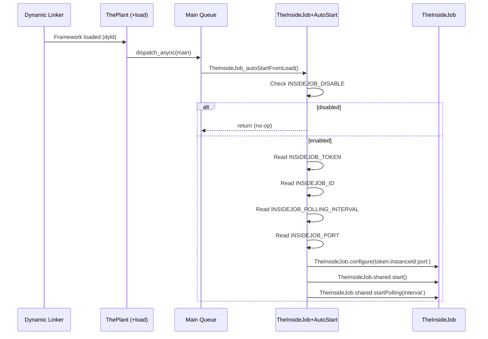
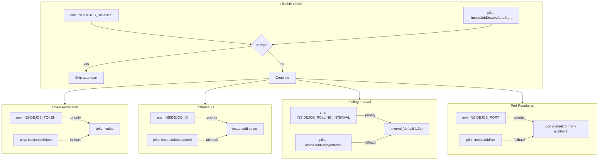

# ThePlant - The Advance Man

> **Files:** `ButtonHeist/Sources/ThePlant/ThePlantAutoStart.m`, `ButtonHeist/Sources/TheInsideJob/Lifecycle/AutoStart.swift`
> **Platform:** iOS 17.0+ (ObjC + Swift)
> **Role:** Zero-configuration auto-initialization - starts TheInsideJob before any app code runs

## Responsibilities

ThePlant enables zero-code-change integration:

1. **ObjC `+load` method** fires automatically when the framework is loaded
2. **Dispatches to main queue** to ensure UIKit safety
3. **Reads configuration** from environment variables and Info.plist
4. **Creates and starts TheInsideJob** singleton before any Swift app code runs
5. **DEBUG builds only** - disabled in Release

## Architecture Diagram

## Configuration Resolution

## Items Flagged for Review

### LOW PRIORITY

**ObjC `+load` timing**
- `+load` runs very early in the process lifecycle
- The `dispatch_async(dispatch_get_main_queue(), ...)` ensures UIKit is available
- But if the app does significant work before the main run loop starts, there could be a brief window where TheInsideJob isn't ready
- In practice this is fine - the async dispatch runs as soon as the main run loop processes its queue

**`@_cdecl` usage**
- `Extensions/AutoStart.swift` uses `@_cdecl("TheInsideJob_autoStartFromLoad")` to expose a Swift function to ObjC
- This is a stable Swift attribute but not officially documented for public use
- Alternative: could use `@objc` class method, but `@_cdecl` avoids needing an ObjC-visible class

**ThePlant target dependency on TheInsideJob**
- ThePlant imports TheInsideJob as a dependency
- The app links both ThePlant and TheInsideJob
- If ThePlant is included without TheInsideJob, it won't compile (which is correct behavior)
