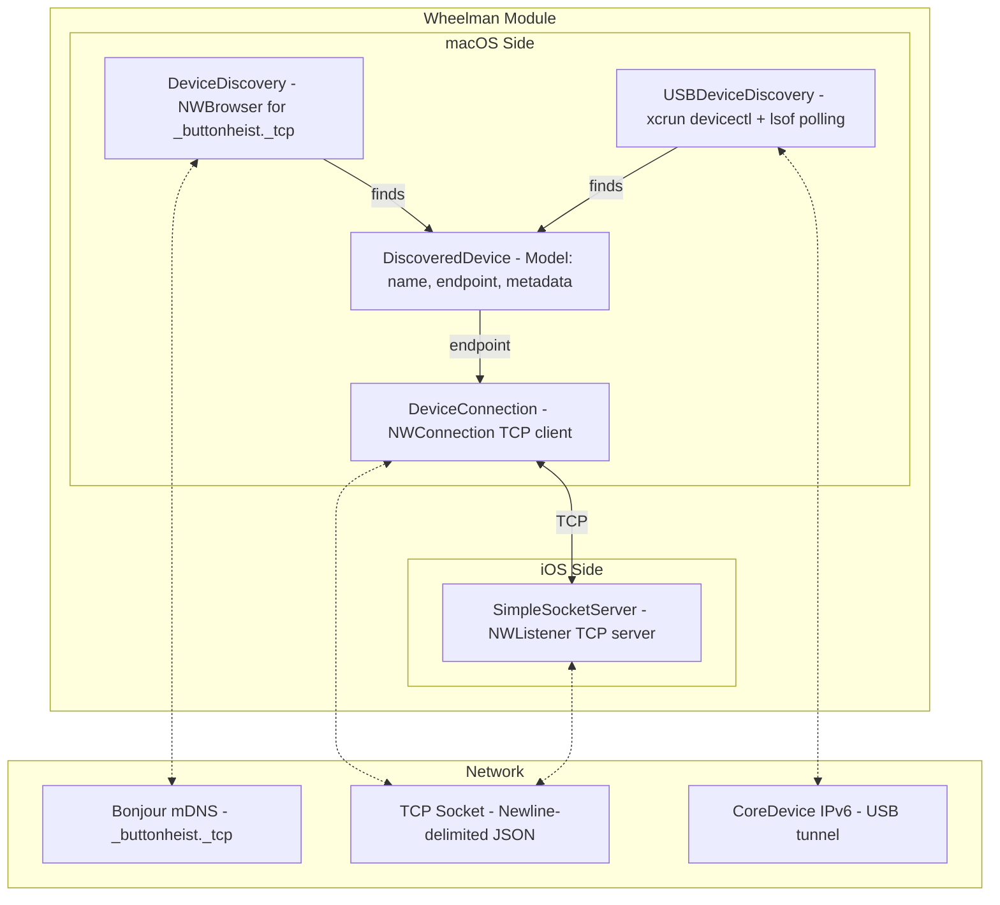
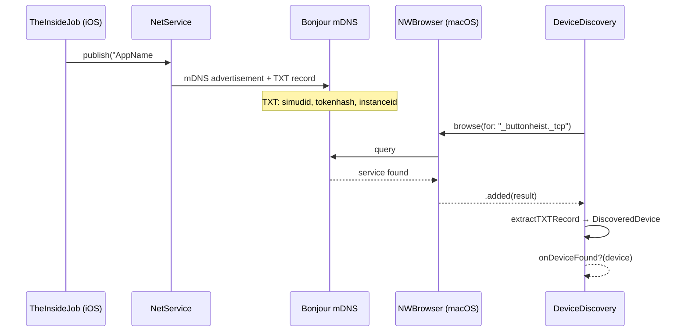
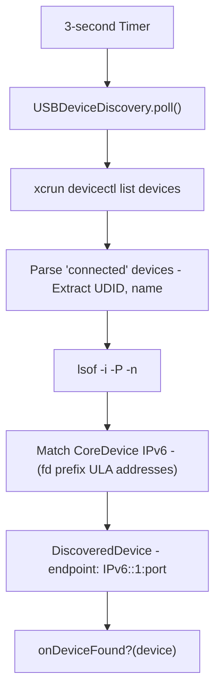
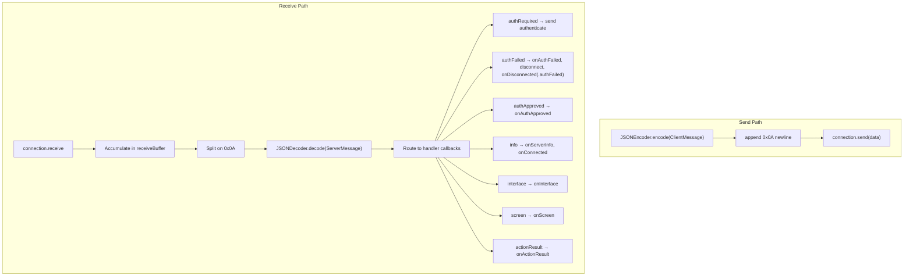

# Wheelman - The Getaway Driver

> **Module:** `ButtonHeist/Sources/Wheelman/`
> **Platform:** iOS 17.0+ / macOS 14.0+ (Network framework)
> **Role:** Cross-platform TCP networking - discovery, connections, server, USB tunneling

## Responsibilities

Wheelman handles all transport:

1. **Bonjour discovery** (`DeviceDiscovery`) - finds TheInsideJob instances on the network
2. **TCP client** (`DeviceConnection`) - connects to and exchanges messages with TheInsideJob
3. **TCP server** (`SimpleSocketServer`) - accepts client connections on the iOS side
4. **USB tunneling** (`USBDeviceDiscovery`) - discovers USB-connected devices via CoreDevice
5. **Device model** (`DiscoveredDevice`) - represents a found InsideJob instance
6. **Disconnect reasons** (`DisconnectReason`) - structured enum for why a connection closed (networkError, bufferOverflow, serverClosed, authFailed, sessionLocked, localDisconnect)

## Architecture Diagram



## Discovery Flow



## SimpleSocketServer Internal Architecture

```mermaid
graph TD
    subgraph SimpleSocketServer["SimpleSocketServer (@unchecked Sendable)"]
        Listener["NWListener - IPv6 dual-stack, port 0"]
        Lock["NSLock - protects all mutable state"]

        subgraph State["Mutable State (lock-protected)"]
            Connections["connections: [String: NWConnection]"]
            AuthSet["authenticatedClients: Set<String>"]
            RateLimit["messageTimes: [String: [Date]]"]
        end

        subgraph Limits["Limits"]
            MaxConn["maxConnections: 5"]
            MaxRate["maxMessagesPerSecond: 30"]
            MaxBuf["maxBufferSize: 10MB"]
        end
    end

    Listener -->|new connection| Accept["Accept / Reject"]
    Accept -->|under limit| Track["Track in connections dict"]
    Accept -->|at limit| Reject["Reject"]

    Track --> UnauthPath["onUnauthenticatedData - (pre-auth messages)"]
    Track --> AuthPath["onDataReceived - (post-auth messages)"]

    UnauthPath -->|markAuthenticated()| AuthPath
```

## USB Discovery Mechanism



## DeviceConnection Message Flow



## Items Flagged for Review

### HIGH PRIORITY

**`vendorid` TXT key never published, always nil** (`DeviceDiscovery.swift:64,68`)
```swift
var vendorId: String? = nil  // line 64
vendorId = txtRecord["vendorid"]  // line 68 - key never published!
```
- `TheInsideJob.swift:238-255` publishes TXT keys: `simudid`, `tokenhash`, `instanceid`
- `DeviceDiscovery` reads `simudid`, `vendorid`, `tokenhash`, `instanceid`
- The `vendorid` key is NEVER published in the TXT record
- `DiscoveredDevice.vendorIdentifier` is always nil for Bonjour-discovered devices
- This may be intentional (removed feature?) but the dead code path is misleading

**`SimpleSocketServer` is `@unchecked Sendable` with manual locking** (`SimpleSocketServer.swift:9`)
- All mutable state protected by a single `NSLock`
- This is correct but fragile - any new mutable state added without lock protection creates a data race
- The `@unchecked Sendable` annotation suppresses compiler safety checks

**Listener semaphore timeout not surfaced as error** (`SimpleSocketServer.swift:88`)
```swift
_ = readySemaphore.wait(timeout: .now() + 5)
```
- If the listener never reaches `.ready` state, the semaphore times out silently
- `_listeningPort` may remain `0`, which is returned to callers
- No error thrown or logged on timeout - callers get port `0` as if it succeeded

### MEDIUM PRIORITY

**USBDeviceDiscovery blocks main thread** (`USBDeviceDiscovery.swift:154-155`)
- `poll()` runs subprocess commands (`xcrun devicectl`, `lsof`) synchronously
- Uses `process.waitUntilExit()` and `pipe.fileHandleForReading.readDataToEndOfFile()`
- These are blocking calls on the main thread (the timer fires on `@MainActor`)
- `xcrun devicectl` has a 10-second timeout, `lsof` has 5-second timeout
- Should be moved to a background queue

**10MB buffer guard disconnects with `.bufferOverflow` reason** (`DeviceConnection.swift`)
- When buffer exceeds 10MB, `disconnect()` is called and `onDisconnected?(.bufferOverflow)` fires
- No error message is sent to the server/client before disconnecting
- The other end sees a silent TCP close

**No tests for `DeviceDiscovery` or `USBDeviceDiscovery`**
- TXT record parsing logic is untested
- USB subprocess parsing (`discoverConnectedDevices`, `findIPv6Tunnel`) is untested
- These involve string parsing that could break with OS version changes

### LOW PRIORITY

**Rate limiting is per-second only** (`SimpleSocketServer.swift`)
- 30 messages/second limit, checked by counting messages in the last 1-second window
- No burst protection or sliding window
- A client could send 30 messages in 1ms, wait 999ms, then send 30 more

**`connection.start(queue: .global())` hardcoded** (`DeviceConnection.swift:58`)
- No way to inject a custom queue for testing
- Callbacks hop to MainActor via `Task`, so the queue choice mainly affects initial callback delivery timing
