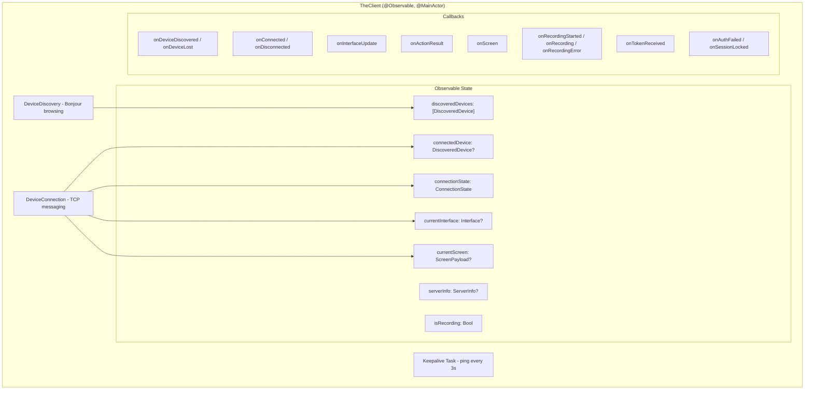
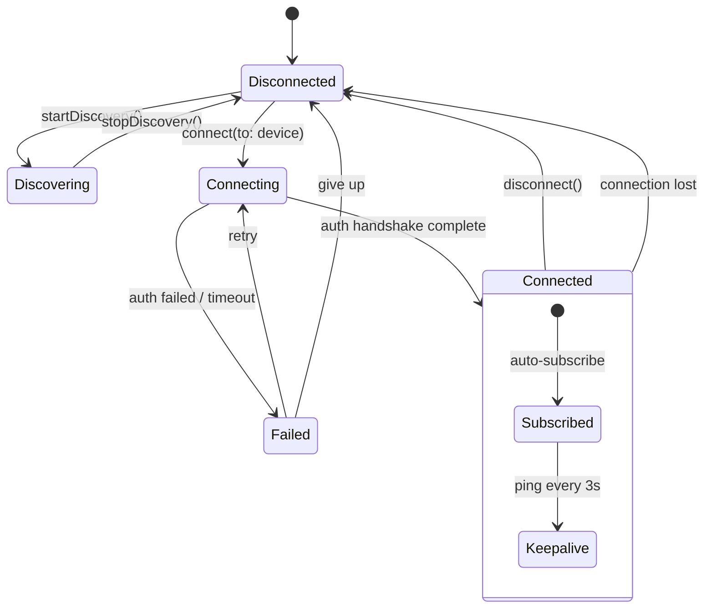
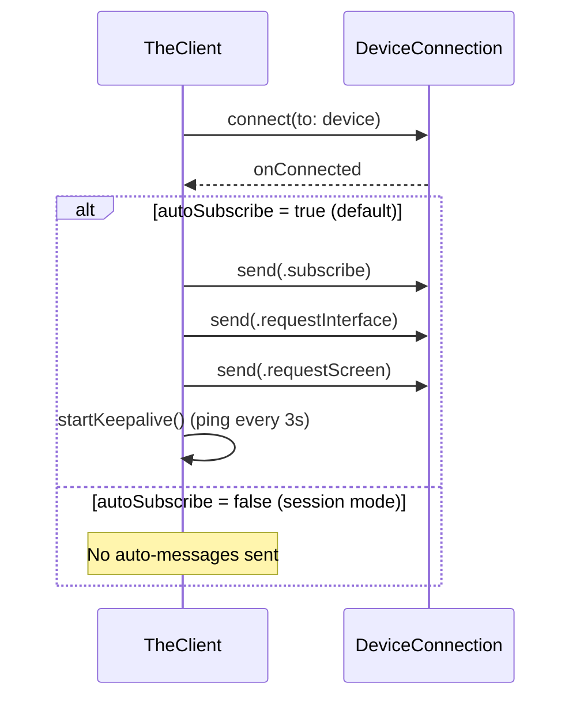
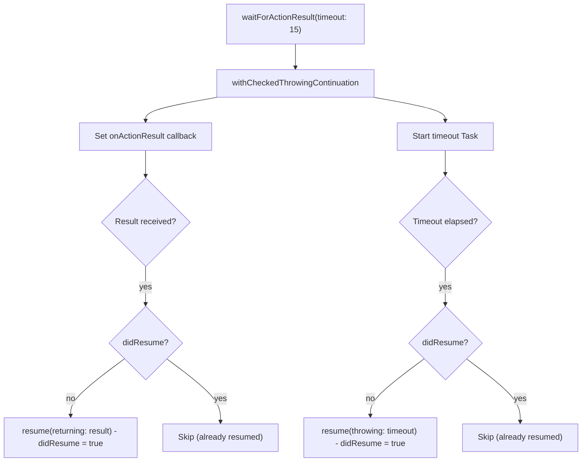

# TheClient - The Outside Coordinator

> **File:** `ButtonHeist/Sources/ButtonHeist/TheClient.swift`
> **Platform:** macOS 14.0+
> **Role:** High-level observable macOS client API for discovery and device control

## Responsibilities

TheClient is the macOS-side counterpart to InsideJob:

1. **Device discovery** via `DeviceDiscovery` (wraps NWBrowser)
2. **Connection management** with auto-subscribe and keepalive
3. **Observable state** for SwiftUI integration (`@Observable`)
4. **Async wait methods** for action results, screenshots, recordings
5. **Display name disambiguation** when multiple devices share names
6. **Callback API** for non-SwiftUI consumers (CLI, MCP)

## Architecture Diagram



## Connection Lifecycle



## Auto-Subscribe Behavior



## Wait Method Pattern



## Items Flagged for Review

### HIGH PRIORITY

**`didResume` boolean potentially accessed off MainActor** (`TheClient.swift:227-246`)
```swift
var didResume = false  // local variable
// Callback (MainActor):
onActionResult = { result in
    guard !didResume else { return }
    didResume = true
    continuation.resume(returning: result)
}
// Timeout Task (no explicit actor annotation):
Task {
    try? await Task.sleep(nanoseconds: ...)
    guard !didResume else { return }
    didResume = true
    continuation.resume(throwing: ActionError.timeout)
}
```
- The timeout `Task` is created without `@MainActor` annotation
- It runs in the cooperative pool and could theoretically check/set `didResume` concurrently with the callback
- Same pattern repeats for `waitForScreen` (line 251) and `waitForRecording` (line 273)
- Risk: double-resume of continuation (crash)

### MEDIUM PRIORITY

**`forceDisconnect()` fires timeout error** (`TheClient.swift`)
- Called when an action timeout suggests the connection is dead
- Fires `onDisconnected?(ActionError.timeout)` which may confuse consumers expecting a real disconnect reason
- The name `forceDisconnect` doesn't indicate it synthesizes a timeout error

**Display name deduplication logic** (`TheClient.swift:348`)
- Complex string disambiguation with 3 tiers: app name only → app name (device) → app name (device) [shortId]
- This runs on every call to `displayName(for:)` by scanning `discoveredDevices`
- Performance is fine for small device counts but not cached

**Keepalive interval hardcoded at 3 seconds** (`TheClient.swift:327`)
- `try? await Task.sleep(nanoseconds: 3_000_000_000)`
- Not configurable
- Documentation (WIRE-PROTOCOL.md) recommends 30-second intervals
- Mismatch: 3s actual vs 30s documented

### LOW PRIORITY

**`autoSubscribe` default behavior**
- When `autoSubscribe = true` (default), connecting immediately sends 3 messages
- TheMastermind sets `autoSubscribe = false` and manages subscription manually
- The dual mode works but adds implicit behavior differences based on the flag
