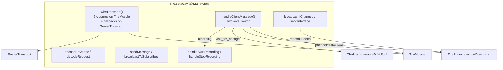

# TheGetaway — The Getaway Driver

> **Directory:** `ButtonHeist/Sources/TheInsideJob/TheGetaway/` (`TheGetaway.swift`, `TheGetaway+Recording.swift`, `PingFastPath.swift`)
> **Platform:** iOS 17.0+ (UIKit, DEBUG builds only)
> **Role:** Runs all comms between the wire and the crew — message dispatch, encode/decode, broadcast, transport wiring, recording lifecycle

## Responsibilities

TheGetaway is the communication backbone of the inside operation:

1. **Transport wiring** — `wireTransport(_:)` bridges TheMuscle (auth) to ServerTransport (networking) via five closures. Neither TheMuscle nor ServerTransport references the other directly.
2. **Message dispatch** — `handleClientMessage` is the two-level switch routing every `ClientMessage` to the right crew member: protocol messages to TheMuscle, observation to TheBrains (wait handlers, interface requests), actions to TheBrains (`executeCommand`), recording to TheStakeout.
3. **Background trace fast-redirect** — before dispatching actions, checks `brains.computeBackgroundAccessibilityTrace()`. If the trace-derived delta shows the screen changed while the agent was thinking, returns a synthetic result instead of executing a stale action.
4. **Encode/decode** — `encodeEnvelope` wraps `ServerMessage` in `ResponseEnvelope`, `decodeRequest` unwraps `RequestEnvelope`. Single codepath for all message types.
5. **Send/broadcast** — `sendMessage` handles single-client responses with error fallback. `broadcastToSubscribed`/`broadcastToAll` encode once, send to many.
6. **Hierarchy broadcast** — `broadcastIfChanged()` calls `brains.broadcastInterfaceIfChanged()` and broadcasts to subscribers. Called by TheInsideJob's pulse handler and polling task.
7. **Interface sending** — `sendInterface` settles, refreshes, explores, builds the full payload, sends, and records the sent state.
8. **Screen capture** — `handleScreen` captures via `brains.captureScreen()`, PNG-encodes, and sends explicit screen responses.
9. **Recording lifecycle** — owns `RecordingPhase` (`.idle`/`.recording(stakeout:)`). Creates TheStakeout on demand, wires capture/completion closures, manages phase transitions.

## Architecture



## Ownership Model

- **Created by** TheInsideJob at init
- **Does not own** any crew members — receives `muscle`, `brains`, `tripwire` as init parameters
- **Owns** `RecordingPhase` and creates `TheStakeout` on demand
- **Holds** a `weak` reference to `ServerTransport` (set via `wireTransport`, cleared on `tearDown`)

## State Machines

### RecordingPhase

```swift
enum RecordingPhase {
    case idle
    case recording(stakeout: TheStakeout)
}
```

TheStakeout is created in `handleStartRecording`, stored in the `.recording` case, and dropped when recording completes (via the `onRecordingComplete` closure) or on `tearDown`.

## Communication Pattern

TheGetaway follows the same closure-injection pattern as TheMuscle:

- TheMuscle's closures (`sendToClient`, `markClientAuthenticated`, etc.) are set by TheGetaway in `wireTransport`
- ServerTransport delivers a single ordered `AsyncStream<TransportEvent>` (`transport.events`); TheGetaway runs one long-lived consumer task that awaits each event and dispatches via `handleTransportEvent(_:)`. The optional synchronous ping fast-path is installed via `transport.setSyncDataInterceptor(_:)` before `start()`.
- TheBrains is called directly (same `@MainActor`, synchronous calls)
- TheInsideJob calls `getaway.broadcastIfChanged()` and `getaway.wireTransport(_:)` — those are the only entry points from the job

## Identity

TheGetaway receives a `ServerIdentity` struct at init:

```swift
struct ServerIdentity {
    let sessionId: UUID
    let effectiveInstanceId: String
    var tlsActive: Bool
}
```

Used to populate `ServerInfo` responses. `tlsActive` is updated by TheInsideJob when TLS is established.

## Code Walkthrough

See [`TheGetaway/README.md`](../../ButtonHeist/Sources/TheInsideJob/TheGetaway/README.md) for a file-level walkthrough.
