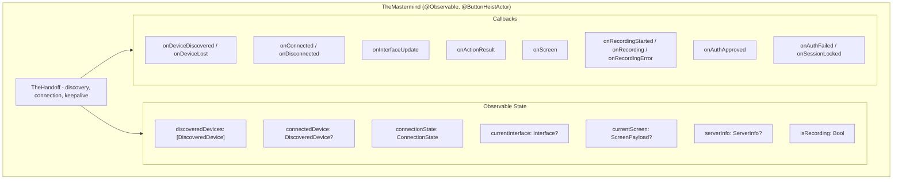
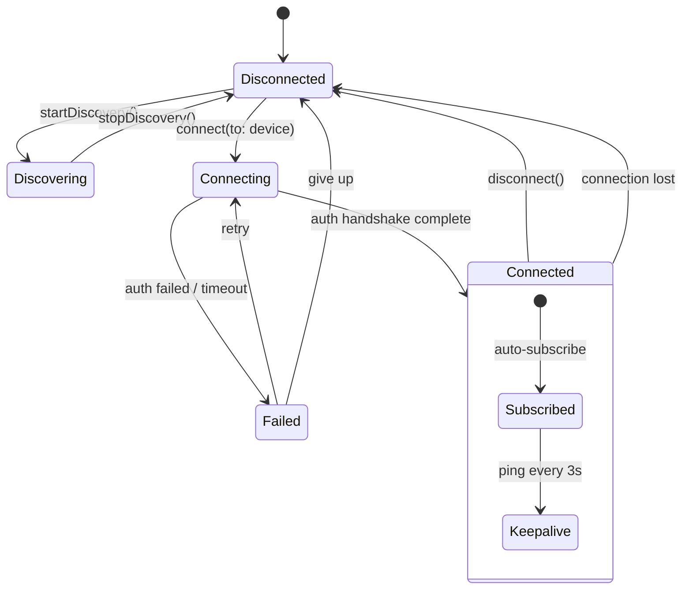
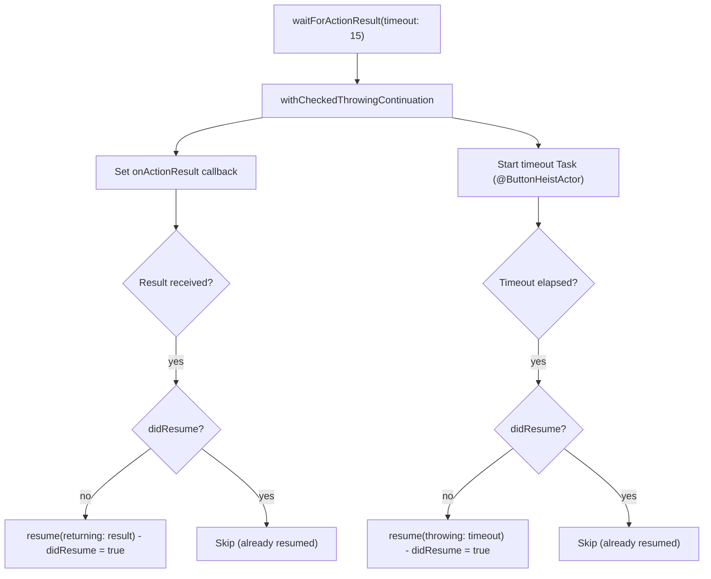

# TheMastermind - The Outside Coordinator

> **File:** `ButtonHeist/Sources/TheButtonHeist/TheMastermind.swift`
> **Platform:** macOS 14.0+
> **Role:** Observable macOS client API wrapping TheHandoff for SwiftUI and callback consumers

## Responsibilities

TheMastermind is the macOS-side counterpart to TheInsideJob:

1. **Observable state** for SwiftUI integration (`@Observable`) - mirrors TheHandoff's state
2. **Callback API** for non-SwiftUI consumers (CLI, MCP) via typed closures
3. **Configuration forwarding** - proxies `token`, `forceSession`, `driverId`, `autoSubscribe` to TheHandoff
4. **Async wait methods** for action results, screenshots, interface, recordings
5. **Display name disambiguation** when multiple devices share names (delegated to TheHandoff)
6. **Discovery and connection** delegation to TheHandoff

> **Note:** TheMastermind replaced the former `TheClient` class. It is a thin `@Observable` wrapper
> that delegates all discovery, connection, keepalive, and reconnect logic to `TheHandoff`.

## Architecture Diagram

## Connection Lifecycle

## Wait Method Pattern

## Delegation Pattern

TheMastermind delegates all core operations to TheHandoff:

| TheMastermind method | Delegates to |
|---------------------|-------------|
| `startDiscovery()` | `handoff.startDiscovery()` |
| `stopDiscovery()` | `handoff.stopDiscovery()` |
| `connect(to:)` | `handoff.connect(to:)` |
| `disconnect()` | `handoff.disconnect()` |
| `send(_:)` | `handoff.send(_:)` |
| `requestInterface()` | `handoff.send(.requestInterface)` |
| `displayName(for:)` | `handoff.displayName(for:)` |
| `token` / `forceSession` / `driverId` / `autoSubscribe` | `handoff.token` / etc. |

The `wireUpHandoff()` method (called from `init`) connects all of TheHandoff's callbacks
to update TheMastermind's observable state and forward to TheMastermind's own callbacks.
