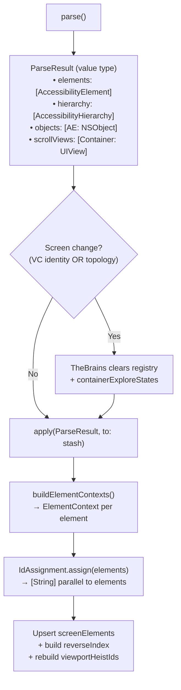

# TheBurglar - The Acquisition Specialist

> **File:** `TheBurglar.swift`
> **Platform:** iOS 17.0+ (UIKit, DEBUG builds only)
> **Role:** Reads the live accessibility tree and populates TheStash's registry

## Responsibilities

TheBurglar breaks in and takes what he finds:

1. **Parse pipeline** — `parse()` reads the live accessibility tree into an immutable `ParseResult` value type via `AccessibilityHierarchyParser` with `elementVisitor` + `containerVisitor` closures. It does not mutate TheStash, but it does perform temporary UIKit visibility tweaks (search-bar reveal/restore) during the read.
2. **Apply pipeline** — `apply(_:to:)` mutates TheStash's registry: sets `currentHierarchy`, `scrollableContainerViews`, calls `registry.register(...)` to merge the parsed hierarchy into the persistent registry tree, rebuilds `registry.viewportIds`, detects first responder, caches screen name. Returns assigned heistIds for explore cycle tracking.
3. **Refresh convenience** — `refresh(into:)` = parse + apply in one step.
4. **Topology-based screen change detection** — `isTopologyChanged(before:after:beforeHierarchy:afterHierarchy:)` detects navigation changes via three signals: back button trait (private `0x8000000`) appearance/disappearance, header label disjointness, and tab-bar content swap (persistence ratio of non-tab-bar labels falls below the tab-switch threshold).
5. **Search bar reveal** — temporarily unhides `UISearchController` bars hidden by `hidesSearchBarWhenScrolling` during parsing, restoring them afterward.

## Architecture

## Ownership Model

- TheBurglar is **created and owned by TheStash** (via `init`), stored as a `private let` on TheStash. Production code reaches it via TheStash facades; type visibility remains module-internal for unit testing.
- TheBurglar **writes to TheStash** — it's the only code that calls `registry.apply()` and sets `currentHierarchy`/`scrollableContainerViews`
- TheBrains calls `stash.refresh()`, or `stash.parse()` + `stash.apply()` separately when it needs to inspect parse results before applying (e.g., for topology comparison in the delta cycle). These are façade methods on TheStash that delegate to the private burglar.
- TheBurglar has **no mutable instance state** — its stored properties are injected dependencies (`parser`, `tripwire`)

## Dependencies

- **TheTripwire** (injected via `init(tripwire:)`) — provides `getAccessibleWindows()` for the parse root (applies modal filtering — if a modal view exists, only its window is returned)
- **AccessibilityHierarchyParser** (from AccessibilitySnapshotBH submodule) — traverses the accessibility tree
- **TheStash.IdAssignment** — assigns heistIds to parsed elements
- **TheStash.ElementRegistry** — the target of `apply()`
