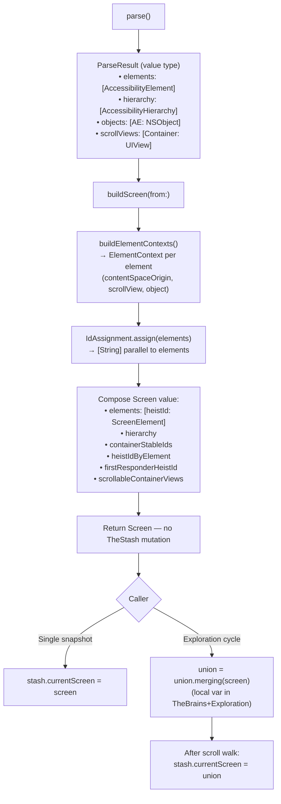

# TheBurglar - The Acquisition Specialist

> **File:** `TheBurglar.swift`
> **Platform:** iOS 17.0+ (UIKit, DEBUG builds only)
> **Role:** Reads the live accessibility tree and produces a `Screen` value.

## Responsibilities

TheBurglar breaks in and takes what he finds:

1. **Parse pipeline** — `parse()` reads the live accessibility tree into an immutable `ParseResult` value type via `AccessibilityHierarchyParser` with `elementVisitor` + `containerVisitor` closures. Does not mutate TheStash. Performs temporary UIKit visibility tweaks (search-bar reveal/restore) during the read.
2. **Screen factory** — `buildScreen(from:)` is the pure value-producing path: takes a `ParseResult`, walks the hierarchy with context propagation, assigns heistIds via `IdAssignment.assign`, detects first responder, and returns a fresh `Screen` value. Does NOT touch TheStash. Callers decide when/how to commit.
3. **Refresh convenience** — `refresh(into:)` chains `parse()` + `buildScreen(from:)` and assigns the result to `stash.currentScreen`. The single-snapshot path used by most non-explore callers.
4. **Topology-based screen change detection** — `isTopologyChanged(before:after:beforeHierarchy:afterHierarchy:)` detects navigation changes via three signals: back button trait (private `0x8000000`) appearance/disappearance, header label disjointness, and tab-bar content swap (persistence ratio of non-tab-bar labels falls below the tab-switch threshold).
5. **Search bar reveal** — temporarily unhides `UISearchController` bars hidden by `hidesSearchBarWhenScrolling` during parsing, restoring them afterward.

## Architecture



## Ownership Model

- TheBurglar is **created and owned by TheStash** (via `init`), stored as a `private let` on TheStash. Production code reaches it via TheStash facades; type visibility remains module-internal for unit testing.
- TheBurglar **does not write to TheStash.** It returns values. The caller (TheStash for single-shot, TheBrains+Exploration for accumulated union) decides when to commit. This is the load-bearing 0.2.25 invariant — parse and commit are separable, so accumulation can live in the caller's stack as a local variable.
- TheBrains calls `stash.refresh()` for the simple parse-and-commit case, or `stash.parse()` + `stash.buildScreen(from:)` separately when it needs to inspect parse results before committing (e.g., topology comparison in the delta cycle, or page-by-page union accumulation during exploration).
- TheBurglar has **no mutable instance state** — its stored properties are injected dependencies (`parser`, `tripwire`).

## The exploration discipline

Pre-0.2.25 the registry retained elements across parses via `merge()` / orphan attachment. 0.2.25 removes that machinery; the "full tree" (union of every element observed during a scroll-walk) is now a **local variable in `TheBrains+Exploration.exploreAndPrune`**:

```swift
var union = stash.currentScreen
for container in scrollableContainers {
    await scrollToTop(container)
    stash.currentScreen = stash.buildScreen(from: stash.parse())   // page commit for termination heuristics
    union = union.merging(stash.currentScreen)                     // accumulate
    while await scrollOnePageAndSettle(container) {
        stash.currentScreen = stash.buildScreen(from: stash.parse())
        union = union.merging(stash.currentScreen)
    }
}
stash.currentScreen = union                                        // final union committed
```

Mid-cycle writes to `currentScreen` are intentional: scroll-page termination heuristics (`stash.viewportIds == before`) read the latest page-only state. The union only becomes the agent-visible "full tree" at the end of the walk.

## Dependencies

- **TheTripwire** (injected via `init(tripwire:)`) — provides `getAccessibleWindows()` for the parse root (applies modal filtering — if a modal view exists, only its window is returned).
- **AccessibilityHierarchyParser** (from AccessibilitySnapshotBH submodule) — traverses the accessibility tree via `elementVisitor` and `containerVisitor` closures.
- **TheStash.IdAssignment** — assigns heistIds to parsed elements. Synthesis is content-derived and wire-format-stable: same element content → same heistId, every time.
- **TheStash.Screen** — the value type returned by `buildScreen(from:)`.

## What changed in 0.2.25

- `apply(_:to:)` (the registry-mutating path) deleted.
- `buildScreen(from:)` introduced as the pure value-producing factory.
- TheBurglar no longer reaches into TheStash. Returns values; callers commit.
- Topology change detection (`isTopologyChanged`) unchanged.
- Search-bar reveal unchanged.

The behavioral change visible to agents: heistIds from a previous `get_interface` no longer resolve in a later `activate` if the element is no longer in the union (e.g., scrolled off-screen *between* explore cycles). Within a single cycle the union accumulates everything observed during the scroll walk, identical to pre-0.2.25 behavior. See `.context/audit/0.2.25-screen-value-type.md` for the design rationale and empirical motivation.
