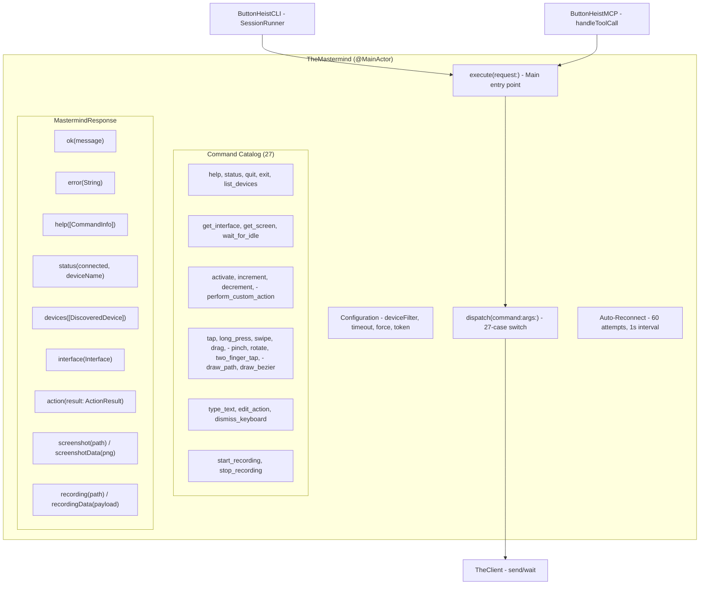
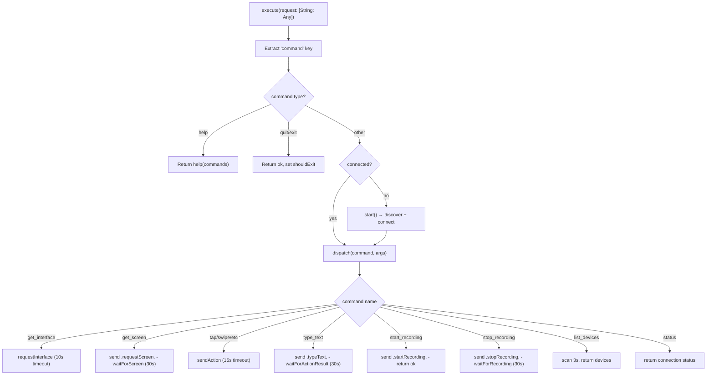
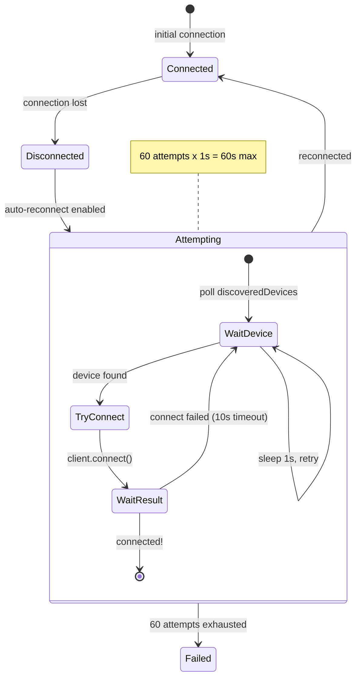

# TheMastermind - The Boss

> **File:** `ButtonHeist/Sources/ButtonHeist/TheMastermind.swift`
> **Platform:** macOS 14.0+
> **Role:** Centralized command dispatch for CLI and MCP - the single orchestration layer

## Responsibilities

TheMastermind is the brain of the outside operation:

1. **Command dispatch** - routes 27 commands to TheClient
2. **Auto-discovery and connection** - finds and connects to devices automatically
3. **Auto-reconnect** - retries connection on disconnect (60 attempts, 1s apart)
4. **Argument parsing** - extracts typed args from JSON dictionaries
5. **Response formatting** - produces both human-readable and JSON responses
6. **Session management** - persistent connection for CLI session and MCP modes

## Architecture Diagram



## Command Execution Flow



## Auto-Reconnect Mechanism



## Timeout Matrix

| Operation | Timeout | Source |
|-----------|---------|--------|
| Connection (discovery) | max(config, 5s) | `TheMastermind.swift:429` |
| Connection (TCP) | max(config, 5s) | `TheMastermind.swift:473` |
| Action result (general) | 15s | `TheMastermind.swift:847` |
| Action result (type_text) | 30s | `TheMastermind.swift:793` |
| Screenshot | 30s | `TheMastermind.swift:540` |
| Recording | 30s | `TheMastermind.swift:stop_recording` |
| Interface request | 10s | `TheMastermind.swift:862` |
| Auto-reconnect per attempt | 10s | `TheMastermind.swift:500` |
| Auto-reconnect total | ~60s | `TheMastermind.swift:499` |

## Items Flagged for Review

### HIGH PRIORITY

**`dispatch` method cyclomatic complexity** (`TheMastermind.swift:521`)
```swift
// swiftlint:disable:next cyclomatic_complexity function_body_length
```
- 320-line switch statement over 28 command strings
- Each case has its own argument extraction and TheClient interaction
- The largest single method in the codebase
- Consider: could the individual command handlers be extracted into separate methods?

**Duplicate error type: `MastermindError` vs `CLIError`**
- `TheMastermind.swift:5-52` defines `MastermindError` with 8 cases
- `ButtonHeistCLI/Sources/Support/DeviceConnector.swift:102-150` defines `CLIError` with 6 overlapping cases
- Error descriptions are nearly identical between the two
- The CLI has two code paths: `SessionRunner` (uses MastermindError) and `DeviceConnector` (uses CLIError)
- Should `CLIError` be removed in favor of `MastermindError`?

### MEDIUM PRIORITY

**Auto-reconnect 60-attempt limit hardcoded** (`TheMastermind.swift:499`)
```swift
for _ in 0..<60 {
```
- Not configurable via `TheMastermind.Configuration`
- Total window is ~60 seconds (60 x 1s sleep + connect time)
- If an app takes longer to restart, reconnection fails silently

**Interface request timeout differs from other operations** (`TheMastermind.swift:862`)
- 10 seconds hardcoded vs 15s for actions, 30s for screenshots/recordings
- Uses its own `withCheckedThrowingContinuation` implementation separate from TheClient's `waitForActionResult`
- The `var resumed = false` guard has the same potential MainActor race as TheClient's wait methods

**`requestInterface` has a separate continuation pattern** (`TheMastermind.swift:861-875`)
- Instead of using `TheClient.waitFor*`, it implements its own continuation
- Sets `client.onInterfaceUpdate` directly, bypassing TheClient's normal callback management
- Could interfere with other code that also sets `client.onInterfaceUpdate`

**No tests for TheMastermind**
- The primary integration point for CLI and MCP has zero unit tests
- Command dispatch, argument parsing, timeout behavior, and auto-reconnect are all untested
- The arg helpers (`stringArg`, `intArg`, `doubleArg`) do type coercion that could benefit from tests

### LOW PRIORITY

**`MastermindResponse` recording cases now include interaction count** (NEW)
- `humanFormatted()` appends "Interactions: N" line when `interactionLog` is non-nil
- `jsonDict()` includes `interactionCount` key (0 when nil)
- Well-tested: `SessionResponseTests` covers both human formatting and JSON serialization

**`supportedCommands` is a String array** (`MastermindCommandCatalog.swift`)
- Commands are matched by string comparison in the dispatch switch
- A typo in the catalog wouldn't be caught at compile time
- No enum-based type safety for command names

**Screenshot file saving uses temp directory** (`TheMastermind.swift`)
- Screenshots and recordings are saved to `FileManager.default.temporaryDirectory`
- These files persist until the OS cleans them up
- No explicit cleanup mechanism
