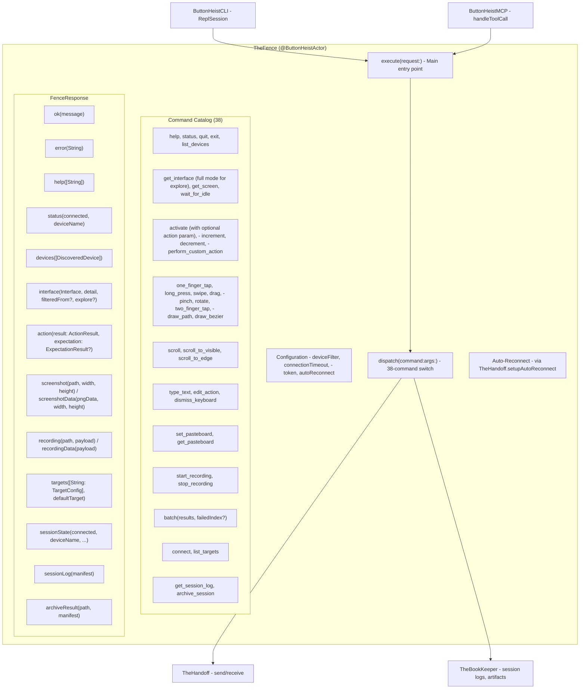
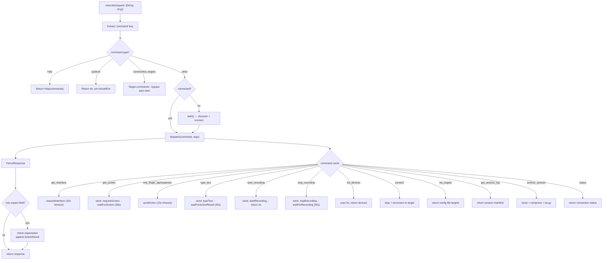
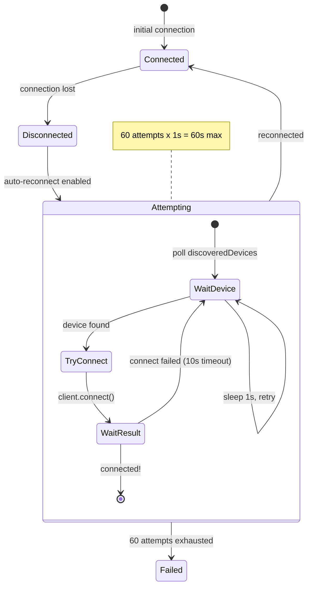

# TheFence - The Boss

> **Files:** `ButtonHeist/Sources/TheButtonHeist/TheFence.swift`, `TheFence+CommandCatalog.swift`, `TheFence+Handlers.swift`, `TheFence+Formatting.swift`
> **Platform:** macOS 14.0+
> **Role:** Centralized command dispatch for CLI and MCP - the single orchestration layer

## Responsibilities

TheFence is the brain of the outside operation:

1. **Command dispatch** - routes 38 commands via TheHandoff
2. **Auto-discovery and connection** - finds and connects to devices automatically
3. **Auto-reconnect** - retries connection on disconnect via TheHandoff
4. **Session bookkeeping** - delegates session logs, artifact storage, and archival to TheBookKeeper
5. **Request-response correlation** - tracks pending requests via `PendingRequestTracker<T>` (generic, requestId-keyed continuation tracker with timeout support), matches responses to waiting async callers
6. **Async wait methods** - `waitForActionResult`, `waitForInterface`, `waitForScreen`, `waitForRecording` with timeout handling
7. **Argument parsing** - extracts typed args from JSON dictionaries
8. **Response formatting** - produces both human-readable and JSON responses (`FenceResponse`)
9. **Session management** - persistent connection for CLI session and MCP modes
10. **Output path validation** - rejects `..` path components in `get_screen` and `stop_recording` output paths to prevent path traversal; resolves paths via `URL.standardized` before writing
11. **Outcome signals** - parses `expect` field from requests, checks `ActionExpectation` against `ActionResult` after each action, reports what happened in responses and batch summaries
12. **Batch early stop** - with `stop_on_error` (default), halts the batch at the first mismet expectation so `failedIndex` points at the action that broke, not a downstream symptom

## Architecture Diagram

## Command Execution Flow

## Auto-Reconnect Mechanism

## Timeout Matrix

| Operation | Timeout | Source |
|-----------|---------|--------|
| Connection (discovery) | configurable (default 30s) | `TheFence.Configuration.connectionTimeout` |
| Action result (general) | 15s | `Timeouts.actionSeconds` |
| Action result (type_text) | 30s | `Timeouts.longActionSeconds` |
| Screenshot | 30s | `Timeouts.longActionSeconds` |
| Recording | 30s | `TheFence.handleStopRecording` |
| Interface request | 10s | `TheFence.handleGetInterface` |
| Explore (full interface) | 60s | `Timeouts.exploreSeconds` |

## Items Flagged for Review

### MEDIUM PRIORITY

**TheFence test coverage is improving but incomplete**
- `TheFenceTests` covers command enum exhaustiveness (case count guard + wire-format verification for all 38 commands) and `FenceResponse` formatting
- `TheFenceHandlerTests` covers command routing (`testAllCatalogCommandsAreRouted`) and handler-level argument validation
- Timeout behavior and auto-reconnect logic remain untested

### LOW PRIORITY

**`FenceResponse` recording cases include interaction count**
- `humanFormatted()` appends "Interactions: N" line when `interactionLog` is non-nil
- `jsonDict()` includes `interactionCount` key (0 when nil)
- Well-tested: `FenceResponseTests` covers both human formatting and JSON serialization

**`supportedCommands` derived from `Command` enum** (`TheFence+CommandCatalog.swift`)
- `TheFence.Command` is a `String`-backed `CaseIterable` enum with 38 cases
- Commands are matched by enum case in the dispatch switch (compile-time exhaustiveness)
- `supportedCommands` is `Command.allCases.map(\.rawValue)` — no hand-maintained list

**Screenshot file saving uses temp directory** (`TheFence.swift`)
- Screenshots and recordings are saved to `FileManager.default.temporaryDirectory`
- These files persist until the OS cleans them up
- No explicit cleanup mechanism
