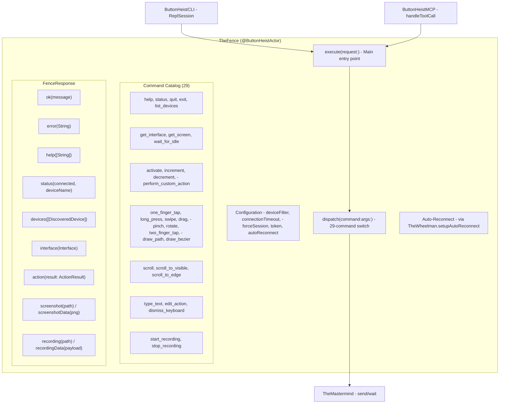
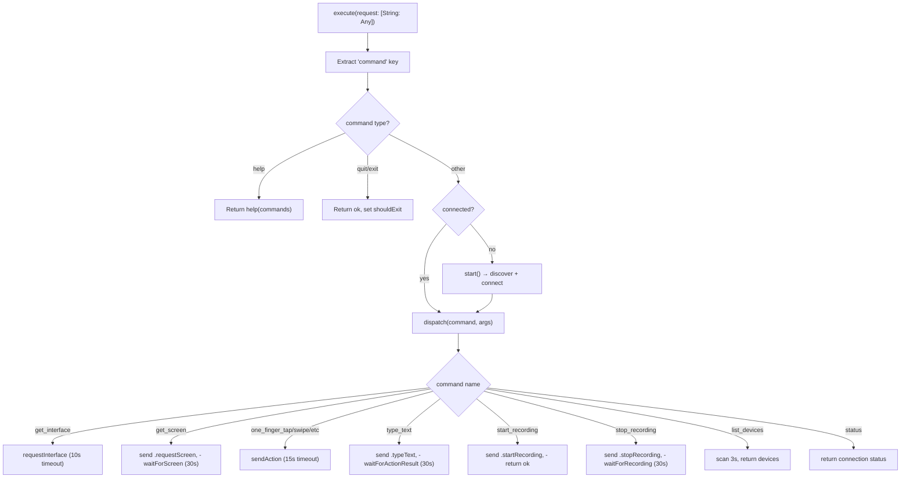
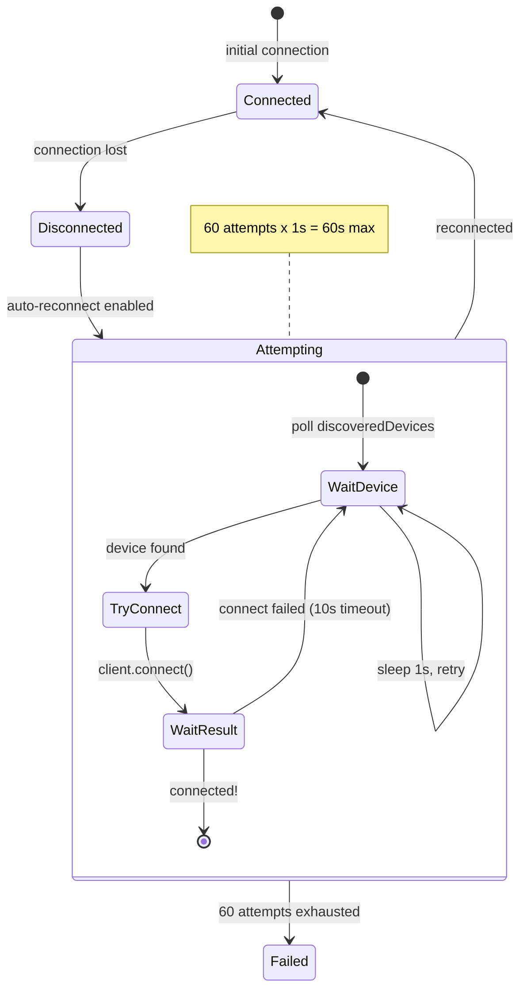

# TheFence - The Boss

> **File:** `ButtonHeist/Sources/TheButtonHeist/TheFence.swift`
> **Platform:** macOS 14.0+
> **Role:** Centralized command dispatch for CLI and MCP - the single orchestration layer

## Responsibilities

TheFence is the brain of the outside operation:

1. **Command dispatch** - routes 29 commands via TheMastermind/TheWheelman
2. **Auto-discovery and connection** - finds and connects to devices automatically
3. **Auto-reconnect** - retries connection on disconnect via TheWheelman
4. **Argument parsing** - extracts typed args from JSON dictionaries
5. **Response formatting** - produces both human-readable and JSON responses (`FenceResponse`)
6. **Session management** - persistent connection for CLI session and MCP modes

## Architecture Diagram

## Command Execution Flow

## Auto-Reconnect Mechanism

## Timeout Matrix

| Operation | Timeout | Source |
|-----------|---------|--------|
| Connection (discovery) | configurable (default 30s) | `TheFence.Configuration.connectionTimeout` |
| Action result (general) | 15s | `TheFence.Timeouts.actionSeconds` |
| Action result (type_text) | 30s | `TheFence.Timeouts.longActionSeconds` |
| Screenshot | 30s | `TheFence.Timeouts.longActionSeconds` |
| Recording | 30s | `TheFence.handleStopRecording` |
| Interface request | 10s | `TheFence.handleGetInterface` |

## Items Flagged for Review

### HIGH PRIORITY

**`dispatch` method cyclomatic complexity** (`TheFence.swift:497`)
- Large switch statement over 29 command strings
- Each case has its own argument extraction and TheMastermind interaction
- The largest single method in the codebase
- Consider: could the individual command handlers be extracted into separate methods?

### MEDIUM PRIORITY

**Interface request timeout differs from other operations** (`TheFence.swift`)
- 10 seconds hardcoded vs 15s for actions, 30s for screenshots/recordings

**No tests for TheFence**
- The primary integration point for CLI and MCP has zero unit tests
- Command dispatch, argument parsing, timeout behavior, and auto-reconnect are all untested

### LOW PRIORITY

**`FenceResponse` recording cases include interaction count**
- `humanFormatted()` appends "Interactions: N" line when `interactionLog` is non-nil
- `jsonDict()` includes `interactionCount` key (0 when nil)
- Well-tested: `SessionResponseTests` covers both human formatting and JSON serialization

**`supportedCommands` is a String array** (`TheFence+CommandCatalog.swift`)
- Commands are matched by string comparison in the dispatch switch
- A typo in the catalog wouldn't be caught at compile time
- No enum-based type safety for command names

**Screenshot file saving uses temp directory** (`TheFence.swift`)
- Screenshots and recordings are saved to `FileManager.default.temporaryDirectory`
- These files persist until the OS cleans them up
- No explicit cleanup mechanism
