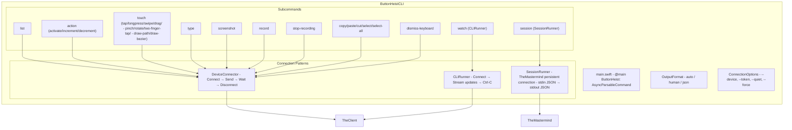
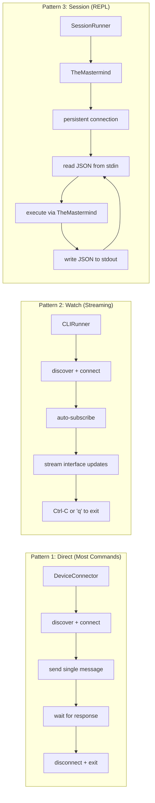
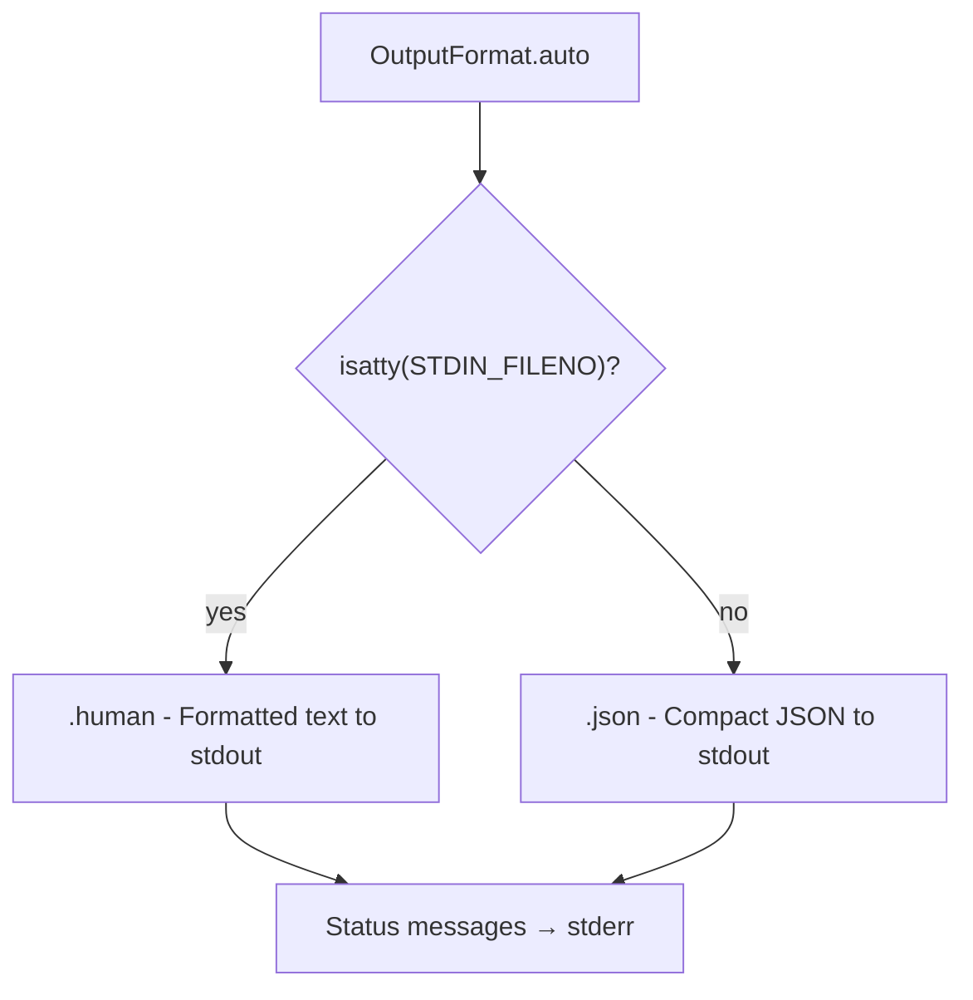

# ButtonHeistCLI - The CLI

> **Module:** `ButtonHeistCLI/Sources/`
> **Platform:** macOS 14.0+
> **Role:** User-facing command-line interface for interactive and batch operations

## Responsibilities

The CLI provides the canonical test client interface:

1. **Subcommand routing** via swift-argument-parser
2. **Three connection patterns**: direct (single command), watch (streaming), session (REPL)
3. **Output format auto-detection**: human for TTY, JSON for piped
4. **Exit code contract** for scripting (0-4, 99)
5. **All TheMastermind commands** accessible via CLI flags

## Architecture Diagram



## Three Connection Patterns



## Exit Code Contract

| Code | Constant | Meaning |
|------|----------|---------|
| 0 | `.success` | Operation completed successfully |
| 1 | `.connectionFailed` | TCP connection failed |
| 2 | `.noDeviceFound` | No device found via Bonjour |
| 3 | `.timeout` | Operation timed out |
| 4 | `.authFailed` | Authentication rejected |
| 99 | `.unknown` | Unexpected error |

## Output Format Detection



## Items Flagged for Review

### MEDIUM PRIORITY

**Duplicate error type: `CLIError`** (`DeviceConnector.swift:102-150`)
- `CLIError` duplicates most of `MastermindError` with nearly identical descriptions
- The CLI has two connection code paths:
  - Direct commands use `DeviceConnector` → `CLIError`
  - Session mode uses `TheMastermind` → `MastermindError`
- Consider consolidating to `MastermindError` only

**`CLIRunner.startKeyboardMonitoring` data race** (`CLIRunner.swift:249`)
```swift
// Task.detached reads @MainActor property:
while await self.isRunning {  // potential data race
```
- `isRunning` is a stored property on `@MainActor CLIRunner`
- The detached task reads it without MainActor isolation
- The subsequent `await MainActor.run` at line 254 correctly hops for the body

**Leading space in import** (`ButtonHeistCLI/Tests/ActionCommandTests.swift:3`)
```swift
 import ButtonHeist  // leading space
```
- Cosmetic issue, compiles fine

**`testAllActionMethods` missing 4 ActionMethod cases** (`ActionCommandTests.swift:488-512`)
- Tests `.activate`, `.increment`, `.decrement`, `.syntheticTap`, `.syntheticLongPress`, etc.
- Missing: `.typeText`, `.editAction`, `.resignFirstResponder`, `.waitForIdle`
- These action methods exist in `ServerMessages.swift:214-233` but aren't tested

### LOW PRIORITY

**Watch mode keyboard handling**
- `CLIRunner` reads raw terminal input for `r` (refresh) and `q` (quit)
- Uses `termios` directly to set raw mode
- This is standard POSIX terminal handling but adds complexity

**No `--timeout` flag for individual commands**
- Direct commands use `DeviceConnector` with hardcoded timeouts
- Users cannot override timeout per-invocation
- Only session mode inherits TheMastermind's configurable timeout
