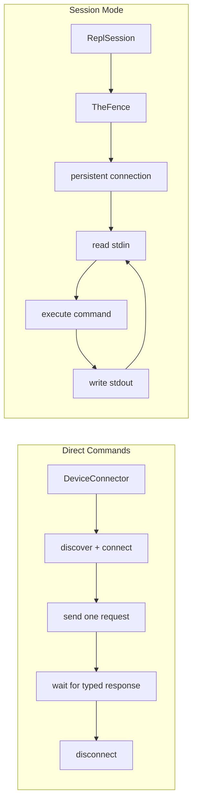

# ButtonHeistCLI - The CLI

> **Module:** `ButtonHeistCLI/Sources/`
> **Platform:** macOS 14.0+
> **Role:** User-facing command-line interface for direct commands and persistent sessions

## Responsibilities

This is the public face of the outfit. The CLI is what you hand to a human operator who wants to work the scene directly:

1. **Subcommand routing** via `swift-argument-parser`
2. **Direct commands** through `DeviceConnector` for one-shot operations
3. **Persistent sessions** through `ReplSession` and `TheFence`
4. **Output auto-detection**: human for TTY, JSON for piped input/output
5. **Access to both high-level commands and raw JSON session requests**

## Architecture Diagram

```mermaid
graph TD
    subgraph CLI["ButtonHeistCLI"]
        Main["main.swift - AsyncParsableCommand"]
        Options["ConnectionOptions - --device, --token, --quiet"]
        Format["OutputFormat - auto / human / json"]

        subgraph Commands["Subcommands"]
            List["list"]
            Activate["activate"]
            Action["action --type increment/decrement/custom/edit/dismiss_keyboard"]
            Scroll["scroll / scroll_to_visible / scroll_to_edge"]
            Swipe["swipe (top-level)"]
            Touch["touch - one_finger_tap / long_press / swipe / drag / pinch / rotate / two_finger_tap"]
            TypeCmd["type"]
            Screenshot["screenshot"]
            GetInterface["get_interface"]
            WaitForIdle["wait_for_idle"]
            Record["record / stop_recording"]
            Pasteboard["set_pasteboard / get_pasteboard"]
            Session["session - ReplSession"]
        end

        subgraph Patterns["Connection Patterns"]
            Direct["DeviceConnector - discover -> connect -> request -> disconnect"]
            REPL["ReplSession -> TheFence - persistent JSON/human command loop"]
        end
    end

    List --> Direct
    Activate --> Direct
    Action --> Direct
    Scroll --> Direct
    Swipe --> Direct
    Touch --> Direct
    TypeCmd --> Direct
    Screenshot --> Direct
    GetInterface --> Direct
    WaitForIdle --> Direct
    Record --> Direct
    Pasteboard --> Direct
    Session --> REPL

    Direct --> TheMastermind["TheMastermind"]
    REPL --> TheFence["TheFence"]
```

## Connection Patterns

## MCP Parity

The CLI is designed to mirror the MCP tool surface. Key mappings:

| MCP Tool | CLI Command | Notes |
|----------|-------------|-------|
| `activate` | `activate` | Direct match |
| `swipe` | `swipe` | Top-level in both |
| `gesture` | `touch` | Grouped gestures |
| `accessibility_action` | `action --type` | Both group increment/decrement/custom/edit/dismiss_keyboard |
| `run_batch`, `get_session_state` | `session` (REPL only) | Available via JSON input in session mode |
| `connect` | `session` (REPL only) | Switch connection target at runtime |
| `list_targets` | `session` (REPL only) | List configured targets from config file |

## Session Notes

- Human mode supports aliases such as `tap`, `ui`, `screen`, `idle`, and `devices`
- JSON mode accepts canonical Fence commands such as `one_finger_tap`, `run_batch`, and `get_session_state`
- `session` is the bridge used under the hood by REPL-like workflows; the MCP server talks to `TheFence` directly rather than shelling out to the CLI

## Exit Code Contract

| Code | Meaning |
|------|---------|
| 0 | Success |
| 1 | Connection failed |
| 2 | No device found |
| 3 | Timeout |
| 4 | Authentication failed |
| 99 | Unexpected error |

## Risks / Gaps

- Direct commands duplicate some timeout behavior instead of routing everything through `TheFence`
- Session mode exposes more raw power than the top-level flags, so documentation needs to keep both surfaces aligned
