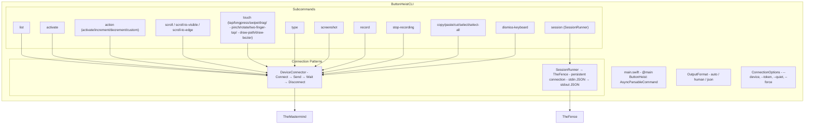
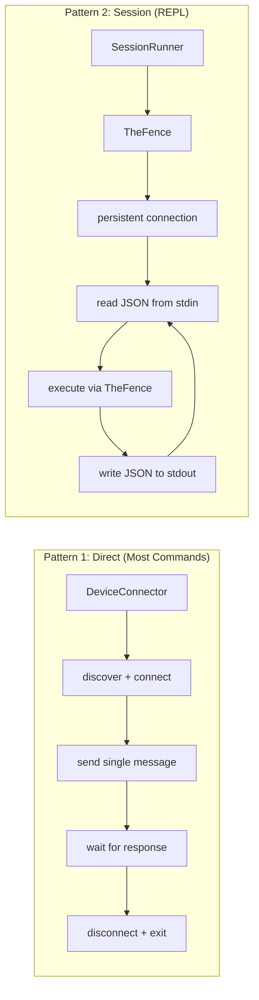
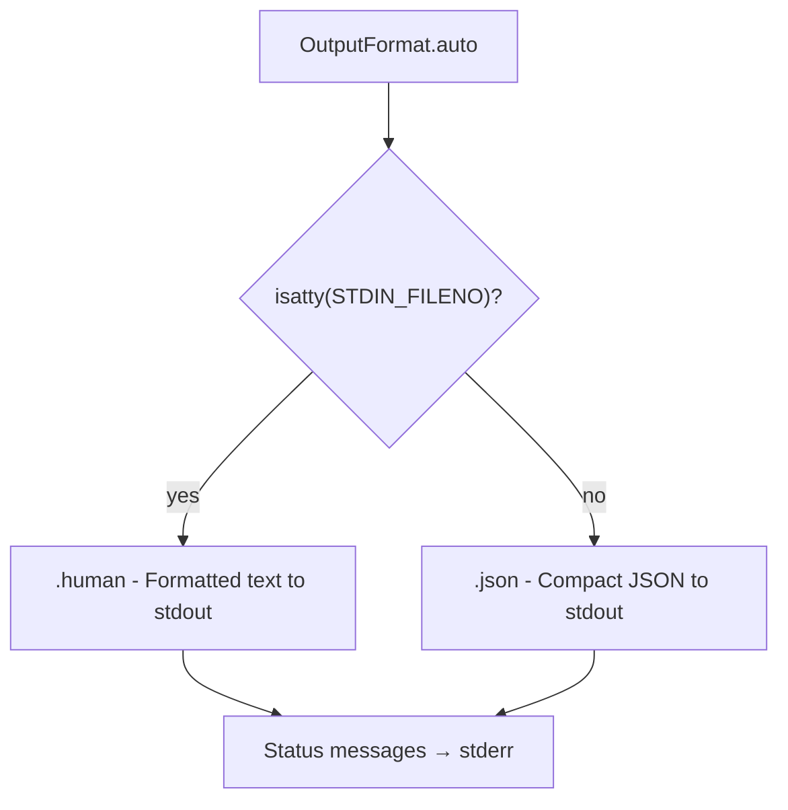

# ButtonHeistCLI - The CLI

> **Module:** `ButtonHeistCLI/Sources/`
> **Platform:** macOS 14.0+
> **Role:** User-facing command-line interface for interactive and batch operations

## Responsibilities

The CLI provides the canonical test client interface:

1. **Subcommand routing** via swift-argument-parser
2. **Two connection patterns**: direct (single command via DeviceConnector) and session (REPL via TheFence)
3. **Output format auto-detection**: human for TTY, JSON for piped
4. **Exit code contract** for scripting (0-4, 99)
5. **All TheFence commands** accessible via CLI flags

## Architecture Diagram



## Two Connection Patterns



## Exit Code Contract

| Code | Constant | Meaning |
|------|----------|---------|
| 0 | `.success` | Operation completed successfully |
| 1 | `.connectionFailed` | TCP connection failed |
| 2 | `.noDeviceFound` | No device found via Bonjour |
| 3 | `.timeout` | Operation timed out |
| 4 | `.authFailed` | Authentication rejected |
| 99 | `.unknown` | Unexpected error |

## Output Format Detection



## Items Flagged for Review

### MEDIUM PRIORITY

**Leading space in import** (`ButtonHeistCLI/Tests/ActionCommandTests.swift:3`)
```swift
 import ButtonHeist  // leading space
```
- Cosmetic issue, compiles fine

**`testAllActionMethods` missing 4 ActionMethod cases** (`ActionCommandTests.swift:488-512`)
- Tests `.activate`, `.increment`, `.decrement`, `.syntheticTap`, `.syntheticLongPress`, etc.
- Missing: `.typeText`, `.editAction`, `.resignFirstResponder`, `.waitForIdle`
- These action methods exist in `ServerMessages.swift:214-233` but aren't tested

### LOW PRIORITY

**No `--timeout` flag for individual commands**
- Direct commands use `DeviceConnector` with hardcoded timeouts
- Users cannot override timeout per-invocation
- Only session mode inherits TheFence's configurable timeout
