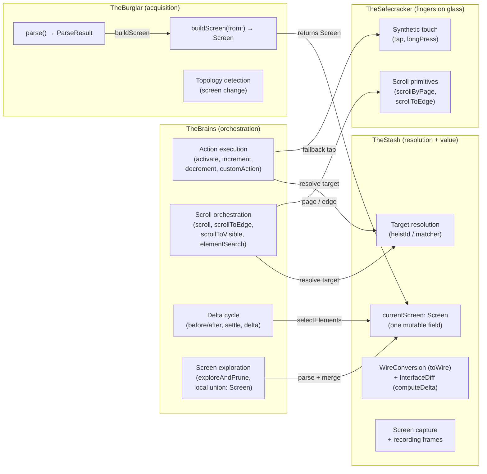
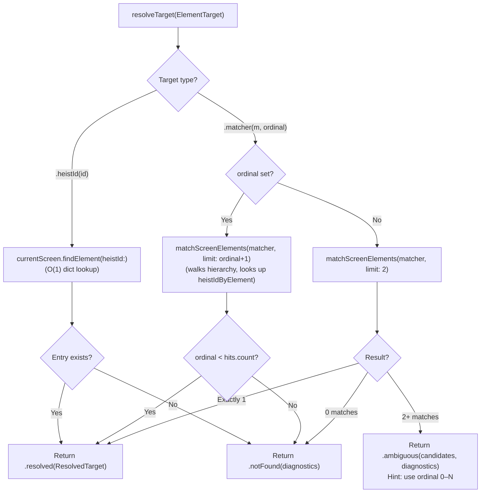

# TheStash - The Score Handler

> **Files:** `TheStash.swift`, `TheStash+Matching.swift`, `TheStash+Capture.swift`, `TheStash/WireConversion.swift`, `TheStash/InterfaceDiff.swift`, `TheStash/IdAssignment.swift`, `TheStash/Screen.swift`, `TheStash/Diagnostics.swift`, `TheStash/Interactivity.swift`, `TheStash/ArrayHelpers.swift`
> **Platform:** iOS 17.0+ (UIKit, DEBUG builds only)
> **Role:** Resolution layer, target dispatch, wire conversion, screen capture

## Responsibilities

TheStash holds the goods — sole custodian of the live UIKit/accessibility object boundary. Value semantics at the API edge; all weak→strong promotion and NSObject touching happens inside.

Post-0.2.25 the resolution layer is **a single immutable value**, `Screen`. TheStash has exactly one mutable field — `var currentScreen: Screen = .empty` — and a single discipline: **parse-then-assign**. Callers obtain a `Screen` via `stash.parse()`, decide what to do with it (commit directly, or merge into an exploration accumulator), then write back into `stash.currentScreen`. The persistent element registry, orphan retention, invariant-checking merge pipeline, and explore-cycle mode flag are gone.

1. **Resolution layer as a value type** — `Screen` bundles `elements: [String: ScreenElement]`, `hierarchy`, `containerStableIds`, `heistIdByElement`, `firstResponderHeistId`, and `scrollableContainerViews` into one immutable struct. `Screen.merging(_:)` is pure last-read-wins on heistId collision. Derived values (`name`, `id`, `heistIds`) are computed on access so they cannot drift from the hierarchy.
2. **Target resolution** — `resolveTarget(_:)` looks only in `currentScreen.elements` / `currentScreen.hierarchy`. The off-screen rule is **strict**: an heistId not in `currentScreen.elements` returns `.notFound` with a near-miss suggestion. No fallback to a recorded scroll position from a previous parse. See [12-UNIFIED-TARGETING.md](12-UNIFIED-TARGETING.md) for the full targeting system.
3. **Element matching** — `matchScreenElements(_:limit:)` walks `selectElements()` using `ElementMatcher` predicates with AND semantics and case-insensitive equality (typography-folded — smart quotes, dashes, ellipsis fold to ASCII; emoji/accents/CJK preserved). Matching sees the committed semantic state, including known-only entries retained from exploration. Matching is exact or miss; substring is reserved for the diagnostic suggestion path (`Diagnostics.findNearMiss`).
4. **HeistId synthesis** — `IdAssignment` assigns stable, deterministic `heistId` identifiers directly from `AccessibilityElement` (developer identifier preferred, else synthesized from traits+label; value excluded for stability), with suffix disambiguation for duplicates and `_at_X_Y` content-position suffixes for spatially-distinct same-content elements seen within one parse. Synthesis is wire format — see CLAUDE.md.
5. **Wire conversion at boundary** — `WireConversion.toWire()` converts `Screen.ScreenElement` → `HeistElement` at serialization boundaries. `WireConversion.toWireTree(from:)` walks the live hierarchy and emits `[InterfaceNode]` for the full tree payload. Pure transform — no stored state.
6. **Delta computation** — `InterfaceDiff.computeDelta()` compares before/after snapshots and emits a compact `AccessibilityTrace.Delta`. Lifts internal `ScreenElement` arrays to wire form via `WireConversion.toWire`, then computes element-level and tree-level edits side-by-side (including functional-move pairing inference). Sibling of `WireConversion`; the two were split in 0.2.26 so trait-policy edits and delta-algorithm edits no longer share a file.
7. **Element actions** — thin wrappers over `accessibilityActivate()`, `accessibilityIncrement()`, `accessibilityDecrement()`, `accessibilityCustomActions` on the live UIKit object. `performCustomAction` returns a `CustomActionOutcome` enum so callers can distinguish "view deallocated" from "no such action" without a raw NSObject check.
8. **Scroll-position primitives** — `jumpToRecordedPosition(_:)`, `restoreScrollPosition(_:to:)`, and `scrollTargetOffset(for:in:)` set `contentOffset` on an element's owning scroll view from a recorded `contentSpaceOrigin`. The stash decides nothing (callers still orchestrate when to jump); it just encapsulates the UIScrollView write so the scroll view handle doesn't leak.
9. **Live geometry readout** — `liveGeometry(for:)` promotes the weak NSObject ref internally and returns a value-typed `(frame, activationPoint, scrollView)` snapshot for callers that need to make viewport decisions.
10. **Screen capture** — renders traversable windows via `UIGraphicsImageRenderer` (TheStash+Capture.swift).
11. **Resolution diagnostics** — near-miss suggestions, similar heistId hints, compact element summaries (`Diagnostics`).

**Not TheStash's job** (moved to other crew members):
- Parse pipeline (hierarchy parsing, element context building, heistId assignment, container stableId computation) → [TheBurglar](10-THEBURGLAR.md). `TheBurglar.buildScreen(from:)` is a pure function from a parsed accessibility tree to a `Screen` value.
- Action execution pipelines, scroll orchestration, delta cycle, explore-and-prune → [TheBrains](13-THEBRAINS.md). The exploration accumulator is a local `var union: Screen` in `Navigation+Explore` — TheStash has no mode flag.

## Custody Contract

TheStash is the custodian of the live accessibility/UI object world.

- **Exclusive ownership of live object references** — if a subsystem needs to get from a parsed element back to a live `NSObject`, it goes through TheStash.
- **Weak references only** — live objects are stored in `Screen.ScreenElement.object` and `.scrollView` as `weak` references; TheStash never prolongs the lifetime of app UI objects.
- **No exported live handles** — other subsystems work through TheStash APIs that return values, frames, points, or perform actions on their behalf.
- **Parser boundary** — TheBurglar owns `AccessibilityHierarchyParser` usage and produces `Screen` values via `buildScreen(from:)`.
- **Fail closed on staleness** — if the weak object is gone, TheStash treats it as stale state. If an heistId is not in `currentScreen.elements`, it's unreachable — agents must scroll or refetch.

## Parse-then-Assign Discipline

```swift
// Standard refresh path (TheBrains.refresh, post-action settle):
let screen = stash.parse()        // pure read — does not touch currentScreen
stash.currentScreen = screen      // commit

// Exploration path (Navigation+Explore.exploreAndPrune):
var union = stash.currentScreen   // seed with current viewport
for container in scrollableContainers {
    await scrollToTop(container)
    if let parsed = stash.refresh() {
        union = union.merging(parsed)
    }
    while await scrollOnePageAndSettle(container) {
        if let parsed = stash.parse() {
            stash.currentScreen = parsed     // mid-cycle live viewport for termination heuristics
            union = union.merging(parsed)
        }
    }
}
stash.currentScreen = union       // commit final union
```

Mid-exploration writes to `currentScreen` keep in-cycle termination checks ("did the viewport change after this scroll?") working without exposing the in-flight union to other code. The agent-visible screen state is always either "viewport from the most recent parse" or "union from the most recent exploration commit" — never a partial in-flight blend.

## Crew Responsibility Boundaries



## Screen Value Layout

```swift
struct Screen: Equatable {
    let elements: [String: ScreenElement]              // heistId → entry
    let hierarchy: [AccessibilityHierarchy]            // live parsed tree
    let containerStableIds: [AccessibilityContainer: String]
    let heistIdByElement: [AccessibilityElement: String]
    let firstResponderHeistId: String?
    let scrollableContainerViews: [AccessibilityContainer: ScrollableViewRef]

    static var empty: Screen { ... }
    func findElement(heistId: String) -> ScreenElement?
    func merging(_ other: Screen) -> Screen      // last-read-wins on heistId collision

    var name: String? { /* first header label, computed */ }
    var id: String? { /* slugified name */ }
    var heistIds: Set<String> { Set(elements.keys) }
}

struct ScreenElement: @unchecked Sendable, Equatable {
    let heistId: String
    let contentSpaceOrigin: CGPoint?    // position within scroll container
    let element: AccessibilityElement   // refreshed each parse
    weak var object: NSObject?          // live UIKit object for actions
    weak var scrollView: UIScrollView?  // parent scroll view
}
```

**Conflict rule for `merging`:** last-read-always-wins. When the same heistId appears in both `self` and `other`, the entire `ScreenElement` from `other` replaces the one from `self` — no field-level merging, no special case to preserve a previously-recorded `contentSpaceOrigin`. The most recent observation is the source of truth. Codified by `ScreenTests`.

## Element Target Resolution

Two resolution strategies: O(1) dictionary lookup for heistIds, predicate search via `heistIdByElement` for matchers.



## Instance State Inventory

Post-0.3.5, TheStash has one mutable accessibility belief. Everything else
lives inside `Screen` or belongs to another owner.

| Store | Lifetime | Purpose |
|-------|----------|---------|
| `currentScreen` | Parse-or-explore-cycle | The latest committed screen value — holds elements, hierarchy, container ids, and live-view refs. |
| `stakeout` (weak) | Application lifetime | Boundary back-reference for recording frame capture; not accessibility belief. |

Broadcast de-duplication memory (`lastBroadcastHierarchyHash`) lives in
`TheBrains`, because it describes outbound delivery, not the committed
accessibility state.

Computed accessors proxy through `currentScreen`:

| Accessor | Source |
|----------|--------|
| `currentHierarchy` | `currentScreen.interactionSnapshot.hierarchy` |
| `knownIds` | `currentScreen.knownIds` (all known semantic entries; after an exploration union this includes off-viewport entries) |
| `visibleIds` | `currentScreen.visibleIds` (strictly backed by the latest parsed live hierarchy) |
| `firstResponderHeistId` | `currentScreen.interactionSnapshot.firstResponderHeistId` |
| `lastScreenName`, `lastScreenId` | derived from `currentScreen.interactionSnapshot.hierarchy` |
| `scrollableContainerViews` | unwraps the weak-view wrappers from `currentScreen.interactionSnapshot.scrollableContainerViews` |

No store writes to another store. No circular dependencies.

## File Organization

| File | Responsibility |
|------|----------------|
| `TheStash.swift` | Core: `currentScreen` field, resolution, element actions, point/frame resolution, element selection, parse facades |
| `TheStash+Matching.swift` | Element matching against ElementMatcher predicates over `selectElements()` |
| `TheStash+Capture.swift` | Screen capture (clean + recording overlay) |
| `TheStash/Screen.swift` | `Screen` struct + `ScreenElement` + `ScrollableViewRef` + pure helpers (`visibleOnly`, `orderedElements`, `merging(_:)`) |
| `TheStash/WireConversion.swift` | Caseless enum with static methods: traitNames, convert, toWire (element + array), toWireTree (Screen → InterfaceNode tree). Pure transform; no delta logic. |
| `TheStash/InterfaceDiff.swift` | Caseless enum with static methods: `computeDelta` and its element/tree edit helpers (functional-move pairing, tree-order sort). Consumes the wire forms produced by `WireConversion`. |
| `TheStash/IdAssignment.swift` | Caseless enum with static methods: deterministic heistId synthesis from traits/labels (wire-format-stable) |
| `TheStash/Diagnostics.swift` | Caseless enum with static methods: resolution error formatting, near-miss suggestions |
| `TheStash/Interactivity.swift` | Interactivity predicates (shared by WireConversion and ActionExecution) |
| `TheStash/ArrayHelpers.swift` | `[Screen.ScreenElement]` screen name/id helpers |

## Dependencies

- **TheTripwire** (injected via `init(tripwire:)`) — provides window access for screen capture.
- **TheBurglar** (created in `init`) — produces `Screen` values via `buildScreen(from:)`.
- **TheStakeout** (`weak var stakeout: TheStakeout?`) — TheStash calls `stakeout?.captureActionFrame()` for recording frame capture.

## Architectural Rule

TheStash owns the NSObject boundary — value semantics at its API edge. It holds exactly one piece of resolution state, `currentScreen`, and exposes thin facades for parse, refresh, resolve, match, and act. It does not *orchestrate* — it does not decide when to scroll, when to refresh, or when to dispatch an action. Those decisions belong to TheBrains, which coordinates TheStash, TheBurglar, TheSafecracker, and TheTripwire. No NSObject escapes the stash after TheBurglar deposits it: callers pass `ScreenElement` tokens and receive CGRects, CGPoints, Bools, and typed outcome enums. Wire conversion, delta computation, and ID assignment are static methods on caseless enums (`TheStash.WireConversion`, `TheStash.InterfaceDiff`, `TheStash.IdAssignment`); callers invoke them directly. TheStash retains `wireTree()` / `wireTreeHash()` as thin readers because they need the *current* screen — they are not zero-behavior facades.
