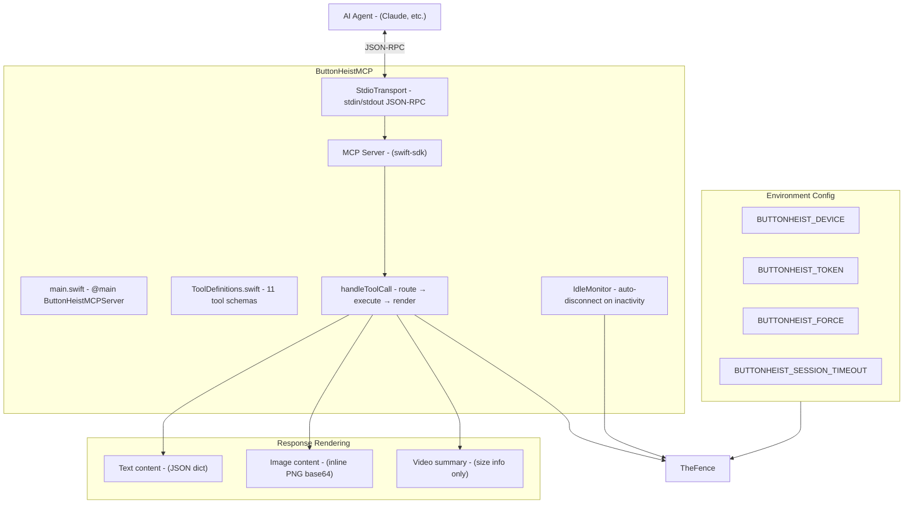
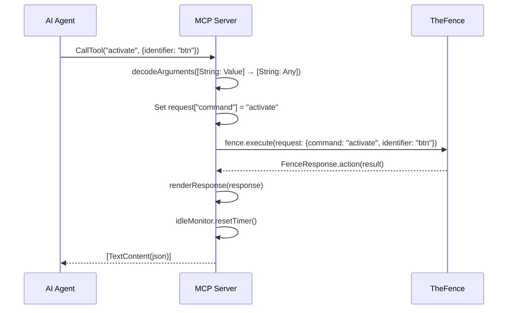
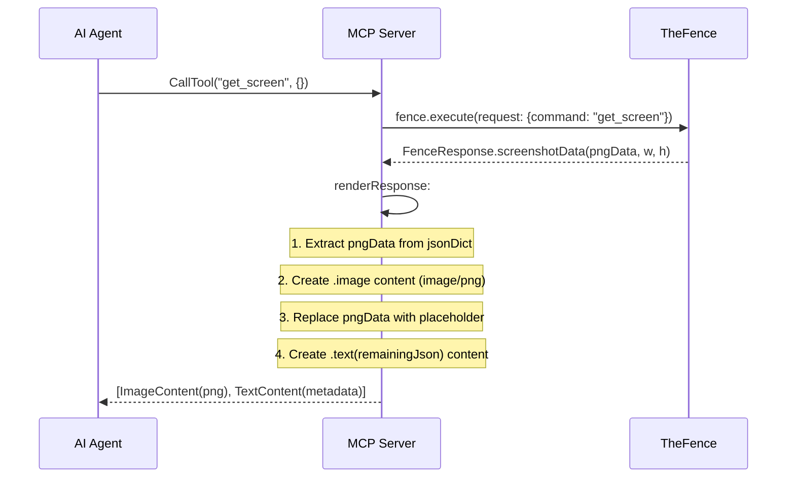

# ButtonHeistMCP - The MCP Server

> **Module:** `ButtonHeistMCP/Sources/`
> **Platform:** macOS 14.0+
> **Role:** Exposes TheFence as 11 purpose-built MCP tools for AI agents

## Responsibilities

The MCP server provides a bridge between AI agents and ButtonHeist:

1. **11 purpose-built tools** with typed schemas (not a single `run` tool)
2. **TheFence delegation** for all command execution
3. **Smart response rendering** - screenshots as inline MCP images, recordings summarized
4. **Idle monitoring** - auto-disconnects after inactivity, reconnects on next tool call
5. **Environment-based config** - device filter, token, force mode, session timeout
6. **StdioTransport** - JSON-RPC over stdin/stdout

## Architecture Diagram

## The 11 Tools

| # | Tool Name | Key Parameters | Annotations |
|---|-----------|---------------|-------------|
| 1 | `get_interface` | (none) | readOnly, idempotent |
| 2 | `activate` | `identifier`, `order` | — |
| 3 | `type_text` | `text`, `deleteCount`, `identifier`, `order` | — |
| 4 | `swipe` | `identifier`, `order`, `direction`, `startX/Y`, `endX/Y`, `distance`, `duration` | — |
| 5 | `get_screen` | `output` (file path) | readOnly, idempotent |
| 6 | `wait_for_idle` | `timeout` (seconds) | readOnly |
| 7 | `start_recording` | `fps`, `scale`, `maxDuration`, `inactivityTimeout` | — |
| 8 | `stop_recording` | `output` (file path) | — |
| 9 | `list_devices` | (none) | readOnly, idempotent |
| 10 | `gesture` | `type` (enum), `identifier`, `order`, `x/y`, `endX/Y`, `duration`, `scale`, `angle`, `points`, `curves` | — |
| 11 | `accessibility_action` | `type` (enum), `identifier`, `order`, `actionName`, `action` | — |

**`gesture` type values:** `one_finger_tap`, `drag`, `long_press`, `pinch`, `rotate`, `two_finger_tap`, `draw_path`, `draw_bezier`

**`accessibility_action` type values:** `increment`, `decrement`, `perform_custom_action`, `edit_action`, `dismiss_keyboard`

## Tool Routing

Tools route to TheFence in two patterns:

1. **Direct tools** (9 tools): The tool name becomes the `command` key directly
   - `get_interface`, `activate`, `type_text`, `swipe`, `get_screen`, `wait_for_idle`, `start_recording`, `stop_recording`, `list_devices`

2. **Grouped tools** (2 tools): The `type` field is extracted and becomes the command
   - `gesture`: `type` becomes the command (`one_finger_tap` → `tap`, others verbatim)
   - `accessibility_action`: `type` becomes the command verbatim

All paths call `fence.execute(request:)` with the assembled request dictionary.

## Tool Call Flow

## Screenshot Response Flow

## Idle Monitor

The MCP server wraps TheFence in an `IdleMonitor`:
- After each successful or failed tool call, the idle timer resets
- When the timer fires (default: `BUTTONHEIST_SESSION_TIMEOUT` or 60s), it calls `fence.stop()`
- The next tool call auto-reconnects via `TheFence.execute()` → `TheFence.start()`

## Items Flagged for Review

### MEDIUM PRIORITY

**Video data omitted from MCP responses** (`main.swift`)
- `renderResponse` replaces `videoData` with a size summary
- The actual video bytes are NOT returned to the AI agent
- This is intentional (too large for LLM context) but means MCP clients can't access raw video
- Only `screenshotData` gets the inline image treatment

### LOW PRIORITY

**No streaming support**
- MCP responses are one-shot
- No way to subscribe to interface updates or stream recording progress
- Each `get_interface` call is a fresh request

**Environment variable configuration only**
- No command-line flags (it's an MCP server, so stdin/stdout are for JSON-RPC)
- All config must come from environment variables
- This is the correct pattern for MCP servers
