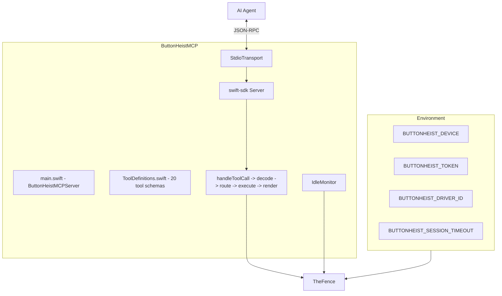

# ButtonHeistMCP - The MCP Server

> **Module:** `ButtonHeistMCP/Sources/`
> **Platform:** macOS 14.0+
> **Role:** Exposes ButtonHeist as 20 typed MCP tools for AI agents

## Responsibilities

This is the clean handshake between an AI agent and the rest of the crew:

1. **20 typed tools** backed by `TheFence`
2. **Tool-to-command routing** for both direct and grouped tools
3. **Response adaptation** for MCP clients: screenshots inline, video summarized
4. **Idle disconnects** with automatic reconnect on the next tool call
5. **Environment-based configuration** for device selection, auth, and timeout

## Architecture Diagram

## Tool Groups

Direct tools:

- `get_interface`
- `activate`
- `type_text`
- `swipe`
- `get_screen`
- `wait_for_idle`
- `start_recording`
- `stop_recording`
- `list_devices`
- `scroll`
- `scroll_to_visible`
- `scroll_to_edge`
- `set_pasteboard`
- `get_pasteboard`
- `run_batch`
- `get_session_state`
- `connect`
- `list_targets`

Grouped tools:

- `gesture`
  - `type`: `one_finger_tap`, `drag`, `long_press`, `pinch`, `rotate`, `two_finger_tap`, `draw_path`, `draw_bezier`
- `accessibility_action`
  - `type`: `increment`, `decrement`, `perform_custom_action`, `edit_action`, `dismiss_keyboard`

## Routing Rules

1. Direct tools map 1:1 to `request["command"] = toolName`
2. Grouped tools extract `type` and use that as the underlying Fence command
3. All requests end at `fence.execute(request:)`

## Response Behavior

- `get_screen` returns inline MCP image content plus JSON metadata
- `stop_recording` omits raw base64 video data from the response and returns a compact summary unless `output` is provided
- Errors are normalized into MCP tool errors with readable text payloads

## Idle Behavior

- The idle timer resets after every successful or failed tool call
- When idle time expires, the MCP server calls `fence.stop()`
- The next tool call reconnects automatically through `TheFence`

## Risks / Gaps

- No streaming tool surface for live subscriptions
- Recording payloads are intentionally lossy in MCP mode to keep context size manageable
