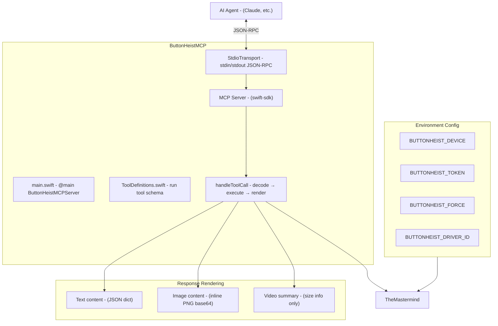
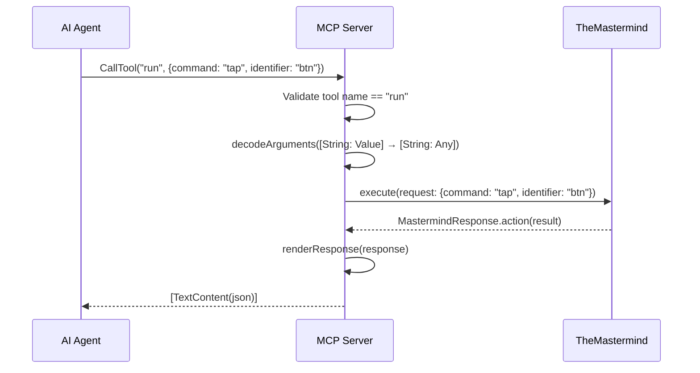
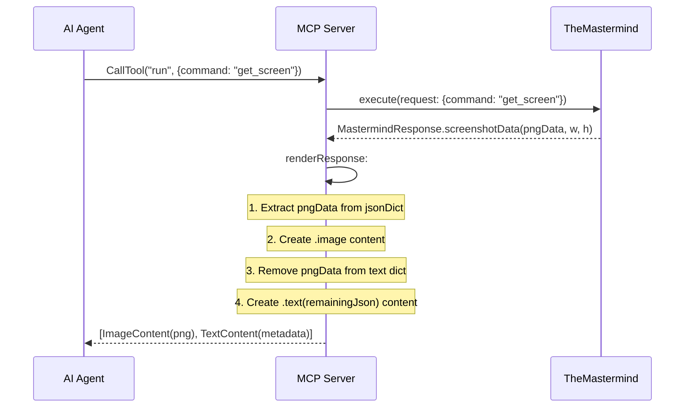
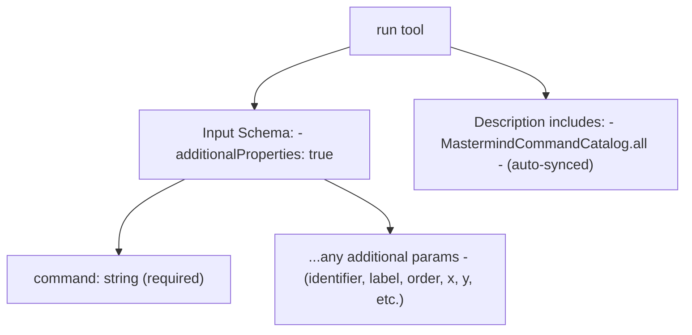

# ButtonHeistMCP - The MCP Server

> **Module:** `ButtonHeistMCP/Sources/`
> **Platform:** macOS 14.0+
> **Role:** Exposes TheMastermind as an MCP (Model Context Protocol) tool for AI agents

## Responsibilities

The MCP server provides a bridge between AI agents and ButtonHeist:

1. **Single `run` tool** accepting `{command, ...params}` JSON
2. **TheMastermind delegation** for all command execution
3. **Smart response rendering** - screenshots as inline MCP images, recordings summarized
4. **Environment-based config** - device filter, token, force mode
5. **StdioTransport** - JSON-RPC over stdin/stdout

## Architecture Diagram



## Tool Call Flow



## Screenshot Response Flow



## Tool Schema



## Items Flagged for Review

### MEDIUM PRIORITY

**MCP version hardcoded to "1.0.0"** (`ButtonHeistMCP/Sources/main.swift:20`)
```swift
Server(name: "buttonheist", version: "1.0.0")
```
- CLI version is "2.1.0" (`ButtonHeistCLI/Sources/Support/main.swift:12`)
- These versions are independent and not derived from a shared source
- Could cause confusion about which version of the protocol is supported

**Video data omitted from MCP responses** (`main.swift`)
- `renderResponse` replaces `videoData` with a size summary
- The actual video bytes are NOT returned to the AI agent
- This is intentional (too large for LLM context) but means MCP clients can't access raw video
- Only `screenshotData` gets the inline image treatment

**`additionalProperties: true` schema** (`ToolDefinitions.swift`)
- The tool accepts any JSON keys alongside `command`
- No per-command parameter validation at the MCP schema level
- All validation happens inside TheMastermind's dispatch
- An AI agent sending wrong parameters gets a runtime error, not a schema error

### LOW PRIORITY

**Single-tool design**
- All 27 commands go through one `run` tool
- Alternative: could expose each command as a separate MCP tool with typed schemas
- Current design is simpler to maintain (auto-syncs with catalog) but less discoverable

**No streaming support**
- MCP responses are one-shot
- No way to subscribe to interface updates or stream recording progress
- Each `get_interface` call is a fresh request

**Environment variable configuration only**
- No command-line flags (it's an MCP server, so stdin/stdout are for JSON-RPC)
- All config must come from environment variables
- This is the correct pattern for MCP servers
