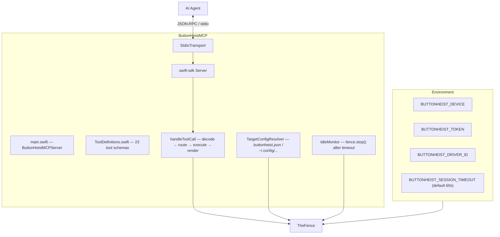
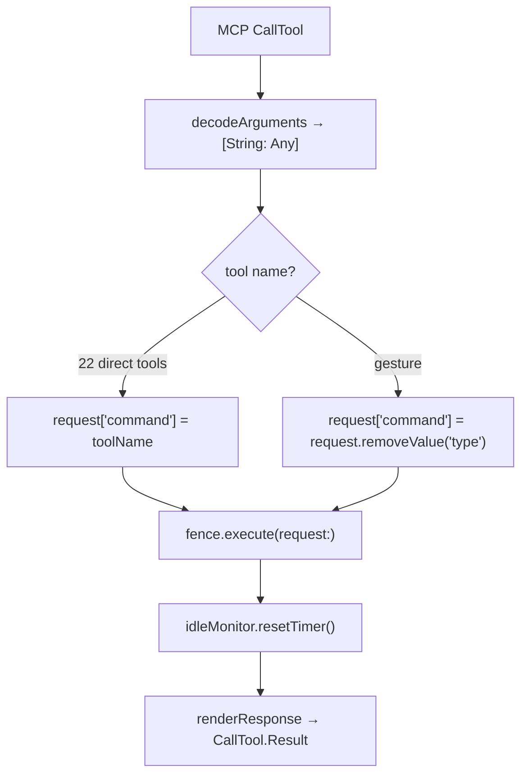

# ButtonHeistMCP — The MCP Server

> **Module:** `ButtonHeistMCP/Sources/`
> **Platform:** macOS 14.0+
> **Role:** Exposes Button Heist as 23 typed MCP tools for AI agents

## Responsibilities

This is the clean handshake between an AI agent and the rest of the crew:

1. **23 typed tools** backed by `TheFence`
2. **Tool-to-command routing** for both direct (21) and grouped (1) tools
3. **Response adaptation** for MCP clients: screenshots inline as MCP image content, video summarized
4. **Idle disconnects** with automatic reconnect on the next tool call
5. **File-based target configuration** via `TargetConfigResolver` (`.buttonheist.json` or `~/.config/buttonheist/config.json`)
6. **Environment-based configuration** for device selection, auth, and timeout

## Source Files

| File | Contents |
|------|----------|
| `main.swift` | `ButtonHeistMCPServer` entry point, `setUp()`, `handleToolCall`, `renderResponse`, `IdleMonitor` |
| `ToolDefinitions.swift` | 23 tool schemas with `expectProperty` shared across action tools |

`TargetConfigResolver` lives in the ButtonHeist framework (`TargetConfig.swift`), not in the MCP package.

## Architecture Diagram

## Full Tool List (23 tools)

| # | Tool Name | Type | Key Parameters |
|---|-----------|------|---------------|
| 1 | `get_interface` | direct | `detail` (`"summary"`/`"full"`), `elements` (heistId filter array) |
| 2 | `activate` | direct | element target, optional `action` for increment/decrement/custom |
| 3 | `type_text` | direct | `text`, `clearFirst`, `deleteCount`, `interKeyDelay` |
| 4 | `swipe` | direct | element target, `direction`, `start`/`end` (UnitPoint), `duration` |
| 5 | `get_screen` | direct | (no params) |
| 6 | `wait_for_idle` | direct | `timeout` |
| 7 | `start_recording` | direct | `fps`, `scale`, `inactivityTimeout`, `maxDuration` |
| 8 | `stop_recording` | direct | `output` (file path) |
| 9 | `list_devices` | direct | (no params) |
| 10 | `gesture` | grouped | `type` enum → underlying command |
| 11 | `edit_action` | direct | `action` (copy/paste/cut/select/selectAll) |
| 12 | `dismiss_keyboard` | direct | (no params beyond `expect`) |
| 13 | `set_pasteboard` | direct | `text` |
| 14 | `get_pasteboard` | direct | (no params) |
| 15 | `scroll` | direct | element target, `direction` |
| 16 | `scroll_to_visible` | direct | match fields, `scope`, `direction` |
| 17 | `scroll_to_edge` | direct | element target, `edge` |
| 18 | `run_batch` | direct | `commands` array |
| 19 | `get_session_state` | direct | (no params) |
| 20 | `connect` | direct | `device`, `token` |
| 21 | `list_targets` | direct | (no params) |
| 22 | `wait_for` | direct | element match fields, `absent`, `timeout` |
| 23 | `explore` | direct | (no params) |

### Gesture subtypes

`gesture` groups these commands under a `type` discriminator:
`one_finger_tap`, `drag`, `long_press`, `pinch`, `rotate`, `two_finger_tap`, `draw_path`, `draw_bezier`

## Key Tool Schemas

### `get_interface`
- `detail`: `"summary"` (default — no geometry) or `"full"` (adds frame, activation point, hints)
- `elements`: optional `[String]` — heistIds to filter; omit for full tree
- `readOnlyHint: true`, `idempotentHint: true`

### `swipe`
- Element targeting: `heistId` / `identifier` / `order`
- `direction`: `up`, `down`, `left`, `right`
- `start` / `end`: `{x: number, y: number}` — UnitPoint relative to element frame where `(0,0)` = top-left, `(1,1)` = bottom-right; values outside 0–1 extend beyond frame
- `duration`: seconds

### `scroll_to_visible`
- Match fields: `heistId`, `identifier`, `label`, `value`, `traits`, `excludeTraits` — all specified fields must match (AND logic)
- `scope`: `"elements"` (leaves only, default), `"containers"`, `"both"`
- `direction`: `"down"` (default), `"up"`, `"left"`, `"right"`

### Shared `expect` property
Used on all action tools. Accepts either:
- String: `"screen_changed"` or `"elements_changed"`
- Object: `{"elementUpdated": {"heistId": "...", "property": "...", "oldValue": "...", "newValue": "..."}}` — all sub-fields optional wildcards; `property` is one of `label`, `value`, `traits`, `hint`, `actions`, `frame`, `activationPoint`

## Routing Rules

1. Direct tools map 1:1 to `request["command"] = toolName`
2. Grouped tools extract `type` and use that as the underlying Fence command
3. All requests end at `fence.execute(request:)`

## Response Behavior

- `get_screen` returns inline MCP image content (`image/png`) plus JSON metadata as text
- `stop_recording` omits raw base64 video data; agents must use the `output` parameter for a file path
- Errors set `isError: true` on the MCP result
- All responses append `response.compactFormatted()` as the text content item

## IdleMonitor

`@ButtonHeistActor private final class` with a simple timer pattern:
- `resetTimer()` cancels any existing timeout task, then spawns a detached `Task` that sleeps for `timeout` seconds and calls `fence.stop()`
- Called after every tool call (success or failure)
- `timeout <= 0` disables idle disconnect
- Default: 60 seconds (from `BUTTONHEIST_SESSION_TIMEOUT` env var)

## Target Configuration

`TargetConfigResolver.loadConfig()` searches in order:
1. `.buttonheist.json` (relative to working directory)
2. `~/.config/buttonheist/config.json`

`resolveEffective()` precedence:
1. `BUTTONHEIST_DEVICE` env var wins over everything
2. Named target from config file
3. `BUTTONHEIST_TOKEN` env var overrides the config file token even when a named target is used

## Risks / Gaps

- No streaming tool surface for live subscriptions
- Recording payloads are intentionally lossy in MCP mode to keep context size manageable
