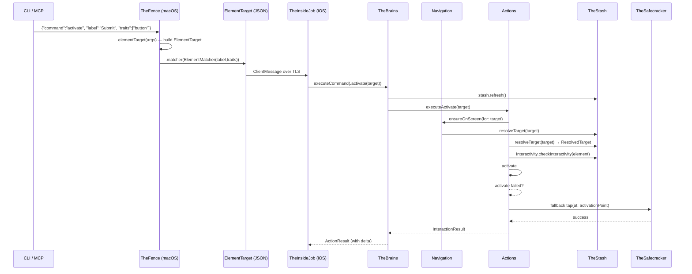
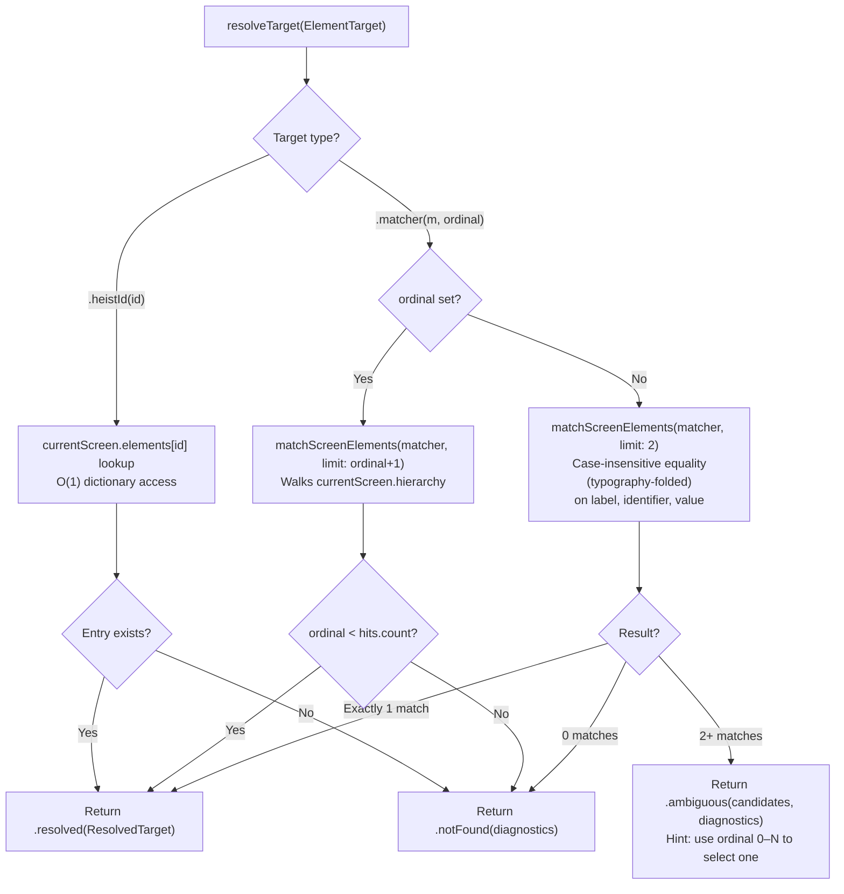

# Unified Targeting - Element Resolution

> **Cross-cutting concern:** TheFence → TheScore (wire) → TheBrains.Actions / TheBrains.Navigation → TheStash → TheSafecracker
> **Role:** Routes every action command to a concrete element via a single resolution path

## Overview

Unified targeting turns a caller's intent ("tap the Submit button") into a concrete `AccessibilityElement` and traversal index on the iOS side. Every action command — activate, scroll, swipe, type_text, gesture, edit_action — flows through the same resolution pipeline.

There are exactly **two targeting strategies**, encoded as cases of the `ElementTarget` enum:

1. **`.heistId(String)`** — "you gave me this token, I hand it back." Assigned by `get_interface`, presumed stable while the element is in `currentScreen`. O(1) lookup into `currentScreen.elements`.
2. **`.matcher(ElementMatcher)`** — "I'm describing the element by its accessibility properties." A predicate-based search on label, identifier, value, and traits with **case-insensitive equality** (typography-folded — smart quotes, dashes, ellipsis fold to ASCII) and exact trait bitmask comparison. Matching is **exact or miss** — there is no substring fallback. On a miss the resolver returns structured suggestions through the diagnostic path. Callers can embed expectations (e.g. `value="6"`) so stale state fails early instead of acting on the wrong element.

A single method, `TheStash.resolveTarget(_:)`, implements this and returns a `TargetResolution` enum (`.resolved(ResolvedTarget)`, `.notFound(diagnostics:)`, `.ambiguous(candidates:diagnostics:)`). `ResolvedTarget` has a single field: `screenElement: ScreenElement`. Every action executor calls this method — there are no alternative resolution paths.

### What was removed/changed

- **`ActionTarget` struct** — replaced by `ElementTarget` enum. The old struct had two optional fields (`heistId: String?`, `match: ElementMatcher?`) creating four states, two of which were invalid. The enum has exactly two valid cases.
- **`identifier` on ActionTarget** — accessibility identifier is an accessibility property, so it belongs in the matcher.
- **`order` on ActionTarget** — fragile positional index that shifts when anything on screen changes. Removed entirely.
- **`heistId` on ElementMatcher** — heistId is an assigned token, not an accessibility property. It lives on ElementTarget, not in the matcher.
- **`lastSnapshot` array** — replaced by `currentScreen.elements` dictionary for O(1) heistId lookup. Post-0.2.25 there is no per-screen registry; the dictionary lives on the `Screen` value held by TheStash and is replaced on every `parse()` / `merging` commit.
- **Legacy resolution methods** — `findElement(for:)` and `resolveTraversalIndex(for:)` were dead code. Removed.

## Data Flow



## Entry Point: TheFence.elementTarget()

`TheFence.swift` — called from every action handler. Reads raw args and builds an `ElementTarget`.

**Routing:** if *any* accessibility property is present (label, identifier, value, traits, excludeTraits), all are packed into an `ElementMatcher`. `heistId` stays on `ElementTarget` directly. `ElementTarget` is an enum — cases are mutually exclusive. The convenience `init?(heistId:matcher:)` picks `.heistId` when a heistId is present, otherwise `.matcher`.

```
args: {"identifier":"btn", "traits":["button"]}
  → ElementTarget.matcher(ElementMatcher(identifier:"btn", traits:[.button]))

args: {"identifier":"btn"}
  → ElementTarget.matcher(ElementMatcher(identifier:"btn"))

args: {"heistId":"button-Submit-0"}
  → ElementTarget.heistId("button-Submit-0")

args: {"heistId":"button-Submit-0", "label":"Submit"}
  → ElementTarget.heistId("button-Submit-0")  // heistId wins, matcher ignored
```

There are two builder methods:
- **`elementTarget(_:)`** — used by all action commands. Produces `ElementTarget`.
- **`elementMatcher(_:)`** — used by multi-result filtering such as `get_interface`. Produces `ElementMatcher` directly. (`absent` is a separate field on `WaitForTarget`, not on `ElementMatcher`.)

## Wire Types

### ElementTarget (TheScore/Elements.swift)

```swift
enum ElementTarget: Codable, Sendable {
    case heistId(String)                              // assigned token from get_interface
    case matcher(ElementMatcher, ordinal: Int? = nil) // describe by accessibility properties
}
```

Exactly one strategy per target — no invalid states. Custom flat-wire Codable preserves backward compatibility with JSON like `{"heistId": "btn"}` or `{"label": "Submit", "traits": ["button"]}`. The optional `ordinal` (0-based) selects among multiple matches; without it, multiple matches return an ambiguity error.

### ElementMatcher (TheScore/Elements.swift)

```swift
struct ElementMatcher: Codable, Sendable, Equatable {
    let label: String?              // case-insensitive equality match (typography-folded)
    let identifier: String?         // case-insensitive equality match (typography-folded)
    let value: String?              // case-insensitive equality match (typography-folded)
    let traits: [HeistTrait]?       // all must be present (AND, exact bitmask)
    let excludeTraits: [HeistTrait]? // none may be present
}
```

`HeistTrait` is a `String`-backed enum with `CaseIterable` (defined in `TheScore/Elements.swift`) covering standard `UIAccessibilityTraits`, private core traits (textEntry, backButton, etc.), and extended AXRuntime traits. Unknown trait strings decode as `.unknown(String)` for forward compatibility.

All non-nil fields must match — **AND semantics**. This is intentional: callers encode expectations into the search. If you expect a slider at value "6" and want to increment to "7", embed `value="6"` in the matcher — stale state fails early instead of acting on the wrong element.

Trait names are resolved to `UIAccessibilityTraits` bitmasks on the iOS side via `UIAccessibilityTraits.knownTraitNames`. Unknown trait names cause an automatic miss (no silent degradation).

## Resolution: TheStash.resolveTarget()

`TheStash.swift` — the single resolution method. Returns `TargetResolution` enum: `.resolved(ResolvedTarget)`, `.notFound(diagnostics:)`, or `.ambiguous(candidates:diagnostics:)`. `ResolvedTarget` has a single field (`screenElement: ScreenElement`) with a computed `element` property.



`matchScreenElements` walks `currentScreen.hierarchy` to find matching `AccessibilityElement`s, then resolves each hit to a `ScreenElement` via `currentScreen.heistIdByElement[element]` → `currentScreen.elements[heistId]`. The reverse index `heistIdByElement` is computed once during `buildScreen(from:)` and stored on the `Screen` value.

## Error Diagnostics: Progressive Disclosure

When `resolveTarget` returns `.notFound`, the `diagnostics` associated value contains a tiered diagnostic message. Three tiers, from most to least specific:

### Tier 1: Ambiguous — "too many matches"

When 2+ elements match the exact predicate, lists all candidates (up to 10):

```
3 elements match: label="Save"
  "Save Changes" id=saveChangesBtn
  "Save Draft" id=saveDraftBtn
  "Save as Template"
```

### Tier 2: Near-miss — "you're right but something changed"

Progressively relaxes one predicate at a time (value first, then traits, label, identifier) and runs a **substring** match against the remaining predicate set. When a relaxed matcher hits, reports up to three candidates so the agent can pick the actual label they meant:

```
No match for: label="Sav" traits=[button]
near miss: matched all fields except label — did you mean label="Save", label="Save Draft", label="Save As"?
```

The substring search is reserved for the suggestion path; resolution itself never falls back to substring. Value is relaxed first because it's the most likely to drift (slider moved, text changed). Only relaxations that leave at least one remaining predicate are tried — dropping the only predicate matches everything, which isn't useful.

### Tier 3: Total miss — "here's what I see"

When nothing is close, dumps a compact element summary (capped at 20) so the caller can self-correct without another round-trip:

```
No match for: label="LoginButton" traits=[button]
14 elements on screen:
  label="Welcome" [staticText]
  label="Email" id="emailField" [textField]
  label="Password" id="passwordField" [secureTextField]
  label="Sign In" [button]
  ...
```

The goal: every error message answers the obvious next question. "Why didn't it match?" → here's what actually diverged. "What's even on screen?" → here, you figure it out.

## Matching Infrastructure (TheStash+Matching.swift)

Matching operates on the **canonical `AccessibilityElement` tree**, not wire types. There is exactly one search surface: `currentScreen.hierarchy`. Resolution paths (`matchScreenElements`, `hasTarget`, `HeistElement.matches`) walk the hierarchy and compare predicates against the canonical `AccessibilityElement`s. There is no flat-array fallback — pre-0.2.25 `cachedElements` was removed when the registry was eliminated.

### Match evaluation (AccessibilityElement.matches)

The same `MatchMode.exact` semantics are shared with `HeistElement.matches` on the client (TheScore), so the same `ElementMatcher` resolves identically server-side and client-side.

1. `label` — case-insensitive equality after typography folding (smart quotes/dashes/ellipsis fold to ASCII; emoji, accents, CJK pass through)
2. `identifier` — case-insensitive equality after typography folding
3. `value` — case-insensitive equality after typography folding
4. `traits` — resolve names to bitmask, check `traits.contains(mask)`. Unknown names → miss.
5. `excludeTraits` — resolve names to bitmask, check `traits.isDisjoint(with: mask)`. Unknown names → miss.

All checks are AND — first failure short-circuits to false. There is no substring fallback in the resolution path; substring matching is reserved for the diagnostic suggestion path (`Diagnostics.findNearMiss`).

## Callers

Every action executor calls `stash.resolveTarget(target)`. Resolution lives on TheStash; orchestration (scroll, ensureOnScreen) lives on Navigation; action execution lives on Actions:

| Method | File | What it needs |
|--------|------|--------------|
| `ensureOnScreen(for:)` | TheBrains/Navigation+Scroll.swift | screenElement → object → scroll ancestor |
| `executeScroll(_:)` | TheBrains/Navigation+Scroll.swift | screenElement → object → scroll ancestor |
| `executeScrollToEdge(_:)` | TheBrains/Navigation+Scroll.swift | screenElement → object → scroll to edge |
| `executeScrollToVisible(_:)` | TheBrains/Navigation+Scroll.swift | resolveFirstMatch (first-match semantics) |
| `executeElementSearch(_:)` | TheBrains/Navigation+Scroll.swift | resolveFirstMatch + scroll loop |
| `executeActivate(_:)` | TheBrains/Actions.swift | element (interactivity check) + screenElement (activate/fallback tap) |
| `executeIncrement(_:)` | TheBrains/Actions.swift | screenElement (increment) + element (fingerprint point) |
| `executeDecrement(_:)` | TheBrains/Actions.swift | screenElement (decrement) + element (fingerprint point) |
| `executeCustomAction(_:)` | TheBrains/Actions.swift | screenElement (perform action) |
| `executeTypeText(_:)` | TheBrains/Actions.swift | element (activation point for tap-to-focus) |
| `executeTap(_:)` | TheBrains/Actions.swift | resolvePoint → element activation point |
| `executeSwipe(_:)` | TheBrains/Actions.swift | resolvePoint or resolveFrame for unit-point swipe |
| `resolvePoint(from:)` | TheStash/TheStash.swift | element (activation point for gesture origin) |
| `actionResultWithDelta(...)` | TheBrains/TheBrains.swift | element (post-action label/value/traits readback) |

Touch gestures (tap, swipe, long_press, drag, pinch, rotate, two_finger_tap) go through `resolvePoint` which calls `resolveTarget` internally. TheSafecracker is called only for the raw gesture synthesis after TheStash has resolved the target.

### Commands that bypass single-target resolution

These commands do not resolve exactly one live element through `resolveTarget()` before doing their work:

| Command | Why |
|---------|-----|
| `get_interface` | Filters the full hierarchy tree, returns multiple matches |
| `wait_for` | Carries an `ElementTarget`, but polls `hasTarget` for appearance/disappearance instead of resolving a single element |

## Design Principles

1. **Two strategies, nothing else.** heistId (you got this token) or matcher (describe what you want). Optional ordinal disambiguates when multiple elements match the same predicate.
2. **Single resolution path** — `resolveTarget()` is the only way to go from `ElementTarget` to a live element. No alternative code paths that could fall out of sync.
3. **Exact matching only** — no fuzzy resolution, no partial matches. Miss → progressive diagnostic that answers the next question.
4. **Expectations in the search** — embed value/trait expectations in the matcher so stale state fails early. A slider at value "8" won't match a search for value "6" — you'll know immediately something changed.
5. **heistId always wins** — fastest path (snapshot lookup by stable ID), deterministic. When a caller has a heistId, they know exactly which element they want.
6. **Matching on canonical types** — `ElementMatcher` predicates resolve against `AccessibilityElement` (parser types with real `UIAccessibilityTraits`), not wire types (`HeistElement` with string trait arrays). This avoids lossy string round-trips.
7. **Progressive disclosure on failure** — errors go from "here's what changed" to "here's what's on screen" depending on how close the miss was. Every error answers the obvious next question.

## CLI Targeting Surface

`ElementTargetOptions` (`ButtonHeistCLI/Sources/Support/ElementTargetOptions.swift`) exposes the full matcher surface to all CLI subcommands:

| Flag | Maps to |
|------|---------|
| `--heist-id` | `ElementTarget.heistId` |
| `--label` | `ElementMatcher.label` |
| `--identifier` | `ElementMatcher.identifier` |
| `--value` | `ElementMatcher.value` |
| `--traits` | `ElementMatcher.traits` |
| `--exclude-traits` | `ElementMatcher.excludeTraits` |
| `--ordinal` | `ElementTarget` ordinal (0-based index among matches) |

`WaitForCommand` is the exception: it builds an `ElementMatcher` directly (no `--heist-id`, since `wait_for` polls by predicate, not by assigned token).

## Element Registry

There is no element registry post-0.2.25. TheStash holds exactly one mutable field — `var currentScreen: Screen` — and rebinds it on every parse / merge. The `Screen` value type carries the heistId index, the parsed hierarchy, the reverse index, and the live scrollable container references as immutable fields. Pre-0.2.25 `screenElements: [String: ScreenElement]`, `presentedHeistIds`, `onScreen`, `heistIdByTraversalOrder`, `updateScreenElements()`, `refreshAccessibilityData()`, and the scorched-earth wipe-and-rebuild on screen change are all gone.

`HeistId resolution` (`resolveTarget(.heistId)`) is O(1) dictionary lookup into `currentScreen.elements`. There is no presentation gate — if a heistId is in `currentScreen.elements`, it resolves. (Exploration unions older elements into `currentScreen` so heistIds for off-viewport elements still resolve until the next non-exploration `parse()` overwrites the screen.)

`Matcher resolution` walks `currentScreen.hierarchy` looking for matching `AccessibilityElement`s, then resolves each hit via `currentScreen.heistIdByElement[element]` (keyed on `AccessibilityElement`, not traversal index) → `currentScreen.elements[heistId]` to recover the `ScreenElement`. Both indices are computed once during `buildScreen(from:)` and never mutated.

Matching always operates on canonical `AccessibilityElement` types, never on wire types. `Screen.merging(_:)` is last-read-wins on conflicting heistIds — the most recently parsed element wins, matching the agent-visible "fresh state beats stale state" rule for exploration unions.
