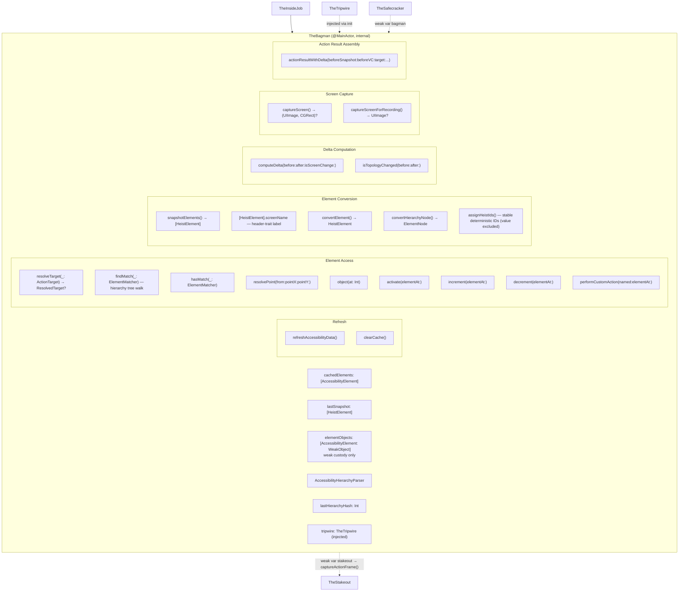
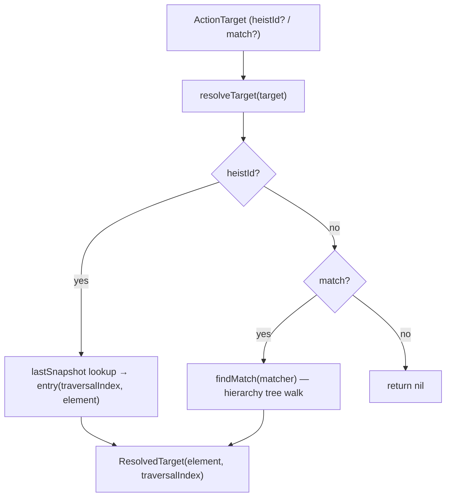
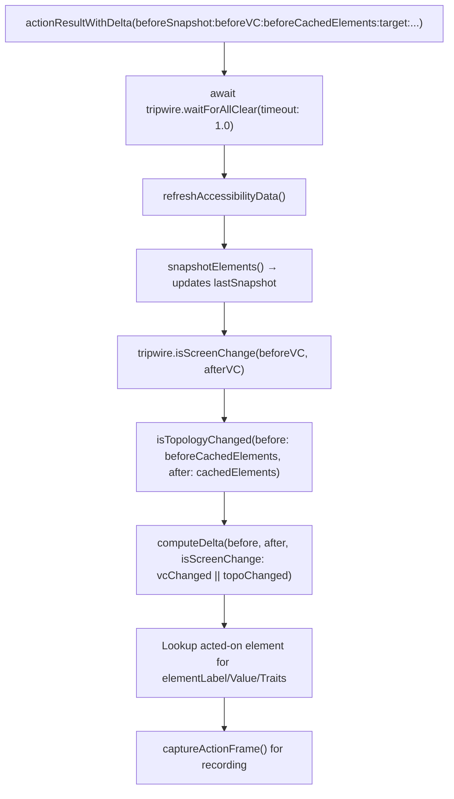

# TheBagman - The Score Handler

> **Files:** `ButtonHeist/Sources/TheInsideJob/TheBagman.swift`, `TheBagman+Conversion.swift`, `TheBagman+Matching.swift`
> **Platform:** iOS 17.0+ (UIKit, DEBUG builds only)
> **Role:** Owns element cache, hierarchy parsing, delta computation, screen capture, and weak custody of live UI objects

## Responsibilities

TheBagman handles all the goods during TheInsideJob:

1. **Element cache** - maintains `cachedElements: [AccessibilityElement]` from the last hierarchy refresh
2. **Weak object custody** - maps parsed elements to live `NSObject` instances via `elementObjects`, always as weak references
3. **Hierarchy parsing** - drives `AccessibilityHierarchyParser` to traverse the accessibility tree
4. **Element resolution** - `resolveTarget(_:)` is the single entry point: heistId → match, returning `ResolvedTarget(element, traversalIndex)`. See [15-UNIFIED-TARGETING.md](15-UNIFIED-TARGETING.md) for the full targeting system.
5. **Element matching** - `findMatch(_:)` and `hasMatch(_:)` search the canonical accessibility snapshot using `ElementMatcher` predicates with AND semantics. Matching runs on `AccessibilityElement` values, not wire types. `AccessibilityContainer` nodes can also be matched when `scope` is `.containers` or `.both` via hierarchy-level matching in `TheBagman+Matching.swift`. Used by TheSafecracker for scroll search.
6. **StableKey identity** - `AccessibilityElement.StableKey` provides geometry-free identity for tracking unique elements across scroll positions. Uses semantic properties (label, identifier, value, traits) by default; falls back to frame geometry when all semantic properties are empty, so identical unlabeled elements at different positions still hash as distinct.
7. **HeistId synthesis** - assigns stable, deterministic `heistId` identifiers to elements (developer identifier preferred, else synthesized from traits+label; value excluded for stability), with disambiguation suffixes for duplicates
8. **Topology-based screen change detection** - detects navigation changes that reuse the same VC by checking back button trait (private `0x8000000`) appearance/disappearance and header label disjointness (`isTopologyChanged`)
9. **Delta computation** - compares before/after element snapshots to produce `InterfaceDelta` (screen change is determined by VC identity from TheTripwire OR topology change from TheBagman)
10. **Screen capture** - renders traversable windows via `UIGraphicsImageRenderer`
11. **Action result assembly** - orchestrates post-action diffs and frame capture (delegates all timing to TheTripwire's `waitForAllClear`)

## Custody Contract

TheBagman is the custodian of the live accessibility/UI object world.

- **Exclusive ownership of live object references** — if a subsystem needs to get from a parsed element back to a live `NSObject`, it goes through TheBagman
- **Weak references only** — live objects are stored only in `elementObjects` and only as `weak` references; TheBagman never prolongs the lifetime of app UI objects
- **No exported live handles** — other subsystems should work through Bagman APIs that return values, frames, points, traversal indices, or perform actions on their behalf
- **Parser boundary** — `AccessibilityHierarchyParser` usage belongs to TheBagman; TheTripwire handles timing/window observation, and TheSafecracker handles actuation
- **Fail closed on staleness** — if the weak object is gone, TheBagman treats it as stale state and re-resolves from a fresh parse instead of pretending the handle is still valid

## Architecture Diagram

## Element Resolution Flow

> Full targeting system documentation: [15-UNIFIED-TARGETING.md](15-UNIFIED-TARGETING.md)

## Delta Computation

Screen change detection uses a two-gate check: TheTripwire's VC identity comparison (primary) OR TheBagman's topology detection (fallback for Workflow-style navigation where the VC is reused). Topology detection checks for back button trait appearance/disappearance and disjoint header labels.

## Action Result Assembly

## Screen Capture

Two capture modes:
- **`captureScreen()`** — renders traversable windows bottom-to-top, **excludes** `FingerprintWindow` (clean screenshots)
- **`captureScreenForRecording()`** — renders **all** windows including `FingerprintWindow` (interaction indicators visible in recordings)

Both use `UIGraphicsImageRenderer` with `drawHierarchy(in:afterScreenUpdates:)`.

## Dependencies

- **TheTripwire** (injected via `init(tripwire:)`) — provides window access, timing coordination (`allClear`, `waitForAllClear`), and VC identity-based screen change detection (TheBagman supplements with topology-based detection)
- **TheStakeout** (`weak var stakeout: TheStakeout?`) — TheBagman calls `stakeout?.captureActionFrame()` during action result assembly for recording frame capture
- **AccessibilityHierarchyParser** (from AccessibilitySnapshot submodule) — traverses the accessibility tree

## Architectural Rule

If code needs to parse the accessibility hierarchy or hold onto a live accessibility-backed `NSObject`, that responsibility belongs to TheBagman. Other subsystems may ask TheBagman to resolve, inspect, or act on behalf of a target, but they should not take ownership of those live references themselves.

## Items Flagged for Review

### MEDIUM PRIORITY

**No unit tests for TheBagman**
- Delta computation is pure data transformation — testable without UIKit dependency
- Element resolution and conversion logic could also be unit tested
- Currently untested

### LOW PRIORITY

**Weak object references can go stale**
- `elementObjects` holds `weak` references to live `NSObject` instances
- Between refresh and use, an object may be deallocated
- This is handled gracefully (returns nil) but worth knowing
