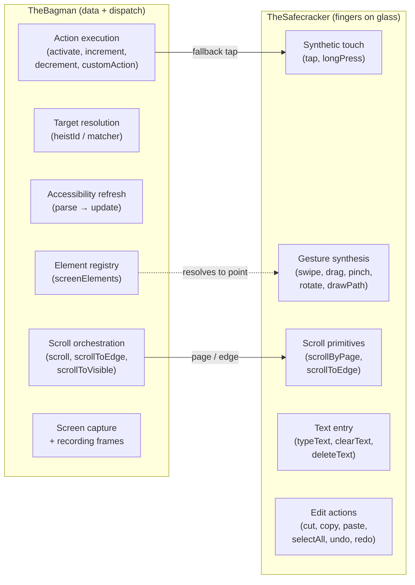
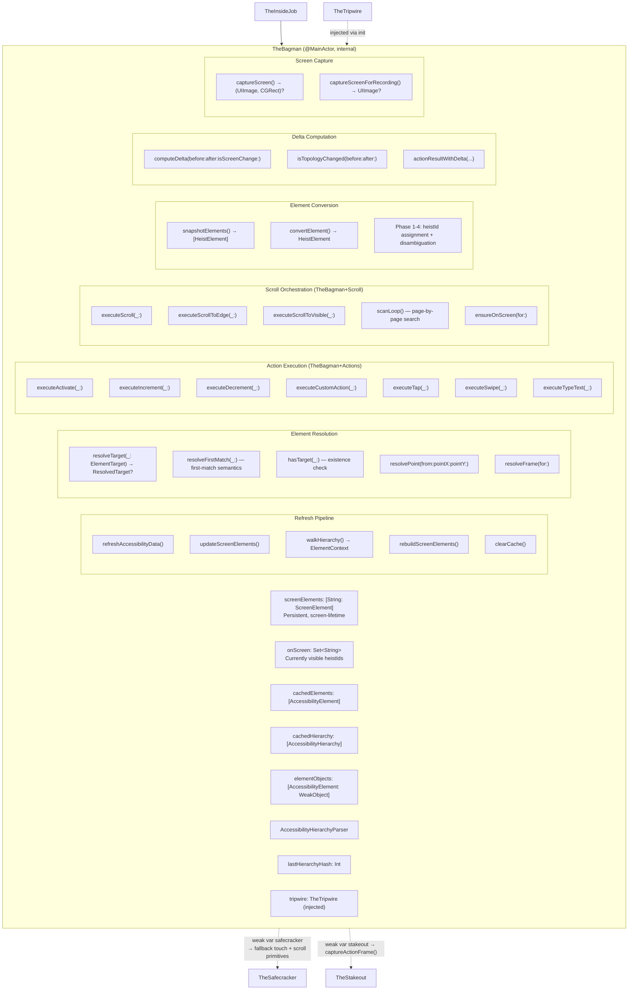
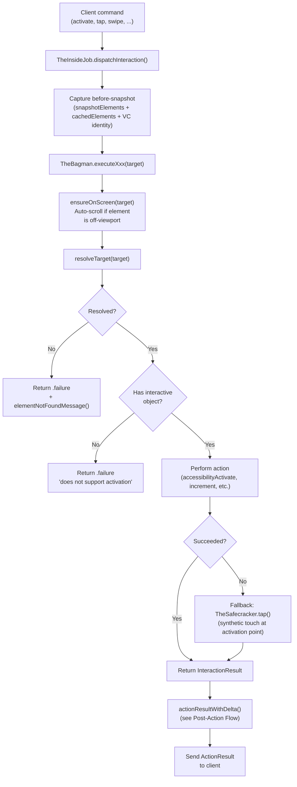
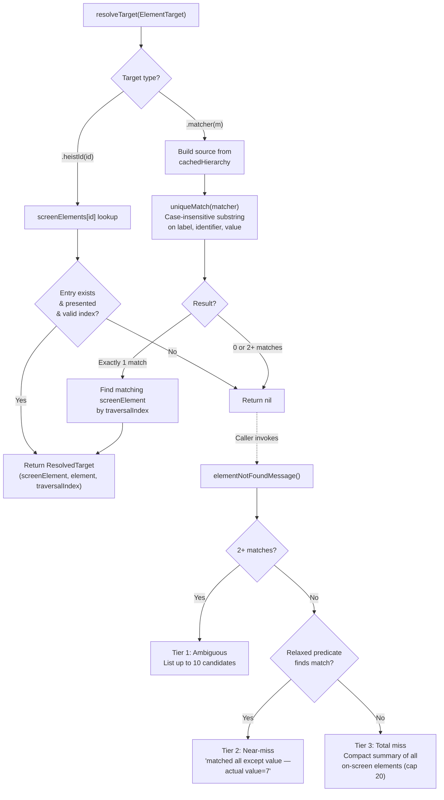
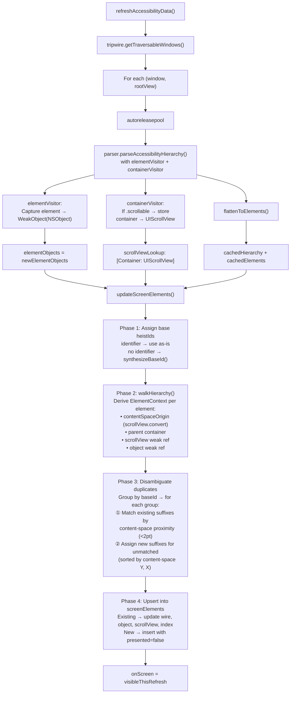
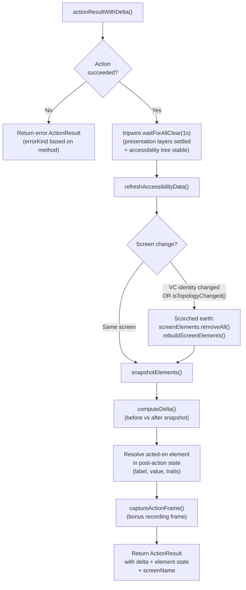
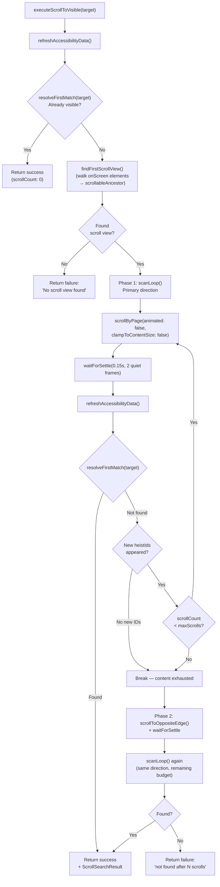

# TheBagman - The Score Handler

> **Files:** `TheBagman.swift`, `TheBagman+Actions.swift`, `TheBagman+Scroll.swift`, `TheBagman+Conversion.swift`, `TheBagman+Matching.swift`
> **Platform:** iOS 17.0+ (UIKit, DEBUG builds only)
> **Role:** Owns element registry, hierarchy parsing, target resolution, action execution, scroll orchestration, delta computation, and screen capture

## Responsibilities

TheBagman handles all the goods during TheInsideJob:

1. **Screen-lifetime element registry** — maintains `screenElements: [String: ScreenElement]` keyed by heistId, persistent across refreshes within the same screen
2. **Weak object custody** — maps parsed elements to live `NSObject` instances via `elementObjects`, always as weak references
3. **Hierarchy parsing** — drives `AccessibilityHierarchyParser` with `elementVisitor` + `containerVisitor` closures to capture element objects and scroll view refs
4. **Target resolution** — `resolveTarget(_:)` is the single entry point: `.heistId` → O(1) dictionary lookup, `.matcher` → `uniqueMatch` predicate search. Returns `ResolvedTarget(screenElement, element, traversalIndex)`. See [15-UNIFIED-TARGETING.md](15-UNIFIED-TARGETING.md) for the full targeting system.
5. **Action execution** — `executeActivate`, `executeIncrement`, `executeDecrement`, `executeCustomAction`, `executeTap`, `executeSwipe`, `executeTypeText`, etc. TheBagman resolves the target, checks interactivity, performs the action, and falls back to TheSafecracker for synthetic touch when accessibility activation fails.
6. **Scroll orchestration** — `executeScroll`, `executeScrollToEdge`, `executeScrollToVisible` with two-phase bidirectional scan. TheSafecracker provides scroll primitives (`scrollByPage`, `scrollToEdge`); TheBagman drives the search logic.
7. **Element matching** — `findMatch(_:)`, `hasMatch(_:)`, `resolveFirstMatch(_:)` search the canonical accessibility snapshot using `ElementMatcher` predicates with AND semantics and case-insensitive substring matching.
8. **HeistId synthesis** — assigns stable, deterministic `heistId` identifiers to elements (developer identifier preferred, else synthesized from traits+label; value excluded for stability), with suffix disambiguation via content-space position matching for scroll stability
9. **Topology-based screen change detection** — detects navigation changes that reuse the same VC by checking back button trait (private `0x8000000`) appearance/disappearance and header label disjointness (`isTopologyChanged`)
10. **Delta computation** — compares before/after element snapshots to produce `InterfaceDelta` (screen change = VC identity from TheTripwire OR topology change from TheBagman)
11. **Screen capture** — renders traversable windows via `UIGraphicsImageRenderer`
12. **Action result assembly** — orchestrates post-action diffs and frame capture (delegates all timing to TheTripwire's `waitForAllClear`)

## Custody Contract

TheBagman is the custodian of the live accessibility/UI object world.

- **Exclusive ownership of live object references** — if a subsystem needs to get from a parsed element back to a live `NSObject`, it goes through TheBagman
- **Weak references only** — live objects are stored in `ScreenElement.object` and `ScreenElement.scrollView` as `weak` references; TheBagman never prolongs the lifetime of app UI objects
- **No exported live handles** — other subsystems should work through Bagman APIs that return values, frames, points, traversal indices, or perform actions on their behalf
- **Parser boundary** — `AccessibilityHierarchyParser` usage belongs to TheBagman; TheTripwire handles timing/window observation, and TheSafecracker handles raw gesture synthesis
- **Fail closed on staleness** — if the weak object is gone, TheBagman treats it as stale state and re-resolves from a fresh parse instead of pretending the handle is still valid

## Crew Responsibility Boundaries



## Architecture Diagram



## Action Execution Pipeline

All interactions follow the same pipeline: TheBagman resolves the target, executes the action (with optional fallback to TheSafecracker for synthetic touch), then produces a delta.



## Element Target Resolution

Two resolution strategies: O(1) dictionary lookup for heistIds, predicate search for matchers. Callers use `elementNotFoundMessage()` for tiered diagnostics on nil.



## Accessibility Refresh & Screen Element Update

The core data pipeline. Runs on every interaction cycle and after scroll steps. The `autoreleasepool` per window bounds memory from ObjC accessibility property reads.



## Action Result with Delta (Post-Action Flow)

After every interaction, TheBagman waits for the UI to settle, diffs the accessibility tree, and detects screen changes. The delta tells callers exactly what changed.



## Screen Change Detection

Three-tier detection: VC identity for UIKit navigation, back-button trait for push/pop, header structure for content replacement. Detection is separate from response — `actionResultWithDelta` calls both.

```mermaid
flowchart TD
    SC["Screen change check<br/>(in actionResultWithDelta)"] --> VC["tripwire.isScreenChange()<br/>Compare VC ObjectIdentifier<br/>before vs after"]
    VC --> VCR{VC identity<br/>changed?}
    VCR -->|Yes| YES["Screen change = true"]
    VCR -->|No| TOP["isTopologyChanged()<br/>Compare before/after<br/>AccessibilityElement arrays"]

    TOP --> BB{Back button trait<br/>(bit 27) appeared<br/>or disappeared?}
    BB -->|Yes| YES
    BB -->|No| HD{Header labels<br/>completely replaced?<br/>(disjoint sets)}
    HD -->|Yes| YES
    HD -->|No| NO["Screen change = false"]

    YES --> WIPE["screenElements.removeAll()"]
    WIPE --> REBUILD["rebuildScreenElements()<br/>(re-derive from cached data<br/>without scroll view context)"]
    NO --> KEEP["Keep existing screenElements<br/>(upserted during refresh)"]
```

## Scroll-to-Visible Search Flow

Two-phase scan: scroll in the primary direction, then jump to the opposite edge and scan again. Uses `resolveFirstMatch` (first-match semantics — any match is success, no uniqueness check). Content-size clamp is always disabled (`clampToContentSize: false`) so lazy containers can scroll past the currently-materialized region. Each step settles via `waitForSettle(0.15s, 2 quiet frames)` to let new content render.



## Delta Computation


Screen change detection uses a two-gate check: TheTripwire's VC identity comparison (primary) OR TheBagman's topology detection (fallback for Workflow-style navigation where the VC is reused). Topology detection checks for back button trait appearance/disappearance and disjoint header labels.

## Screen Capture

Two capture modes:
- **`captureScreen()`** — renders traversable windows bottom-to-top, **excludes** `FingerprintWindow` (clean screenshots)
- **`captureScreenForRecording()`** — renders **all** windows including `FingerprintWindow` (interaction indicators visible in recordings)

Both use `UIGraphicsImageRenderer` with `drawHierarchy(in:afterScreenUpdates:)`.

## ScreenElement Structure

```swift
struct ScreenElement {
    let heistId: String
    let contentSpaceOrigin: CGPoint?    // position within scroll container
    var container: AccessibilityContainer?
    var lastTraversalIndex: Int
    var wire: HeistElement              // updated each refresh
    var presented: Bool                 // true after sent to clients
    weak var object: NSObject?          // live UIKit object for actions
    weak var scrollView: UIScrollView?  // parent scroll view (outlives children)
}
```

**Lifetime rules:**
- UIKit guarantees the scroll view outlives its children, so if `object != nil` then `scrollView != nil` (when originally set)
- If `object == nil` but `scrollView != nil`, the element was deallocated (cell reuse) but the scroll view is still alive — you can still scroll to its content-space position
- `presented` is set to `true` when the element is sent to clients via `get_interface` or delta; `resolveTarget(.heistId)` requires `presented == true`

## Dependencies

- **TheTripwire** (injected via `init(tripwire:)`) — provides window access, timing coordination (`allClear`, `waitForAllClear`), VC identity-based screen change detection, and first responder lookup
- **TheSafecracker** (`weak var safecracker: TheSafecracker?`) — TheBagman calls TheSafecracker for raw gesture synthesis (fallback tap, scroll primitives, text entry, edit actions)
- **TheStakeout** (`weak var stakeout: TheStakeout?`) — TheBagman calls `stakeout?.captureActionFrame()` during action result assembly for recording frame capture
- **AccessibilityHierarchyParser** (from AccessibilitySnapshot submodule) — traverses the accessibility tree with `elementVisitor` and `containerVisitor` closures

## Architectural Rule

If code needs to parse the accessibility hierarchy, hold onto a live accessibility-backed `NSObject`, resolve an element target, or execute an accessibility action, that responsibility belongs to TheBagman. TheSafecracker is exclusively "fingers on glass" — it provides raw gesture primitives but never resolves targets or owns element state.

## Items Flagged for Review

### MEDIUM PRIORITY

**No unit tests for TheBagman**
- Delta computation is pure data transformation — testable without UIKit dependency
- Element resolution and conversion logic could also be unit tested
- HeistId synthesis and suffix disambiguation are deterministic and testable
- Currently untested

### LOW PRIORITY

**Weak object references can go stale**
- `ScreenElement.object` and `ScreenElement.scrollView` hold `weak` references to live objects
- Between refresh and use, an object may be deallocated
- This is handled gracefully (returns nil) but worth knowing
