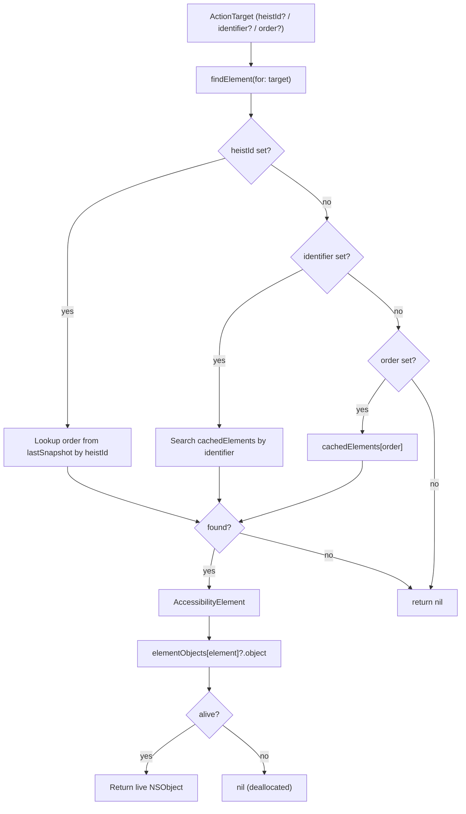
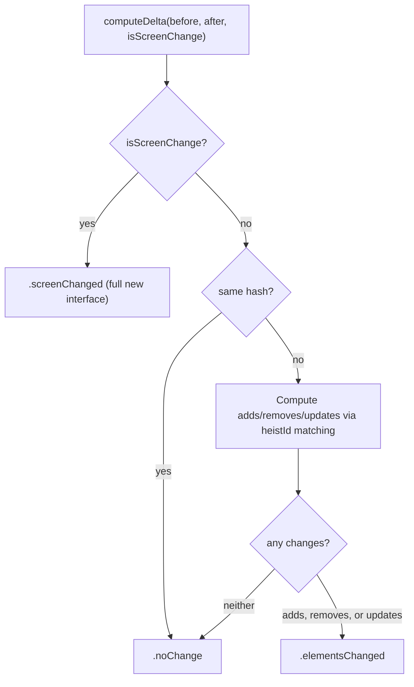
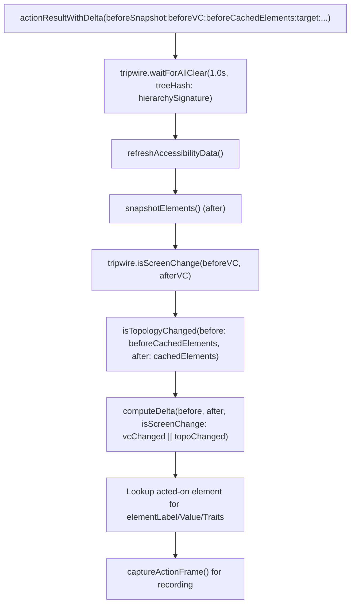

# TheBagman - The Score Handler

> **File:** `ButtonHeist/Sources/TheInsideJob/TheBagman.swift`
> **Platform:** iOS 17.0+ (UIKit, DEBUG builds only)
> **Role:** Owns element cache, hierarchy parsing, delta computation, and screen capture

## Responsibilities

TheBagman handles all the goods during TheInsideJob:

1. **Element cache** - maintains `cachedElements: [AccessibilityElement]` from the last hierarchy refresh
2. **Weak object references** - maps elements to live `NSObject` instances via `elementObjects` dictionary
3. **Hierarchy parsing** - drives `AccessibilityHierarchyParser` to traverse the accessibility tree
4. **Element resolution** - finds elements by `heistId`, `identifier`, or `order` for TheSafecracker
5. **Element matching** - `findMatch(_:)` and `hasMatch(_:)` search the cached element tree using `ElementMatcher` predicates with AND semantics. Matching runs on the canonical `AccessibilityElement` tree, not wire types. `AccessibilityContainer` nodes can also be matched when `scope` is `.containers` or `.both`. Used by TheSafecracker for scroll search.
6. **StableKey identity** - `AccessibilityElement.StableKey` provides geometry-free identity for tracking unique elements across scroll positions. Uses semantic properties (label, identifier, value, traits) by default; falls back to frame geometry when all semantic properties are empty, so identical unlabeled elements at different positions still hash as distinct.
7. **HeistId synthesis** - assigns stable, deterministic `heistId` identifiers to elements (developer identifier preferred, else synthesized from traits+label), with disambiguation suffixes for duplicates
8. **Topology-based screen change detection** - detects navigation changes that reuse the same VC by checking back button trait (private `0x8000000`) appearance/disappearance and header label disjointness (`isTopologyChanged`)
9. **Delta computation** - compares before/after element snapshots to produce `InterfaceDelta` (screen change is determined by VC identity from TheTripwire OR topology change from TheBagman)
10. **Screen capture** - renders traversable windows via `UIGraphicsImageRenderer`
11. **Action result assembly** - orchestrates post-action diffs and frame capture (delegates all timing to TheTripwire's `waitForAllClear`)

## Architecture Diagram

```mermaid
graph TD
    subgraph TheBagman["TheBagman (@MainActor, internal)"]
        Cache["cachedElements: [AccessibilityElement]"]
        LastSnap["lastSnapshot: [HeistElement]"]
        WeakRefs["elementObjects: [AccessibilityElement: WeakObject]"]
        Parser["AccessibilityHierarchyParser"]
        Hash["lastHierarchyHash: Int"]
        Tripwire["tripwire: TheTripwire (injected)"]

        subgraph Refresh["Refresh"]
            RefreshData["refreshAccessibilityData()"]
            ClearCache["clearCache()"]
        end

        subgraph ElementAccess["Element Access"]
            FindElement["findElement(for: ActionTarget)"]
            FindMatch["findMatch(_: ElementMatcher)"]
            HasMatch["hasMatch(_: ElementMatcher)"]
            ResolveIndex["resolveTraversalIndex(for:)"]
            ResolvePoint["resolvePoint(from:pointX:pointY:)"]
            ObjectAt["object(at: Int)"]
            Activate["activate(elementAt:)"]
            Increment["increment(elementAt:)"]
            Decrement["decrement(elementAt:)"]
            CustomAction["performCustomAction(named:elementAt:)"]
        end

        subgraph Conversion["Element Conversion"]
            Snapshot["snapshotElements() → ElementSnapshot"]
            Convert["convertElement() → HeistElement"]
            ConvertTree["convertHierarchyNode() → ElementNode"]
            AssignIds["assignHeistIds() — stable deterministic IDs"]
        end

        subgraph Delta["Delta Computation"]
            ComputeDelta["computeDelta(before:after:isScreenChange:)"]
            TopoChanged["isTopologyChanged(before:after:)"]
        end

        subgraph Screen["Screen Capture"]
            CaptureScreen["captureScreen() → (UIImage, CGRect)?"]
            CaptureRecording["captureScreenForRecording() → UIImage?"]
        end

        subgraph ActionResult["Action Result Assembly"]
            ResultDelta["actionResultWithDelta(beforeSnapshot:beforeVC:target:...)"]
        end
    end

    TheInsideJob["TheInsideJob"] --> TheBagman
    TheTripwire["TheTripwire"] -.->|injected via init| TheBagman
    TheSafecracker["TheSafecracker"] -.->|weak var bagman| TheBagman
    TheStakeout["TheStakeout"] -.->|captureActionFrame()| TheBagman
```

## Element Resolution Flow



## Delta Computation



Screen change detection uses a two-gate check: TheTripwire's VC identity comparison (primary) OR TheBagman's topology detection (fallback for Workflow-style navigation where the VC is reused). Topology detection checks for back button trait appearance/disappearance and disjoint header labels.

## Action Result Assembly



## Screen Capture

Two capture modes:
- **`captureScreen()`** — renders traversable windows bottom-to-top, **excludes** `FingerprintWindow` (clean screenshots)
- **`captureScreenForRecording()`** — renders **all** windows including `FingerprintWindow` (interaction indicators visible in recordings)

Both use `UIGraphicsImageRenderer` with `drawHierarchy(in:afterScreenUpdates:)`.

## Dependencies

- **TheTripwire** (injected via `init(tripwire:)`) — provides window access, timing coordination (`allClear`, `waitForAllClear`), and VC identity-based screen change detection (TheBagman supplements with topology-based detection)
- **AccessibilityHierarchyParser** (from AccessibilitySnapshot submodule) — traverses the accessibility tree

## Items Flagged for Review

### MEDIUM PRIORITY

**No unit tests for TheBagman**
- Delta computation is pure data transformation — testable without UIKit dependency
- Element resolution and conversion logic could also be unit tested
- Currently untested

### LOW PRIORITY

**Weak object references can go stale**
- `elementObjects` holds `weak` references to live `NSObject` instances
- Between refresh and use, an object may be deallocated
- This is handled gracefully (returns nil) but worth knowing
