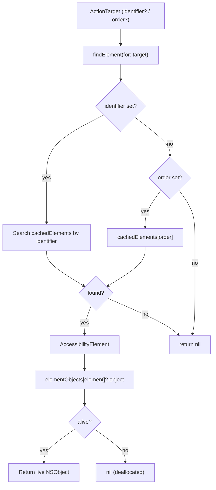
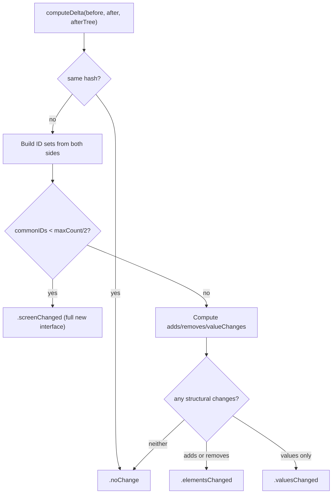
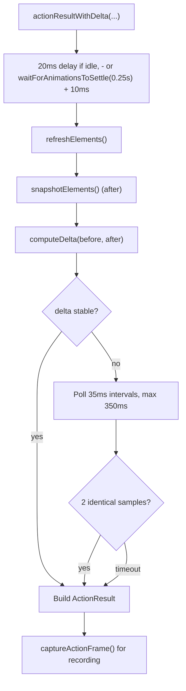

# TheBagman - The Score Handler

> **File:** `ButtonHeist/Sources/TheInsideJob/TheBagman.swift`
> **Platform:** iOS 17.0+ (UIKit, DEBUG builds only)
> **Role:** Owns element cache, hierarchy parsing, delta computation, animation detection, and screen capture

## Responsibilities

TheBagman handles all the goods during TheInsideJob:

1. **Element cache** - maintains `cachedElements: [AccessibilityElement]` from the last hierarchy refresh
2. **Weak object references** - maps elements to live `NSObject` instances via `elementObjects` dictionary
3. **Hierarchy parsing** - drives `AccessibilityHierarchyParser` to traverse the accessibility tree
4. **Element resolution** - finds elements by `identifier` or `order` for TheSafecracker
5. **Delta computation** - compares before/after element snapshots to produce `InterfaceDelta`
6. **Animation detection** - walks `CALayer` trees for active animation keys
7. **Screen capture** - renders traversable windows via `UIGraphicsImageRenderer`
8. **Action result assembly** - orchestrates post-action delays, diffs, stability checks, and frame capture

## Architecture Diagram

```mermaid
graph TD
    subgraph TheBagman["TheBagman (@MainActor, internal)"]
        Cache["cachedElements: [AccessibilityElement]"]
        WeakRefs["elementObjects: [AccessibilityElement: WeakObject]"]
        Parser["AccessibilityHierarchyParser"]
        Hash["lastHierarchyHash: Int"]

        subgraph Refresh["Refresh"]
            RefreshData["refreshAccessibilityData()"]
            GetWindows["getTraversableWindows()"]
            ClearCache["clearCache()"]
        end

        subgraph ElementAccess["Element Access"]
            FindElement["findElement(for: ActionTarget)"]
            ResolveIndex["resolveTraversalIndex(for:)"]
            ResolvePoint["resolvePoint(from:pointX:pointY:)"]
            ObjectAt["object(at: Int)"]
            Activate["activate(elementAt:)"]
            Increment["increment(elementAt:)"]
            Decrement["decrement(elementAt:)"]
            CustomAction["performCustomAction(named:elementAt:)"]
        end

        subgraph Conversion["Element Conversion"]
            Snapshot["snapshotElements() → [HeistElement]"]
            Convert["convertElement() → HeistElement"]
            ConvertTree["convertHierarchyNode() → ElementNode"]
        end

        subgraph Delta["Delta Computation"]
            ComputeDelta["computeDelta(before:after:afterTree:)"]
        end

        subgraph Animation["Animation Detection"]
            HasAnim["hasActiveAnimations() → Bool"]
            WaitSettle["waitForAnimationsToSettle(timeout:)"]
        end

        subgraph Screen["Screen Capture"]
            CaptureScreen["captureScreen() → (UIImage, CGRect)?"]
            CaptureRecording["captureScreenForRecording() → UIImage?"]
        end

        subgraph ActionResult["Action Result Assembly"]
            ResultDelta["actionResultWithDelta(success:method:...)"]
        end
    end

    TheInsideJob["TheInsideJob"] --> TheBagman
    TheSafecracker["TheSafecracker"] -.->|weak var bagman| TheBagman
    TheStakeout["TheStakeout"] -.->|captureActionFrame()| TheBagman
```

## Element Resolution Flow



## Delta Computation



## Action Result Assembly



## Screen Capture

Two capture modes:
- **`captureScreen()`** — renders traversable windows bottom-to-top, **excludes** `FingerprintWindow` (clean screenshots)
- **`captureScreenForRecording()`** — renders **all** windows including `FingerprintWindow` (interaction indicators visible in recordings)

Both use `UIGraphicsImageRenderer` with `drawHierarchy(in:afterScreenUpdates:)`.

## Window Filtering

`getTraversableWindows()` returns windows from the foreground active scene, filtered:
- Excludes `FingerprintWindow` instances
- Excludes hidden windows
- Excludes zero-size windows
- Sorted by `windowLevel` descending

## Items Flagged for Review

### MEDIUM PRIORITY

**No unit tests for TheBagman**
- Delta computation is pure data transformation — testable without UIKit dependency
- Element resolution and conversion logic could also be unit tested
- Currently untested

**Animation detection filters `_UIParallaxMotionEffect` keys**
- Active animation keys matching this prefix are ignored
- If Apple adds other system animation prefixes, they won't be filtered

### LOW PRIORITY

**Weak object references can go stale**
- `elementObjects` holds `weak` references to live `NSObject` instances
- Between refresh and use, an object may be deallocated
- This is handled gracefully (returns nil) but worth knowing
