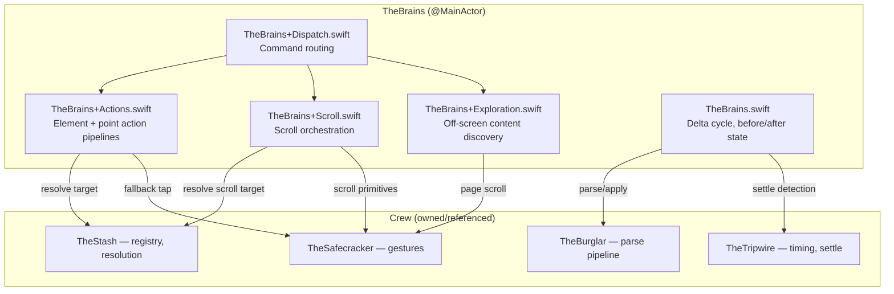
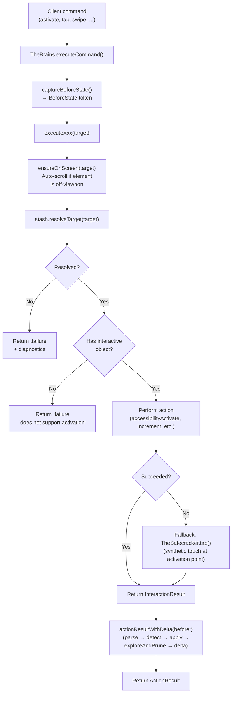
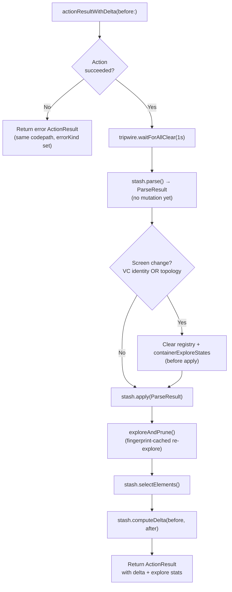

# TheBrains - The Mastermind

> **Files:** `TheBrains.swift`, `TheBrains+Actions.swift`, `TheBrains+Scroll.swift`, `TheBrains+Exploration.swift`, `TheBrains+Dispatch.swift`
> **Platform:** iOS 17.0+ (UIKit, DEBUG builds only)
> **Role:** Plans the play, sequences the crew — action execution, scroll orchestration, exploration, delta cycle

## Responsibilities

TheBrains takes a command and works it through to a result:

1. **Command dispatch** — `executeCommand(_:)` routes `ClientMessage` to the appropriate handler: accessibility actions, touch gestures, text/scroll/search, or explore.
2. **Action execution pipelines** — Two generic pipelines: `performElementAction` (element-targeted: ensureOnScreen → resolve → check interactivity → perform action) and `performPointAction` (coordinate-targeted gestures). Each `executeXxx` method is a thin closure that feeds the pipeline.
3. **Scroll orchestration** — `executeScroll`, `executeScrollToEdge`, `executeScrollToVisible` (one-shot jump to known position), `executeElementSearch` (iterative page-by-page search for unseen elements). See [14a-SCROLLING.md](14a-SCROLLING.md).
4. **Screen exploration** — `exploreAndPrune()` scrolls every scrollable container to discover all elements, using `containerExploreStates` fingerprint caching to skip unchanged containers. Prunes elements no longer seen after a full explore cycle.
5. **Delta cycle** — `captureBeforeState()` captures a `BeforeState` token; after the action, `actionResultWithDelta(before:)` settles via TheTripwire, parses via TheStash, detects screen changes, applies, explores, and computes the delta through a single codepath for both success and failure.
6. **Refresh convenience** — `refresh()` delegates to `stash.refresh()` and accumulates heistIds into `exploreCycleIds`. TheBurglar is TheStash's private implementation detail — TheBrains never references it.
7. **Wait handlers** — `executeWaitForIdle(timeout:)` and `executeWaitForChange(timeout:expectation:)` live here because they're accessibility-level work: refresh, settle, delta, expectation evaluation. The wait-for-change handler has a fast path (tree already changed) and slow path (poll loop).
8. **Response state tracking** — `SentState` struct (treeHash, beforeState, screenId) tracks the last response sent to the driver. `recordSentState()` snapshots current state; `computeBackgroundDelta()` reads it. TheGetaway calls `recordSentState()` after every send.
9. **TheGetaway-facing methods** — `currentInterface()`, `broadcastInterfaceIfChanged()`, `computeBackgroundDelta()`, `captureScreen()`, `captureScreenForRecording()`, `screenName`, `screenId`, `stakeout`. Purpose-built methods so TheGetaway and TheInsideJob never reach through to TheStash.

## Architecture

## Action Execution Pipeline

## Post-Action Delta Flow

## Instance State

| Store | Lifetime | Purpose |
|-------|----------|---------|
| `containerExploreStates` | Screen | Cached fingerprint + heistIds per scrollable container |
| `exploreCycleIds` | Explore cycle | Accumulates heistIds during `exploreAndPrune()`, nil outside |

## Ownership Model

- **Owns** TheStash, TheSafecracker (created in `init`)
- **References** TheTripwire (injected via `init(tripwire:)`)
- **Owned by** TheInsideJob (`let brains: TheBrains`)
- **Does not reference** TheBurglar — parse/apply goes through TheStash's facade methods

## File Organization

| File | Responsibility |
|------|----------------|
| `TheBrains.swift` | Core: BeforeState, actionResultWithDelta, refresh, clearCache |
| `TheBrains+Actions.swift` | Unified element/point action pipelines, all executeXxx methods |
| `TheBrains+Scroll.swift` | Scroll orchestration, scroll-to-visible (one-shot), element-search (iterative), ensure-on-screen |
| `TheBrains+Exploration.swift` | Off-screen content discovery, container fingerprint caching |
| `TheBrains+Dispatch.swift` | Command routing: accessibility actions, touch gestures, text/scroll/search, explore |

## Dependencies

- **TheStash** (owned) — element registry, target resolution, wire conversion, parse pipeline (TheBurglar is TheStash's private detail)
- **TheSafecracker** (owned) — raw gesture synthesis (fallback tap, scroll primitives, text entry, edit actions)
- **TheTripwire** (injected) — settle detection, VC identity, window access
