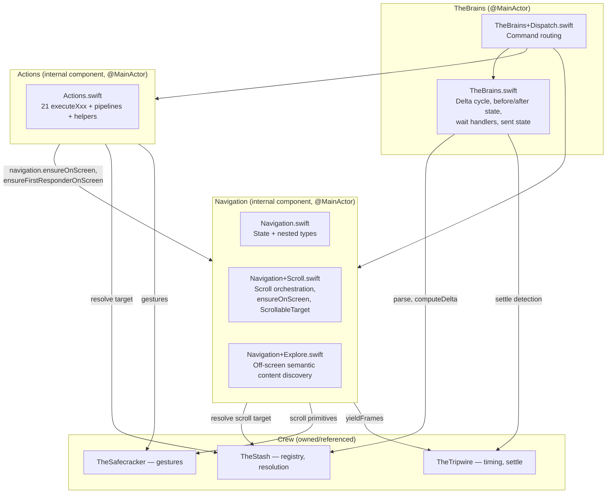
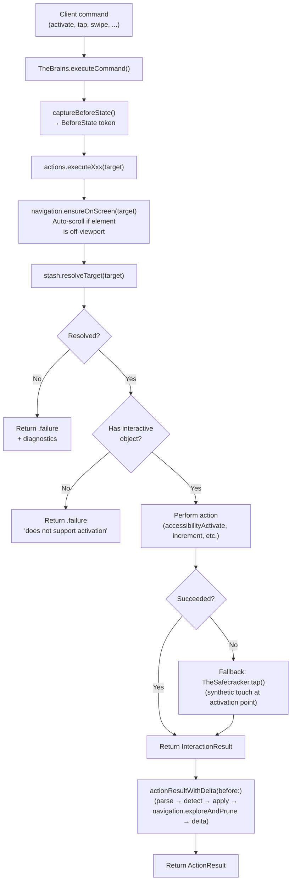
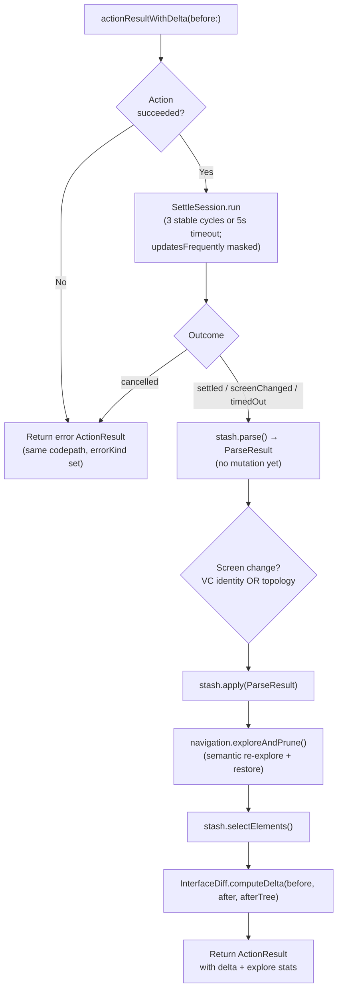

# TheBrains - The Mastermind

> **Files:** `TheBrains.swift`, `TheBrains+Dispatch.swift`, `Navigation.swift`, `Navigation+Scroll.swift`, `Navigation+Explore.swift`, `Actions.swift`, `ActionResultBuilder.swift`, `SettleSession.swift`, `ActivateFailureDiagnostic.swift`
> **Platform:** iOS 17.0+ (UIKit, DEBUG builds only)
> **Role:** Plans the play, sequences the crew — orchestrates command dispatch, scroll/explore via Navigation, action execution via Actions, and the post-action delta cycle

## Shape

TheBrains is an orchestrator class with two internal components:

- **`Navigation`** — scroll and exploration engine. Owns `ScrollableTarget`, `SettleSwipeLoopState`, `ScreenManifest`, and `lastSwipeDirectionByTarget`. Drives TheSafecracker's scroll primitives.
- **`Actions`** — the 21 `executeXxx` action handlers, plus `performElementAction` / `performPointAction` generic pipelines and duration helpers.

`Navigation` and `Actions` are *internal components of TheBrains*, not crew members in their own right — neutral noun-style names. Both are owned by TheBrains (`let navigation: Navigation`, `let actions: Actions`) and share the same TheStash / TheSafecracker / TheTripwire references. Actions holds a reference to Navigation because targeted element/point flows use `ensureOnScreen(for:)`, while edit, pasteboard, and resign-first-responder commands use `ensureFirstResponderOnScreen()`.

TheBrains itself keeps the post-action delta cycle (`captureBeforeState`, `actionResultWithDelta`), command dispatch (`executeCommand`), wait handlers (`executeWaitForIdle`, `executeWaitForChange`), response state (`SentState`, `recordSentState`, `computeBackgroundDelta`), and screen-capture passthroughs.

## Responsibilities

1. **Command dispatch (`TheBrains+Dispatch.swift`)** — `executeCommand(_:)` routes `ClientMessage` to the appropriate handler: accessibility actions, touch gestures, text/scroll/search, or explore. Switch closures call `actions.executeXxx(...)` or `navigation.executeScroll(...)` etc.
2. **Action execution (`Actions.swift`)** — Two generic pipelines: `performElementAction` (element-targeted: navigation.ensureOnScreen → resolve → check interactivity → perform action) and `performPointAction` (coordinate-targeted gestures). Most `executeXxx` methods are thin wrappers over these pipelines; `executeSwipe` and `executeTypeText` are specialized multi-step flows.
3. **Scroll orchestration (`Navigation+Scroll.swift`)** — `executeScroll`, `executeScrollToEdge`, `executeScrollToVisible` (one-shot jump to known position), `executeElementSearch` (iterative page-by-page search for unseen elements). See [14a-SCROLLING.md](14a-SCROLLING.md).
4. **Screen exploration (`Navigation+Explore.swift`)** — `exploreAndPrune()` scrolls reachable scrollable containers to discover semantic content and restores their visual position. The exploration accumulator is a local `var union: Screen`; the final union is committed by writing it back into `stash.currentScreen`. Targeted exploration may stop early once the target resolves.
5. **Delta cycle (`TheBrains.swift`)** — `captureBeforeState()` captures a `BeforeState` token; after the action, `actionResultWithDelta(before:)` short-circuits failure responses from the before snapshot, and on success runs the multi-cycle settle, parses via TheStash, detects screen changes, applies, asks Navigation to explore, and computes the delta. When a screen change is detected but the post-change parse stays empty after 10 repop attempts, `settled: false` is reported so the wire reflects an unhealthy snapshot rather than a confident one.
6. **Post-action settle and transient capture (`SettleSession.swift`)** — `SettleSession` (owned and instantiated per call) drives a closure-based polling loop against TheStash and TheTripwire. It returns `.settled` after `cyclesRequired` consecutive identical AX-tree fingerprints, `.screenChanged` if topVC changes mid-loop, `.cancelled` if the surrounding task is cancelled, or `.timedOut` after the hard deadline. Elements observed mid-loop but absent from baseline ∪ final are returned as `InterfaceDelta.transient` via `SettleSession.transientElements`. Spinners (`UIAccessibilityTraits.updatesFrequently`) are masked out of both the fingerprint and `TimelineKey`.
7. **Refresh convenience** — `refresh()` delegates to `stash.refresh()`. TheBurglar is TheStash's private implementation detail — TheBrains never references it.
8. **Wait handlers (`TheBrains.swift`)** — `executeWaitForIdle(timeout:)` and `executeWaitForChange(timeout:expectation:)`.
9. **Response state tracking (`TheBrains.swift`)** — `SentState`, `recordSentState`, `computeBackgroundDelta`, `screenChangedSinceLastSent`, `lastSentScreenId`.
10. **TheGetaway-facing methods** — `currentInterface()`, `broadcastInterfaceIfChanged()`, `computeBackgroundDelta()`, `captureScreen()`, `captureScreenForRecording()`, `screenName`, `screenId`, `stakeout`.

## Architecture

## Action Execution Pipeline

## Post-Action Delta Flow

## Instance State

| Store | Lives on | Lifetime | Purpose |
|-------|----------|----------|---------|
| `lastSwipeDirectionByTarget` | Navigation | Across swipes | Last direction per swipeable target key (drives direction-change settle profile) |
| `lastSentState` | TheBrains | Between responses | Snapshot (semantic treeHash, viewportHash, beforeState, screenId) of the last reply sent to the driver, used by `computeBackgroundDelta` and the wait-for-change fast path |

## Ownership Model

- **Owns** TheStash, TheSafecracker, Navigation, Actions (all created in `init`)
- **References** TheTripwire (injected via `init(tripwire:)`)
- **Owned by** TheInsideJob (`let brains: TheBrains`)
- **Does not reference** TheBurglar — parse/apply goes through TheStash's facade methods

## File Organization

| File | Responsibility |
|------|----------------|
| `TheBrains.swift` | Orchestrator class: BeforeState, SentState, actionResultWithDelta, refresh, wait handlers, clearCache, navigation + actions ownership, typealiases + forwarders for test compatibility |
| `TheBrains+Dispatch.swift` | Command routing: dispatches to `actions.executeXxx` / `navigation.executeXxx` |
| `Navigation.swift` | Type + init + state (`lastSwipeDirectionByTarget`) + nested types (`ScrollableTarget`, `ScrollAxis`, `SettleSwipeProfile`, `SettleSwipeLoopState`, `ScreenManifest`) |
| `Navigation+Scroll.swift` | Scroll orchestration, scroll-to-visible (one-shot), element-search (iterative), ensure-on-screen, axis/direction mapping, safe swipe frame |
| `Navigation+Explore.swift` | Off-screen semantic content discovery, target-aware exploration, scroll-position restore, presentation-obscuring detection |
| `Actions.swift` | Unified element/point action pipelines, all 21 executeXxx methods, duration helpers |
| `SettleSession.swift` | Multi-cycle AX-tree settle loop with inline transient capture; `SettleOutcome`, `TimelineKey`, `SettleSession.transientElements` |
| `ActionResultBuilder.swift` | Builds `ActionResult` with compile-time separation of success/failure fields |
| `ActivateFailureDiagnostic.swift` | Fact-only diagnostic builder for failed `executeActivate` paths |

## Dependencies

- **TheStash** (owned) — element registry, target resolution, wire conversion, parse pipeline (TheBurglar is TheStash's private detail)
- **TheSafecracker** (owned) — raw gesture synthesis (fallback tap, scroll primitives, text entry, edit actions)
- **TheTripwire** (injected) — settle detection, VC identity, window access

## Acceptance Criteria

1. `navigation.exploreAndPrune()` must explore both `UIScrollView` and non-`UIScrollView` scrollable containers (via swipe fallback).
2. Unsupported commands returned by `executeCommand`/dispatch helpers must include stable command identity plus current `screenName`/`screenId` diagnostics.
3. `ScreenManifest.scrollCount` must count forward page exploration steps (not setup/restore positioning).
4. The unit test suite must cover unsupported-command diagnostics deterministically.
5. `Navigation` and `Actions` are internal components, not crew members. They live in the same directory as TheBrains and are accessed through `brains.navigation.X` and `brains.actions.X` (preferred) or through TheBrains' compatibility forwarders.
