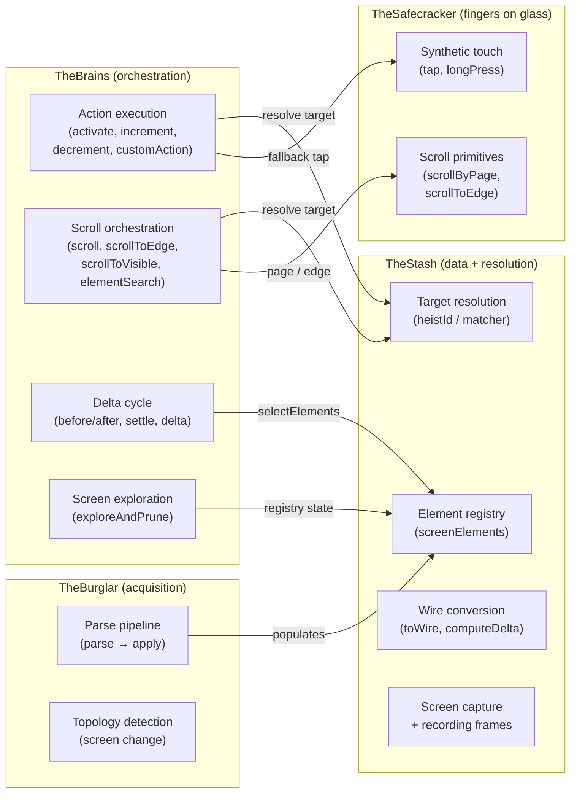
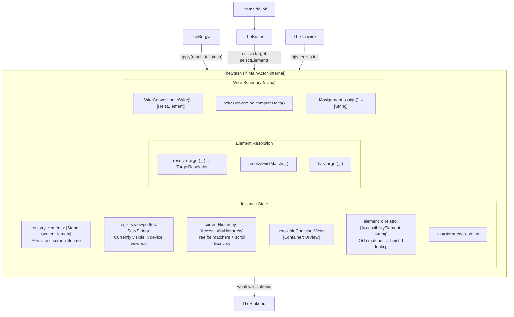
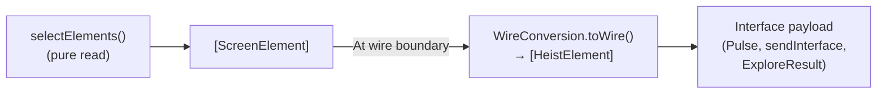
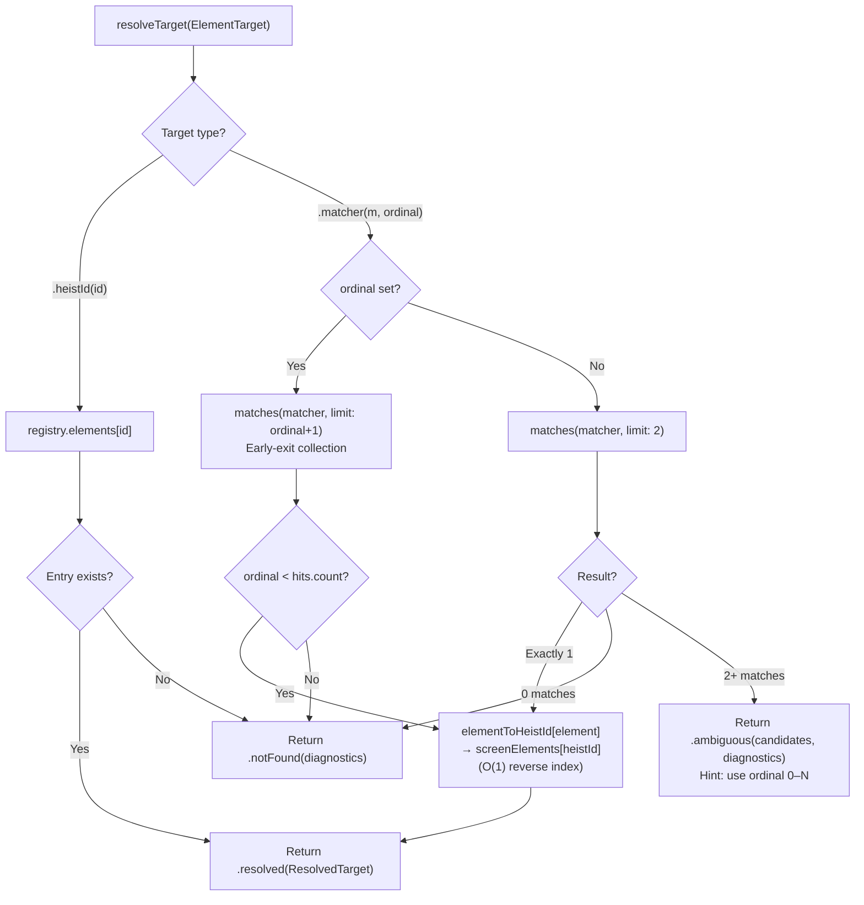

# TheStash - The Score Handler

> **Files:** `TheStash.swift`, `TheStash+Matching.swift`, `TheStash+Capture.swift`, `TheStash/WireConversion.swift`, `TheStash/IdAssignment.swift`, `TheStash/ElementRegistry.swift`, `TheStash/Diagnostics.swift`, `TheStash/Interactivity.swift`, `TheStash/ScreenManifest.swift`, `TheStash/ArrayHelpers.swift`
> **Platform:** iOS 17.0+ (UIKit, DEBUG builds only)
> **Role:** Element registry, target resolution, wire conversion, screen capture

## Responsibilities

TheStash holds the goods — pure data, no side effects:

1. **Screen-lifetime element registry** — maintains `screenElements: [String: ScreenElement]` keyed by heistId, persistent across refreshes within the same screen
2. **Target resolution** — `resolveTarget(_:)` is the single entry point: `.heistId` → O(1) dictionary lookup in `registry.elements`, `.matcher` → `uniqueMatch` tree walk + O(1) reverse index lookup via `registry.reverseIndex`. Returns `TargetResolution` enum (`.resolved(ResolvedTarget)`, `.notFound(diagnostics:)`, `.ambiguous(candidates:diagnostics:)`). See [15-UNIFIED-TARGETING.md](15-UNIFIED-TARGETING.md) for the full targeting system.
3. **Element matching** — `findMatch(_:)`, `hasMatch(_:)`, `resolveFirstMatch(_:)` search the canonical accessibility hierarchy using `ElementMatcher` predicates with AND semantics and case-insensitive substring matching.
4. **HeistId synthesis** — `IdAssignment` assigns stable, deterministic `heistId` identifiers directly from `AccessibilityElement` (developer identifier preferred, else synthesized from traits+label; value excluded for stability), with suffix disambiguation for duplicates
5. **Wire conversion at boundary** — `WireConversion.toWire()` converts `ScreenElement` → `HeistElement` only at serialization boundaries (Pulse broadcast, sendInterface, ExploreResult). All internal code operates on `AccessibilityElement`.
6. **Delta computation** — `WireConversion.computeDelta()` computes interface deltas from before/after snapshots
7. **Element actions** — thin wrappers over `accessibilityActivate()`, `accessibilityIncrement()`, `accessibilityDecrement()`, `accessibilityCustomActions` on the live UIKit object
8. **Screen capture** — renders traversable windows via `UIGraphicsImageRenderer` (TheStash+Capture.swift)
9. **Resolution diagnostics** — near-miss suggestions, similar heistId hints, compact element summaries (`Diagnostics`)

**Not TheStash's job** (moved to other crew members):
- Parse pipeline (hierarchy parsing, element context building) → [TheBurglar](13a-THEBURGLAR.md)
- Action execution pipelines, scroll orchestration, delta cycle, explore → [TheBrains](13b-THEBRAINS.md)

## Custody Contract

TheStash is the custodian of the live accessibility/UI object world.

- **Exclusive ownership of live object references** — if a subsystem needs to get from a parsed element back to a live `NSObject`, it goes through TheStash
- **Weak references only** — live objects are stored in `ScreenElement.object` and `ScreenElement.scrollView` as `weak` references; TheStash never prolongs the lifetime of app UI objects
- **No exported live handles** — other subsystems work through TheStash APIs that return values, frames, points, or perform actions on their behalf
- **Parser boundary** — TheBurglar owns `AccessibilityHierarchyParser` usage and populates TheStash via `apply()`
- **Fail closed on staleness** — if the weak object is gone, TheStash treats it as stale state and re-resolves from a fresh parse instead of pretending the handle is still valid

## Crew Responsibility Boundaries



## Architecture Diagram



## Data Flow: Snapshot → Wire



## Element Target Resolution

Two resolution strategies: O(1) dictionary lookup for heistIds, predicate search + O(1) reverse index for matchers.



## ScreenElement Structure

```swift
struct ScreenElement {
    let heistId: String
    let contentSpaceOrigin: CGPoint?    // position within scroll container (frozen at creation)
    var element: AccessibilityElement   // updated each refresh when visible
    weak var object: NSObject?          // live UIKit object for actions
    weak var scrollView: UIScrollView?  // parent scroll view (outlives children)
}
```

**5 fields, clear separation:**
- `heistId` and `contentSpaceOrigin` are **immutable identity** — set once when the element is first discovered
- `element`, `object`, `scrollView` are **mutable live state** — updated each refresh when the element is visible

**Lifetime rules:**
- UIKit guarantees the scroll view outlives its children, so if `object != nil` then `scrollView != nil` (when originally set)
- If `object == nil` but `scrollView != nil`, the element was deallocated (cell reuse) but the scroll view is still alive — you can still scroll to its content-space position
- Any element in `registry.elements` is resolvable by heistId

## Instance State Inventory

| Store | Lifetime | Purpose |
|-------|----------|---------|
| `currentHierarchy` | Refresh | Tree for matcher resolution + scroll target discovery |
| `scrollableContainerViews` | Refresh | Container → UIView for scroll operations |
| `registry.elements` | Screen | The registry — all resolution paths read from here |
| `registry.viewportIds` | Refresh | HeistIds visible in the device viewport |
| `registry.reverseIndex` | Refresh | O(1) reverse index: AccessibilityElement → heistId |
| `lastHierarchyHash` | Screen | Pulse polling dedup memo |
| `lastScreenName` | Screen | First header element label, computed once in `apply()` |
| `lastScreenId` | Screen | Slugified `lastScreenName` (e.g. "controls_demo"), computed alongside it |

**Data flows down through two tiers:**
- **Tier 1 (tree)**: `currentHierarchy`, `scrollableContainerViews` — volatile, rebuilt each refresh
- **Tier 2 (registry)**: `registry.elements`, `registry.viewportIds`, `registry.reverseIndex` — persistent, upserted

No store writes to another store. No circular dependencies.

## File Organization

| File | Responsibility |
|------|----------------|
| `TheStash.swift` | Core: registry state, resolution, element actions, point/frame resolution, element selection |
| `TheStash+Matching.swift` | Element matching against ElementMatcher predicates |
| `TheStash+Capture.swift` | Screen capture (clean + recording overlay) |
| `TheStash/WireConversion.swift` | Caseless enum with static methods: toWire(), delta computation, tree conversion |
| `TheStash/IdAssignment.swift` | Caseless enum with static methods: deterministic heistId synthesis from traits/labels |
| `TheStash/ElementRegistry.swift` | Element registry storage: elements, viewportIds, reverseIndex |
| `TheStash/Diagnostics.swift` | Caseless enum with static methods: resolution error formatting |
| `TheStash/Interactivity.swift` | Interactivity predicates (shared by WireConversion and ActionExecution) |
| `TheStash/ScreenManifest.swift` | Container exploration bookkeeping |
| `TheStash/ArrayHelpers.swift` | [HeistElement] screen name/id helpers |

## Dependencies

- **TheTripwire** (injected via `init(tripwire:)`) — provides window access for screen capture
- **TheBurglar** (created in `init`) — populates the registry via `apply()`
- **TheStakeout** (`weak var stakeout: TheStakeout?`) — TheStash calls `stakeout?.captureActionFrame()` for recording frame capture

## Architectural Rule

TheStash is pure data — it holds elements, resolves targets, and converts to wire format. It does not orchestrate actions, drive scrolling, or manage the delta cycle. Those responsibilities belong to TheBrains, which coordinates TheStash, TheBurglar, TheSafecracker, and TheTripwire. Wire conversion and ID assignment are static methods on caseless enums (`TheStash.WireConversion`, `TheStash.IdAssignment`) — call them directly, not through instance forwarding.
