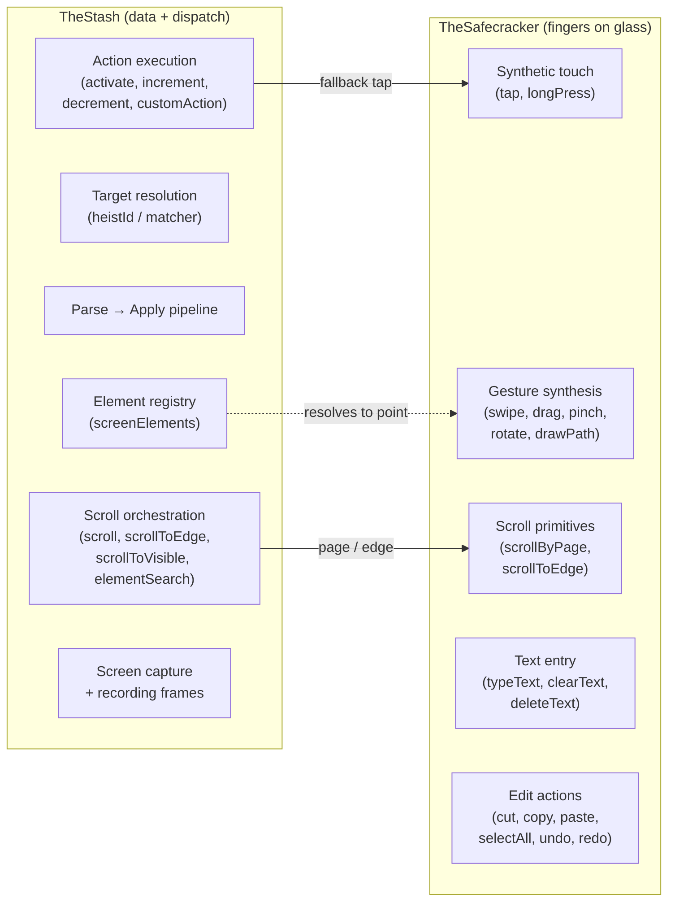
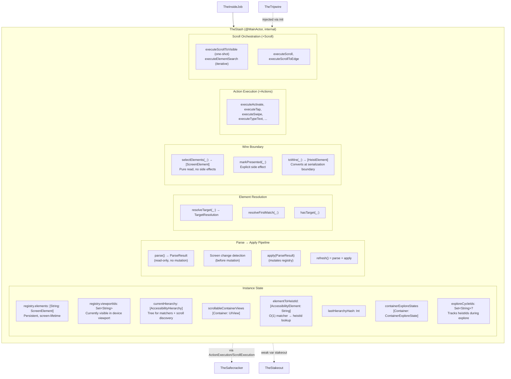
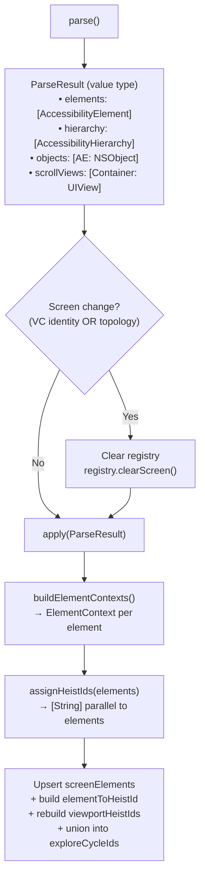
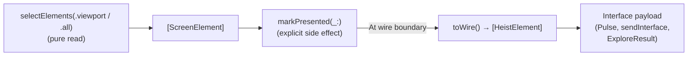
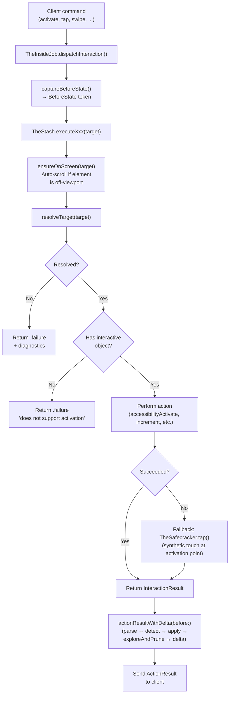
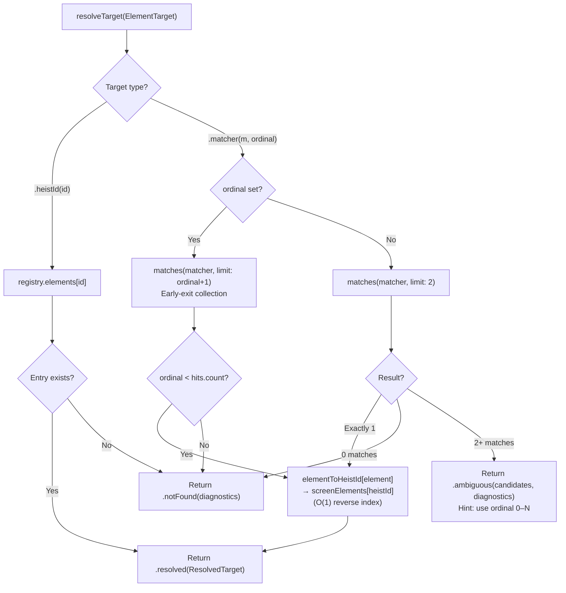
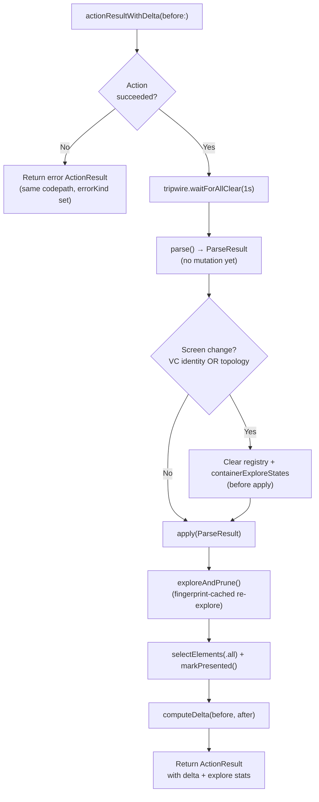

# TheStash - The Score Handler

> **Files:** `TheStash.swift`, `TheStash+Matching.swift`, `TheStash+Capture.swift`, `TheStash/ActionExecution.swift`, `TheStash/ScrollExecution.swift`, `TheStash/ScreenExploration.swift`, `TheStash/WireConversion.swift`, `TheStash/IdAssignment.swift`, `TheStash/ElementRegistry.swift`, `TheStash/Diagnostics.swift`, `TheStash/Interactivity.swift`, `TheStash/ScreenManifest.swift`, `TheStash/ArrayHelpers.swift`
> **Platform:** iOS 17.0+ (UIKit, DEBUG builds only)
> **Role:** Owns element registry, hierarchy parsing, target resolution, action execution, scroll orchestration, delta computation, and screen capture

## Responsibilities

TheStash handles all the goods during TheInsideJob:

1. **Screen-lifetime element registry** — maintains `screenElements: [String: ScreenElement]` keyed by heistId, persistent across refreshes within the same screen
2. **Parse/apply pipeline** — `parse()` reads the live accessibility tree into an immutable `ParseResult` value; `apply()` mutates the registry. Screen change detection happens between these two steps — no mixed old/new state.
3. **Hierarchy parsing** — drives `AccessibilityHierarchyParser` with `elementVisitor` + `containerVisitor` closures to capture element objects and scroll view refs
4. **Target resolution** — `resolveTarget(_:)` is the single entry point: `.heistId` → O(1) dictionary lookup in `registry.elements`, `.matcher` → `uniqueMatch` tree walk + O(1) reverse index lookup via `registry.reverseIndex`. Returns `TargetResolution` enum (`.resolved(ResolvedTarget)`, `.notFound(diagnostics:)`, `.ambiguous(candidates:diagnostics:)`). See [15-UNIFIED-TARGETING.md](15-UNIFIED-TARGETING.md) for the full targeting system.
5. **Action execution** — Two generic pipelines (`performElementAction` for element-targeted actions, `performPointAction` for coordinate-targeted gestures) handle resolution, interactivity checking, and error reporting. Each `executeXxx` method is a thin closure that feeds the pipeline. TheStash resolves the target, checks interactivity, performs the action, and falls back to TheSafecracker for synthetic touch when accessibility activation fails.
6. **Scroll orchestration** — `executeScroll`, `executeScrollToEdge`, `executeScrollToVisible` (one-shot jump to known position), `executeElementSearch` (iterative page-by-page search for unseen elements). `scroll` and `scrollToEdge` use `resolveScrollTarget` to get the element's stored `screenElement.scrollView` from the accessibility hierarchy. See [04a-SCROLLING.md](04a-SCROLLING.md).
7. **Element matching** — `findMatch(_:)`, `hasMatch(_:)`, `resolveFirstMatch(_:)` search the canonical accessibility hierarchy using `ElementMatcher` predicates with AND semantics and case-insensitive substring matching.
8. **HeistId synthesis** — assigns stable, deterministic `heistId` identifiers directly from `AccessibilityElement` (developer identifier preferred, else synthesized from traits+label; value excluded for stability), with suffix disambiguation for duplicates
9. **Topology-based screen change detection** — detects navigation changes that reuse the same VC by checking back button trait (private `0x8000000`) appearance/disappearance and header label disjointness (`isTopologyChanged`)
10. **Wire conversion at boundary** — `toWire()` converts `ScreenElement` → `HeistElement` only at serialization boundaries (Pulse broadcast, sendInterface, ExploreResult). All internal code operates on `AccessibilityElement`.
11. **Delta computation** — `captureBeforeState()` captures a `BeforeState` token (snapshot + viewport elements + VC identity); after the action, `actionResultWithDelta(before:)` computes the delta through a single codepath for both success and failure. Includes post-action `exploreAndPrune()` so deltas capture off-screen changes.
12. **Container fingerprint caching** — `ContainerExploreState` caches each scrollable container's visible subtree fingerprint, accumulated fingerprint, and discovered heistIds. On re-explore, unchanged containers are skipped via O(1) fingerprint comparison.
13. **Screen capture** — renders traversable windows via `UIGraphicsImageRenderer` (TheStash+Capture.swift)
14. **Resolution diagnostics** — near-miss suggestions, similar heistId hints, compact element summaries (TheStash+Diagnostics.swift)

## Custody Contract

TheStash is the custodian of the live accessibility/UI object world.

- **Exclusive ownership of live object references** — if a subsystem needs to get from a parsed element back to a live `NSObject`, it goes through TheStash
- **Weak references only** — live objects are stored in `ScreenElement.object` and `ScreenElement.scrollView` as `weak` references; TheStash never prolongs the lifetime of app UI objects
- **No exported live handles** — other subsystems should work through Bagman APIs that return values, frames, points, or perform actions on their behalf
- **Parser boundary** — `AccessibilityHierarchyParser` usage belongs to TheStash; TheTripwire handles timing/window observation, and TheSafecracker handles raw gesture synthesis
- **Fail closed on staleness** — if the weak object is gone, TheStash treats it as stale state and re-resolves from a fresh parse instead of pretending the handle is still valid

## Crew Responsibility Boundaries



## Architecture Diagram



## Data Flow: Parse → Apply



## Data Flow: Snapshot → Wire



## Action Execution Pipeline

All interactions follow the same pipeline: TheStash resolves the target, executes the action (with optional fallback to TheSafecracker for synthetic touch), then produces a delta.



## Element Target Resolution

Two resolution strategies: O(1) dictionary lookup for heistIds, predicate search + O(1) reverse index for matchers.



## Post-Action Delta Flow

Screen change detection happens *before* registry mutation — parse returns an immutable value, topology is compared against the old state, then the registry is cleared (if changed) and the new state applied.



## ScreenElement Structure

```swift
struct ScreenElement {
    let heistId: String
    let contentSpaceOrigin: CGPoint?    // position within scroll container (frozen at creation)
    var element: AccessibilityElement   // updated each refresh when visible
    weak var object: NSObject?          // live UIKit object for actions
    weak var scrollView: UIScrollView?  // parent scroll view (outlives children)
}
```

**5 fields, clear separation:**
- `heistId` and `contentSpaceOrigin` are **immutable identity** — set once when the element is first discovered
- `element`, `object`, `scrollView` are **mutable live state** — updated each refresh when the element is visible

**Lifetime rules:**
- UIKit guarantees the scroll view outlives its children, so if `object != nil` then `scrollView != nil` (when originally set)
- If `object == nil` but `scrollView != nil`, the element was deallocated (cell reuse) but the scroll view is still alive — you can still scroll to its content-space position
- Any element in `registry.elements` is resolvable by heistId — the former `presentedHeistIds` gate has been removed

## Instance State Inventory

| Store | Lifetime | Purpose |
|-------|----------|---------|
| `currentHierarchy` | Refresh | Tree for matcher resolution + scroll target discovery |
| `scrollableContainerViews` | Refresh | Container → UIView for scroll operations |
| `registry.elements` | Screen | The registry — all resolution paths read from here |
| `registry.viewportIds` | Refresh | HeistIds visible in the device viewport |
| `registry.reverseIndex` | Refresh | O(1) reverse index: AccessibilityElement → heistId |
| `lastHierarchyHash` | Screen | Pulse polling dedup memo |
| `lastScreenName` | Screen | First header element label, computed once in `apply()` |
| `lastScreenId` | Screen | Slugified `lastScreenName` (e.g. "controls_demo"), computed alongside it |
| `containerExploreStates` | Screen | Cached fingerprint + heistIds per scrollable container |
| `exploreCycleIds` | Explore cycle | Accumulates heistIds during `exploreAndPrune()`, nil outside |

**Data flows down through two tiers:**
- **Tier 1 (tree)**: `currentHierarchy`, `scrollableContainerViews` — volatile, rebuilt each refresh
- **Tier 2 (registry)**: `registry.elements`, `registry.viewportIds`, `registry.reverseIndex` — persistent, upserted

No store writes to another store. No circular dependencies.

## File Organization

| File | Lines | Responsibility |
|------|-------|----------------|
| `TheStash.swift` | ~800 | Core: ParseResult, parse/apply pipeline, resolution, topology, action result assembly, forwarding accessors |
| `TheStash+Matching.swift` | ~200 | Element matching against ElementMatcher predicates |
| `TheStash+Capture.swift` | ~55 | Screen capture (clean + recording overlay) |
| `TheStash/ActionExecution.swift` | ~420 | Unified pipelines (`performElementAction`, `performPointAction`) + all `executeXxx` methods |
| `TheStash/ScrollExecution.swift` | ~500 | Scroll orchestration, scroll-to-visible (one-shot), element-search (iterative), ensure-on-screen, direction mapping |
| `TheStash/ScreenExploration.swift` | ~170 | Off-screen content discovery; drives scroll-to-explore cycle |
| `TheStash/WireConversion.swift` | ~215 | Caseless enum with static methods: toWire(), delta computation, tree conversion |
| `TheStash/IdAssignment.swift` | ~100 | Caseless enum with static methods: deterministic heistId synthesis from traits/labels |
| `TheStash/ElementRegistry.swift` | ~95 | Element registry storage: elements, viewportIds, reverseIndex |
| `TheStash/Diagnostics.swift` | ~50 | Caseless enum with static methods: resolution error formatting |
| `TheStash/Interactivity.swift` | ~50 | Interactivity predicates (shared by WireConversion and ActionExecution) |
| `TheStash/ScreenManifest.swift` | ~65 | Container exploration bookkeeping |
| `TheStash/ArrayHelpers.swift` | ~45 | [HeistElement] screen name/id helpers |

## Dependencies

- **TheTripwire** (injected via `init(tripwire:)`) — provides window access, timing coordination (`allClear`, `waitForAllClear`), VC identity-based screen change detection, and first responder lookup
- **TheSafecracker** (via ActionExecution and ScrollExecution extensions) — TheStash delegates to TheSafecracker for raw gesture synthesis (fallback tap, scroll primitives, text entry, edit actions)
- **TheStakeout** (`weak var stakeout: TheStakeout?`) — TheStash calls `stakeout?.captureActionFrame()` during action result assembly for recording frame capture
- **AccessibilityHierarchyParser** (from AccessibilitySnapshot submodule) — traverses the accessibility tree with `elementVisitor` and `containerVisitor` closures

## Architectural Rule

If code needs to parse the accessibility hierarchy, hold onto a live accessibility-backed `NSObject`, resolve an element target, or execute an accessibility action, that responsibility belongs to TheStash. TheSafecracker is exclusively "fingers on glass" — it provides raw gesture primitives but never resolves targets or owns element state. Wire types (`HeistElement`) are produced by `toWire()` only at serialization boundaries — all internal code operates on `AccessibilityElement`.
