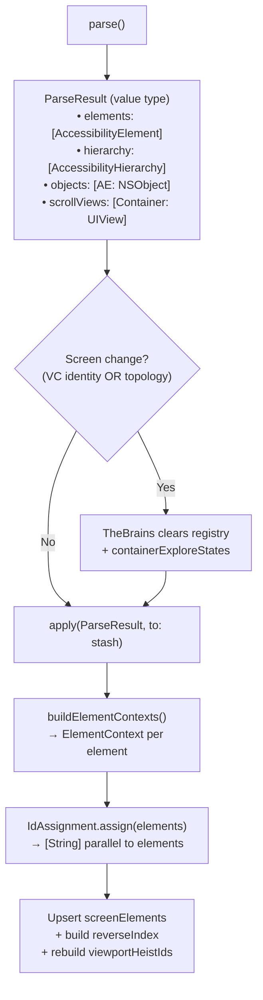

# TheBurglar - The Acquisition Specialist

> **File:** `TheBurglar.swift`
> **Platform:** iOS 17.0+ (UIKit, DEBUG builds only)
> **Role:** Reads the live accessibility tree and populates TheStash's registry

## Responsibilities

TheBurglar breaks in and takes what he finds:

1. **Parse pipeline** — `parse()` reads the live accessibility tree into an immutable `ParseResult` value type via `AccessibilityHierarchyParser` with `elementVisitor` + `containerVisitor` closures. No mutation, no side effects.
2. **Apply pipeline** — `apply(_:to:)` mutates TheStash's registry: sets `currentHierarchy`, `scrollableContainerViews`, upserts `registry.elements`, rebuilds `registry.viewportIds`, detects first responder, caches screen name. Returns assigned heistIds for explore cycle tracking.
3. **Refresh convenience** — `refresh(into:)` = parse + apply in one step.
4. **Topology-based screen change detection** — `isTopologyChanged(before:after:)` detects navigation changes by checking back button trait (private `0x8000000`) appearance/disappearance and header label disjointness.
5. **Search bar reveal** — temporarily unhides `UISearchController` bars hidden by `hidesSearchBarWhenScrolling` during parsing, restoring them afterward.

## Architecture

## Ownership Model

- TheBurglar is **created and owned by TheStash** (via `init`)
- TheBurglar **writes to TheStash** — it's the only code that calls `registry.apply()` and sets `currentHierarchy`/`scrollableContainerViews`
- TheBrains calls `stash.burglar.refresh(into: stash)` or `stash.burglar.parse()` + `stash.burglar.apply()` separately when it needs to inspect parse results before applying (e.g., for topology comparison in the delta cycle)
- TheBurglar has **no mutable instance state** — the parser is its only stored property

## Dependencies

- **TheTripwire** (injected via `init(tripwire:)`) — provides `getTraversableWindows()` for the parse root
- **AccessibilityHierarchyParser** (from AccessibilitySnapshot submodule) — traverses the accessibility tree
- **TheStash.IdAssignment** — assigns heistIds to parsed elements
- **TheStash.ElementRegistry** — the target of `apply()`
