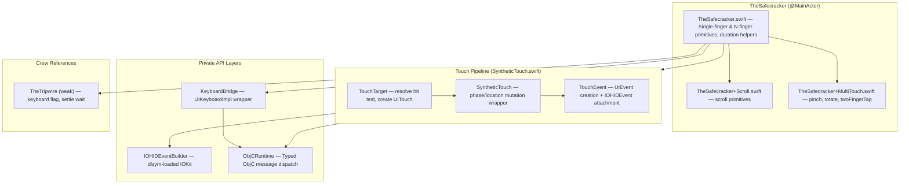
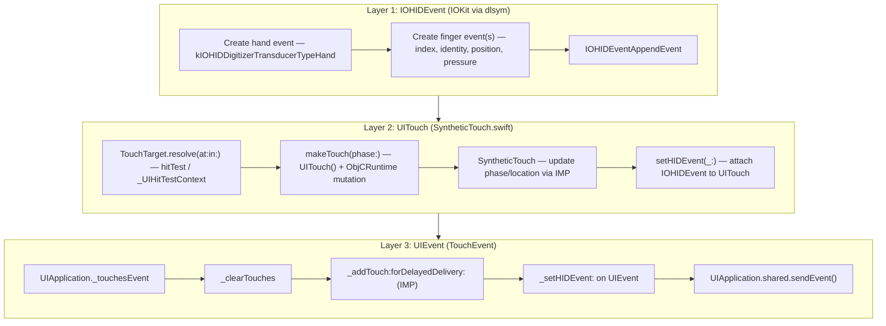
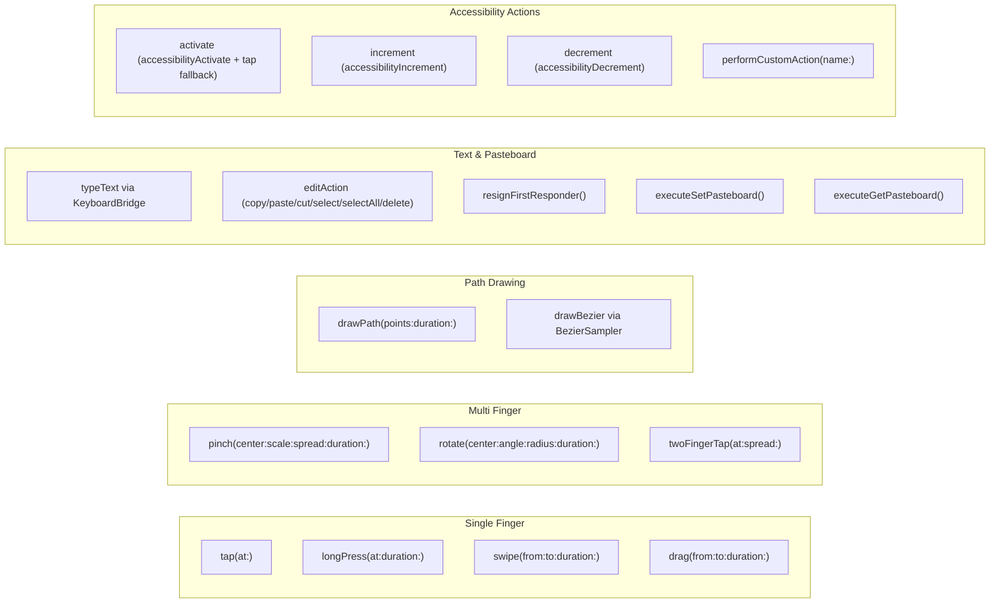
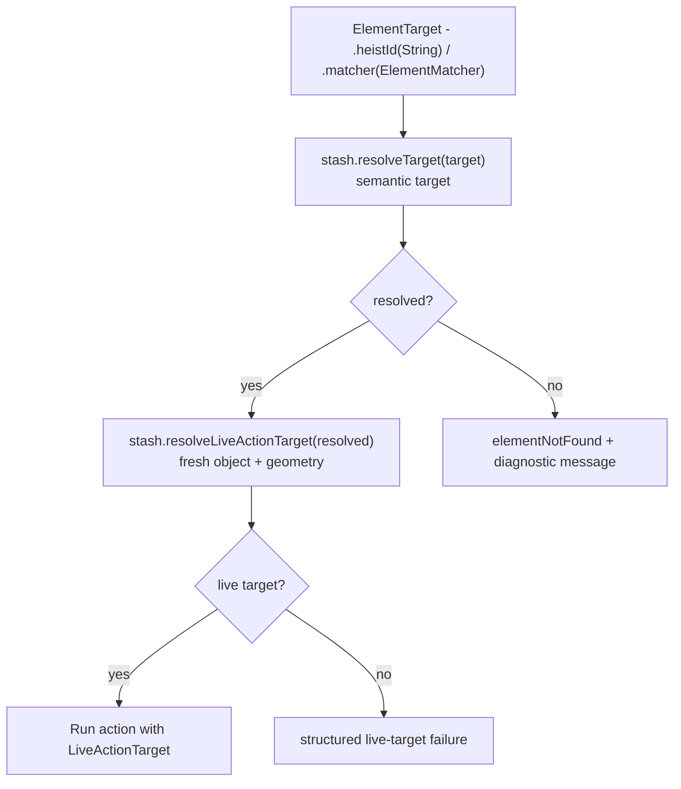

# TheSafecracker — The Specialist

> **Files:** `ButtonHeist/Sources/TheInsideJob/TheSafecracker/`
> **Platform:** iOS 17.0+ (UIKit, private APIs, DEBUG builds only)
> **Role:** Performs all physical interactions with the UI — touch injection, text input, gestures

## Responsibilities

TheSafecracker is the hands of the operation:

1. **Single-finger gestures** — tap, long press, swipe, drag
2. **Multi-finger gestures** — pinch, rotate, two-finger tap
3. **Path drawing** — polyline (drawPath) and Bezier curves (drawBezier)
4. **Text input** — typing via `KeyboardBridge` (UIKeyboardImpl wrapper), works in both software and hardware keyboard modes
5. **Text clearing** — select-all + delete via UITextInput
6. **Keyboard management** — detect visibility (via TheTripwire flag + UIKeyboardImpl fallback), dismiss keyboard
7. **Scrolling** — `scrollByPage` (UIScrollView.setContentOffset), `scrollToEdge`, `scrollToMakeVisible`, `scrollBySwipe` (synthetic swipe for non-UIScrollView containers)
8. **First responder lookup** — walks the view hierarchy to find the current first responder

TheSafecracker does **not** resolve element targets, check interactivity, or read current element state. TheStash resolves everything and hands TheSafecracker the coordinates, frames, or UIScrollViews it needs.

## Source Files

| File | Purpose |
|------|---------|
| `TheSafecracker.swift` | Core class, single-finger primitives, keyboard wrappers, `InteractionResult`, `PointResolution`, first responder utilities, N-finger primitives, duration helpers, `onGestureMove` callback |
| `TheSafecracker+Scroll.swift` | Scroll primitives: `scrollByPage`, `scrollToEdge`, `scrollToMakeVisible`, `scrollToOppositeEdge`, `scrollBySwipe` |
| `TheSafecracker+MultiTouch.swift` | `pinch`, `rotate`, `twoFingerTap` |
| `TheSafecracker+Bezier.swift` | `BezierSampler` — cubic bezier sampling into polylines |
| `TheSafecracker+IOHIDEventBuilder.swift` | `IOHIDEventBuilder` + `FingerTouchData`; IOKit dlopen/dlsym loader |
| `TheSafecracker+TapDiagnostic.swift` | Diagnostic helpers for tap-target classification |
| `KeyboardBridge.swift` | `UIKeyboardImpl` wrapper: `shared()`, `type(_:)`, `deleteBackward()`, `drainTaskQueue()`, `hasActiveInput` |
| `SyntheticTouch.swift` | Three nested structs: `TouchTarget`, `SyntheticTouch`, `TouchEvent` — the touch pipeline |
| `ObjCRuntime.swift` | `ObjCRuntime.Message` — typed ObjC dispatch for void and returning calls |
| `TheFingerprints.swift` | Visual touch indicator type (see 17-THEFINGERPRINTS dossier for the full overlay system) |

## Architecture Diagram

## Deep Dives

| Topic | File | Covers |
|-------|------|--------|
| [Scrolling](14a-SCROLLING.md) | `14a-SCROLLING.md` | Auto-scroll to visible, explicit scroll commands, ancestor walk, settle logic |
| [Touch Injection](14b-TOUCH-INJECTION.md) | `14b-TOUCH-INJECTION.md` | 3-layer IOKit/UITouch/UIEvent pipeline, hit testing, gesture geometry, timing |
| [Text Entry](14c-TEXT-ENTRY.md) | `14c-TEXT-ENTRY.md` | 5-step pipeline, UIKeyboardImpl injection, keyboard detection, edit actions |

## InteractionResult

`InteractionResult` is a plain struct — it does **not** conform to `Error`.

| Field | Type |
|-------|------|
| `success` | `Bool` |
| `method` | `ActionMethod` |
| `message` | `String?` |
| `value` | `String?` |
| `scrollSearchResult` | `ScrollSearchResult?` |

`PointResolution` is a custom enum (`.success(CGPoint)` / `.failure(InteractionResult)`) that exists specifically so `InteractionResult` doesn't need `Error` conformance.

## Touch Injection Stack

## KeyboardBridge

`@MainActor struct KeyboardBridge` wraps `UIKeyboardImpl` private API access through `ObjCRuntime`:

| Method | What it does |
|--------|-------------|
| `static shared() -> KeyboardBridge?` | `UIKeyboardImpl.sharedInstance` via ObjCRuntime; nil if class/selector absent |
| `var hasActiveInput: Bool` | `delegate is UIKeyInput` |
| `func type(_ character: Character)` | `addInputString:` + `drainTaskQueue()` |
| `func deleteBackward()` | `deleteFromInput` + `drainTaskQueue()` |
| `private func drainTaskQueue()` | `taskQueue.waitUntilAllTasksAreFinished` |

TheSafecracker treats text entry as active only when `KeyboardBridge.shared()?.hasActiveInput` is true: the keyboard singleton must have a focused `UIKeyInput` delegate. `isKeyboardVisible()` checks `tripwire.keyboardVisibleFlag` first (notification-driven, immediate), then falls back to the same active-input signal for hardware-keyboard scenarios.

## Gesture Catalog

## Gesture Move Callback

`var onGestureMove: (@MainActor ([CGPoint]) -> Void)?` — called during every continuous gesture step (swipe, drag, long press, draw path, pinch, rotate) with the current finger positions. Set by TheInsideJob to update recording overlays during gesture execution. Fires alongside `fingerprints.updateTrackingFingerprints` at each 10ms step.

## Timing Constants

| Constant | Value | Purpose |
|----------|-------|---------|
| `defaultInterKeyDelay` | 30 ms | Between keystrokes |
| `maxInterKeyDelay` | 500 ms | Upper clamp for inter-key delay |
| `gestureYieldDelay` | 50 ms | Between gesture phases (began/ended) |
| `keyboardPollInterval` | 100 ms | Polling for keyboard appearance |
| `keyboardPollMaxAttempts` | 20 | = 2 second max wait for keyboard |

Gesture step interval is 10ms for all continuous gestures. `clampDuration` clamps to `[0.01, 60.0]` with default `0.5`.

## Scrolling & Auto-Scroll

> **Deep dive:** [14a-SCROLLING.md](14a-SCROLLING.md) — full design, requirements, limitations, and implementation notes

TheBrains owns all scroll orchestration (see [13-THEBRAINS.md](13-THEBRAINS.md)). TheSafecracker provides the scroll primitives: `scrollByPage`, `scrollToEdge`, `scrollToMakeVisible`, `scrollToOppositeEdge`, and `scrollBySwipe`.

| Primitive | Input | Mechanism |
|-----------|-------|-----------|
| `scrollByPage` | UIScrollView + direction | `setContentOffset` with 44pt overlap, clamped to content bounds |
| `scrollToEdge` | UIScrollView + edge | `setContentOffset` to absolute boundary |
| `scrollToMakeVisible` | CGRect + UIScrollView | Minimum offset adjustment to bring frame into visible rect |
| `scrollToOppositeEdge` | UIScrollView + direction | Jump to opposite content edge (no animation) |
| `scrollBySwipe` | CGRect + direction | Synthetic swipe gesture at 75% travel, 0.25s duration |

**Auto-scroll** is driven by `Navigation.ensureOnScreen(for:)` (in `TheBrains/Navigation+Scroll.swift`) before every element-targeted interaction. It checks current geometry against `UIScreen.main.bounds`, uses the current screen's scroll view reference (with UIKit ancestor fallback), calls TheSafecracker's `scrollToMakeVisible` for minimum offset adjustment, waits for settle via TheTripwire, and refreshes `currentScreen`. TheStash exposes semantic resolution and fresh live-target snapshots only — it does not perform scroll orchestration or persist geometry as authority. If a known semantic target cannot be made visible or refreshed into live geometry, the command fails with a diagnostic instead of tapping stale coordinates.

**Input size guards:** `touchDrawPath` limits to 10,000 points; `touchDrawBezier` limits to 1,000 segments.

## Swipe Resolution Paths

`executeSwipe` supports three coordinate resolution strategies:

1. **Unit-point pair**: `target.start` + `target.end` as `UnitPoint` relative to element frame — maps `(0,0)...(1,1)` to the element's `accessibilityFrame`
2. **Direction expansion**: `target.direction` expands to `direction.defaultStart`/`defaultEnd` unit points, then resolves as #1
3. **Absolute fallback**: `startX/Y` + `endX/Y` screen points, or direction-only with 200pt offset from element center

## Element Resolution Flow

> Full targeting system documentation: [12-UNIFIED-TARGETING.md](12-UNIFIED-TARGETING.md)

Element action executors resolve in two visible stages. `TheStash.resolveTarget(_:)` checks heistId → matcher and returns semantic `ResolvedTarget` data from the current `Screen`. Immediately before dispatch, `resolveLiveActionTarget(for:)` promotes the weak object reference and returns a fresh `LiveActionTarget` with frame and activation point. If that live object or geometry is unavailable, action execution refreshes once for cell reuse and then returns a structured failure.

## Items Flagged for Review

### HIGH PRIORITY

**Private API usage via `unsafeBitCast`** (`SyntheticTouch.swift`, `ObjCRuntime.swift`)
- All UITouch mutation uses IMP extraction via `unsafeBitCast` to call private selectors
- Guards: `responds(to:)` checks protect against missing selectors but NOT against signature changes
- This is the established KIF pattern and is DEBUG-only, but should be monitored with each iOS release

**IOHIDEventBuilder uses `dlsym`-loaded IOKit** (`TheSafecracker+IOHIDEventBuilder.swift`)
- All IOKit function pointers are loaded dynamically at first use
- If IOKit reorganizes or removes these symbols, touch injection silently fails
- The `guard` on dlsym returns nil-checks, but no runtime warning is logged on failure

### MEDIUM PRIORITY

**Text injection uses `UIKeyboardImpl.sharedInstance`**
- Encapsulated in `KeyboardBridge` — `shared()`, `type(_:)`, `deleteBackward()`
- `drainTaskQueue()` after each keystroke matches KIF's pattern
- `hasActiveInput` checks `delegate is UIKeyInput` (not just non-nil existence)

**Duplicate default durations** (`TheBrains/Actions.swift` vs `TheSafecracker.swift`)
- High-level executors in `TheBrains/Actions.swift` and primitive methods in `TheSafecracker.swift` both have independent duration defaults
- Both default to 0.15s for swipe — consistent but defined in two places

### LOW PRIORITY

**Fingerprint overlays shown for all gesture types**
- Every successful interaction calls `showFingerprint()` or `beginTrackingFingerprints()`
- Intentional for recording visibility; can be disabled via `INSIDEJOB_DISABLE_FINGERPRINTS=1`
