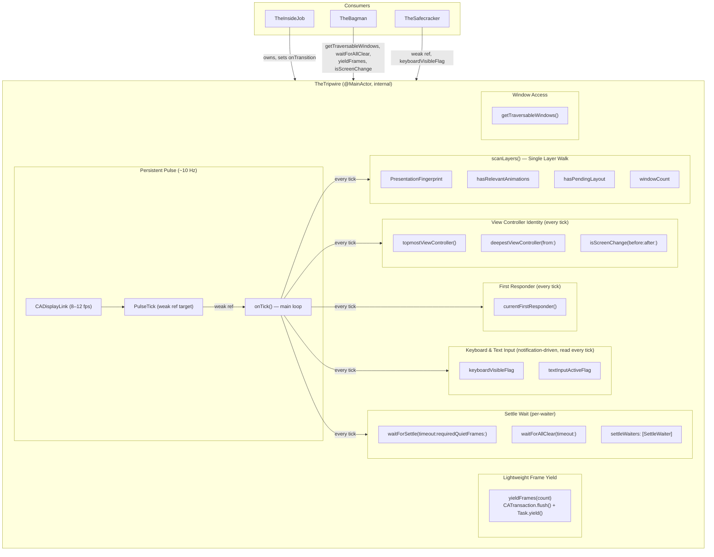
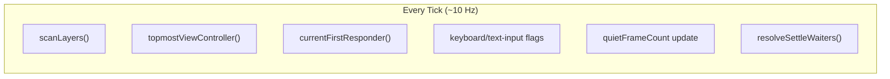
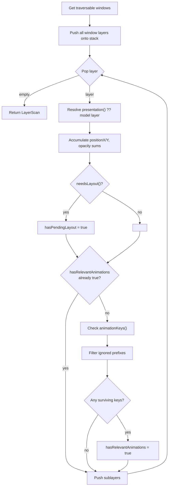
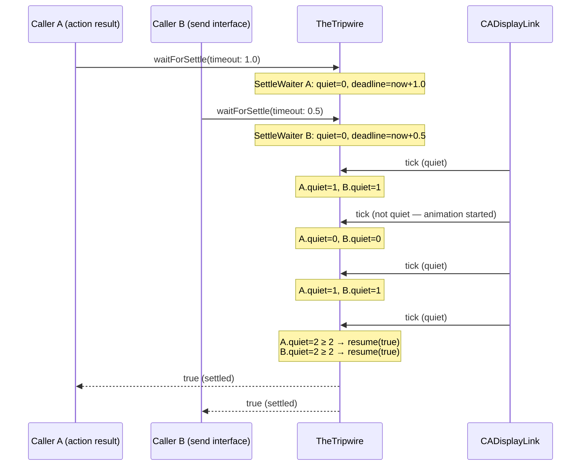
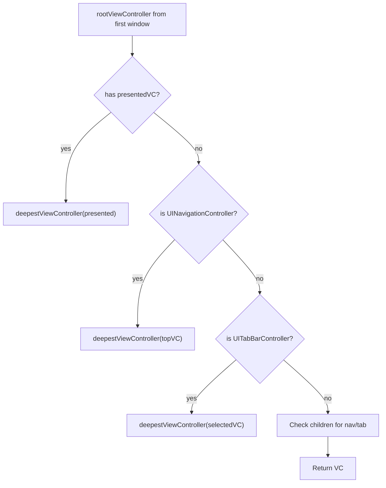
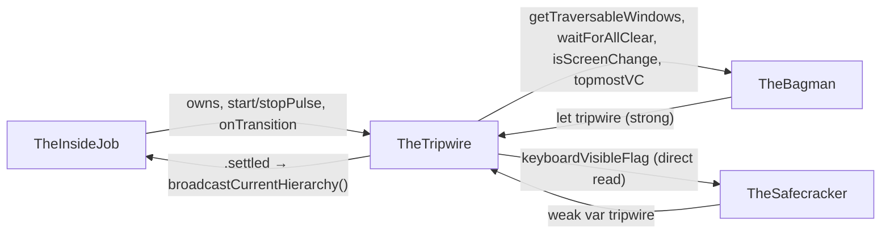

# TheTripwire — The Early Warning System

> **File:** `ButtonHeist/Sources/TheInsideJob/TheTripwire.swift`
> **Platform:** iOS 17.0+ (UIKit, DEBUG builds only)
> **Role:** Persistent UI pulse — samples all timing signals on a single ~10 Hz clock, gates settle decisions, and emits transition events

## Overview

TheTripwire is the UI state sensor for TheInsideJob. It owns a single persistent `CADisplayLink` that fires at ~10 Hz, sampling the entire layer tree, view controller hierarchy, first responder, and input state on every tick. Multiple concurrent callers can wait for the UI to settle, each tracking their own quiet-frame count against an independent deadline.

TheTripwire never reads the accessibility tree. It reads UIKit timing signals (layers, animations, VCs, keyboard notifications). TheBagman reads the accessibility tree. The two are cleanly separated.

## Nested Types

| Type | Kind | Purpose |
|------|------|---------|
| `PulseReading` | `struct` | Snapshot of all sampled signals from one tick |
| `PulseTransition` | `enum` | Discrete state-change events emitted via `onTransition` |
| `PresentationFingerprint` | `struct` | Sum of all presentation layer positions and opacities |
| `LayerScan` | `struct` | Accumulator filled during `scanLayers()` |
| `SettleWaiter` | `private struct` | Per-caller state for `waitForSettle` |
| `RunningContext` | `private class` | Mutable context that exists only while the pulse is running — holds link, tick count, keyboard/text flags, settle waiters |
| `PulsePhase` | `private enum` | State machine: `.idle` or `.running(RunningContext)` |
| `PulseTick` | file-private top-level `class` | `NSObject` target for `CADisplayLink` (weak-ref indirection) |

## Pulse Architecture

TheTripwire runs a single `CADisplayLink` at ~10 Hz. Every tick runs the full set of checks in one pass — there is no tiered cadence; all signals are sampled on every tick:

1. `CATransaction.flush()` — commit deferred SwiftUI layout
2. `scanLayers()` — single layer-tree walk for fingerprint, animations, layout, window count
3. Sample VC identity (`topmostViewController`) and first responder (`currentFirstResponder`)
4. Read keyboard/text-input flags (set by notification observers)
5. Build a `PulseReading` snapshot with all signals + derived quiet-frame count
6. Diff against the previous `latestReading` and fire `PulseTransition` callbacks for any changes
7. Resolve settle waiters

**`latestReading` is the single source of truth.** There are no shadow variables — the new reading is diffed directly against the previous one for transition detection.

Keyboard and text-input flags (`keyboardVisibleFlag`, `textInputActiveFlag`) are set synchronously by `NotificationCenter` observers and read into the pulse reading each tick. `TheSafecracker.isKeyboardVisible()` reads `keyboardVisibleFlag` directly for immediate queries outside the tick cadence.



## The Pulse Model

### Lifecycle

`startPulse()` is idempotent. When first called:

1. Allocates a `PulseTick` (NSObject) and stores it in `pulseTarget`.
2. Creates `CADisplayLink(target: pulseTarget, selector: handleTick)` — the display link retains `PulseTick`, not `TheTripwire`. If `TheTripwire` deallocates, `handleTick` sees `nil` and invalidates the link.
3. Sets `preferredFrameRateRange(minimum: 8, maximum: 12, preferred: 10)`.
4. Adds to `.main` run loop, `.common` mode (fires during scrolling too).
5. Starts keyboard/text-input notification observers.

`stopPulse()` invalidates the link, resumes all pending settle waiters with `false`, and resets all state.

### Tick Cadence

All signals are sampled on every tick (~10 Hz). There is no tiered cadence — `onTick()` runs all checks unconditionally:



Every tick builds a complete `PulseReading` snapshot from all current signal values.

### Tick Processing (`onTick()`)

1. **`CATransaction.flush()`** — commits SwiftUI's deferred implicit layout before sampling.
2. **`scanLayers()`** — single DFS walk of every layer in every traversable window. Returns `LayerScan` with fingerprint, animation flag, layout flag, window count.
3. **Quiet frame logic** — a tick is quiet if: no pending layout, no relevant animations, AND fingerprint matches previous. Quiet increments `quietFrameCount`; not quiet resets to 0.
4. **VC identity** — `topmostViewController()` wrapped in `ObjectIdentifier`. Change fires `.screenChanged(from:to:)`.
5. **First responder** — `currentFirstResponder()` wrapped in `ObjectIdentifier`. Change fires `.focusChanged(from:to:)`.
6. **Keyboard/text-input flags** — read from notification-driven flags on `RunningContext`. Changes fire `.keyboardChanged(visible:)` and `.textInputChanged(active:)`.
7. **Build `PulseReading`** from all current signal values.
8. **Settle edge detection** — fires `.settled` on false→true, `.unsettled` on true→false.
9. **`resolveSettleWaiters()`** — increments or resets each waiter's quiet count, resumes those that are done.

## `scanLayers()` — Single Combined Layer Walk

Replaces three separate passes (fingerprint, animation check, layout check) with one DFS using an explicit stack:



**Ignored animation prefixes:** `["_UIParallaxMotionEffect", "match-"]` — parallax motion effects and matchedGeometryEffect transitions are persistent/transient system animations that would block settlement.

## `PresentationFingerprint` — Structure and Comparison

Fields: `positionXSum`, `positionYSum`, `opacitySum` (all `CGFloat`), `layerCount` (`Int`).

`matches(_ other:)` uses toleranced comparison:
- `layerCount` must match exactly (layer additions/removals are always significant)
- Position tolerance: `0.5 pt` (catches any perceptible movement, ignores sub-pixel noise)
- Opacity tolerance: `0.05` (catches fades, ignores floating-point drift)

All four conditions must pass. Reading `presentation()` instead of the model layer captures in-flight animated values.

## Per-Waiter Settle Tracking



Key design: each waiter starts its own quiet-frame counter at zero, independent of the global `quietFrameCount`. A waiter registered after the UI is already settled must still accumulate its own 2 quiet frames. This prevents false positives where a settle happened before the caller started waiting.

`resolveSettleWaiters` iterates in reverse for safe removal — prevents index shifting from affecting unprocessed waiters.

### Callers

| Call site | Timeout | Purpose |
|-----------|---------|---------|
| `checkForChanges()` | sync `allClear()` | Gate polling broadcasts |
| `sendInterface()` | 0.5s | Wait before sending interface snapshot |
| `actionResultWithDelta()` | 1.0s | Wait after action before computing delta |
| `handleWaitForIdle()` | user-specified (clamped to 60s) | Explicit idle wait command |

## Lightweight Frame Yielding

`yieldFrames(_:)` is a minimal alternative to `waitForSettle` for scroll loops that need layout to run but don't need to wait for animations to finish. Each iteration does:

1. `CATransaction.flush()` — commit pending Core Animation transactions (flushes SwiftUI layout)
2. `Task.yield()` — yield to the main run loop so layout and rendering can execute

This is used by `TheBagman`'s scroll scan loop and scroll-to-edge re-jump loop. Two frames is enough for SwiftUI lazy containers to materialize content after a `contentOffset` change, without the overhead of the full pulse-based settle detection.

**Why not `waitForSettle`:** The settle path waits for presentation layers to match model layers (no in-flight animations). In a scroll scan, we don't care about animations finishing — we just need layout to run so new accessibility elements appear. `yieldFrames` is ~2 orders of magnitude faster per step.

| Caller | Frames | Purpose |
|--------|--------|---------|
| `scanLoop()` | 2 | Let lazy content materialize between page scrolls |
| `executeScrollToEdge()` | 2 | Let lazy content grow `contentSize` between re-jumps |
| `executeScrollToVisible()` Phase 2 | 2 | Let layout settle after jumping to opposite edge |

### `yieldRealFrames(_:intervalMs:)`

A heavier variant of `yieldFrames` that uses `Task.sleep` instead of `Task.yield()` to give `CADisplayLink` animations time to process. Required for accessibility SPI scroll methods that queue animated scrolls — `Task.yield()` alone doesn't advance the animation. Default interval is 16ms (one display frame).

## Keyboard and Text Input Tracking

### Keyboard (notification-driven)

Three notifications → `keyboardVisibleFlag`:

- `keyboardWillShowNotification` → `true` immediately
- `keyboardDidHideNotification` → `false` immediately
- `keyboardDidChangeFrameNotification` → frame-based check: end frame must intersect screen bounds with `height > 0` and `origin.y < screenBounds.height` (handles floating/undocked keyboards)

### Text input (notification-driven)

`UITextField` and `UITextView` begin/end editing notifications → `textInputActiveFlag`.

### Promotion to pulse

These flags are set synchronously when the notification fires and read into the `PulseReading` on every tick. Changes fire `PulseTransition` events immediately on the next tick. TheSafecracker reads `keyboardVisibleFlag` directly for immediate queries outside the tick cadence.

## First Responder Tracking

`currentFirstResponder()` walks every subview in every traversable window (frontmost first), depth-first, calling `view.isFirstResponder`. Returns the first match.

Sampled every tick (~10 Hz). Identity change (via `ObjectIdentifier`) fires `.focusChanged(from:to:)`.

## View Controller Walk



Sampled every tick. Identity change fires `.screenChanged(from:to:)`.

### Topology supplement (TheBagman)

For cases where the VC is reused (e.g., Workflow-style navigation), TheBagman supplements with topology-based detection:
- **Back button trait** (bit 27): presence/absence change = screen change
- **Header labels**: if both before/after have headers and they're completely disjoint = screen change

The combined gate in `actionResultWithDelta`:
```
tripwire.isScreenChange(before:after:) || isTopologyChanged(before:after:)
```

## `PulseTransition` Events

| Transition | Trigger | Cadence |
|-----------|---------|---------|
| `.screenChanged(from:to:)` | VC identity change | Every tick |
| `.focusChanged(from:to:)` | First responder change | Every tick |
| `.keyboardChanged(visible:)` | Keyboard flag change | Every tick |
| `.textInputChanged(active:)` | Text input flag change | Every tick |
| `.settled` | quiet → settled edge | Every tick |
| `.unsettled` | settled → not-quiet edge | Every tick |

TheInsideJob wires `onTransition` and uses `.settled` to trigger deferred hierarchy broadcasts when `hierarchyInvalidated` is true.

## Window Filtering (`getTraversableWindows()`)

Scans the `foregroundActive` `UIWindowScene`. Filters out:
- `TheFingerprints.FingerprintWindow` (tap-indicator overlay)
- Hidden windows
- Zero-size windows

Sorts by `windowLevel` descending (frontmost first). Returns `[(window: UIWindow, rootView: UIView)]`.

Used by both `scanLayers()` (fingerprinting) and `TheBagman.refreshAccessibilityData()` (accessibility parsing), ensuring both operate on the same window set.

## Crew Interactions



- **TheInsideJob** owns the instance. Sets `onTransition` in `start()`, calls `startPulse()`/`stopPulse()` on suspend/resume. On `.settled`, broadcasts hierarchy if invalidated.
- **TheBagman** holds a strong ref passed at init. Uses `getTraversableWindows()` for parsing and capture, `waitForAllClear()` post-action, `topmostViewController()` and `isScreenChange()` for delta computation.
- **TheSafecracker** holds a weak ref. Reads `keyboardVisibleFlag` directly for `isKeyboardVisible()`. Uses `waitForAllClear()` for scroll-settle in `ensureOnScreen`.

## Design Decisions

- **Persistent pulse over on-demand sampling**: A single ~10 Hz clock replaces ad-hoc polling loops and per-settle display links. Lower overhead, better timing coherence, and the pulse detects transitions even when no one is actively waiting.
- **Flat cadence**: All signals are sampled on every tick. The simplicity of running all checks unconditionally outweighs the marginal CPU savings of tiered sampling — VC walks and first responder searches are cheap at ~10 Hz.
- **Weak-ref indirection via PulseTick**: `CADisplayLink` retains its target. If TheTripwire were the target, deallocating it would leave a dangling display link. The `PulseTick` intermediary checks a weak ref and self-invalidates.
- **`CATransaction.flush()` before scanning**: SwiftUI batches layout commits. Without the flush, `scanLayers()` would see stale layer positions and report false "quiet" readings.
- **Per-waiter quiet frames**: Global quiet-frame count can't serve multiple concurrent callers with different start times. Each waiter tracks its own count from registration, preventing false positives from stale settle state.
- **Separation from TheBagman**: TheTripwire reads UIKit timing signals; TheBagman reads the accessibility tree. Neither imports the other's domain. The only shared surface is `getTraversableWindows()`.
- **VC identity over element overlap**: `ObjectIdentifier` comparison of the topmost VC is cheaper and more reliable than the old heuristic of element identifier overlap ratios.
- **Presentation layer fingerprinting**: Summing `CALayer.presentation()` positions/opacities catches any layer movement without enumerating specific animation types. The tolerances (0.5 pt position, 0.05 opacity) filter sub-pixel noise while catching all perceptible motion.

## Items Flagged for Review

### LOW PRIORITY

**`getTraversableWindows()` is called from both TheTripwire and TheBagman**
- TheBagman calls `tripwire.getTraversableWindows()` for hierarchy parsing and screen capture
- This is by design (shared window set), but the method is on TheTripwire rather than being shared infrastructure
