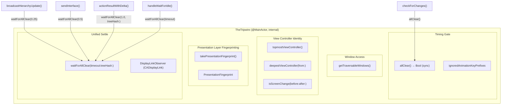
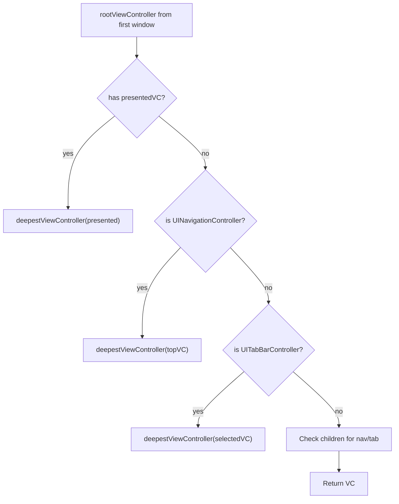
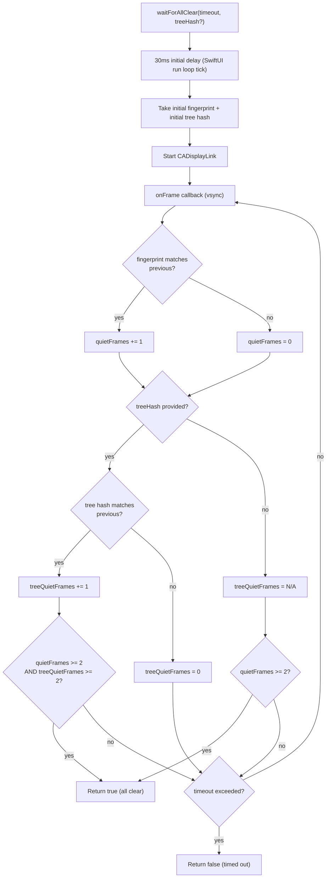

# TheTripwire - The Timing Coordinator

> **File:** `ButtonHeist/Sources/TheInsideJob/TheTripwire.swift`
> **Platform:** iOS 17.0+ (UIKit, DEBUG builds only)
> **Role:** Centralized timing coordinator — gates all "is the UI ready?" decisions for TheInsideJob

## Responsibilities

TheTripwire is the timing coordinator for TheInsideJob. Every path that reads or broadcasts the accessibility tree goes through TheTripwire first to ensure the UI is stable.

1. **Window access** - returns the active scene's visible, non-overlay windows sorted by level (`getTraversableWindows()`)
2. **View controller identity** - walks the VC hierarchy (presented, nav, tab, children) to find the topmost visible VC (`topmostViewController()`)
3. **Screen change detection** - compares `ObjectIdentifier` snapshots of the topmost VC before/after an action (`isScreenChange()`)
4. **Synchronous animation gate** - cheap DFS check for active `CAAnimation` keys, filtering out persistent system animations like `_UIParallaxMotionEffect` (`allClear()`)
5. **Presentation layer fingerprinting** - sums `CALayer` presentation positions and opacities across all windows to detect movement (`PresentationFingerprint`)
6. **Unified settle wait** - async wait using `CADisplayLink` (vsync-synced) until presentation layers stop moving AND optionally the accessibility tree hash stabilizes, both requiring 2 consecutive quiet frames (`waitForAllClear(timeout:treeHash:)`)

## Architecture Diagram

## View Controller Walk

## waitForAllClear Flow

## Design Decisions

- **Separation from TheBagman**: TheTripwire reads UIKit timing signals; TheBagman reads the accessibility tree. TheTripwire never imports or reads the accessibility tree directly — callers pass a `treeHash` closure when tree stability matters.
- **VC identity over element overlap**: Screen change is detected by comparing `ObjectIdentifier` of the topmost VC, replacing the old heuristic of checking element identifier overlap ratios. This is more reliable and cheaper.
- **CADisplayLink over polling**: Settling uses vsync-synced display link callbacks instead of a polling loop with `Task.sleep`. Zero drift, zero wasted polls.
- **Presentation layer fingerprinting**: Summing `CALayer.presentation()` positions/opacities catches any layer movement without needing to enumerate specific animation types.
- **Unified settle loop**: `waitForAllClear(timeout:treeHash:)` combines presentation layer fingerprinting and optional tree hash stability in a single CADisplayLink loop, replacing the prior two-phase approach (settle then poll).

## Items Flagged for Review

### LOW PRIORITY

**`getTraversableWindows()` is called from both TheTripwire and TheBagman**
- TheBagman calls `tripwire.getTraversableWindows()` for hierarchy parsing and screen capture
- This is by design (shared window set), but the method is on TheTripwire rather than being shared infrastructure
