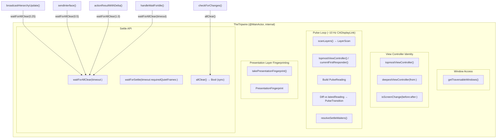
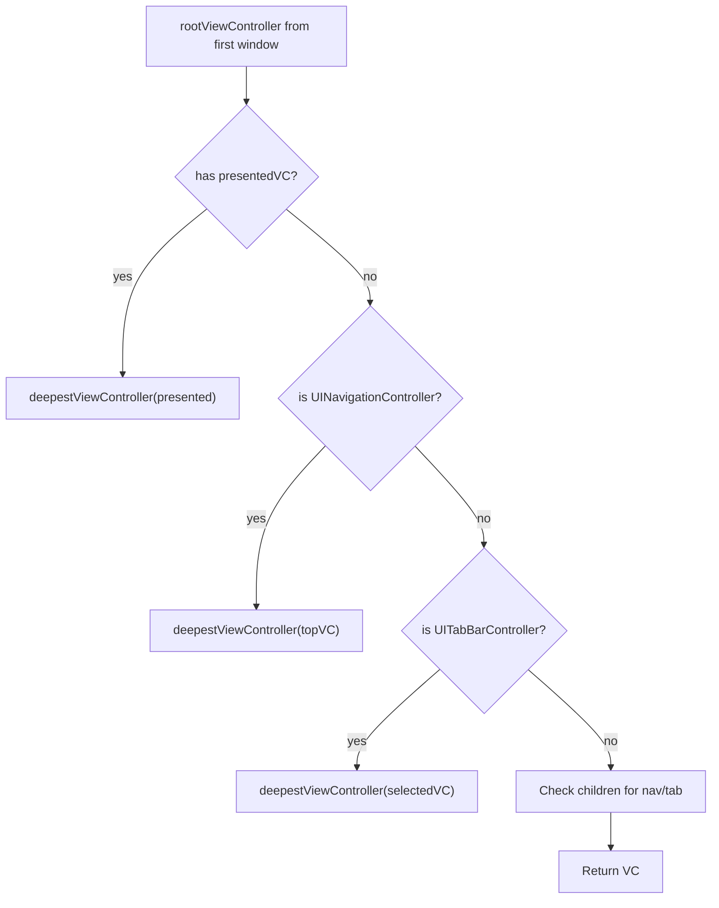
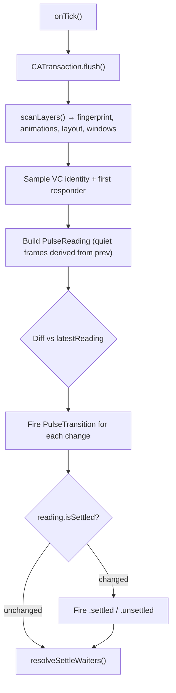

# TheTripwire - The Timing Coordinator

> **File:** `ButtonHeist/Sources/TheInsideJob/TheTripwire.swift`
> **Platform:** iOS 17.0+ (UIKit, DEBUG builds only)
> **Role:** Centralized timing coordinator — gates all "is the UI ready?" decisions for TheInsideJob

## Responsibilities

TheTripwire is the timing coordinator for TheInsideJob. Every path that reads or broadcasts the accessibility tree goes through TheTripwire first to ensure the UI is stable.

1. **Window access** - returns the active scene's visible, non-overlay windows sorted by level (`getTraversableWindows()`)
2. **View controller identity** - walks the VC hierarchy (presented, nav, tab, children) to find the topmost visible VC (`topmostViewController()`)
3. **Screen change detection (VC identity)** - compares `ObjectIdentifier` snapshots of the topmost VC before/after an action (`isScreenChange()`). This is the primary gate; TheBagman supplements with topology-based detection for cases where the VC is reused (e.g., Workflow-style navigation)
4. **Synchronous animation gate** - cheap DFS check for active `CAAnimation` keys, filtering out persistent system animations like `_UIParallaxMotionEffect` (`allClear()`)
5. **Presentation layer fingerprinting** - sums `CALayer` presentation positions and opacities across all windows to detect movement (`PresentationFingerprint`)
6. **Unified settle wait** - async wait using `CADisplayLink` (vsync-synced) until presentation layers stop moving, requiring 2 consecutive quiet frames (`waitForAllClear(timeout:)`)

## Pulse Architecture

TheTripwire runs a single `CADisplayLink` at ~10 Hz. Every tick runs the full set of checks in one pass:

1. `CATransaction.flush()` — commit deferred SwiftUI layout
2. `scanLayers()` — single layer-tree walk for fingerprint, animations, layout, window count
3. Sample VC identity and first responder
4. Build a `PulseReading` snapshot with all signals + derived quiet-frame count
5. Diff against the previous `latestReading` and fire `PulseTransition` callbacks for any changes
6. Resolve settle waiters

**`latestReading` is the single source of truth.** There are no shadow variables — the new reading is diffed directly against the previous one for transition detection.

Keyboard and text-input flags (`keyboardVisibleFlag`, `textInputActiveFlag`) are set synchronously by `NotificationCenter` observers and read into the pulse reading each tick. `TheSafecracker.isKeyboardVisible()` reads `keyboardVisibleFlag` directly for immediate queries outside the tick cadence.

## View Controller Walk

## Tick Flow

## Design Decisions

- **Separation from TheBagman**: TheTripwire reads UIKit timing signals; TheBagman reads the accessibility tree. TheTripwire never imports or reads the accessibility tree directly.
- **VC identity over element overlap**: Screen change is detected by comparing `ObjectIdentifier` of the topmost VC, replacing the old heuristic of checking element identifier overlap ratios. This is more reliable and cheaper. For cases where the VC is reused (e.g., Workflow-style navigation), TheBagman provides a supplementary topology-based check using back button trait and header labels.
- **CADisplayLink over polling**: Settling uses vsync-synced display link callbacks instead of a polling loop with `Task.sleep`. Zero drift, zero wasted polls.
- **Presentation layer fingerprinting**: Summing `CALayer.presentation()` positions/opacities catches any layer movement without needing to enumerate specific animation types.
- **Single-state pulse**: `latestReading` is the only mutable state for the pulse. Transitions are derived by diffing the new reading against the previous one — no shadow variables or carried-forward intermediaries.
- **Flat tick**: All signals (layer scan, VC identity, first responder, keyboard, text input, window count) run every tick. The cheap reads (property lookups, bool comparisons) don't warrant gating behind a cadence when `scanLayers()` dominates cost.

## Items Flagged for Review

### LOW PRIORITY

**`getTraversableWindows()` is called from both TheTripwire and TheBagman**
- TheBagman calls `tripwire.getTraversableWindows()` for hierarchy parsing and screen capture
- This is by design (shared window set), but the method is on TheTripwire rather than being shared infrastructure
