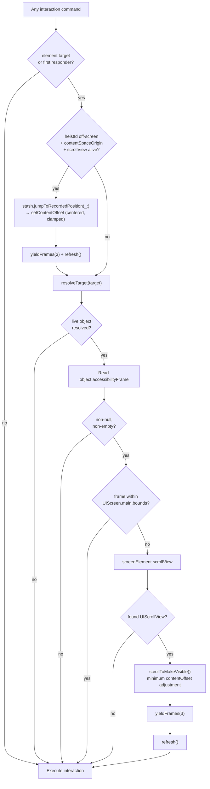
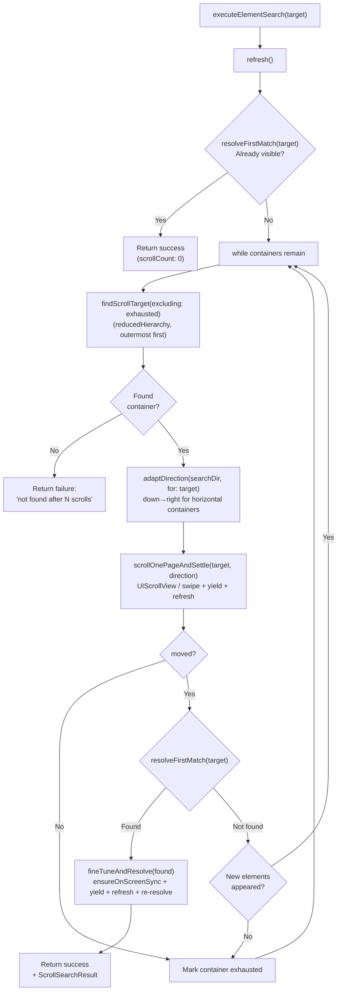

# Scrolling Deep Dive

> **Source:** `ButtonHeist/Sources/TheInsideJob/TheBrains/Navigation+Scroll.swift` (orchestration), `TheSafecracker/TheSafecracker+Scroll.swift` (scroll primitives)
> **Parent dossiers:** [13-THEBRAINS.md](13-THEBRAINS.md), [14-THESAFECRACKER.md](14-THESAFECRACKER.md)

TheBrains' `Navigation` component owns all scroll orchestration — three explicit scroll commands for agents, and an automatic pre-interaction scroll that ensures every action is visible on screen. TheSafecracker provides the scroll primitives (`scrollByPage`, `scrollToEdge`, `scrollToMakeVisible`, `scrollBySwipe`) but never decides what to scroll or when. `Actions` calls into `Navigation` for pre-action positioning (`ensureOnScreen`, `ensureFirstResponderOnScreen`) — TheStash exposes resolution and live geometry but performs no scroll orchestration.

Two-tier dispatch: UIScrollView for direct offset manipulation, synthetic swipe for everything else.

## Scrollable Container Discovery

Scrollable containers are discovered from the **accessibility hierarchy tree**, not from UIKit view hierarchy walking. The accessibility parser marks containers as `.scrollable(contentSize:)` when their backing view is a `UIScrollView` subclass (or reports scrollable traits). One lookup is stored:

| Lookup | Key | Value | Used for |
|--------|-----|-------|----------|
| `scrollableContainerViews` | `AccessibilityContainer` | `UIView` | Cast to `UIScrollView` for direct `setContentOffset`, else synthetic swipe |

Rebuilt on every `refresh()` call via the `containerVisitor` callback.

### ScrollableTarget

A `ScrollableTarget` enum wraps a discovered scrollable container with two tiers:

```
.uiScrollView(UIScrollView)           — direct setContentOffset (fast, precise)
.swipeable(CGRect, CGSize)             — synthetic swipe gesture (universal)
```

`scrollOnePageAndSettle(_:direction:animated:)` dispatches through these tiers and waits for layout to settle (one `yieldFrames` + one `refresh`). UIScrollView gets direct `setContentOffset` manipulation. Everything else (e.g. SwiftUI's `PlatformContainer`) gets a synthetic swipe at the container's screen-space frame. Returns a `(moved: Bool, previousVisibleIds: Set<String>)` tuple so callers can detect stagnation against the latest parsed viewport without a second refresh.

### Axis-Aware Resolution

`ScrollAxis` is an `OptionSet` with `.horizontal` and `.vertical`. Three `requiredAxis(for:)` overloads map `ScrollDirection`, `ScrollEdge`, and `ScrollSearchDirection` to the axis they operate on.

For `scroll` and `scroll_to_edge`, `resolveScrollTarget` returns the element's stored `screenElement.scrollView` from the accessibility hierarchy only when it can scroll on the requested axis. If the owned scroll view cannot reveal that axis, resolution returns nil instead of falling back to an unrelated container.

For `element_search`, `adaptDirection` maps the caller's direction hint to each container's natural axis: "down" means "forward" — forward in a vertical = `.down`, forward in a horizontal = `.right`. This lets the search iterate every scroll view regardless of axis.

Doctrine: direct scroll commands move only the resolved element's stored scroll view, and only on an axis that can reveal it; global scroll-container scanning belongs to `element_search`.

## Auto-Scroll to Visible

### Why it exists

Humans watching an agent interact with a simulator need to see every action happen on screen. Without auto-scroll, an agent can tap, type into, or swipe an element that's scrolled out of the viewport — the action succeeds but the observer sees nothing happen.

The check runs inside TheStash before every interaction (via `ensureOnScreen(for:)`). The agent has no knowledge of it, sends no extra parameters, and receives no indication it happened. From the agent's perspective the command just works. From the human's perspective the screen scrolls to the element and then the action occurs.

### What it checks

The check compares the element's `accessibilityFrame` (screen coordinates, read from the live `NSObject`) against `UIScreen.main.bounds`. If the frame is fully contained within the screen bounds, no scroll is needed.

**This is a bounds check, not a visibility check.** It does not care about:
- Keyboard overlapping the element
- Modal sheets or overlays obscuring the element
- Other views drawn on top of the element
- The element being transparent or hidden

It only cares whether the element's frame is geometrically within the screen rectangle. An element behind a keyboard is "on screen" — an element scrolled 500 points below the viewport is not.

### What it does when an element is off-screen

A sequential coarse-then-fine flow:

**Step 1 — Coarse jump (off-screen heistId only).** If the target is a `.heistId` that resolves into `currentScreen.elements` (e.g. unioned in during a prior exploration cycle) but is not in the live viewport, and the stored `ScreenElement` carries both a `contentSpaceOrigin` and a live `scrollView`:

1. Calls `stash.jumpToRecordedPosition(_:)` — the stash internally computes the clamped, centered content offset via `TheStash.scrollTargetOffset(for:in:)` and sets it on the owning scroll view. Returns the previous offset so callers can revert.
2. Waits for settle via `yieldFrames(3)`, then `stash.refresh()` (commits a fresh `currentScreen` value)

**Step 2 — Fine-tune (any target).** Asks the stash for live geometry via `stash.liveGeometry(for:)`, which promotes the weak NSObject ref to strong internally and returns a value-typed `(frame, activationPoint, scrollView)` snapshot:

1. Checks `UIScreen.main.bounds.contains(frame)` and comfort-zone containment
2. Calls `scrollToMakeVisible(_:in:)` — adjusts `contentOffset` by the minimum amount needed to bring the element fully within the scroll view's visible rect
4. Waits for the scroll to settle via `yieldFrames(3)` — CATransaction flush + Task.yield per frame
5. Refreshes `currentScreen` via `stash.refresh()` so subsequent reads reflect post-scroll positions



In the flowchart, `screenElement.scrollView`, `screenElement.contentSpaceOrigin`, and the coarse-jump path all read from the live `ScreenElement` stored on `currentScreen.elements[heistId]` (computed once during `buildScreen(from:)` from the parsed accessibility hierarchy and held on the `Screen` value).

### Entry points

Two public methods resolve their target, then delegate to a shared private implementation:

| Method | Resolves object from | Used by |
|--------|---------------------|---------|
| `ensureOnScreen(for: ElementTarget)` (on `Navigation`) | `stash.resolveTarget` → `currentScreen.elements` | activate, increment, decrement, customAction, tap, longPress, swipe, drag, pinch, rotate, twoFingerTap, typeText |
| `ensureFirstResponderOnScreen()` (on `Navigation`) | `tripwire.currentFirstResponder()` responder chain walk | editAction, setPasteboard, getPasteboard, resignFirstResponder |

### Best-effort guarantee

The auto-scroll never blocks or fails the command. If anything goes wrong — element can't be resolved, no scrollable ancestor, frame is null, tripwire is nil — the interaction proceeds at the current position.

## Explicit Scroll Commands

Three commands expose scrolling directly to agents. These are not auto-scroll — they are standalone commands the agent sends intentionally.

| Command | Method | Behavior |
|---------|--------|----------|
| `scroll` | `executeScroll` → `scrollByPage` | Axis-aware page scroll on the resolved element's stored scroll view |
| `scroll_to_visible` | `executeScrollToVisible` | One-shot jump to a known element's recorded scroll position |
| `element_search` | `executeElementSearch` | Hierarchy-driven search with swipe fallback for non-UIScrollView containers |
| `scroll_to_edge` | `executeScrollToEdge` → `scrollToEdge` | Axis-aware edge jump on the resolved element's stored scroll view |

### scroll (page step)

Scrolls the resolved element's stored scroll view by one page in the given direction. "One page" is the scroll view's frame dimension minus a 44pt overlap, so the user retains context across pages.

`resolveScrollTarget` returns the element's stored scroll view from the accessibility hierarchy (`screenElement.scrollView`) only when that scroll view supports the requested axis. It never borrows an unrelated container from the global hierarchy. If no owned scroll view can reveal that axis, the command fails closed with "No scrollable ancestor found for element." If the owned scroll view supports the axis but is already at its limit, `scrollByPage` returns false ("Already at edge").

Offsets are clamped to valid content bounds. Returns `false` if already at the edge.

### scroll_to_visible (known-position jump)

Jumps directly to a known element's recorded scroll position. This command is for visible elements or `heistId` targets still present in the current or preserved screen snapshot, especially the union produced by the latest `get_interface --full`.

**Input:** `ScrollToVisibleTarget` containing an `ElementTarget`. If the element is already visible, it is comfort-scrolled if needed. If it is off-screen and has a recorded content-space position, Button Heist jumps to that position and re-resolves the target.

Fails closed when the element is not in `currentScreen.elements` or has no recorded scroll position. Use `element_search` for unseen elements or stale heistIds that have fallen out of the current snapshot.

### element_search (hierarchy-driven search)

Searches for an element by scrolling through scrollable containers discovered from the accessibility hierarchy tree. Uses `reducedHierarchy` (pre-order traversal) to visit containers outermost first.

**Input:** `ElementSearchTarget` containing an `ElementTarget` predicate and optional `direction` (default `.down`). Scrolls until found or all containers exhausted.

**Algorithm:**

1. **Pre-check.** Refresh and check if element is already visible via `resolveFirstMatch`.
2. **Scroll loop.** `findScrollTarget(excluding: exhausted)` walks the hierarchy tree and returns the first non-exhausted scrollable container. `adaptDirection` maps the caller's direction to the container's natural axis. `scrollOnePageAndSettle` scrolls it and settles (yield + refresh in one call). After each scroll, check for match. If found, `fineTuneAndResolve` runs `ensureOnScreenSync` + yield + refresh + re-resolve to get fresh coordinates. If no new elements appeared, mark the container exhausted.



### scroll_to_edge (jump to extreme)

Jumps the content offset to the absolute edge of the content. Uses axis-aware resolution (same as `scroll`) to find the right scroll view.

| Edge | Offset |
|------|--------|
| `.top` | `y = -insets.top` |
| `.bottom` | `y = contentSize.height + insets.bottom - frame.height` |
| `.left` | `x = -insets.left` |
| `.right` | `x = contentSize.width + insets.right - frame.width` |

For `UIScrollView` instances, `scrollToEdge` sets `contentOffset` directly to the computed edge in a single call — no iteration. If the resolved element's stored scroll view cannot support the requested edge axis, the command fails closed instead of searching sibling containers.

## Scrollable Container Lookup

Scrollable container discovery uses the **accessibility hierarchy tree** exclusively — there is no UIKit ancestor walk. The hierarchy parser's `containerVisitor` callback tags containers as `.scrollable(contentSize:)` and maps them to live `UIView` references in the `scrollableContainerViews` dictionary during each `refresh()`.

Two resolution paths use this data:

1. **`resolveScrollTarget(screenElement:axis:)`** — for `scroll` and `scroll_to_edge`. Returns the element's stored `screenElement.scrollView` (set by the hierarchy tree during parsing) only when it supports the requested axis. It does not search the full hierarchy.

2. **`findScrollTarget(excluding:)`** — for `element_search`. Walks `currentHierarchy.reducedHierarchy` (pre-order = outermost first) and returns the first non-exhausted `.scrollable` container. Looks up the container in `scrollableContainerViews` — if the backing view is a `UIScrollView`, returns `.uiScrollView`; otherwise returns `.swipeable` with the container's screen frame and content size.

## Settle After Scroll

After any `setContentOffset(animated: true)` call, the scroll view runs a Core Animation animation (~300ms). For animated UIScrollView scrolls via `scrollOnePageAndSettle`, the settle path uses `animateScrollFingerprint` — a visual fingerprint overlay that matches the animation duration. For non-animated scrolls, `yieldFrames(3)` is used — `CATransaction.flush()` + `Task.yield()` per frame.

The `scroll` command settles via `scrollOnePageAndSettle` which handles both yield and refresh internally.

`element_search` and `scroll_to_edge` also settle via `scrollOnePageAndSettle` per step. The auto-scroll path (`ensureOnScreen`) uses `yieldFrames(3)` + `refresh()` after each `setContentOffset` or `scrollToMakeVisible` call.

## Implementation Notes

### Why setContentOffset + swipe fallback

`setContentOffset` gives exact positioning for `UIScrollView` instances. But SwiftUI's internal scroll containers (e.g. `HostingScrollView.PlatformContainer`) are not `UIScrollView` subclasses on iOS 26 — they don't respond to `setContentOffset`. For these, a synthetic swipe gesture at 75% travel covers a full page reliably. The two-tier `ScrollableTarget` dispatch uses `setContentOffset` when available and falls through to synthetic swipe as the universal fallback.

### Why the 44pt overlap in page scroll

The 44pt overlap when paging ensures continuity — the last few lines of the previous page remain visible at the top of the next page. This matches the standard iOS VoiceOver three-finger-swipe page scrolling behavior. 44pt is also the minimum recommended touch target size in the HIG.

### Why NSObject for ensureOnScreen

The auto-scroll has two callers: element-targeted commands (resolve through TheStash) and first-responder commands (resolve through the UIView responder chain). Both produce a live `NSObject` that has `accessibilityFrame` and participates in the view hierarchy. Accepting `NSObject` lets both paths share one implementation.
