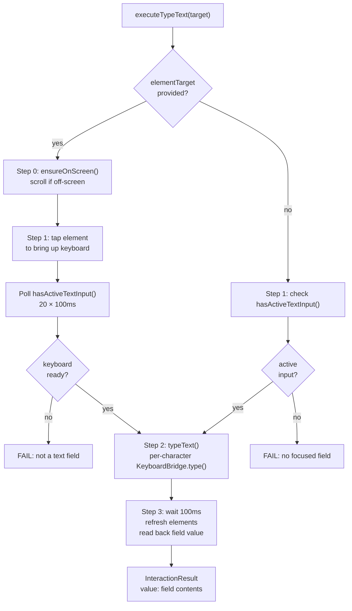

# TheSafecracker Deep Dive: Text Entry

> **Source:** `ButtonHeist/Sources/TheInsideJob/TheBrains/Actions.swift` (`executeTypeText`), `TheSafecracker/TheSafecracker.swift` (raw keyboard methods), `TheSafecracker/KeyboardBridge.swift`
> **Parent dossier:** [14-THESAFECRACKER.md](14-THESAFECRACKER.md)

Text entry bypasses the UIKit touch system entirely and speaks to `UIKeyboardImpl` through `KeyboardBridge` — a dedicated `@MainActor struct` that wraps all private API access via `ObjCRuntime`. This is the same technique used by the KIF testing framework. It works with both software and hardware keyboards.

**Invariant:** Text entry is a focus transaction: resolve one editable target, make it first responder, wait for an active `UIKeyInput` delegate, then mutate text through that input path.

## The 3-Step Pipeline

`executeTypeText` orchestrates three steps. Focus is mandatory: either the command provides an `elementTarget` to tap, or a text input must already be active. Once focus is established, the command types the required non-empty text. Clear and delete are explicit `edit_action` commands, not `type_text` side effects.



### Step 0: Ensure on screen

If `elementTarget` is provided, `ensureOnScreen(for:)` scrolls the element into view before tapping. See [14a-SCROLLING.md](14a-SCROLLING.md).

### Step 1: Focus

**With elementTarget:** Resolves the element via TheStash, taps at its `activationPoint` via synthetic touch, then polls `hasActiveTextInput()` every 100ms for up to 2 seconds (20 iterations). The poll exists because keyboard activation is asynchronous — UIKit needs time to create the keyboard host view and connect the input delegate.

**Without elementTarget:** Checks `hasActiveTextInput()` once. If false, fails immediately — the caller must either provide an element to tap or ensure a field is already focused.

### Step 2: Type text

Iterates each `Character` in the string (Swift character granularity, not UTF-16 code units). For each:

1. Calls `KeyboardBridge.shared()?.type(character)` — which sends `addInputString:` with a single-character `String` to `UIKeyboardImpl.sharedInstance` and drains the task queue
2. Sleeps `interKeyDelay` (30ms default)

`addInputString:` routes the character through the keyboard's internal input processing, which means it lands in the first responder via the normal `UIKeyInput.insertText(_:)` pathway with all associated responder-chain delegate callbacks.

### Step 3: Readback

Waits 100ms, refreshes the accessibility element cache via `brains.refresh()`, then re-resolves the element and reads its `value` property. This value is returned in the `InteractionResult` so the agent knows what the field contains after typing.

## KeyboardBridge

`KeyboardBridge` (`KeyboardBridge.swift`) is a `@MainActor struct` that encapsulates all `UIKeyboardImpl` private API access:

| Method/Property | What it does |
|--------|-------------|
| `static shared() -> KeyboardBridge?` | `UIKeyboardImpl.sharedInstance` via `ObjCRuntime.classMessage`; nil if class/selector absent |
| `var delegate: AnyObject?` | Reads `UIKeyboardImpl.delegate` via ObjCRuntime |
| `var hasActiveInput: Bool` | `delegate is UIKeyInput` — true if a text input conformer is the current input delegate |
| `func type(_ character: Character)` | Calls `addInputString:` + `drainTaskQueue()` |
| `func deleteBackward()` | Calls `deleteFromInput` + `drainTaskQueue()` |
| `private func drainTaskQueue()` | Gets `taskQueue` from impl, calls `waitUntilAllTasksAreFinished` |

Uses `sharedInstance`, not `activeInstance`. The difference matters:
- `sharedInstance` persists across both software and hardware keyboard modes
- `activeInstance` returns nil when a hardware keyboard is connected because UIKit doesn't create a software keyboard view

## Keyboard Detection

### `hasActiveTextInput()`

Checks whether `KeyboardBridge.shared()?.hasActiveInput` is true. The `UIKeyboardImpl.sharedInstance` singleton can exist without a focused text field; readiness requires its delegate to conform to `UIKeyInput`.

### Keyboard visibility tracking (TheTripwire)

Keyboard visibility is tracked by **TheTripwire**, not TheSafecracker. TheTripwire registers for three notifications:

- `keyboardWillShowNotification` → `keyboardVisibleFlag = true`
- `keyboardDidHideNotification` → `keyboardVisibleFlag = false`
- `keyboardDidChangeFrameNotification` → frame-based check: end frame must intersect screen bounds with `height > 0` and `origin.y < screenBounds.height`

This notification-based approach was adopted because on iOS 26, `UIKeyboardImpl`'s host window no longer appears in `UIWindowScene.windows`, making view-hierarchy-based keyboard detection unreliable.

`TheSafecracker.isKeyboardVisible()` reads `tripwire.keyboardVisibleFlag` directly for an immediate answer, then falls back to `KeyboardBridge.shared()?.hasActiveInput` for hardware-keyboard scenarios where the software keyboard frame is off-screen.

## drainTaskQueue — Why It Exists

`UIKeyboardImpl` enqueues character processing work on an internal `taskQueue`. Without draining, a rapid succession of `addInputString:` or `deleteFromInput` calls outpaces the keyboard's processing, causing dropped or reordered characters. This is a direct port of KIF's `[taskQueue waitUntilAllTasksAreFinished]` pattern.

The drain is encapsulated in `KeyboardBridge` and runs synchronously on the main actor after each `type()` or `deleteBackward()` call, before the `interKeyDelay` sleep.

## First Responder Routing

TheSafecracker does not walk the view hierarchy to find the first responder for text mutation. Standard edit operations (`selectAll`, `delete`, `copy`, `paste`, `cut`, `resignFirstResponder`) route through `UIApplication.shared.sendAction(..., to: nil, ...)`, which lets UIKit dispatch to the current responder. Text mutation routes through `KeyboardBridge` only after `hasActiveTextInput()` confirms that `UIKeyboardImpl.delegate` is a `UIKeyInput`.

`ensureFirstResponderOnScreen()` is a navigation concern, not a text mutation concern. It uses `tripwire.currentFirstResponder()` when edit and pasteboard commands need the human-visible focused field scrolled into view. See [14a-SCROLLING.md](14a-SCROLLING.md) for the auto-scroll entry points.

## Edit Actions

`performEditAction` sends standard edit actions through UIKit's responder chain:

```swift
UIApplication.shared.sendAction(action.selector, to: nil, from: nil, for: nil)
```

With `to: nil`, UIKit walks the responder chain from the first responder upward until something handles it.

| EditAction case | Selector |
|-----------------|----------|
| `.copy` | `copy(_:)` |
| `.paste` | `paste(_:)` |
| `.cut` | `cut(_:)` |
| `.select` | `select(_:)` |
| `.selectAll` | `selectAll(_:)` |
| `.delete` | `delete(_:)` |

`executeEditAction` calls `ensureFirstResponderOnScreen()` first so the human observer sees the target field.

## Timing Constants

| Constant | Value | Used by |
|----------|-------|---------|
| `defaultInterKeyDelay` | 30ms | Default delay between each keypress |
| `maxInterKeyDelay` | 500ms | Upper clamp applied in `executeTypeText` |
| 100ms poll | hardcoded | Step 1 — keyboard readiness polling interval |
| 2s timeout | 20 × 100ms | Step 1 — max wait for keyboard to appear |
| 100ms settle | hardcoded | Step 3 — before readback |

The effective `interKeyDelay` is `min(defaultInterKeyDelay, maxInterKeyDelay)` = 30ms. The 30ms delay per character means typing 100 characters takes ~3 seconds.

## Requirements

- **UIKeyboardImpl present.** The `sharedInstance` singleton must be resolvable via ObjC runtime. This is a private class that has existed since iOS 2 and is stable across versions.
- **addInputString: and deleteFromInput selectors.** These must exist on `UIKeyboardImpl`. Both are KIF-validated patterns.
- **Active UIKeyInput delegate.** The keyboard bridge must have a delegate that conforms to `UIKeyInput`. This is stricter than resolving `UIKeyboardImpl.sharedInstance`, which can exist even when no editable responder is focused.
- **Main actor.** All text methods interact with UIKit responder chain and must run on the main thread.

## Limitations

- **No autocomplete/suggestion interaction.** Characters are injected directly — autocomplete suggestions that appear in the suggestion bar are not tapped or dismissed. The text lands as-is.
- **No secure text field detection.** Typing into secure fields (password fields) works, but the readback in Step 3 returns the masked value or nil, not the actual typed text.
- **Single-character granularity.** Each character is a separate `addInputString:` call with a sleep between. Emoji sequences and complex Unicode clusters work (Swift `Character` handles them), but the per-character delay adds up for long strings.
- **No IME / multi-stage input.** CJK input methods that require composition (pinyin, kana) are not supported — characters are injected as final text, bypassing the composition stage.
- **Replacement depends on responder-chain edit actions.** Use `edit_action selectAll` and `edit_action delete` before `type_text` when replacing existing contents.
- **Hardware keyboard drain timing.** `drainTaskQueue` may behave differently with hardware keyboards since the task queue processing path differs. In practice this hasn't been an issue because the drain is synchronous.

## Error Cases

| Condition | Error message |
|-----------|--------------|
| Element not found | "Target element not found" |
| Tap failed | "Failed to tap target element to bring up keyboard" |
| Keyboard didn't appear in 2s | "No active text input after tapping element. The element may not be a text field." |
| No focus, no elementTarget | "No active text input. Provide an elementTarget to focus a text field, or ensure a text field is already focused." |
| Type failed | "No keyboard or focused text input available for typing." |
