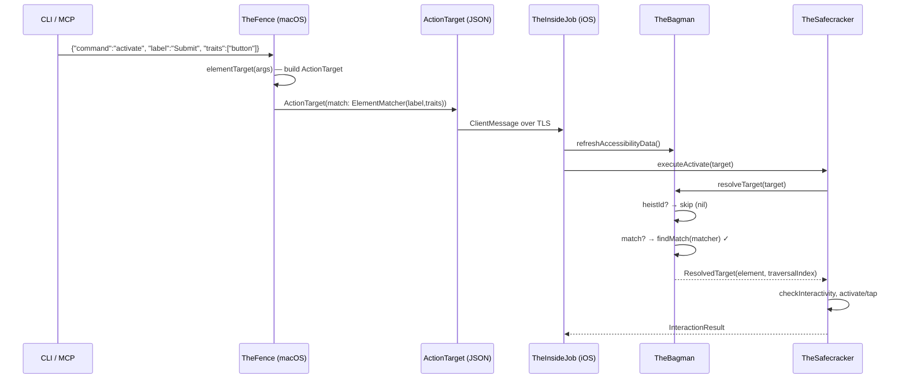
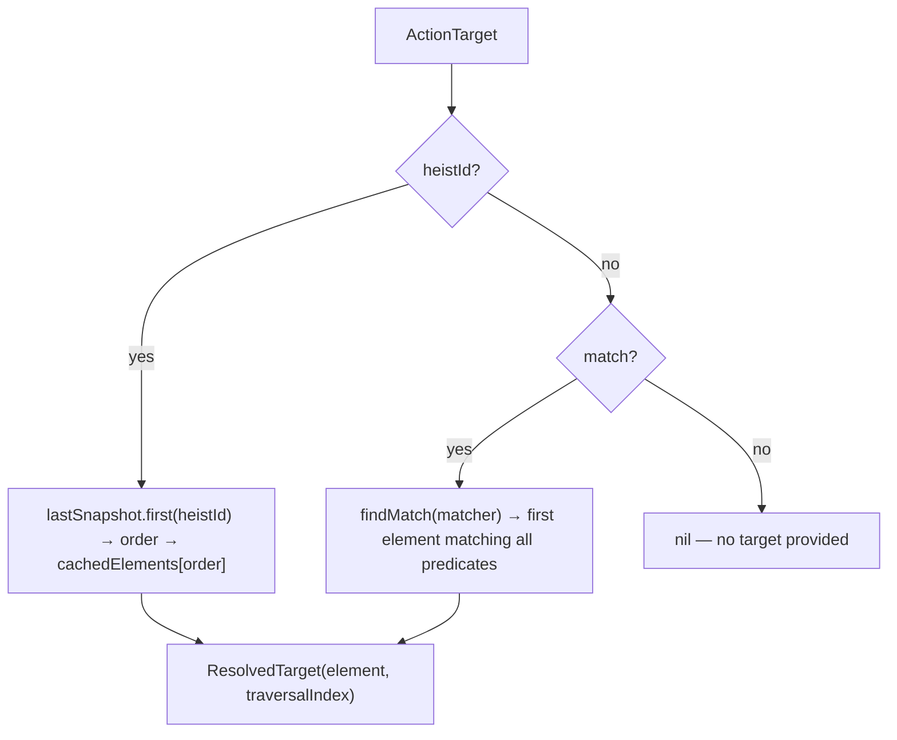

# Unified Targeting - Element Resolution

> **Cross-cutting concern:** TheFence → TheScore (wire) → TheBagman → TheSafecracker
> **Role:** Routes every action command to a concrete element via a single resolution path

## Overview

Unified targeting turns a caller's intent ("tap the Submit button") into a concrete `AccessibilityElement` and traversal index on the iOS side. Every action command — activate, scroll, swipe, type_text, gesture, edit_action — flows through the same resolution pipeline.

There are exactly **two targeting strategies**:

1. **heistId** — "you gave me this token, I hand it back." Assigned by `get_interface`, presumed stable while the element is on screen. Fast lookup via the snapshot index.
2. **match** — "I'm describing the element by its accessibility properties." A predicate-based search on label, identifier, value, and traits. Callers can embed expectations (e.g. `value="6"`) so stale state fails early instead of acting on the wrong element.

A single method, `TheBagman.resolveTarget(_:)`, implements this priority chain and returns both the `AccessibilityElement` and its `traversalIndex`. Every action executor calls this method — there are no alternative resolution paths.

### What was removed

- **`identifier` on ActionTarget** — accessibility identifier is an accessibility property, so it belongs in the matcher. Sending `{"identifier": "btn"}` builds `ActionTarget(match: ElementMatcher(identifier: "btn"))`.
- **`order` on ActionTarget** — fragile positional index that shifts when anything on screen changes. Encouraged callers to skip understanding what they're targeting. Removed entirely.
- **`heistId` on ElementMatcher** — heistId is an assigned token, not an accessibility property. It lives on ActionTarget, not in the matcher.
- **Legacy resolution methods** — `findElement(for:)` and `resolveTraversalIndex(for:)` were dead code. Removed.

## Data Flow



## Entry Point: TheFence.elementTarget()

`TheFence.swift` — called from every action handler. Reads raw args and builds an `ActionTarget`.

**Routing:** if *any* accessibility property is present (label, identifier, value, traits, excludeTraits), all are packed into an `ElementMatcher`. `heistId` stays on `ActionTarget` directly. Both can coexist — heistId takes priority in resolution.

```
args: {"identifier":"btn", "traits":["button"]}
  → ActionTarget(match: ElementMatcher(identifier:"btn", traits:["button"]))

args: {"identifier":"btn"}
  → ActionTarget(match: ElementMatcher(identifier:"btn"))

args: {"heistId":"button-Submit-0"}
  → ActionTarget(heistId: "button-Submit-0")

args: {"heistId":"button-Submit-0", "label":"Submit"}
  → ActionTarget(heistId: "button-Submit-0", match: ElementMatcher(label:"Submit"))
```

There are two builder methods:
- **`elementTarget(_:)`** — used by all action commands. Produces `ActionTarget`.
- **`elementMatcher(_:)`** — used by `get_interface`, `scroll_to_visible`, `wait_for`. Produces `ElementMatcher` directly (includes `absent` flag).

## Wire Types

### ActionTarget (TheScore/ClientMessages.swift)

```swift
struct ActionTarget: Codable, Sendable {
    let heistId: String?       // assigned token from get_interface
    let match: ElementMatcher? // describe by accessibility properties
}
```

At most one strategy is active. When both are present, heistId wins.

### ElementMatcher (TheScore/Elements.swift)

```swift
struct ElementMatcher: Codable, Sendable, Equatable {
    let label: String?           // exact match on element label
    let identifier: String?      // exact match on accessibility identifier
    let value: String?           // exact match on element value
    let traits: [String]?        // all must be present (AND)
    let excludeTraits: [String]? // none may be present
    let scope: MatchScope?       // .elements (default), .containers, .both
    let absent: Bool?            // caller asserts no match exists
}
```

All non-nil fields must match — **AND semantics**. This is intentional: callers encode expectations into the search. If you expect a slider at value "6" and want to increment to "7", embed `value="6"` in the matcher — stale state fails early instead of acting on the wrong element.

Trait names are resolved to `UIAccessibilityTraits` bitmasks on the iOS side via `AccessibilitySnapshotParser.knownTraits`. Unknown trait names cause an automatic miss (no silent degradation).

## Resolution: TheBagman.resolveTarget()

`TheBagman.swift` — the single resolution method. Returns `ResolvedTarget(element, traversalIndex)` or nil.



## Error Diagnostics: Progressive Disclosure

When `resolveTarget` returns nil, the error message anticipates what the caller needs to self-correct. Three tiers, from most to least specific:

### Tier 1: Near-miss — "you're right but something changed"

Progressively relaxes one predicate at a time (value first, then traits, label, identifier). When a relaxed matcher finds an element, reports what diverged:

```
No match for: label="Volume" traits=[adjustable] value="6"
near miss: matched all fields except value — actual value=8
```

Value is relaxed first because it's the most likely to drift (slider moved, text changed). This gives the caller the actual value so they can retry with correct expectations or proceed knowing the current state.

### Tier 2: Substring match — "did you mean...?"

When no near-miss is found but the label partially matches existing elements:

```
No match for: label="Save"
similar labels: "Save Changes", "Save Draft", "Save as Template"
```

### Tier 3: Total miss — "here's what I see"

When nothing is close, dumps a compact element summary (capped at 20) so the caller can self-correct without another round-trip:

```
No match for: label="LoginButton" traits=[button]
14 elements on screen:
  label="Welcome" [staticText]
  label="Email" id="emailField" [textField]
  label="Password" id="passwordField" [secureTextField]
  label="Sign In" [button]
  ...
```

The goal: every error message answers the obvious next question. "Why didn't it match?" → here's what actually diverged. "What's even on screen?" → here, you figure it out.

## Matching Infrastructure (TheBagman+Matching.swift)

Matching operates on the **canonical `AccessibilityElement` tree**, not wire types. Two parallel search surfaces exist:

| Surface | Used by | Method |
|---------|---------|--------|
| **Flat array** (`cachedElements`) | `resolveTarget` via `findMatch` | `[AccessibilityElement].firstMatch(_:)` — linear scan |
| **Hierarchy tree** (`[AccessibilityHierarchy]`) | `get_interface` filtering | `AccessibilityHierarchy.matches(_:)` — recursive tree walk |

### Match scope

`MatchScope` controls which node types are evaluated:

- `.elements` (default) — leaf nodes only
- `.containers` — container nodes only (groups with children)
- `.both` — both leaf and container nodes

Containers only carry label/value/identifier (via `semanticGroup`). They have no `UIAccessibilityTraits`, so any `traits` predicate auto-fails on containers.

### Match evaluation (AccessibilityElement.matches)

1. `label` — exact string equality
2. `identifier` — exact string equality
3. `value` — exact string equality
4. `traits` — resolve names to bitmask, check `traits.contains(mask)`. Unknown names → miss.
5. `excludeTraits` — resolve names to bitmask, check `traits.isDisjoint(with: mask)`. Unknown names → miss.

All checks are AND — first failure short-circuits to false.

## Callers

Every action executor in TheSafecracker calls `bagman.resolveTarget(target)`:

| Method | File | What it needs |
|--------|------|--------------|
| `ensureOnScreen(for:)` | TheSafecracker+Actions.swift | traversalIndex → object → scroll ancestor |
| `executeScroll(_:)` | TheSafecracker+Actions.swift | traversalIndex → scroll ancestor |
| `executeScrollToEdge(_:)` | TheSafecracker+Actions.swift | traversalIndex → scroll to edge |
| `executeActivate(_:)` | TheSafecracker+Actions.swift | element (interactivity check) + traversalIndex (activate/tap) |
| `executeIncrement(_:)` | TheSafecracker+Actions.swift | element (fingerprint point) + traversalIndex (increment) |
| `executeDecrement(_:)` | TheSafecracker+Actions.swift | element (fingerprint point) + traversalIndex (decrement) |
| `executeCustomAction(_:)` | TheSafecracker+Actions.swift | traversalIndex (perform action) |
| `executeTypeText(_:)` | TheSafecracker+TextEntry.swift | element (activation point for tap-to-focus) |
| `resolvePoint(from:)` | TheBagman.swift | element (activation point for gesture origin) |
| `actionResultWithDelta(...)` | TheBagman.swift | element (post-action label/value/traits readback) |

Touch gestures (tap, swipe, long_press, drag, pinch, rotate, two_finger_tap) go through `resolvePoint` which calls `resolveTarget` internally.

### Commands that bypass ActionTarget

These commands use `ElementMatcher` directly (not `ActionTarget`):

| Command | Why |
|---------|-----|
| `get_interface` | Filters the full hierarchy tree, returns multiple matches |
| `scroll_to_visible` | Scrolls until a match appears, uses `findMatch`/`hasMatch` directly |
| `wait_for` | Polls for element appearance/disappearance, uses `hasMatch` directly |

## Design Principles

1. **Two strategies, nothing else.** heistId (you got this token) or matcher (describe what you want). No positional indices, no guessing.
2. **Single resolution path** — `resolveTarget()` is the only way to go from `ActionTarget` to a live element. No alternative code paths that could fall out of sync.
3. **Exact matching only** — no fuzzy resolution, no partial matches. Miss → progressive diagnostic that answers the next question.
4. **Expectations in the search** — embed value/trait expectations in the matcher so stale state fails early. A slider at value "8" won't match a search for value "6" — you'll know immediately something changed.
5. **heistId always wins** — fastest path (snapshot lookup by stable ID), deterministic. When a caller has a heistId, they know exactly which element they want.
6. **Matching on canonical types** — `ElementMatcher` predicates resolve against `AccessibilityElement` (parser types with real `UIAccessibilityTraits`), not wire types (`HeistElement` with string trait arrays). This avoids lossy string round-trips.
7. **Progressive disclosure on failure** — errors go from "here's what changed" to "here's what's on screen" depending on how close the miss was. Every error answers the obvious next question.
