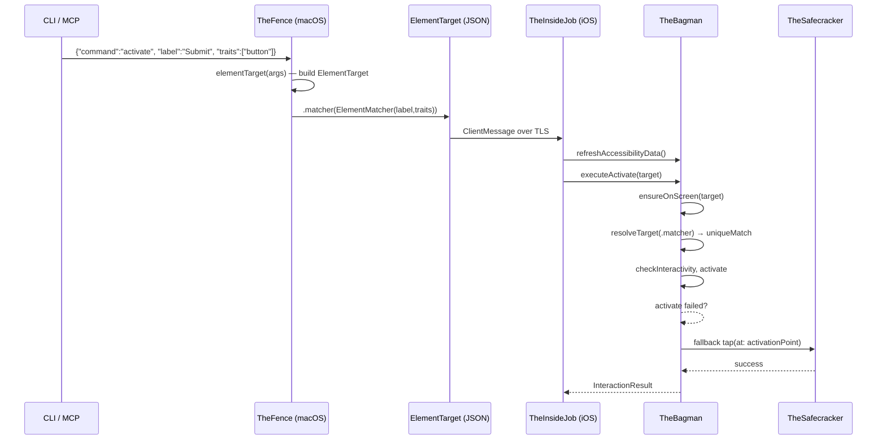
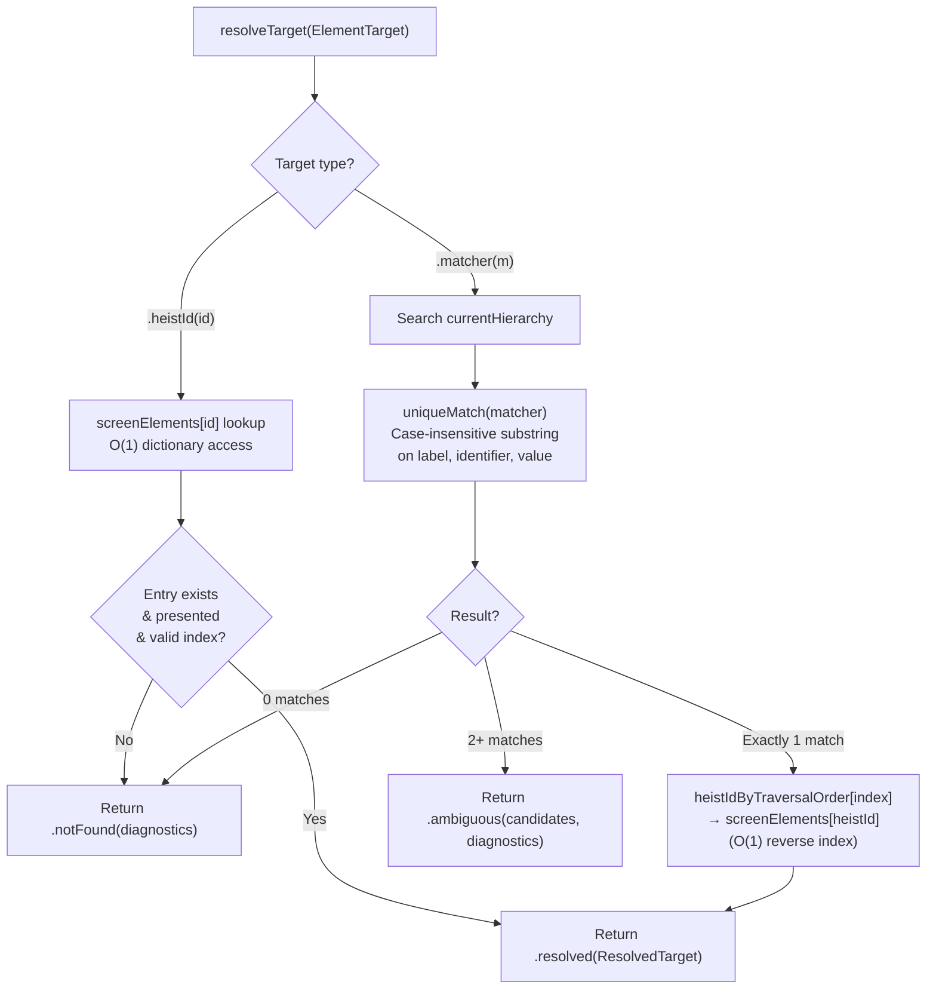

# Unified Targeting - Element Resolution

> **Cross-cutting concern:** TheFence → TheScore (wire) → TheBagman → TheSafecracker
> **Role:** Routes every action command to a concrete element via a single resolution path

## Overview

Unified targeting turns a caller's intent ("tap the Submit button") into a concrete `AccessibilityElement` and traversal index on the iOS side. Every action command — activate, scroll, swipe, type_text, gesture, edit_action — flows through the same resolution pipeline.

There are exactly **two targeting strategies**, encoded as cases of the `ElementTarget` enum:

1. **`.heistId(String)`** — "you gave me this token, I hand it back." Assigned by `get_interface`, presumed stable while the element is on screen. O(1) lookup via `screenElements` dictionary.
2. **`.matcher(ElementMatcher)`** — "I'm describing the element by its accessibility properties." A predicate-based search on label, identifier, value, and traits with case-insensitive substring matching. Callers can embed expectations (e.g. `value="6"`) so stale state fails early instead of acting on the wrong element.

A single method, `TheBagman.resolveTarget(_:)`, implements this and returns `ResolvedTarget(screenElement, element, traversalIndex)`. Every action executor calls this method — there are no alternative resolution paths.

### What was removed/changed

- **`ActionTarget` struct** — replaced by `ElementTarget` enum. The old struct had two optional fields (`heistId: String?`, `match: ElementMatcher?`) creating four states, two of which were invalid. The enum has exactly two valid cases.
- **`identifier` on ActionTarget** — accessibility identifier is an accessibility property, so it belongs in the matcher.
- **`order` on ActionTarget** — fragile positional index that shifts when anything on screen changes. Removed entirely.
- **`heistId` on ElementMatcher** — heistId is an assigned token, not an accessibility property. It lives on ElementTarget, not in the matcher.
- **`lastSnapshot` array** — replaced by `screenElements` dictionary for O(1) heistId lookup.
- **Legacy resolution methods** — `findElement(for:)` and `resolveTraversalIndex(for:)` were dead code. Removed.

## Data Flow



## Entry Point: TheFence.elementTarget()

`TheFence.swift` — called from every action handler. Reads raw args and builds an `ElementTarget`.

**Routing:** if *any* accessibility property is present (label, identifier, value, traits, excludeTraits), all are packed into an `ElementMatcher`. `heistId` stays on `ElementTarget` directly. Both can coexist — heistId takes priority in resolution.

```
args: {"identifier":"btn", "traits":["button"]}
  → ElementTarget(match: ElementMatcher(identifier:"btn", traits:["button"]))

args: {"identifier":"btn"}
  → ElementTarget(match: ElementMatcher(identifier:"btn"))

args: {"heistId":"button-Submit-0"}
  → ElementTarget(heistId: "button-Submit-0")

args: {"heistId":"button-Submit-0", "label":"Submit"}
  → ElementTarget(heistId: "button-Submit-0", match: ElementMatcher(label:"Submit"))
```

There are two builder methods:
- **`elementTarget(_:)`** — used by all action commands. Produces `ElementTarget`.
- **`elementMatcher(_:)`** — used by `get_interface`, `scroll_to_visible`, `wait_for`. Produces `ElementMatcher` directly (includes `absent` flag).

## Wire Types

### ElementTarget (TheScore/Elements.swift)

```swift
enum ElementTarget: Codable, Sendable {
    case heistId(String)          // assigned token from get_interface
    case matcher(ElementMatcher)  // describe by accessibility properties
}
```

Exactly one strategy per target — no invalid states. Custom flat-wire Codable preserves backward compatibility with JSON like `{"heistId": "btn"}` or `{"label": "Submit", "traits": ["button"]}`.

### ElementMatcher (TheScore/Elements.swift)

```swift
struct ElementMatcher: Codable, Sendable, Equatable {
    let label: String?           // exact match on element label
    let identifier: String?      // exact match on accessibility identifier
    let value: String?           // exact match on element value
    let traits: [String]?        // all must be present (AND)
    let excludeTraits: [String]? // none may be present
    let absent: Bool?            // caller asserts no match exists
}
```

All non-nil fields must match — **AND semantics**. This is intentional: callers encode expectations into the search. If you expect a slider at value "6" and want to increment to "7", embed `value="6"` in the matcher — stale state fails early instead of acting on the wrong element.

Trait names are resolved to `UIAccessibilityTraits` bitmasks on the iOS side via `AccessibilitySnapshotParser.knownTraits`. Unknown trait names cause an automatic miss (no silent degradation).

## Resolution: TheBagman.resolveTarget()

`TheBagman.swift` — the single resolution method. Returns `ResolvedTarget(screenElement, element, traversalIndex)` or nil.



## Error Diagnostics: Progressive Disclosure

When `resolveTarget` returns nil, the caller invokes `elementNotFoundMessage(for:)` which produces a tiered diagnostic. Three tiers, from most to least specific:

### Tier 1: Ambiguous — "too many matches"

When 2+ elements match the substring predicate, lists all candidates (up to 10):

```
3 elements match: label="Save"
  "Save Changes" id=saveChangesBtn
  "Save Draft" id=saveDraftBtn
  "Save as Template"
```

### Tier 2: Near-miss — "you're right but something changed"

Progressively relaxes one predicate at a time (value first, then traits, label, identifier). When a relaxed matcher finds an element, reports what diverged:

```
No match for: label="Volume" traits=[adjustable] value="6"
near miss: matched all fields except value — actual value=8
```

Value is relaxed first because it's the most likely to drift (slider moved, text changed). Only relaxations that leave at least one remaining predicate are tried — dropping the only predicate matches everything, which isn't useful.

### Tier 3: Total miss — "here's what I see"

When nothing is close, dumps a compact element summary (capped at 20) so the caller can self-correct without another round-trip:

```
No match for: label="LoginButton" traits=[button]
14 elements on screen:
  label="Welcome" [staticText]
  label="Email" id="emailField" [textField]
  label="Password" id="passwordField" [secureTextField]
  label="Sign In" [button]
  ...
```

The goal: every error message answers the obvious next question. "Why didn't it match?" → here's what actually diverged. "What's even on screen?" → here, you figure it out.

## Matching Infrastructure (TheBagman+Matching.swift)

Matching operates on the **canonical `AccessibilityElement` tree**, not wire types. Two search surfaces exist:

| Surface | Used by | Method |
|---------|---------|--------|
| **Hierarchy tree** (`[AccessibilityHierarchy]`) | `resolveTarget`, `get_interface` filtering, `wait_for` | `AccessibilityHierarchy.matches(_:)` — recursive tree walk |
| **Flat array** (`cachedElements`) | Fallback when hierarchy is empty | `[AccessibilityElement].firstMatch(_:)` — linear scan |

The hierarchy tree is the primary surface. `findMatch(_:)` searches `currentHierarchy` directly.

### Match evaluation (AccessibilityElement.matches)

1. `label` — case-insensitive substring via `localizedCaseInsensitiveContains`
2. `identifier` — case-insensitive substring via `localizedCaseInsensitiveContains`
3. `value` — case-insensitive substring via `localizedCaseInsensitiveContains`
4. `traits` — resolve names to bitmask, check `traits.contains(mask)`. Unknown names → miss.
5. `excludeTraits` — resolve names to bitmask, check `traits.isDisjoint(with: mask)`. Unknown names → miss.

All checks are AND — first failure short-circuits to false. String matching is single-pass with no separate fuzzy tier.

## Callers

Every action executor in TheBagman calls `resolveTarget(target)`:

| Method | File | What it needs |
|--------|------|--------------|
| `ensureOnScreen(for:)` | TheBagman+Scroll.swift | screenElement → object → scroll ancestor |
| `executeScroll(_:)` | TheBagman+Scroll.swift | screenElement → object → scroll ancestor |
| `executeScrollToEdge(_:)` | TheBagman+Scroll.swift | screenElement → object → scroll to edge |
| `executeScrollToVisible(_:)` | TheBagman+Scroll.swift | resolveFirstMatch (first-match semantics) |
| `executeActivate(_:)` | TheBagman+Actions.swift | element (interactivity check) + screenElement (activate/fallback tap) |
| `executeIncrement(_:)` | TheBagman+Actions.swift | screenElement (increment) + element (fingerprint point) |
| `executeDecrement(_:)` | TheBagman+Actions.swift | screenElement (decrement) + element (fingerprint point) |
| `executeCustomAction(_:)` | TheBagman+Actions.swift | screenElement (perform action) |
| `executeTypeText(_:)` | TheBagman+Actions.swift | element (activation point for tap-to-focus) |
| `executeTap(_:)` | TheBagman+Actions.swift | resolvePoint → element activation point |
| `executeSwipe(_:)` | TheBagman+Actions.swift | resolvePoint or resolveFrame for unit-point swipe |
| `resolvePoint(from:)` | TheBagman.swift | element (activation point for gesture origin) |
| `actionResultWithDelta(...)` | TheBagman.swift | element (post-action label/value/traits readback) |

Touch gestures (tap, swipe, long_press, drag, pinch, rotate, two_finger_tap) go through `resolvePoint` which calls `resolveTarget` internally. TheSafecracker is called only for the raw gesture synthesis after TheBagman has resolved the target.

### Commands that bypass ElementTarget

These commands use `ElementMatcher` directly (not `ElementTarget`):

| Command | Why |
|---------|-----|
| `get_interface` | Filters the full hierarchy tree, returns multiple matches |
| `scroll_to_visible` | Scrolls until a match appears, uses `findMatch`/`hasMatch` directly |
| `wait_for` | Polls for element appearance/disappearance, uses `hasMatch` directly |

## Design Principles

1. **Two strategies, nothing else.** heistId (you got this token) or matcher (describe what you want). No positional indices, no guessing.
2. **Single resolution path** — `resolveTarget()` is the only way to go from `ElementTarget` to a live element. No alternative code paths that could fall out of sync.
3. **Exact matching only** — no fuzzy resolution, no partial matches. Miss → progressive diagnostic that answers the next question.
4. **Expectations in the search** — embed value/trait expectations in the matcher so stale state fails early. A slider at value "8" won't match a search for value "6" — you'll know immediately something changed.
5. **heistId always wins** — fastest path (snapshot lookup by stable ID), deterministic. When a caller has a heistId, they know exactly which element they want.
6. **Matching on canonical types** — `ElementMatcher` predicates resolve against `AccessibilityElement` (parser types with real `UIAccessibilityTraits`), not wire types (`HeistElement` with string trait arrays). This avoids lossy string round-trips.
7. **Progressive disclosure on failure** — errors go from "here's what changed" to "here's what's on screen" depending on how close the miss was. Every error answers the obvious next question.

## CLI Targeting Surface

`ElementTargetOptions` (`ButtonHeistCLI/Sources/Support/ElementTargetOptions.swift`) exposes the full matcher surface to all CLI subcommands:

| Flag | Maps to |
|------|---------|
| `--heist-id` | `ElementTarget.heistId` |
| `--label` | `ElementMatcher.label` |
| `--identifier` | `ElementMatcher.identifier` |
| `--value` | `ElementMatcher.value` |
| `--traits` | `ElementMatcher.traits` |
| `--exclude-traits` | `ElementMatcher.excludeTraits` |

`WaitForCommand` is the exception: it builds an `ElementMatcher` directly (no `--heist-id`, since `wait_for` polls by predicate, not by assigned token).

## Element Registry

`screenElements: [String: ScreenElement]` is the persistent element registry, keyed by heistId. It lives for the screen's duration and is populated during `updateScreenElements()` (called from `refreshAccessibilityData()`). Screen change = scorched earth (full wipe + rebuild from cached data).

`snapshotElements()` reads from `screenElements` and returns the currently visible elements (those in `onScreen`) as `[HeistElement]`. This is the wire-level view used for `get_interface` responses and delta computation.

HeistId resolution via `resolveTarget(.heistId)` is O(1) dictionary lookup into `screenElements`, gated by `presentedHeistIds` (elements sent to clients via `snapshot()`). Matcher resolution walks `currentHierarchy` then uses O(1) `heistIdByTraversalOrder` reverse index to find the corresponding `ScreenElement`. Matching always operates on canonical `AccessibilityElement` types, never on wire types.
