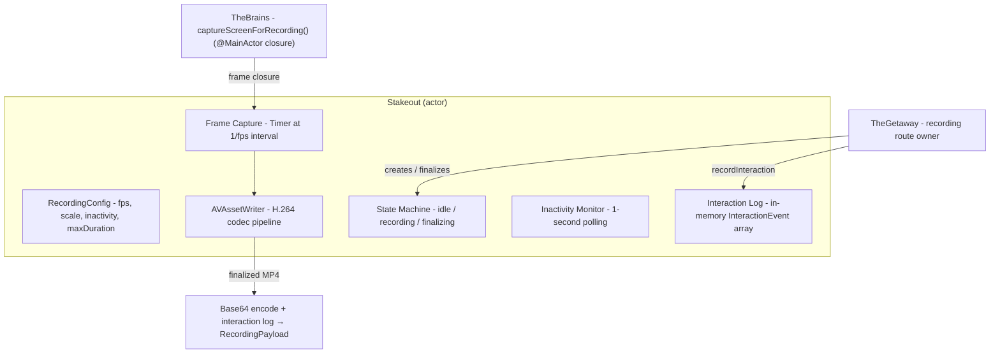
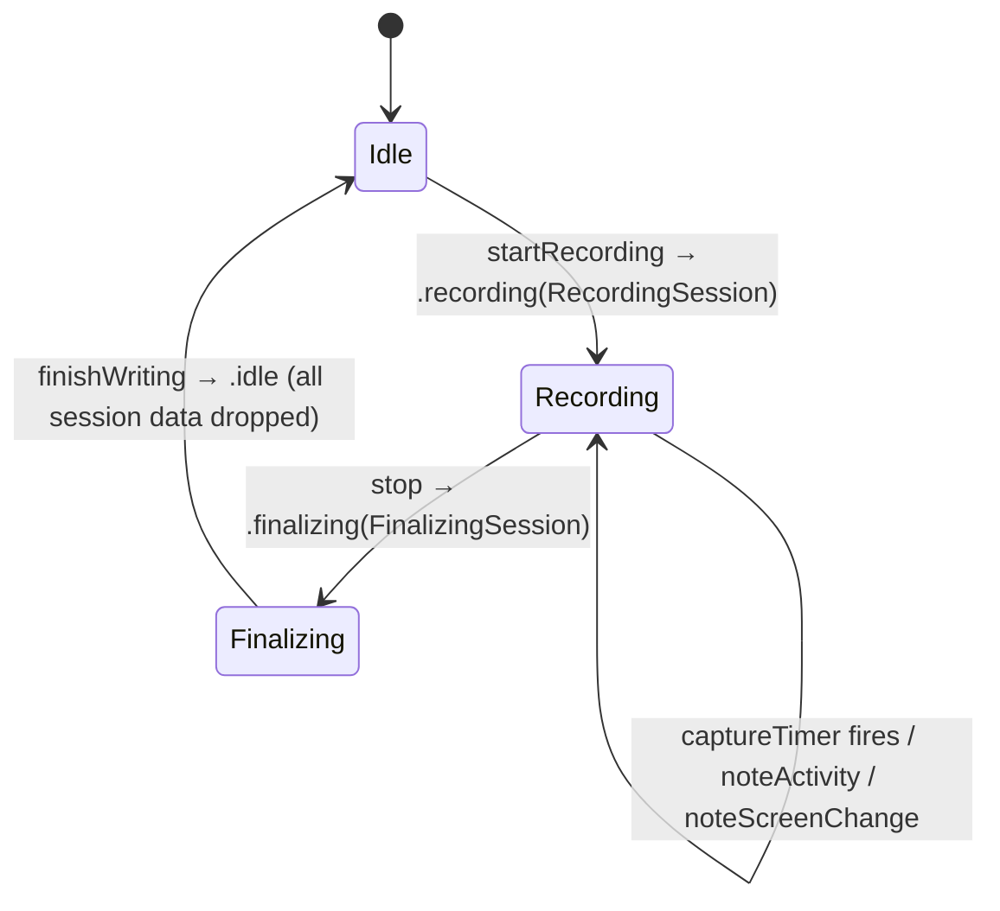
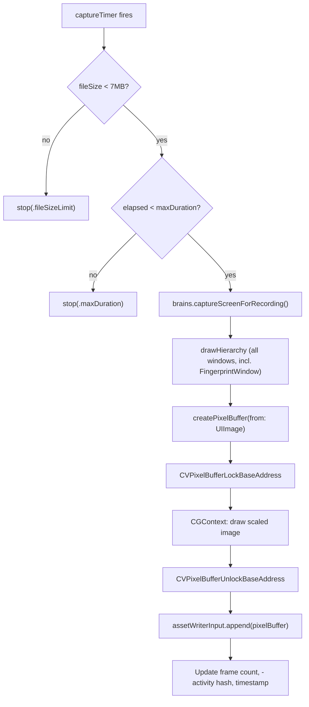
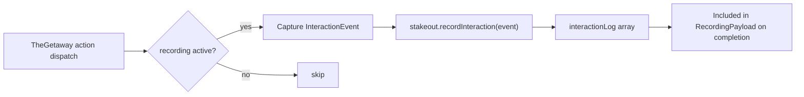

# TheStakeout - The Lookout

> **File:** `ButtonHeist/Sources/TheInsideJob/TheStakeout/TheStakeout.swift`
> **Platform:** iOS 17.0+ (AVFoundation, UIKit)
> **Role:** Screen recording engine - captures and encodes H.264/MP4 video for TheGetaway to route

## Responsibilities

TheStakeout handles all screen recording operations:

1. **Frame capture** at configurable FPS (1-15, default 8)
2. **H.264/MP4 encoding** via AVAssetWriter pipeline
3. **Resolution scaling** adjustable from 0.25x to 1.0x native
4. **Inactivity detection** auto-stops when no screen changes for timeout window
5. **Fingerprint inclusion** — recordings include the FingerprintWindow overlay because captureScreenForRecording() draws all windows
6. **Size limiting** caps at 7MB to stay under 10MB wire protocol buffer limit
7. **Max duration** caps at configurable limit (default 60s)
8. **Interaction logging** records wire-level command/result pairs alongside video

## Architecture Diagram



## Isolation Model

TheStakeout is declared `actor TheStakeout` (post-0.2.24 conversion from `@MainActor` class). The single MainActor escape hatch is `captureFrame` — the closure installed by TheGetaway that calls `brains.captureScreenForRecording()` to snapshot the live window hierarchy into a `UIImage`. Every other piece of state — the `stakeoutPhase` state machine, AVAssetWriter, the pixel-buffer adaptor, sample buffers, timer tasks — lives inside the actor. AVAssetWriter and its pixel-buffer adaptor are thread-safe and do not require MainActor isolation. The AVAssetWriter `finishWriting` completion handler bridges back into the actor via `Task { await self.handleFinalize(...) }` rather than hopping through MainActor.

## Recording State Machine

State is modeled as an enum with associated data — `RecordingSession` and `FinalizingSession` structs carry all fields that are only meaningful in their respective states. `.idle` carries nothing: no stale writer references, no orphaned tasks, no leftover frame counts. The transition from `.recording` to `.finalizing` explicitly drops timer tasks and captures only the data needed for finalization.



## Frame Capture Pipeline



## Configuration

| Parameter | Default | Range | Notes |
|-----------|---------|-------|-------|
| `fps` | 8 | 1-15 | Frames per second |
| `scale` | `1.0 / screen.scale` (~0.33 on 3x Retina) | 0.25-1.0 | Resolution multiplier applied to native pixels. When omitted, defaults to 1x point size (native / screen.scale) |
| `maxDuration` | 60.0s | >0 | Hard cap on recording length |
| `inactivityTimeout` | disabled | >0 | Optional early-stop after no changes |

## Interaction Recording

During an active recording, TheGetaway records each completed command/result as an `InteractionEvent` and appends it to Stakeout's in-memory log via `recordInteractionIfRecording(command:result:)`.

Each `InteractionEvent` contains:
- `timestamp: Double` (seconds since recording start, from `recordingElapsed`)
- `command: ClientMessage` (the command that triggered the interaction)
- `result: ActionResult` (the result returned to the client, which itself carries an `accessibilityDelta` inside)

On recording completion, the log is included in `RecordingPayload.interactionLog` (nil if empty).



## Items Flagged for Review

### HIGH PRIORITY

**7MB file size limit is disconnected from 10MB buffer limit** (`TheStakeout.swift`)
```swift
if fileSize > 7_000_000  // 7MB raw = ~9.3MB base64, under 10MB buffer limit
```
- The 7MB raw → ~9.3MB base64 math is correct (base64 expansion is ~1.33x)
- But this constant is not derived from `SocketReceiveFramer.defaultMaxBufferedBytes` (10_000_000)
- If someone changes the buffer limit, this constant won't auto-adjust
- The relationship is only documented in a code comment

### MEDIUM PRIORITY

**Inactivity detection uses accessibility hierarchy hash, not pixel comparison** (`TheStakeout.swift`)
- Activity is tracked via `noteScreenChange()` (called when TheStash detects a hierarchy hash change) and `noteActivity()` (called on each incoming client command)
- Subtle pixel-only animations (e.g. spinner rotation) do NOT count as activity, so they won't prevent inactivity timeout
- This is intentional — recording only extends when meaningful UI content changes

**Output dimensions rounded to even** (H.264 requirement)
- `nativePixels * effectiveScale` rounded to nearest even number
- This is correct for H.264 but could produce unexpected recording dimensions
- Users specifying `scale: 0.75` on a non-standard resolution might get slightly different output

**Recording payload delivered on demand**
- Completed video data is returned to the `stop_recording` waiter
- Automatic stops deliver the payload only to the `start_recording` originator when possible; other clients get lightweight `recordingStopped`
- Cached originator-owned payloads are cleared on owner disconnect or session release so a later driver cannot retrieve them

### LOW PRIORITY

**No cancellation of in-flight frame capture**
- If `stopRecording()` is called during `captureAndAppendFrame()`, the frame capture completes before stop is processed
- This is a benign race: the final frame is just included in the output

**`try?` on `Data(contentsOf:)` for finished MP4**
```swift
let videoData = try? Data(contentsOf: url)
```
- If reading the completed file fails, `deliverError(.finalizationFailed)` is called correctly
- The error detail from the failed read is lost though

**Interaction log payload size is bounded** (FIXED)
- Each `InteractionEvent` uses a compact `AccessibilityTrace.Delta?` instead of full before/after `Interface` snapshots
- The interaction log is capped at 500 events
- The 7MB file size cap applies to video data; the compact delta format keeps the JSON-encoded interaction log small
