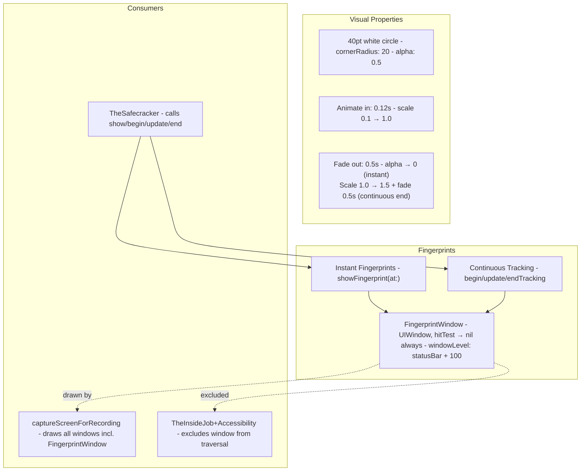
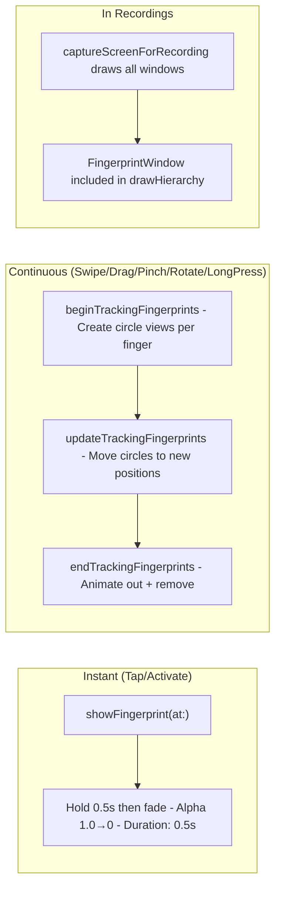

# Fingerprints - The Evidence

> **File:** `ButtonHeist/Sources/TheInsideJob/TheSafecracker/TheFingerprints.swift`
> **Platform:** iOS 17.0+ (UIKit)
> **Role:** Visual touch indicators - shows where interactions happen, included in recordings

## Responsibilities

Fingerprints provides visual feedback for all touch interactions:

1. **Passthrough overlay window** at window level `statusBar + 100`
2. **Instant fingerprints** for taps - 40pt white circle, holds for 0.5s then fades out over 0.5s
3. **Continuous tracking** for swipes/drags/pinches - multi-finger circles that follow touch; on end, scales 1.5x and fades out over 0.5s
4. **Recording integration** - FingerprintWindow is drawn with all windows in captureScreenForRecording(), so recordings include the overlay
5. **Accessibility exclusion** - window excluded from hierarchy traversal
6. **DEBUG-only** - entire class is inside `#if DEBUG` (and `#if canImport(UIKit)`)

## Architecture Diagram

## Interaction Types

## Items Flagged for Review

### LOW PRIORITY

**Fingerprints can be disabled via configuration**
- Set `INSIDEJOB_DISABLE_FINGERPRINTS=1` (env var) or `InsideJobDisableFingerprints=true` (Info.plist) to suppress all visual feedback
- When disabled, all `showFingerprint` / `beginTrackingFingerprints` / `updateTrackingFingerprints` / `endTrackingFingerprints` calls are no-ops
- Useful for automated testing at high speed where overlay animations add overhead

**Fingerprints captured via drawHierarchy**
- captureScreenForRecording() draws all windows (including FingerprintWindow)
- No separate CGContext compositing; the overlay is captured when visible at frame capture time

**Passthrough window always in the hierarchy**
- `FingerprintWindow` is created and added to the scene
- Even when no fingerprints are showing, the window exists
- It's excluded from accessibility traversal via `getTraversableWindows()` filter
