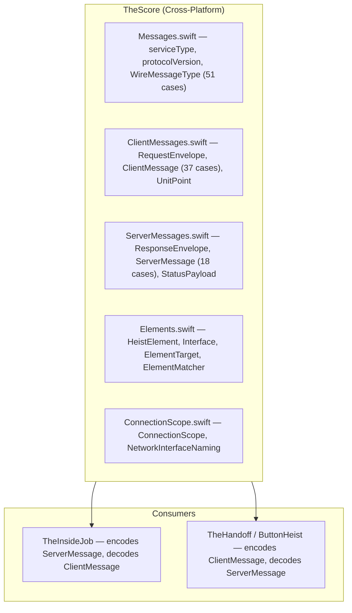
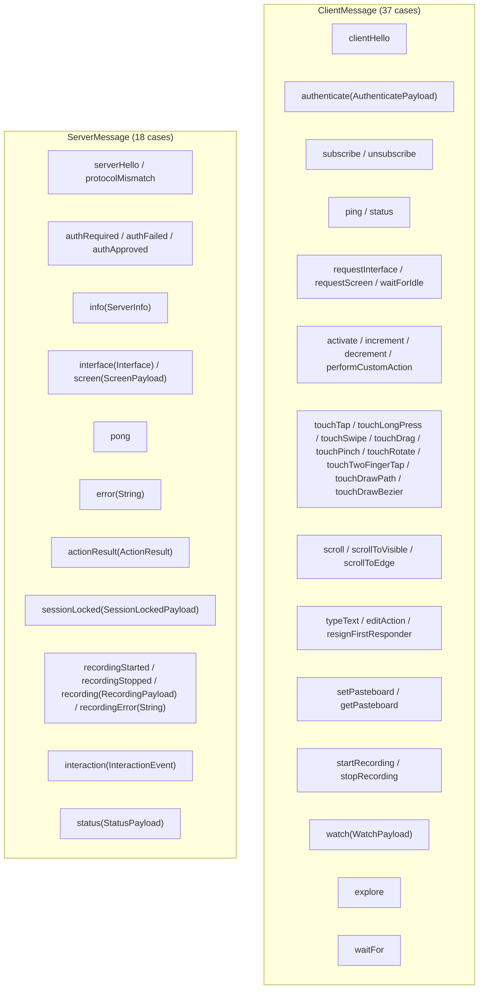
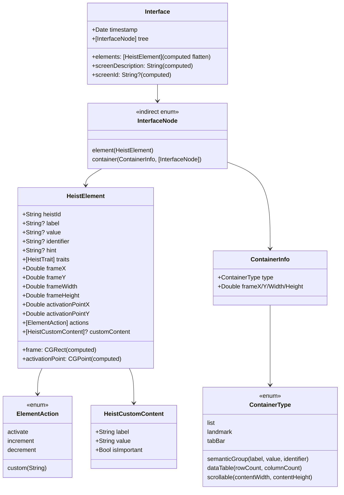
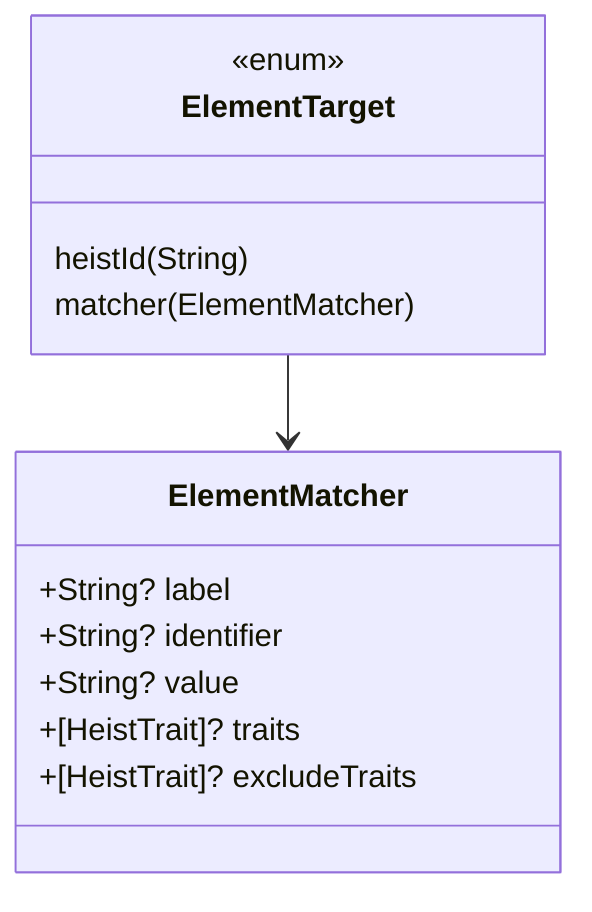
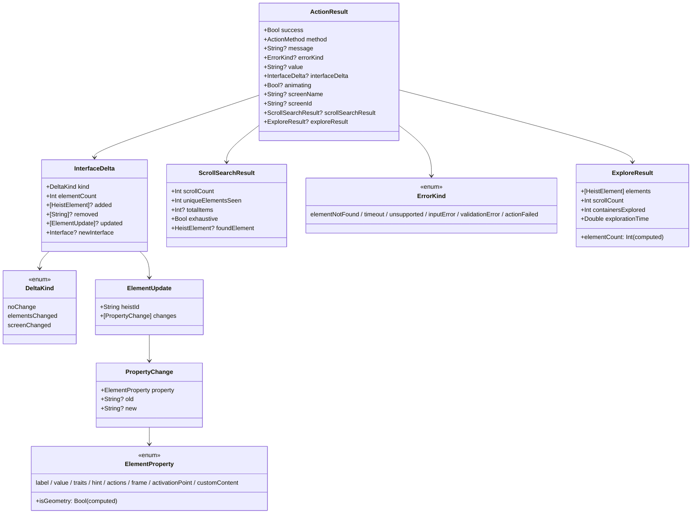
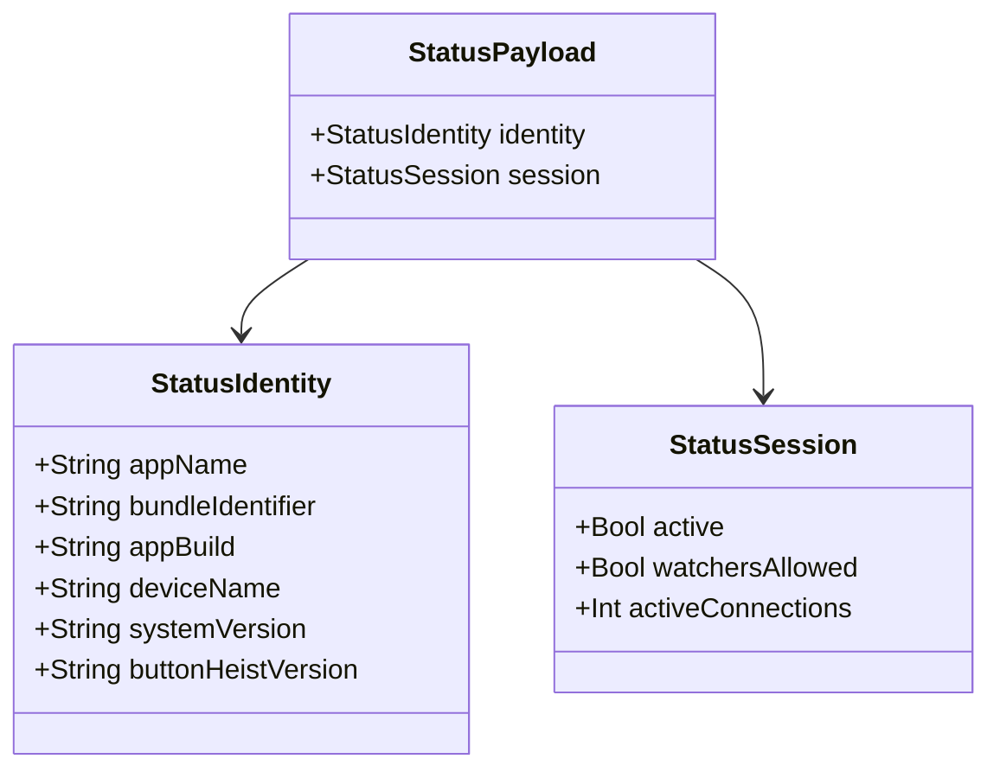
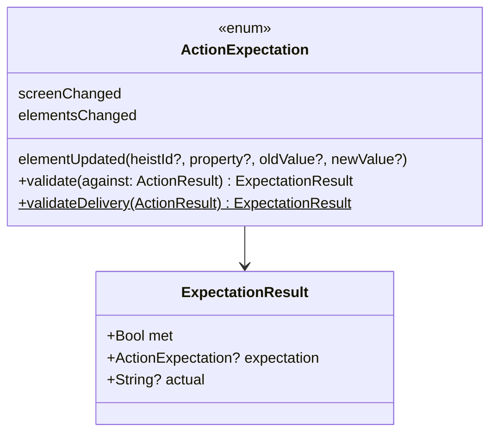

# TheScore — The Score

> **Module:** `ButtonHeist/Sources/TheScore/`
> **Platform:** iOS 17.0+ / macOS 14.0+ (cross-platform, no UIKit/AppKit)
> **Role:** Shared wire protocol definitions — the contract between iOS server and macOS clients

## Responsibilities

TheScore is the shared playbook. It defines:

1. **All client-to-server messages** (`ClientMessage` — 37 cases)
2. **All server-to-client messages** (`ServerMessage` — 18 cases, including `status(StatusPayload)`)
3. **Request/response envelopes** (`RequestEnvelope`, `ResponseEnvelope`) for correlation
4. **UI element types** (`HeistElement`, `Interface`, `InterfaceNode`, `ElementAction`, `ContainerInfo`, `HeistCustomContent`)
5. **Element targeting** (`ElementTarget`, `ElementMatcher`) — enum-based element reference (`.heistId`/`.matcher`) with structured multi-field AND matching
6. **Action result types** (`ActionResult`, `InterfaceDelta`, `ActionMethod`, `ScrollSearchResult`)
7. **Action outcome signals** (`ActionExpectation`, `ExpectationResult`) — outcome classifiers for actions
8. **Media payloads** (`ScreenPayload`, `RecordingPayload`)
9. **Interaction events** (`InteractionEvent`) — wire-level command/result recording, also broadcast live to observers
10. **Status types** (`StatusPayload`, `StatusIdentity`, `StatusSession`) — server identity and session state
11. **Watch payload** (`WatchPayload`) — observer connection parameters
12. **Server info** (`ServerInfo`)
13. **Protocol constants** (service type, version)
14. **`ButtonHeistActor`** — dedicated global actor for the host-side control plane
15. **Connection scope types** (`ConnectionScope`) — configurable connection source filtering (simulator, USB, network) with address classification
16. **Unit-point geometry** (`UnitPoint`) — element-relative coordinates for gestures

## Source Files

| File | Contents |
|------|----------|
| `Messages.swift` | `buttonHeistServiceType`, `protocolVersion` ("9.0"), `WireMessageType` (51 cases), `ButtonHeistActor` |
| `ClientMessages.swift` | `RequestEnvelope`, `ClientMessage` (37 cases), all action target structs, `UnitPoint`, `RecordingConfig` |
| `ServerMessages.swift` | `ResponseEnvelope`, `ServerMessage` (18 cases), `ActionResult`, `ErrorKind`, `InterfaceDelta`, `StatusPayload`, `ScreenPayload`, `RecordingPayload`, `InteractionEvent`, `ServerInfo` |
| `Elements.swift` | `HeistElement`, `HeistTrait` (43 known cases + `unknown(String)`), `Interface`, `InterfaceNode`, `ContainerInfo` (with nested `ContainerType`), `ElementAction`, `HeistCustomContent`, `ElementTarget`, `ElementMatcher` |
| `ClientMessages+WireCoding.swift` | Custom flat envelope encoding for client messages |
| `ServerMessages+WireCoding.swift` | Custom flat envelope encoding for server messages |
| `HeistPlaybackReport.swift` | `HeistPlaybackReport`, `StepResult`, `PlaybackErrorKind`, `Outcome`, `junitXML()` generation |
| `ConnectionScope.swift` | `ConnectionScope` enum, `NetworkInterfaceNaming` protocol |

## Architecture Diagram

## Message Catalog

## Element Model

## Element Matching

All specified fields must match (AND logic). `ElementTarget` is an enum with `.heistId(String)` for stable ID lookup and `.matcher(ElementMatcher)` for predicate-based search. The `absent` flag lives on `WaitForTarget` (in ClientMessages.swift), not on `ElementMatcher`.

## Action Results and Deltas

## Status Types

`status` is allowed on the pre-auth path for any client that has completed the `clientHello` → `serverHello` handshake.

## Outcome Signals

## Gesture Targets with UnitPoint

`UnitPoint` enables element-relative coordinate specification. Origin `(0,0)` = top-left, `(1,1)` = bottom-right, `(0.5,0.5)` = center. Values outside 0–1 extend beyond the element's frame.

`SwipeTarget` supports three resolution paths:
1. **Unit-point pair**: `start` + `end` as `UnitPoint` relative to element frame
2. **Direction-to-unit-point**: `direction` expands to `defaultStart`/`defaultEnd` unit points
3. **Absolute coordinates**: `startX/Y` + `endX/Y` screen points (legacy)

## Wire Protocol

- **Framing:** Newline-delimited JSON (each message is JSON + `0x0A`)
- **Protocol version:** `"9.0"` (explicit `type` / `payload` envelopes + exact hello/version matching + canonical interface tree payloads)
- **Service type:** `_buttonheist._tcp`
- **Encoding:** `Codable` with custom top-level envelope coding at the wire boundary
- **All types:** `Codable` + `Sendable` for Swift 6 concurrency

## Action Method Catalog

`ActionMethod` (27 cases): `activate`, `increment`, `decrement`, `syntheticTap`, `syntheticLongPress`, `syntheticSwipe`, `syntheticDrag`, `syntheticPinch`, `syntheticRotate`, `syntheticTwoFingerTap`, `syntheticDrawPath`, `typeText`, `customAction`, `editAction`, `resignFirstResponder`, `setPasteboard`, `getPasteboard`, `waitForIdle`, `waitForChange`, `scroll`, `scrollToVisible`, `elementSearch`, `scrollToEdge`, `waitFor`, `explore`, `elementNotFound`, `elementDeallocated`

## Items Flagged for Review

### MEDIUM PRIORITY

**`ElementAction` custom Codable** (`Elements.swift:27-60`)
- Known actions encode as plain strings: `"activate"`, `"increment"`, `"decrement"`
- Custom actions encode as `{"custom":"name"}` objects
- Decoding: tries `{"custom":"name"}` keyed form first, falls back to plain string
- A plain string that isn't one of the known three throws a `DecodingError` (custom actions must use `{"custom":"name"}` keyed form)

### LOW PRIORITY

**Interface tree wire encoding**
- Top-level request/response envelopes are explicit `type` / `payload`
- `InterfaceNode` and `ContainerInfo` carry custom `Codable` so the wire shape is `{"element": {...HeistElement...}}` and `{"container": {...ContainerInfo, "children":[...]}}` — the synthesized `_0`-wrapped form is never emitted on the wire

**No formal schema validation**
- Messages rely entirely on `Codable` for validation
- An invalid JSON field silently produces a decode error (caught by `try?` in receivers)
- Exact protocol matching now happens during `serverHello` / `clientHello`
