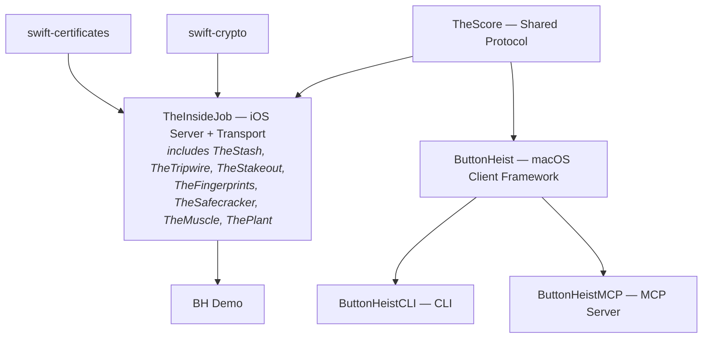
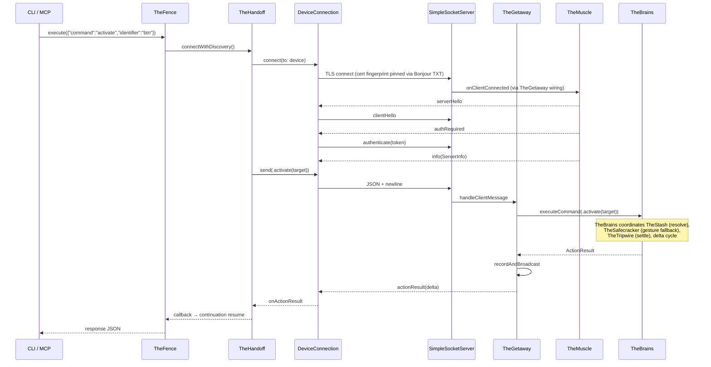

# Button Heist Crew Dossiers - Overview

## The Heist Metaphor

Button Heist is a remote iOS UI automation system structured as a heist crew. An iOS framework (TheInsideJob) embeds inside a target app as a TLS-encrypted server, while macOS tooling discovers, connects (with certificate fingerprint pinning via Bonjour), and sends commands to interact with the app's UI programmatically.

## Crew Roster

The dossiers are numbered to be read in order. Start at the entry point a user actually touches (the CLI), follow a command into the app, watch it find and act on an element, and observe the way out. The wire protocol (TheScore) lives at the end as reference material — skim it when you need to know exactly what a message looks like on the wire.

### Outside Team — Issuing Commands (macOS)
| # | Crew Member | Alias | Primary Role |
|---|-------------|-------|-------------|
| 01 | [ButtonHeistCLI](01-CLI.md) | The CLI | Command-line interface |
| 02 | [ButtonHeistMCP](02-MCP.md) | The MCP Server | AI agent tool interface |
| 03 | [TheFence](03-THEFENCE.md) | The Boss | Centralized command dispatch, request-response correlation, async waits |
| 04 | [TheHandoff](04-THEHANDOFF.md) | The Logistics | Device discovery, TLS connection, keepalive, auto-reconnect, session state |
| 05 | [TheBookKeeper](05-THEBOOKKEEPER.md) | The Accountant | Session logs, artifact storage, compression, path safety, heist recording |

### Inside Team — Receiving Commands (iOS, in-process)
| # | Crew Member | Alias | Primary Role |
|---|-------------|-------|-------------|
| 06 | [TheInsideJob](06-THEINSIDEJOB.md) | The Job | Singleton coordinator, crew assembly, server lifecycle |
| 07 | [ThePlant](07-THEPLANT.md) | The Advance Man | Zero-config auto-start via ObjC +load |
| 08 | [TheMuscle](08-THEMUSCLE.md) | The Bouncer | Authentication, session locking, on-device approval |
| 09 | [TheGetaway](09-THEGETAWAY.md) | The Getaway Driver | Message dispatch, encode/decode, broadcast, transport wiring, recording |

### Inside Team — Finding the Element
| # | Crew Member | Alias | Primary Role |
|---|-------------|-------|-------------|
| 10 | [TheBurglar](10-THEBURGLAR.md) | The Acquisition Specialist | Hierarchy parsing, parse/apply pipeline, topology detection |
| 11 | [TheStash](11-THESTASH.md) | The Score Handler | Element registry, target resolution, wire conversion, screen capture |
| 12 | [Unified Targeting](12-UNIFIED-TARGETING.md) | *(cross-cutting)* | Element resolution pipeline: TheFence → ElementTarget → TheStash.resolveTarget → action execution |

### Inside Team — Executing the Action
| # | Crew Member | Alias | Primary Role |
|---|-------------|-------|-------------|
| 13 | [TheBrains](13-THEBRAINS.md) | The Mastermind | Action execution, scroll orchestration, delta cycle, wait handlers, exploration |
| 14 | [TheSafecracker](14-THESAFECRACKER.md) | The Specialist | Touch injection, text input, gesture synthesis |
| 14a | [Scrolling](14a-SCROLLING.md) | *(deep dive)* | Auto-scroll, scroll commands, settle logic |
| 14b | [Touch Injection](14b-TOUCH-INJECTION.md) | *(deep dive)* | 3-layer IOKit/UITouch/UIEvent pipeline |
| 14c | [Text Entry](14c-TEXT-ENTRY.md) | *(deep dive)* | UIKeyboardImpl injection, keyboard detection, edit actions |

### Inside Team — Observation Layer
| # | Crew Member | Alias | Primary Role |
|---|-------------|-------|-------------|
| 15 | [TheTripwire](15-THETRIPWIRE.md) | The Early Warning System | Animation detection, VC identity, presentation layer fingerprinting |
| 16 | [TheStakeout](16-THESTAKEOUT.md) | The Lookout | Screen recording, video encoding |
| 17 | [TheFingerprints](17-THEFINGERPRINTS.md) | The Evidence | Visual touch indicators, overlay included in recordings |

### Reference
| # | Crew Member | Alias | Primary Role |
|---|-------------|-------|-------------|
| 18 | [TheScore](18-THESCORE.md) | The Score | Wire protocol types shared by both sides — consult when you need the exact on-wire shape of a message |

## Module Dependency Graph

> **Note:** TheGetaway, TheBrains, TheStash, TheBurglar, TheTripwire, TheSafecracker, TheMuscle, TheStakeout, TheFingerprints, and ThePlant are all source groups compiled into the `TheInsideJob` framework target — they are not separate modules. They have separate dossiers because they are architecturally distinct subsystems with clear responsibilities. Each has its own folder under `Sources/TheInsideJob/` with a README walking through the code.

## End-to-End Data Flow

## Cross-Cutting Review Concerns

These issues span multiple crew members and warrant holistic review:

1. ~~**Documentation drift**~~ - Fixed: configure() port param removed, isRunning visibility corrected, INSIDEJOB_BIND_ALL removed, token persistence clarified, InteractionEvent updated to use interfaceDelta
2. ~~**Duplicate error types**~~ - Fixed: `CLIError` removed, `FenceError` is the single error type
3. **Inconsistent timeouts** - 15s for actions, 30s for type_text/screenshots, 10s for interface requests
4. ~~**`vendorid` TXT key**~~ - Fixed: removed from DiscoveredDevice and DeviceDiscovery
5. ~~**Token logged in plaintext**~~ - By design: session token is logged with `privacy: .public` — it's a coordination primitive for agent isolation, not a security credential
6. **No TheInsideJob unit tests** - TheMuscleTests added; TheStash and TheInsideJob server-side logic still untested
7. **USBDeviceDiscovery blocks actor thread** - Subprocess calls in @ButtonHeistActor context
8. ~~**Interaction log payload unbounded**~~ - Fixed: capped at 500 events, uses InterfaceDelta instead of full snapshots
