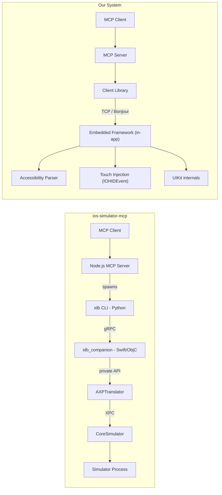

# Comparison: Us vs ios-simulator-mcp

Both are MCP servers that let AI agents control iOS UIs. The fundamental difference is architectural: `ios-simulator-mcp` operates from outside the app via Facebook's `idb`, while we embed a framework directly into the app process. This gives us deeper access to the accessibility tree, real touch injection, and features like interface deltas — but requires linking a framework.

## Architecture



**ios-simulator-mcp** depends on five layers of indirection to reach the app: Node.js → Python CLI → gRPC → native companion → private Apple framework → XPC. The companion (`idb_companion`) is a macOS daemon that must run on the same machine as the Simulator. It uses `AXPTranslator`, an Apple private framework that bridges iOS accessibility to macOS.

**Our system** connects directly to the app over TCP. The embedded framework runs inside the app process (DEBUG builds only), so it has direct access to UIKit, the view hierarchy, and the accessibility runtime with no XPC serialization boundary.

## Capability Matrix

| Capability | ios-simulator-mcp | Us | Notes |
|---|---|---|---|
| Interface tree | `idb ui describe-all --nested` | `get_interface` | See parsing deep dive below |
| Interface deltas | No | Yes | Added/removed/changed elements after every action |
| Animation detection | No | Yes | Waits for CALayer animations to settle |
| `wait_for_idle` | No | Yes | Explicit tool for agents to pause until UI is stable |
| Screenshot | `idb screenshot` | `get_screen` | Both return PNG |
| Screen recording | `idb record video` | `start_recording` / `stop_recording` | Ours includes interaction log (up to 500 events) |
| Tap | `idb ui tap X Y` (coordinate) | `activate` (element) or `gesture` (coordinate) | We try `accessibilityActivate()` first, fall back to synthetic tap |
| Long press | Not available | `gesture` type `long_press` | |
| Swipe | `idb ui swipe` (coordinate) | `swipe` (element or coordinate) | |
| Multi-touch | No | Pinch, rotate, two-finger tap, bezier paths, polyline | |
| Scroll | Swipe-based only | `scroll` (one page), `scroll_to_visible`, `scroll_to_edge` | We call `UIScrollView.setContentOffset` directly |
| Text input | `idb ui text` (ASCII) | `type_text` + `deleteText` | We use `UIKeyboardImpl.addInputString` with keyboard detection |
| Accessibility actions | Not exposed | `increment`, `decrement`, `perform_custom_action`, `edit_action`, `dismiss_keyboard` | |
| App install/launch | `idb install` / `idb launch` | Manual (`xcrun simctl`) | Gap for us |
| Simulator lifecycle | `open -a Simulator` | Not managed | Gap for us |
| Physical devices | No | Yes (USB tunnel via `xcrun devicectl`) | |
| Integration cost | Zero — works with any app | Must link embedded framework (DEBUG only) | |

## Interface Parsing Deep Dive

### How idb Does It

`ios-simulator-mcp` calls `idb ui describe-all --json --nested` and passes the JSON back to the MCP client verbatim. Zero parsing on their end.

Inside idb, the companion calls:

```objc
AXPTranslator *translator = [objc_getClass("AXPTranslator") sharedInstance];
[translator frontmostApplicationWithDisplayId:0 bridgeDelegateToken:token];
```

Then recursively walks `element.accessibilityChildren`, serializing each element into a dictionary. The `--nested` flag gives you a tree with `"children"` arrays; without it you get a flat list with parent-child relationships lost.

**Fields captured per element:**

| Field | Source |
|---|---|
| `AXLabel` | `element.accessibilityLabel` |
| `AXValue` | `element.accessibilityValue` |
| `AXUniqueId` | `element.accessibilityIdentifier` |
| `AXFrame` | String: `"{{x, y}, {w, h}}"` |
| `frame` | Numeric dict (redundant with AXFrame) |
| `type` | `accessibilityRole` minus `"AX"` prefix |
| `role` / `role_description` / `subrole` | macOS AX role taxonomy |
| `title` | `element.accessibilityTitle` |
| `help` | `element.accessibilityHelp` |
| `enabled` | `element.accessibilityEnabled` |
| `custom_actions` | Action names only |
| `traits` | Bitmask → string array |
| `pid` | Process ID |

**Not in the default set** (must be explicitly requested): `expanded`, `placeholder`, `hidden`, `focused`, `is_remote`.

### How We Do It

Our embedded framework runs `AccessibilitySnapshotParser.parseAccessibilityHierarchy(in: rootView)` inside the app process. The parser calls `root.recursiveAccessibilityHierarchy()` to walk the UIKit view tree, sorts elements by VoiceOver traversal order, and builds a typed tree with container semantics (`semanticGroup`, `list`, `landmark`, `dataTable`, `tabBar`).

An `elementVisitor` closure captures weak `NSObject` references for each element — this is how we keep a live mapping from parsed elements to real UIKit objects for later interaction.

**Fields captured per element:**

| Field | Source |
|---|---|
| `label` | `accessibilityLabel` |
| `value` | `accessibilityValue` |
| `identifier` | `accessibilityIdentifier` |
| `hint` | `accessibilityHint` |
| `description` | VoiceOver description string |
| `frame` | `accessibilityFrame` (CGRect) |
| `activationPoint` | `accessibilityActivationPoint` |
| `traits` | Bitmask → string array |
| `respondsToUserInteraction` | Whether the element handles taps |
| `customActions` | Name + image per action |
| `customContent` | `AXCustomContent` (label/value/importance) |
| `customRotors` | Rotor names + result markers |
| `order` | VoiceOver traversal index |
| `actions` | Available element actions |

### What We Capture That idb Doesn't

- **Activation point** — the actual tap target, not just the frame center
- **`respondsToUserInteraction`** — whether the element does anything when tapped
- **Custom content** (`AXCustomContent`) — structured label/value pairs
- **Custom rotors** — with result markers
- **Traversal order** — explicit index, not implicit array position
- **Container types** — typed enum, not role strings

### Known idb Limitations

- **UITabBar bug** ([idb#767](https://github.com/facebook/idb/issues/767)): `describe-all` sometimes returns empty `children` arrays for tab bars even though `describe-point` can reach the tab items.
- **WebView blind spot**: Content inside `WKWebView` lives in a separate process and isn't captured by the default tree walk. idb has a grid hit-test workaround (`FBAccessibilityRemoteContentOptions`) but it adds ~270ms and ios-simulator-mcp doesn't use it.
- **XPC/AXPTranslator translation loss**: The data crosses multiple process boundaries (app → Simulator runtime → CoreSimulator XPC → AXPTranslator → companion). `AXPTranslator` converts iOS accessibility into the macOS AX protocol (AXUIElement, AXRole, etc.), which is a narrower vocabulary. iOS-specific properties like `activationPoint`, `customContent`, `customRotors`, and `respondsToUserInteraction` have no macOS AX equivalent and are dropped. Live object references are also lost — idb gets dictionaries, not the backing `NSObject`s, so it can't call methods like `accessibilityActivate()` or `accessibilityIncrement()` on them later.

## Interaction Model

`ios-simulator-mcp` is entirely **coordinate-based**. Every interaction goes through `idb ui tap X Y` or `idb ui swipe X1 Y1 X2 Y2`. The agent must extract coordinates from the `AXFrame`/`frame` fields and compute tap targets itself.

Our system supports both **element-level** and **coordinate-level** interactions. `activate` finds the element by identifier or traversal order, calls `accessibilityActivate()`, and falls back to a synthetic tap at the element's `activationPoint`. Gestures can target either an element or raw coordinates.

Notably, idb's companion *does* have element-level APIs (`tapWithError:` sends AXPress, `scrollWithDirection:error:`, `setValue:error:`) but these aren't exposed through the `idb` CLI. ios-simulator-mcp has no way to reach them.

Touch injection also differs fundamentally:
- **idb**: Coordinates sent over XPC to the Simulator runtime
- **Us**: Creates real `IOHIDEvent` objects via `dlopen`/`dlsym` into IOKit, attaches them to `UITouch` instances, wraps in `UIEvent`, and calls `UIApplication.shared.sendEvent()`. These are indistinguishable from real hardware touches.

## Gaps — Things They Have That We Don't

| Feature | What they do | Our workaround |
|---|---|---|
| Zero integration | Works with any app, no code changes | Must link embedded framework (DEBUG only) |
| App install/launch | `idb install` / `idb launch` built in | Manual `xcrun simctl install` / `simctl launch` |
| Simulator lifecycle | Opens Simulator.app | Manual |
| Screenshot formats | PNG, TIFF, BMP, GIF, JPEG | PNG only |
| npx install | `npx ios-simulator-mcp` | Build from source |

## Links

- [ios-simulator-mcp](https://github.com/joshuayoes/ios-simulator-mcp) — GitHub repo
- [facebook/idb](https://github.com/facebook/idb) — the tool it wraps
- [idb accessibility docs](https://fbidb.io/docs/accessibility/)
- [FBAccessibilityCommands.h](https://github.com/facebook/idb/blob/main/FBControlCore/Commands/FBAccessibilityCommands.h) — idb's element protocol
- [FBSimulatorAccessibilityCommands.m](https://github.com/facebook/idb/blob/main/FBSimulatorControl/Commands/FBSimulatorAccessibilityCommands.m) — where idb walks the tree
- [idb#767](https://github.com/facebook/idb/issues/767) — UITabBar children bug
